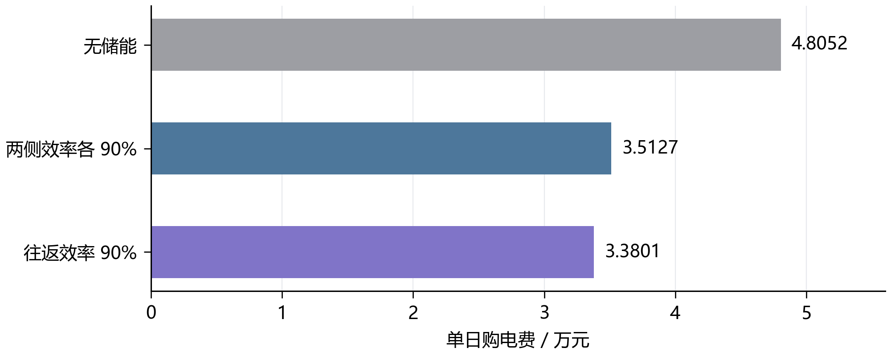
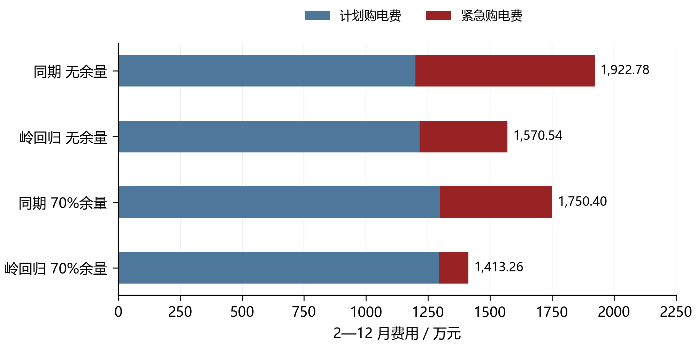

# 考虑预测误差的微网日前购电与储能调度

## 摘 要

针对光伏发电、小区负载与分时电价共同影响的微网购电问题，建立统一的母线能量平衡和储能状态模型，分别研究已知曲线下的单日最优调度，以及供需未知时的日前计划与实时补购。

针对第一问，在充电、放电效率各为 90% 的解释下，将十分钟购电、充放电和弃用电量作为连续变量，以二元变量保证充放电互斥，并约束日初与日末储电量相同。采用混合整数线性规划求得全天计划购电 59,482.70 kWh、购电费 35,126.95 元，较无储能基线降低 26.90%。整数解与线性松弛下界一致，支持当前模型下数值精度内的最优性。

针对第二问，将同期预测和岭回归与日前调度连接，以历史净负载预测误差分位数构造余量。通过 1 月验证选择岭回归与 70% 余量，在 2—12 月 334 天进行顺序回测，普通与紧急购电总费用为 1,413.26 万元，比同期无余量低 26.50%，比岭回归无余量低 10.01%。验证期 90% 余量虽消除紧急购电，总费用反而更高，说明可靠性改善必须与计划支出共同评价。

模型检查覆盖能量平衡、SOC 连续性、功率和容量边界、充放电互斥及费用复算。第二问结论限于所检验策略，尚未证明随机控制意义下的全局最优；短验证期、效率与时间标签解释仍是需要进一步核对的因素。

关键词：微网调度；混合整数线性规划；岭回归；预测误差；日前购电

## 一 问题重述

题面研究小区光伏、负载、储能与外部电网之间的电力调控 [1]。储能可以在低价或光伏富余时吸收电量，在高价或供电不足时释放电量；调度既要满足负载，也要尽可能节省购电费用。本文只处理前两问。

第一问给定每天重复的电价、负载和单日光伏预测，要求每天 00:00 制定全天购电计划，且日初日末储电量相同。需报告指定十分钟时段的购电量、全天总量和费用，以及四小时充放电汇总。第二问中负载与光伏逐日变化，正常购电仍按计划量收费，供电缺口通过五倍交易电价的紧急购电补足，需输出 2—12 月每日完整策略及四个指定日期的结果。

## 二 问题分析

第一问是已知输入曲线下的跨时段资源分配。线性回归不负责决定何时充电；购电、电池和负载之间的能量约束才是主模型。加入二元变量后可直接保证同一时段不同时充放电，避免事后修复改变费用与可行性。

第二问的预测误差具有不对称经济后果：低估净负载可能触发五倍电价补购，高估则可能产生仍需付费的富余计划电量。因此先预测负载与光伏，再构造风险余量并求购电计划，最后用实际观测执行与计费。预测误差用于评价预测器，实际购电总费用用于评价完整策略，两者不能互相替代。

## 三 模型假设与数据处理

### 3.1 参数及工作假设

统一参数见表 1。功率上限按微网母线侧定义，所有决策电量使用 kWh。题面“充放电效率为 90%”可能存在单程与往返解释差异，主实验采用两侧各 90%，并对另一解释单独进行敏感性分析。

表 1 储能参数与时间离散

| 参数 | 数值 | 性质 |
| --- | --- | --- |
| 额定容量 | 12000 kWh | 题面给定 |
| 允许储电量 | 1200—10800 kWh | 题面给定 |
| 最大充放电功率 | 5000 kW | 题面给定 |
| 初始储电量 | 6000 kWh | 1 月 1 日 00:00 给定 |
| 充电／放电效率 | 0.9／0.9 | 主实验解释 |
| 时段长度 | 1/6 h | 十分钟离散 |

（1）将每个功率值解释为以时间标签为右端点的十分钟区间平均值。由此原始 00:10 对应 00:00—00:10，原始 00:00+1 对应 23:50—24:00。结果副本按该时间轴统一标签；该解释并非题面明确说明的采样定义。

（2）不设置题面未给出的售电收入与折旧价格，允许不能使用的电量被弃用。普通购电按计划量结算，富余计划量不退款。电池磨损成本没有纳入当前目标。

（3）实际执行近似每十分钟内功率恒定、当前供需可即时观测并平衡。该近似只服务于区间内的充放电和紧急购电，不允许日前读取当天真实曲线。

（4）第二问实际 SOC 连续跨日。日前名义轨迹的日末下限取 6000 kWh，作为防止计划耗空电池的策略设置；不强制实际日末回到 6000，也不按天重置电池。

### 3.2 输入审计与时间边界

附件 1 有 144 个时段，附件 2 的负载与光伏各有 365×144＝52,560 个观测。读取后检查到完整的 2025 年日期、相同的负载和光伏时间轴，未发现缺失、负数或重复日期，未无依据删除峰值。附件 1 混合存储了时间类型与字符串，统一转换分钟后核对 10、20、…、1440。电量按下式换算：

$$
L_{d,t}=P^{\mathrm{load}}_{d,t}\Delta t,\qquad V_{d,t}=P^{\mathrm{PV}}_{d,t}\Delta t,\qquad \Delta t=\frac{1}{6}\ \mathrm{h}.
$$

独立重读原始工作簿确认：附件 1 的时间列含 60 个时间类型单元格和 84 个字符串，均已规范化；附件 2 的两类序列各 52,560 项无缺失、非有限值或负数，且无重复日期或完全重复的日曲线。全局四分位距规则未标记超界点，但这一检查不能证明不存在局部测量误差。

因此，本次预处理没有执行填补、删点、缩尾或平滑，只执行时间格式与单位规范化。光伏有 23,540 个零值，其本身不是缺失标记，保留在原始记录与回测中。预测值的非负截断属于模型输出规则，训练集标准化属于特征处理，均不等同于修改实际观测。

实际数据的测量不确定性没有单独给出，因此不添加虚构置信区间。全文图线来自原始输入或保存的实际计算结果，时段内不做平滑插值。

## 四 符号说明

下文沿用表 2 的符号。单日模型省略日期下标，日内区间用 1—144，状态包含 145 个边界点；跨日计算另带日期下标。

表 2 主要符号及单位

| 符号 | 含义 | 单位 |
| --- | --- | --- |
| $d,t$ | 日期与十分钟时段 | — |
| $L_{d,t},V_{d,t}$ | 负载与光伏电量 | kWh |
| $\hat L_{d,t},\hat V_{d,t}$ | 日前负载与光伏预测 | kWh |
| $g_{d,t},e_{d,t}$ | 计划购电与紧急购电 | kWh |
| $c_{d,t},d_{d,t}$ | 母线侧充电与放电 | kWh |
| $w_{d,t}$ | 不能利用的富余电量 | kWh |
| $S_{d,t}$ | 区间起点的储电量 | kWh |
| $p_t$ | 固定分时交易电价 | 元/kWh |
| $\eta_c,\eta_d$ | 充电与放电效率 | — |
| $z_t$ | 充电状态二元变量 | — |
| $\lambda,q$ | 岭惩罚强度与余量分位数 | — |
| $r_{d,t}(q)$ | 非负净负载预测余量 | kWh |

日期下标 d 与放电变量的字母 d 通过下标位置区分；为简化实现，程序字段分别使用 date 和 discharge_kwh。

## 五 第一问的模型建立与求解

### 5.1 供需结构与决策目标

已给曲线及固定电价如图 1 所示。光伏集中在白天，而负载覆盖全天，储能调度应同时响应供需差额和分时价格。电价使用独立面板，避免功率与价格共用坐标造成误读。

图 1 第一问供需曲线与分时电价

图中每一阶梯对应一个十分钟平均功率或电价，光伏阴影为功率曲线下区域，不作为置信带。

目标是最小化全天计划购电费：

$$
\min C_1=\sum_{t=1}^{144}p_tg_t.
$$

以母线侧收支写能量守恒，将允许的富余供电显式记为未利用电量：

$$
g_t+V_t+d_t=L_t+c_t+w_t,\qquad g_t,w_t\geq0.
$$

充电损耗发生在进入储能时，放电损耗发生在从储能输出至母线时，因而状态方程为：

$$
S_{t+1}=S_t+\eta_c c_t-\frac{d_t}{\eta_d},\qquad 1200\leq S_t\leq10800.
$$

SOC 上下界施加于全部 145 个状态点，状态递推与其他时段约束对应 t＝1，…，144。令每时段最大母线侧充放电量 M＝5000/6 kWh，用二元变量直接限制互斥：

$$
0\leq c_t\leq Mz_t,\qquad 0\leq d_t\leq M(1-z_t),\qquad z_t\in\{0,1\}.
$$

第一问满足以下初始和终端条件，避免利用电池初始存量净放电造成虚假节省：

$$
S_1=S_{145}=6000.
$$

将上述关系集中写成一般日模型，决策变量为购电、充放电、未利用电量、储电量和状态变量。给定不同供需输入与初末状态条件时，可复用以下结构：

$$
\boxed{\left\{\begin{aligned}\min_{g,c,d,w,S,z}\quad &\sum_{t=1}^{144}p_tg_t\\\mathrm{s.t.}\quad &g_t+V_t+d_t=L_t+c_t+w_t,\\&S_{t+1}=S_t+\eta_c c_t-d_t/\eta_d,\\&1200\leq S_t\leq10800,\quad g_t,w_t\geq0,\\&0\leq c_t\leq Mz_t,\quad0\leq d_t\leq M(1-z_t),\\&z_t\in\{0,1\},\quad S_1=S_{145}=6000.\end{aligned}\right.}
$$

上述模型有 865 个变量，其中 144 个为二元变量。以 SciPy 1.17.1 的 milp 接口调用 HiGHS [2]，相对间隙目标设为 10⁻⁷，每日求解时间上限为 30 秒；超时或无可行解时应停止并报告，而非将空结果视为成功。

### 5.2 调度结果与指定时段

计算得到全天购电量 59,482.70 kWh、费用 35,126.95 元。购电与储能轨迹见图 2，指定时段购电和四小时充放电分别见表 3、表 4。

图 2 第一问电价驱动的购电与储能运行

自上而下为电价、购电与正净负载、充放电、SOC。所有阶梯保留十分钟决策，不作平滑。购电超过正净负载的部分用于充电；SOC 阴影为允许范围。

表 3 第一问指定时段购电量及全天费用

| 时间段 | 购电量 | 时间段 | 购电量 | 时间段 | 购电量 |
| --- | --- | --- | --- | --- | --- |
| 10:00-10:10 | 0.00 | 12:00-12:10 | 480.41 | 14:00-14:10 | 0.00 |
| 16:00-16:10 | 445.43 | 18:00-18:10 | 531.89 | 20:00-20:10 | 0.00 |
| 全天购电量 | 59,482.70 | 全天购电费 | 35,126.95 | — | — |

表中电量单位为 kWh，全天购电费单位为元。

表 4 第一问四小时充放电及日初日末储电量

| 时间段 | 充电量 | 放电量 | 时间段 | 充电量 | 放电量 |
| --- | --- | --- | --- | --- | --- |
| 00:00-04:00 | 4,500.00 | 0.00 | 04:00-08:00 | 833.33 | 6,365.84 |
| 08:00-12:00 | 4,787.96 | 1,703.00 | 12:00-16:00 | 5,286.04 | 91.10 |
| 16:00-20:00 | 0.00 | 5,780.13 | 20:00-24:00 | 5,333.33 | 2,859.87 |
| 00:00 储电量 | 6,000.00 | — | 24:00 储电量 | 6,000.00 | — |

表内所有电量单位为 kWh，充放电量采用母线侧口径。四小时内可先充后放，汇总行两者均正不违反十分钟互斥。图中尖峰主要对应集中充电：22:00—22:10 负载约 3309.39 kW、光伏为零，充电 5000 kW，故购电约 8309.39 kW。相邻时段电价为 0.3859、0.4368 元/kWh，模型分别安排满功率充电与不充电。

当前目标只计购电费，未计充电切换成本或功率爬坡限制，因此低价区间内也可能出现零散充电。这是模型边界，不能由图形尖峰直接判为原始数据异常。固定放电与未利用电量、保持费用不变的充电变差最小化诊断未获得实质不同的轨迹，不能据此声称存在平滑且同成本的替代方案。若需要更平稳的实际操作，应另加爬坡约束或费用容差内的次级目标，重新计算并比较成本。

### 5.3 最优性检验与效率解释

删除整数限制得到线性松弛下界 35,126.94858929 元，与整数解目标之差为 0.00000000 元，求解器相对间隙为零。在本题输入与约束口径下，这支持数值精度内的全局最优性。能量平衡最大残差约 2.27e-13 kWh，SOC 递推与容量、功率边界均通过复核。

以每时段正净负载直接购电构造无储能基线：

$$
g_t^{(0)}=\max(L_t-V_t,0),\qquad C_1^{(0)}=\sum_t p_tg_t^{(0)}.
$$

该基线费用为 48,052.05 元，主模型节省 26.90%。效率解释的对照见图 3：若总往返效率为 0.9，并对称取两侧效率为平方根 0.9，费用为 33,801.50 元。该试验只改变效率，不能与主实验混为同一组结果。

图 3 第一问储能收益与效率解释对照

所有柱形从零开始。前两项比较储能作用，后两项比较效率解释；主文及 Excel 均对应“两侧效率各 90%”。

## 六 第二问的预测与日前策略

### 6.1 训练与评价的时间顺序

以 1 月 22—31 日作为验证窗，选择岭回归惩罚与风险余量。2 月 1 日起固定这些选择规则，执行至 12 月 31 日。模型每七天更新一次，最多使用最近 60 个已结束日期；评价过程中已观察到的数据可以进入后续更新，尚未发生的数据不进入当前决策。这是顺序样本外回测，而不是把全年随机拆分。

一月份共同热身从 1 月 1 日的 6000 kWh 开始；首日无历史时用附件 1 作为冷启动参考，随后不足七天用近三日均值，积累七天后用日／周同期。验证期初 SOC 为 6244.256891 kWh，评价期初为 9902.811288 kWh，各候选策略都从同一状态出发。冷启动的附件 1 仅作为明确的初始化假设，不当作全年可提前获得的预报。

### 6.2 同期基线与岭回归预测

对负载或光伏电量序列 y，同期基线取昨日与上周同日相同时间槽的均值：

$$
\hat y_{d,t}^{\mathrm{seasonal}}=\frac{y_{d-1,t}+y_{d-7,t}}{2}.
$$

岭回归采用 21 个特征：昨日、前日、上周同日的同槽值，三日和七日同槽均值、七日同槽标准差、昨日全天均值和近三日全天均值共八项；前三阶日内正余弦六项；星期指示七项。日期及时间属于决策时已知的日历信息。标准化均值与尺度仅在当次训练集上估计，常量特征尺度置 1。

$$
\min_{\beta,b}\sum_{i\in\mathcal T_d}(y_i-b-\widetilde{x}_i^{\mathsf T}\beta)^2+\lambda\|\beta\|_2^2.
$$

截距不惩罚，负载和光伏分别拟合。按验证 MAE 比较 λ＝1、10、100，均选 1；实现采用 NumPy 线性方程求解，与带截距岭目标一致 [3]。从 1 月 15 日开始具备拟合条件，之后每七日重新拟合。预测截断为非负；某槽过去七日光伏全零时，该槽预测置零，日出日落季节变化可能使此规则产生滞后。

评价指标采用功率单位的 MAE 与 RMSE；不使用夜间分母为零的普通 MAPE：

$$
\mathrm{MAE}=\frac{1}{n}\sum_i|P_i-\widehat P_i|,\qquad\mathrm{RMSE}=\sqrt{\frac{1}{n}\sum_i(P_i-\widehat P_i)^2}.
$$

### 6.3 净负载误差余量与名义优化

定义历史净负载误差及只包含过去信息的误差样本池：

$$
\varepsilon_{j,s}=(L_{j,s}-V_{j,s})-(\hat L_{j,s}-\hat V_{j,s}).
$$

$$
\mathcal E_{d,t}=\{\varepsilon_{j,s}:\max(2,d-28)\leq j<d,\ 1\leq s\leq144,\ |s-t|\leq3\}.
$$

日期下标以 1 月 1 日为 d＝1；排除首日冷启动误差，最多池化 28 个已结束日期和目标槽前后三槽。跨日边界不绕回，不足 28 天时仅取已有历史。余量规则为：

$$
r_{d,t}(q)=\max\{0,Q_q(\mathcal E_{d,t})\}.
$$

无余量候选直接设 r＝0，与“取零分位数”区分。对 q＝0.7、0.8、0.9，分位数使用样本排序后的线性插值。将预测负载加余量作为名义需求，求解第五节同一物理模型：

$$
L_t^{\mathrm{nom}}=\hat L_{d,t}+r_{d,t}(q),\qquad V_t^{\mathrm{nom}}=\hat V_{d,t},\qquad S_{d,145}^{\mathrm{nom}}\geq6000.
$$

70% 分位数不是“全天 70% 概率不缺电”的保证。名义优化只最小化计划费，五倍紧急购电的影响通过验证期对余量方案的筛选间接体现，不能据此称为已精确求解随机规划。

### 6.4 实时执行与跨日状态

当天普通购电计划固定后，定义当前供需剩余。对非负剩余尽量充电，对缺口尽量放电，并分别受可用空间、储电量和功率限制：

$$
u_t=g_t+V_t-L_t.
$$

$$
c_t=\min\left\{\max(u_t,0),M,\frac{10800-S_t}{\eta_c}\right\}.
$$

$$
d_t=\min\left\{\max(-u_t,0),M,\eta_d(S_t-1200)\right\}.
$$

$$
e_t=\max(-u_t-d_t,0),\qquad w_t=\max(u_t-c_t,0).
$$

以上规则使同一时段仅有充电或放电，SOC 仍按状态方程更新，实际日末传给次日：

$$
S_{d+1,1}=S_{d,145}.
$$

所有供电缺口由紧急购电补足。全年评价费用定义为：

$$
C_2=\sum_{d,t}p_tg_{d,t}+5\sum_{d,t}p_te_{d,t}.
$$

将第二问策略概括如下。记 Ω 为第一问中除初末等式之外的物理可行域，输入替换为带余量预测，日初状态取真实已知值；G 表示本节的贪心实时平衡规则：

$$
\boxed{\left\{\begin{aligned}(g^{\mathrm{plan}},\ldots)&\in\arg\min_{(g,c,d,w,S,z)\in\Omega}\sum_t p_tg_t,\\L^{\mathrm{nom}}&=\hat L+r(q),\quad V^{\mathrm{nom}}=\hat V,\\S_1^{\mathrm{nom}}&=S_1^{\mathrm{actual}},\quad S_{145}^{\mathrm{nom}}\geq6000,\\(c_t,d_t,e_t,w_t)&=\mathcal G(g_t^{\mathrm{plan}},L_t,V_t,S_t),\\C_2&=\sum_{d,t}p_t(g_{d,t}^{\mathrm{plan}}+5e_{d,t}).\end{aligned}\right.}
$$

其中 Ω 中每一时段的平衡使用上式名义输入；最后一行是实际策略评价费用，不是声称日前已知实际 e 的优化目标。余量 q 仅由一月验证费用选择，之后冻结。

实际储能动作可以偏离名义动作，但普通计划购电不能按真实曲线事后改写。这一贪心控制具有可行性与因果性，不保证跨时段的实时经济最优。

## 七 第二问的结果与检验

### 7.1 验证期选择与紧急购电权衡

验证结果见表 5 与图 4。各方案使用相同验证初始 SOC，但期末存量不同，因此除费用外同时列出期末储电量，不把存量差异隐藏在成本比较中。

表 5 一月份十天验证结果

| 预测器 | 余量 | 总费/元 | 紧急费/元 | 期末SOC/kWh |
| --- | --- | --- | --- | --- |
| 同期 | 无 | 661,834.09 | 173,098.38 | 9,902.81 |
| 同期 | 70% | 634,179.58 | 110,989.47 | 10,595.98 |
| 同期 | 80% | 666,226.97 | 64,910.51 | 10,800.00 |
| 同期 | 90% | 680,257.72 | 456.98 | 10,800.00 |
| 岭回归 | 无 | 532,888.41 | 61,836.07 | 5,924.08 |
| 岭回归 | 70% | 509,757.47 | 8,765.44 | 6,623.17 |
| 岭回归 | 80% | 529,846.45 | 4.16 | 7,110.16 |
| 岭回归 | 90% | 633,664.05 | 0.00 | 9,039.38 |

图 4 验证期风险余量与费用的权衡

横轴为四种候选方案，其中“无余量”是独立基线。折线只辅助比较候选值，不表示连续参数的精确响应。

岭回归 70% 余量的验证费为 509,757.47 元，其中紧急费 8,765.44 元；90% 余量紧急费为零，但总费升至 633,664.05 元。两者期末储电量相差约 2416 kWh，故不能完全忽略存量影响；当前目标仍按题面购电费用评价，不另添加缺乏依据的残值收入。

### 7.2 全期预测误差与季节变化

按表 6 比较 334 天共 48,096 个十分钟区间的功率预测误差，岭回归在负载预测上的改善大于光伏。四个指定日期的曲线对照见图 5，整年误差仍以全期统计为准。

表 6 第二问全期预测误差

| 预测器 | 负载MAE | 负载RMSE | 光伏MAE | 光伏RMSE |
| --- | --- | --- | --- | --- |
| 同期 | 372.26 | 585.91 | 171.98 | 343.38 |
| 岭回归 | 179.86 | 234.59 | 155.28 | 306.74 |

上述误差单位均为 kW，光伏指标包含夜间零值，不能直接等同于白天发电时段的预测精度。

图 5 四个指定日期的负载与光伏日前预测

各列共用纵轴尺度，日期由题目指定。实线为实际观测，虚线为岭回归预测，不加入平滑后虚构的尖峰。

### 7.3 全期购电费用与运行约束

策略费用分解如图 6，数值及期末存量见表 7。相同初始状态保证比较具有共同起点，实际状态在全年内自行连续演化。

表 7 第二问全期费用及期末储电量

| 策略 | 计划费/万元 | 紧急费/万元 | 总费/万元 | 期末SOC/kWh |
| --- | --- | --- | --- | --- |
| 同期 无余量 | 1,199.19 | 723.59 | 1,922.78 | 5,825.99 |
| 岭回归 无余量 | 1,215.92 | 354.62 | 1,570.54 | 5,903.65 |
| 同期 70%余量 | 1,297.86 | 452.54 | 1,750.40 | 6,217.35 |
| 岭回归 70%余量 | 1,293.50 | 119.76 | 1,413.26 | 5,903.65 |

图 6 第二问四组策略的全期费用分解

蓝色为普通计划购电费，深红为紧急购电费；条形右端标注两者合计。主策略由一月份验证选择。

主策略总费用 14,132,612.16 元，较同期无余量低 26.50%，较岭回归无余量低 10.01%。后两组期末 SOC 均为 5,903.65 kWh，因此此处的余量增益没有被不同期末存量混淆。

主策略紧急购电累计 197,465.10 kWh，涉及 1132 个十分钟区间，不等同于同样数量的独立事件。未利用电量为 2,211,229.49 kWh，其中可包含未消纳光伏和富余计划购电，不能全部称为弃光。

按月费用见图 7，主策略在 11 个评价月份中有 11 个月的总费用低于同期无余量。月度划分仅用于描述已固定策略的季节表现，未用于重新选超参数；月总费也受到月份天数和负载规模影响，不宜直接将其解读为单位供电效率。

图 7 固定策略的月度总费用与紧急费用

上面板为含紧急费用的月总费，下面板为其中的紧急费用。三条曲线依次分离预测改进和风险余量的作用。

月度预测 MAE 进一步见图 8。两块热力图各用自身的颜色上限，不能直接按跨面板颜色深浅比较负载与光伏误差；应读取格内数值。该图用于观察季节变化，不提供未计算的置信区间。

图 8 同期预测与岭回归的月度误差

每格为对应月份全部十分钟区间的 MAE，单位 kW；数值为整数显示，统计文件保留完整精度。

### 7.4 题目指定日期的结果

以下表 8—表 15 按题面并排布局给出四个日期的指定时段购电、全天量费及四小时储能汇总。购电量指普通计划量，全天购电费包含普通与紧急两部分；紧急量在表 16 单列。

2025-03-20 的购电结果见表 8，储能结果见表 9。

#### 2025-03-20 的运行结果

表 8 2025-03-20 指定时段购电与全天费用

| 时间段 | 购电量 | 时间段 | 购电量 | 时间段 | 购电量 |
| --- | --- | --- | --- | --- | --- |
| 10:00-10:10 | 0.00 | 12:00-12:10 | 574.14 | 14:00-14:10 | 0.00 |
| 16:00-16:10 | 488.93 | 18:00-18:10 | 720.76 | 20:00-20:10 | 0.00 |
| 全天购电量 | 68,036.47 | 全天购电费 | 41,276.85 | — | — |

表 9 2025-03-20 充放电与边界储电量

| 时间段 | 充电量 | 放电量 | 时间段 | 充电量 | 放电量 |
| --- | --- | --- | --- | --- | --- |
| 00:00-04:00 | 4,071.86 | 209.79 | 04:00-08:00 | 1,038.99 | 5,515.86 |
| 08:00-12:00 | 6,186.28 | 2,777.38 | 12:00-16:00 | 4,162.63 | 444.57 |
| 16:00-20:00 | 266.98 | 5,659.90 | 20:00-24:00 | 5,687.88 | 2,954.47 |
| 00:00 储电量 | 6,617.05 | — | 24:00 储电量 | 6,376.92 | — |

2025-06-21 的购电结果见表 10，储能结果见表 11。

#### 2025-06-21 的运行结果

表 10 2025-06-21 指定时段购电与全天费用

| 时间段 | 购电量 | 时间段 | 购电量 | 时间段 | 购电量 |
| --- | --- | --- | --- | --- | --- |
| 10:00-10:10 | 0.00 | 12:00-12:10 | 0.00 | 14:00-14:10 | 0.00 |
| 16:00-16:10 | 210.92 | 18:00-18:10 | 0.00 | 20:00-20:10 | 0.00 |
| 全天购电量 | 36,315.40 | 全天购电费 | 21,120.39 | — | — |

表 11 2025-06-21 充放电与边界储电量

| 时间段 | 充电量 | 放电量 | 时间段 | 充电量 | 放电量 |
| --- | --- | --- | --- | --- | --- |
| 00:00-04:00 | 526.76 | 524.94 | 04:00-08:00 | 413.77 | 4,402.74 |
| 08:00-12:00 | 9,426.35 | 0.00 | 12:00-16:00 | 0.00 | 0.00 |
| 16:00-20:00 | 151.96 | 5,493.83 | 20:00-24:00 | 6,132.83 | 2,497.81 |
| 00:00 储电量 | 6,945.01 | — | 24:00 储电量 | 7,576.71 | — |

2025-09-23 的购电结果见表 12，储能结果见表 13。

#### 2025-09-23 的运行结果

表 12 2025-09-23 指定时段购电与全天费用

| 时间段 | 购电量 | 时间段 | 购电量 | 时间段 | 购电量 |
| --- | --- | --- | --- | --- | --- |
| 10:00-10:10 | 0.00 | 12:00-12:10 | 491.40 | 14:00-14:10 | 0.00 |
| 16:00-16:10 | 549.29 | 18:00-18:10 | 788.73 | 20:00-20:10 | 0.00 |
| 全天购电量 | 71,561.09 | 全天购电费 | 44,415.98 | — | — |

表 13 2025-09-23 充放电与边界储电量

| 时间段 | 充电量 | 放电量 | 时间段 | 充电量 | 放电量 |
| --- | --- | --- | --- | --- | --- |
| 00:00-04:00 | 5,252.67 | 0.00 | 04:00-08:00 | 218.14 | 5,830.96 |
| 08:00-12:00 | 5,558.85 | 1,896.62 | 12:00-16:00 | 4,033.40 | 575.17 |
| 16:00-20:00 | 231.66 | 5,642.21 | 20:00-24:00 | 6,050.86 | 2,841.96 |
| 00:00 储电量 | 6,072.60 | — | 24:00 储电量 | 6,631.50 | — |

2025-12-21 的购电结果见表 14，储能结果见表 15。

#### 2025-12-21 的运行结果

表 14 2025-12-21 指定时段购电与全天费用

| 时间段 | 购电量 | 时间段 | 购电量 | 时间段 | 购电量 |
| --- | --- | --- | --- | --- | --- |
| 10:00-10:10 | 0.00 | 12:00-12:10 | 967.61 | 14:00-14:10 | 0.00 |
| 16:00-16:10 | 812.86 | 18:00-18:10 | 739.98 | 20:00-20:10 | 0.00 |
| 全天购电量 | 97,145.51 | 全天购电费 | 62,434.14 | — | — |

表 15 2025-12-21 充放电与边界储电量

| 时间段 | 充电量 | 放电量 | 时间段 | 充电量 | 放电量 |
| --- | --- | --- | --- | --- | --- |
| 00:00-04:00 | 4,629.25 | 143.74 | 04:00-08:00 | 1,398.62 | 1,538.91 |
| 08:00-12:00 | 5,704.82 | 7,168.67 | 12:00-16:00 | 6,940.07 | 2,243.11 |
| 16:00-20:00 | 24.16 | 5,708.86 | 20:00-24:00 | 5,695.76 | 2,842.53 |
| 00:00 储电量 | 6,318.60 | — | 24:00 储电量 | 6,443.34 | — |

表 16 四个指定日期的紧急购电

| 3月20日时段 | 电量 | 6月21日时段 | 电量 | 9月23日时段 | 电量 | 12月21日时段 | 电量 |
| --- | --- | --- | --- | --- | --- | --- | --- |
| 无 | 0.00 | 无 | 0.00 | 20:20-20:30 | 0.33 | 07:50-08:00 | 23.78 |

以上电量单位为 kWh、费用单位为元。3 月 20 日与 6 月 21 日无紧急购电；9 月 23 日发生于 20:20—20:30，12 月 21 日发生于 07:50—08:00。连续正紧急购电槽合并为一个区间，不跨日合并。

## 八 模型检验与适用范围

### 8.1 数值与因果检查

复算以保存的完整精度逐时结果为依据，再逐项核对 Excel。检查包括供电平衡、SOC 递推、跨日状态衔接、非负电量、功率与容量限制、充放电互斥以及普通和紧急费用。CSV 保留 17 位有效数字，论文显示两位小数，两位小数表不用于重新计算约束残差。

程序测试用可手算的两时段套利验证最优目标，用电池容量边界验证充放电与紧急补购，用改变未来输入后的前缀不变性检查信息边界。全期物理残差在 10⁻⁵ kWh 容差内，未发现违约记录。数值可行性检查不能替代对时间标签和效率解释的审题判断。

### 8.2 局限与后续改进

第一问是给定假设下的确定性最优解；没有计入电池磨损，不能据此保证高频切换在实际设备中最经济。若增加磨损惩罚或平滑约束，应重新求解并作为新模型报告，不可只平滑购电图来暗中修改方案。

第二问的经验分位数没有联合供电可靠性保证，一月份十天验证不足以覆盖所有季节。实时贪心控制、6000 kWh 名义终端目标与短历史训练窗均为可改进环节，现有实验没有证明其优于所有神经网络或场景优化方案。

若继续扩展，可比较滚动的多季节验证、终端储能目标和显式场景优化，并在第三问中引入题目提供的日内预报。当前前两问不需要训练 GRU 或 LSTM 才能成立，是否采用复杂预测器应由同等信息条件下的费用与误差共同决定。

## 九 结论

已知供需曲线时，采用带互斥约束的 MILP 可得到费用 35,126.95 元的单日调度，最优性由线性松弛下界和整数解共同支持。供需未知时，岭回归与风险余量连接日前调度，在本次 334 天回测中获得 1,413.26 万元总费用。适度余量减少紧急补购，但零紧急购电不是成本最小的同义词。

本文统一了电量单位、损耗、计划付费与跨日状态的计算口径。结论依赖于所列效率解释、时间离散及即时平衡假设；第三、四问尚未纳入本稿。

## 参考文献

[1] 全国大学生数学建模竞赛组委会. 2026 年高教社杯全国大学生数学建模竞赛 C 题：微网与外部电网电力调控策略. 用户提供题面与附件.

[2] SciPy Developers. scipy.optimize.milp[EB/OL]. https://docs.scipy.org/doc/scipy/reference/generated/scipy.optimize.milp.html. 访问日期：2026-09-10；运行版本：1.17.1.

[3] scikit-learn Developers. Ridge[EB/OL]. https://scikit-learn.org/stable/modules/generated/sklearn.linear_model.Ridge.html. 访问日期：2026-09-10. 本文按该目标以 NumPy 实现，未调用 scikit-learn.

## 附录 支撑材料与运行说明

数学计算程序为 src/q12.py，七项基础测试位于 tests/test_q12.py，逐时结果核对程序为 src/verify_q12.py。主结果保存在 artifacts/q12，含 result1.xlsx、result2.xlsx、四组逐时压缩记录、逐日指标与验证比较。修订图表和分月统计分别位于 figures/q12_revision 与 artifacts/q12_revision，初稿重建程序为 src/revise_q12.py。

使用 Python 3.12.14、NumPy 2.3.5、SciPy 1.17.1、pandas 2.2.3 和 Matplotlib 3.10.9。安装依赖后，从仓库根目录运行模型，并通过 --data-root 指向原题目录。前两问整套四组回测在本机一次执行约 61.7 秒，不含程序开发与文档制作。原始附件需由使用者另行取得，不能仅凭论文复现原始输入。当前是前两问初稿，完整代码附件与 AI 使用记录应在全篇定稿时统一整理。
