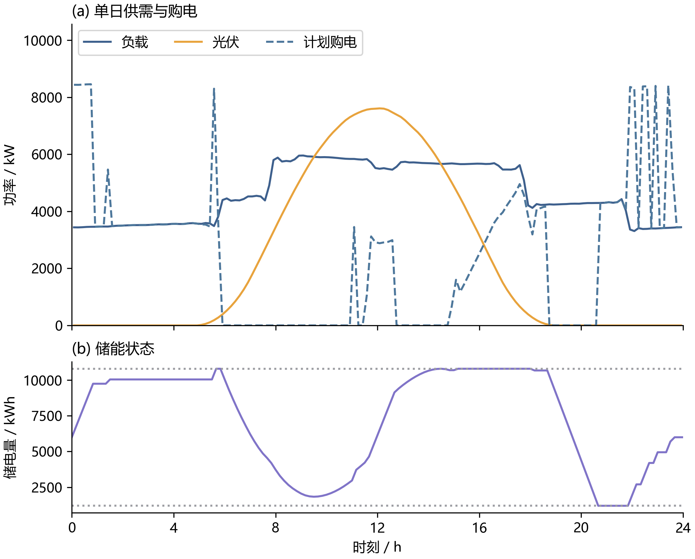
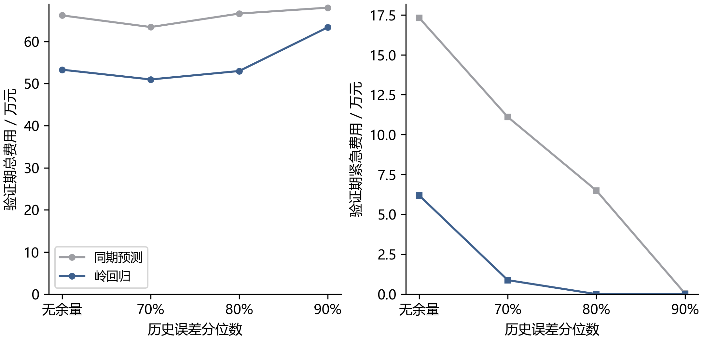
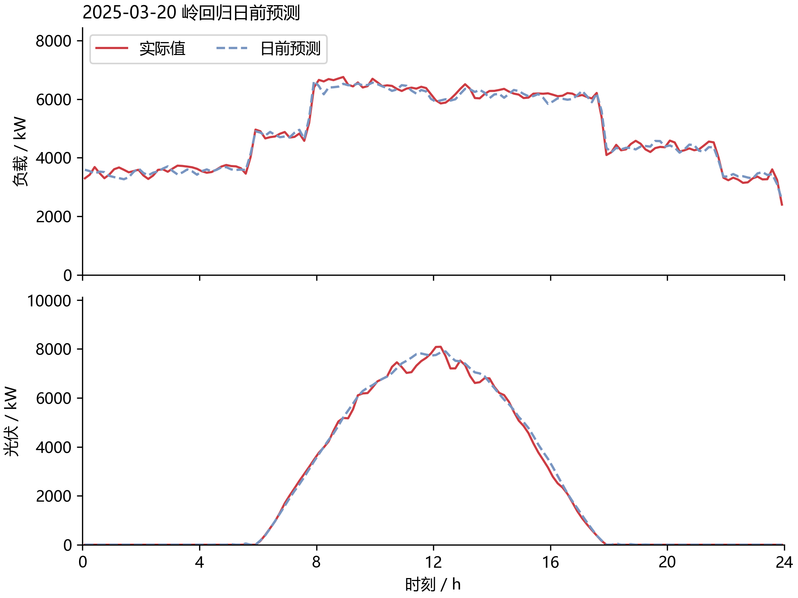
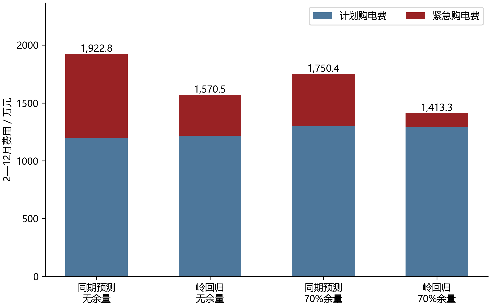

# 考虑预测误差的微网日前购电与储能调度

第一问与第二问初稿

## 摘要

针对小区光伏发电、负载需求与分时电价共同影响的微网购电问题，建立统一的能量平衡与储能状态模型。在给定单日曲线时，以计划购电费最小为目标，采用混合整数线性规划约束充放电互斥，并要求日初日末储电量相等。对于未来供需未知的情形，比较同期预测和岭回归，使用历史净负载误差的分位数构造非负余量，再通过实际运行仿真评估计划费用与五倍电价的紧急购电费用。

在充电、放电效率分别为 90%，输入功率视为十分钟区间平均值的假设下，第一问全天计划购电 59,482.70 kWh，购电费 35,126.95 元，相对无储能基线降低 26.90%。第二问利用一月份验证数据选择岭回归与 70% 分位数余量，随后在 2—12 月 334 天进行顺序回测。该策略总费用为 1,413.26 万元，相对同期预测无余量基线下降 26.50%；相对岭回归无余量策略下降 10.01%。结果表明，预测改进与适量风险余量均能降低费用，但更高余量虽可进一步减少紧急购电，也可能增加总成本。本稿仅回答前两问，其结论限于所列信息、时间、效率与运行假设。

关键词：微网调度；混合整数线性规划；岭回归；风险余量；时间顺序回测

## 1 问题分析

题面及附件提供了微网的物理参数、供需曲线与结果模板 [1]。第一问的电价、负载和光伏预测曲线已给定，需决定各时段的购电与储能安排，属于确定性优化问题，不需要拟合预测模型。储能的经济作用来自跨时段转移电量，必须同时考虑功率上限、容量边界和能量损失。

第二问要求每天午夜制定整天计划。实际用电和发电变化后，普通购电仍按计划量付费，剩余供电缺口通过五倍电价紧急补购。因此，少买与多买均存在代价。模型分为日前预测、计划优化和实时执行三个部分；历史真实值用于过去信息与事后评价，不能用于提前决定当天购电量。

## 2 数据处理与模型假设

附件 1 含 144 个十分钟时刻，附件 2 的负载与光伏各含 365×144＝52,560 个观测。实际读取未发现缺失值、负数或日期重复，保留全部样本，不对波峰进行无依据的删除或平滑。附件 1 部分时间单元格为字符串、部分为时间类型，读取后统一转换为分钟数，检查为 10、20、…、1440 的完整序列。

采用下列假设，并将它们与题面直接给定的参数区分：

1. 每个功率值表示以其时间标签为右端点的十分钟区间平均功率。电量为功率乘 1/6 小时。模板的区间标签存在疑似错位，本稿按内部区间起止时间汇总，导出副本同步采用规范标签，原始附件保持不变。
2. 充电和放电效率各取 0.9，往返效率为 0.81；功率上限定义在微网母线侧。另检验总往返效率 0.9 的解释。
3. 不设置题面未给出的售电收入，允许无法利用的剩余电量被弃用。计划富余电量仍付费。
4. 实时控制采用每十分钟内功率恒定且可即时平衡的近似。当前区间缺口可以被电池和紧急购电补足；这不是提前知道整天真实曲线。
5. 第二问实际 SOC 跨日连续，日前预测轨迹的日末 SOC 下限取 6000 kWh，作为避免耗空电池的策略设置，不强制实际日末回到此值。评价期初值由统一的一月份因果热身策略得到，不从二月起每天重置。

记区间负载与光伏电量为 $L_t,V_t$，计划购电为 $g_t$，紧急购电为 $e_t$，母线侧充电与放电为 $c_t,d_t$，未利用电量为 $w_t$，区间起点储电量为 $S_t$。上述电量单位均为 kWh，电价 $p_t$ 单位为元/kWh。

## 3 第一问的确定性优化模型

### 3.1 目标与约束

最小化全天购电费用：

$$
\min C_1=\sum_{t=1}^{144}p_tg_t.
$$

第一问不设置紧急购电，能量平衡与储能状态满足：

$$
g_t+V_t+d_t=L_t+c_t+w_t,\qquad w_t\ge0,
$$

$$
S_{t+1}=S_t+0.9c_t-\frac{d_t}{0.9},\qquad1200\le S_t\le10800.
$$

令 $z_t\in\{0,1\}$ 表示充电状态，母线侧每区间最大充放电量为 $M=5000/6$ kWh，规定

$$
0\le c_t\le Mz_t,\qquad0\le d_t\le M(1-z_t),\qquad g_t\ge0.
$$

取 $S_1=S_{145}=6000$ kWh。该等式避免利用初始存量净放电制造虚假的节省。模型共有 865 个变量，其中 144 个为二元变量；利用 SciPy 的 MILP 接口调用 HiGHS 求解 [2]。

### 3.2 求解结果

全天计划购电量为 **59,482.70 kWh**，购电费为 **35,126.95 元**。无储能基线按正净负载直接购电，费用为 48,052.05 元，采用储能后降低 26.90%。表 1 给出题目指定区间，表 2 给出四小时充放电汇总。图 1 展示供需、购电与储能轨迹。

表 1 第一问指定区间计划购电量

| 时段 | 计划购电量 / kWh |
| --- | --- |
| 10:00-10:10 | 0.00 |
| 12:00-12:10 | 480.41 |
| 14:00-14:10 | 0.00 |
| 16:00-16:10 | 445.43 |
| 18:00-18:10 | 531.89 |
| 20:00-20:10 | 0.00 |

表 2 第一问储能运行汇总

| 时段 | 充电量 / kWh | 放电量 / kWh |
| --- | --- | --- |
| 00:00-04:00 | 4,500.00 | 0.00 |
| 04:00-08:00 | 833.33 | 6,365.84 |
| 08:00-12:00 | 4,787.96 | 1,703.00 |
| 12:00-16:00 | 5,286.04 | 91.10 |
| 16:00-20:00 | 0.00 | 5,780.13 |
| 20:00-24:00 | 5,333.33 | 2,859.87 |

00:00 与 24:00 的储电量均为 6000.00 kWh。充电量记录进入电池前的母线电量，放电量记录电池返回母线的电量，二者不应直接按无损储能作差。

图 1 第一问单日供需、购电与 SOC 轨迹

### 3.3 结果检验与效率敏感性

整数模型的目标值与 LP 松弛下界之差为 0.00000000 元，求解器报告相对间隙为 0。因此，在当前输入与约束口径下，第一问已获得数值精度内的全局最优解。最大能量平衡残差约 2.27e-13 kWh，未出现同时充放电。

若“效率 90%”解释为总往返效率，将两侧效率均设为 $\sqrt{0.9}$，第一问费用变为 33,801.50 元。由此可见，效率定义会影响数值结论，后续整篇论文应保持同一口径，不混用两组结果。

## 4 第二问的预测与风险余量模型

### 4.1 时间顺序与预测器

以 1 月 22—31 日为验证区间，模型只用各预测时点之前已结束的日期训练。岭回归从积累足够历史后开始，每七天重新拟合一次，最多使用最近 60 天。样本不足时采用简单历史曲线。验证期选择完成后，将规则固定并应用到 2—12 月，后续已观测数据可以进入下一次更新，但不回写历史预测。

同期基线使用昨日和上周同日相同时段的均值。岭回归使用昨日、前日、上周同日的同槽电量，最近三日与七日同槽均值、七日标准差、过去日均值，三阶日内正余弦项以及星期指示变量，共 21 个特征。所有标准化参数均由当前训练段计算，预测当日的真实负载与光伏不进入特征。

对负载和光伏分别拟合带截距的岭回归 [3]：

$$
\min_{\beta,b}\sum_i(y_i-b-x_i^T\beta)^2+\lambda\|\beta\|_2^2.
$$

截距不参与惩罚。验证比较 $\lambda\in\{1,10,100\}$，两种变量均选择 $\lambda=1$。预测值截断为非负；如果某时槽过去七日的光伏均为零，则其预测置零。该规则只利用历史，但对日出日落变化的适应存在滞后。

### 4.2 风险余量

令净负载预测误差为

$$
\varepsilon_{d,t}=(L_{d,t}-V_{d,t})-(\hat L_{d,t}-\hat V_{d,t}).
$$

对决策日之前最近 28 天、目标时槽前后三个十分钟槽内的历史误差取经验分位数，并截断为非负，得到余量 $r_{d,t}(q)$。不足 28 天时只使用已有历史，时槽池化不跨越日界。初稿比较无余量以及 $q=0.7,0.8,0.9$。

将 $\hat L+r(q)$ 与 $\hat V$ 代入第一问的物理模型，以计划购电费最小求得日前计划，同时将预测轨迹日末储电量约束为至少 6000 kWh。这里的分位数余量是一种可解释的风险控制近似，**不是精确求解全年随机最优控制，也不等于以概率 q 保证全日无缺口**。

### 4.3 实时执行与费用

当天计划确定后不再倒改。每一十分钟区间，令计划购电与实际光伏减去实际负载的差额为 $u_t$。当 $u_t\ge0$ 时，在功率和容量允许范围内充电，剩余部分记为未利用电量；当 $u_t<0$ 时，先按功率和 SOC 限制尽可能放电，剩余缺口记为紧急购电。所有区间均满足供电平衡，实际 SOC 连续传递至次日。

实际评价费用为

$$
C_2=\sum_tp_tg_t^{plan}+\sum_t5p_te_t.
$$

普通购电按计划量收费，未利用的计划电量不退款。余量参数按验证期的该项总费用选择，而不是只按预测误差或紧急购电量选择。

## 5 第二问结果与分析

### 5.1 验证期的费用权衡

图 2 比较不同余量的验证费用。岭回归配合 70% 分位数余量的十天总费用为 509,757.47 元，紧急费用为 8,765.44 元，在候选方案中最低。岭回归配合 90% 余量的验证期紧急费用为零，但总费用为 633,664.05 元，更高的计划支出抵消了避免紧急购电的收益。

图 2 一月验证期风险余量与费用的关系

四种策略在评价期采用相同初始 SOC：9,902.81 kWh，来源于从 1 月 1 日 6000 kWh 出发的共同热身运行。不同策略在后续产生各自的 SOC 轨迹，没有按天重置。验证期与全年比较均报告期末存量，避免忽略存量差异。

### 5.2 样本外预测与调度效果

表 3 为 334 天共 48,096 个时段上的预测误差。相对同期基线，岭回归对负载的改善较明显，光伏改善较小。图 3 展示题目指定的 3 月 20 日预测结果，单日图用于说明误差形态，整体评价以全期指标为准。

表 3 第二问样本外预测误差

| 预测器 | 负载 MAE / kW | 负载 RMSE / kW | 光伏 MAE / kW | 光伏 RMSE / kW |
| --- | --- | --- | --- | --- |
| 同期预测 | 372.26 | 585.91 | 171.98 | 343.38 |
| 岭回归 | 179.86 | 234.59 | 155.28 | 306.74 |

图 3 2025 年 3 月 20 日的日前预测与实际观测

表 4 与图 4 给出各策略的费用。岭回归无余量相对同期无余量已降低成本；在相同岭回归预测上增加 70% 余量，普通购电费增加，但紧急费用下降更多，最终总费用进一步降低 10.01%。这说明本题需要评价预测与调度的组合，而非只评价预测器。

表 4 第二问 2—12 月策略比较

| 策略 | 计划费 / 万元 | 紧急费 / 万元 | 总费用 / 万元 | 紧急购电 / kWh |
| --- | --- | --- | --- | --- |
| 同期预测 无余量 | 1,199.19 | 723.59 | 1,922.78 | 1,227,223.94 |
| 岭回归 无余量 | 1,215.92 | 354.62 | 1,570.54 | 597,480.88 |
| 同期预测 70%余量 | 1,297.86 | 452.54 | 1,750.40 | 763,659.44 |
| 岭回归 70%余量 | 1,293.50 | 119.76 | 1,413.26 | 197,465.10 |

图 4 不同预测与余量策略的全期费用分解

选定策略累计紧急购电 197,465.10 kWh，涉及 1132 个十分钟区间。未利用电量为 2,211,229.49 kWh，其中可能同时包含光伏富余和未吸收计划电量，当前账本不将其全部解释为弃光。该结果没有实现全年零紧急购电，也没有证明其为所有可行策略中的全局最优。

岭回归无余量与带余量策略在 12 月 31 日结束时均为 5,903.65 kWh，因此二者的主要费用差异不来自不同的期末电池存量。同期两组的期末 SOC 分别为 5,825.99 与 6,217.35 kWh；跨预测器的费用比较仍需注意这种存量差异。

### 5.3 指定日期结果

表 5 为题目指定四日的汇总。“全天购电量”在本稿及导出表中指普通计划购电量；紧急购电另列。“全天购电费”包含普通与紧急两部分。后续各表给出指定十分钟槽与四小时充放电量。

表 5 第二问指定日期汇总

| 日期 | 全天计划购电 / kWh | 全天总购电费 / 元 | 紧急购电 / kWh | 日初 SOC / kWh | 日末 SOC / kWh |
| --- | --- | --- | --- | --- | --- |
| 2025-03-20 | 68,036.47 | 41,276.85 | 0.00 | 6,617.05 | 6,376.92 |
| 2025-06-21 | 36,315.40 | 21,120.39 | 0.00 | 6,945.01 | 7,576.71 |
| 2025-09-23 | 71,561.09 | 44,415.98 | 0.33 | 6,072.60 | 6,631.50 |
| 2025-12-21 | 97,145.51 | 62,434.14 | 23.78 | 6,318.60 | 6,443.34 |

### 2025-03-20

表 6 给出指定时段购电量，表 7 为储能汇总，表 8 为连续紧急购电区间。

表 6 2025-03-20 指定区间计划购电

| 时段 | 计划购电 / kWh |
| --- | --- |
| 10:00-10:10 | 0.00 |
| 12:00-12:10 | 574.14 |
| 14:00-14:10 | 0.00 |
| 16:00-16:10 | 488.93 |
| 18:00-18:10 | 720.76 |
| 20:00-20:10 | 0.00 |

表 7 2025-03-20 四小时充放电

| 时段 | 充电 / kWh | 放电 / kWh |
| --- | --- | --- |
| 00:00-04:00 | 4,071.86 | 209.79 |
| 04:00-08:00 | 1,038.99 | 5,515.86 |
| 08:00-12:00 | 6,186.28 | 2,777.38 |
| 12:00-16:00 | 4,162.63 | 444.57 |
| 16:00-20:00 | 266.98 | 5,659.90 |
| 20:00-24:00 | 5,687.88 | 2,954.47 |

表 8 2025-03-20 紧急购电

| 时段 | 紧急购电 / kWh |
| --- | --- |
| 无 | 0.00 |

### 2025-06-21

表 9 给出指定时段购电量，表 10 为储能汇总，表 11 为连续紧急购电区间。

表 9 2025-06-21 指定区间计划购电

| 时段 | 计划购电 / kWh |
| --- | --- |
| 10:00-10:10 | 0.00 |
| 12:00-12:10 | 0.00 |
| 14:00-14:10 | 0.00 |
| 16:00-16:10 | 210.92 |
| 18:00-18:10 | 0.00 |
| 20:00-20:10 | 0.00 |

表 10 2025-06-21 四小时充放电

| 时段 | 充电 / kWh | 放电 / kWh |
| --- | --- | --- |
| 00:00-04:00 | 526.76 | 524.94 |
| 04:00-08:00 | 413.77 | 4,402.74 |
| 08:00-12:00 | 9,426.35 | 0.00 |
| 12:00-16:00 | 0.00 | 0.00 |
| 16:00-20:00 | 151.96 | 5,493.83 |
| 20:00-24:00 | 6,132.83 | 2,497.81 |

表 11 2025-06-21 紧急购电

| 时段 | 紧急购电 / kWh |
| --- | --- |
| 无 | 0.00 |

### 2025-09-23

表 12 给出指定时段购电量，表 13 为储能汇总，表 14 为连续紧急购电区间。

表 12 2025-09-23 指定区间计划购电

| 时段 | 计划购电 / kWh |
| --- | --- |
| 10:00-10:10 | 0.00 |
| 12:00-12:10 | 491.40 |
| 14:00-14:10 | 0.00 |
| 16:00-16:10 | 549.29 |
| 18:00-18:10 | 788.73 |
| 20:00-20:10 | 0.00 |

表 13 2025-09-23 四小时充放电

| 时段 | 充电 / kWh | 放电 / kWh |
| --- | --- | --- |
| 00:00-04:00 | 5,252.67 | 0.00 |
| 04:00-08:00 | 218.14 | 5,830.96 |
| 08:00-12:00 | 5,558.85 | 1,896.62 |
| 12:00-16:00 | 4,033.40 | 575.17 |
| 16:00-20:00 | 231.66 | 5,642.21 |
| 20:00-24:00 | 6,050.86 | 2,841.96 |

表 14 2025-09-23 紧急购电

| 时段 | 紧急购电 / kWh |
| --- | --- |
| 20:20-20:30 | 0.33 |

### 2025-12-21

表 15 给出指定时段购电量，表 16 为储能汇总，表 17 为连续紧急购电区间。

表 15 2025-12-21 指定区间计划购电

| 时段 | 计划购电 / kWh |
| --- | --- |
| 10:00-10:10 | 0.00 |
| 12:00-12:10 | 967.61 |
| 14:00-14:10 | 0.00 |
| 16:00-16:10 | 812.86 |
| 18:00-18:10 | 739.98 |
| 20:00-20:10 | 0.00 |

表 16 2025-12-21 四小时充放电

| 时段 | 充电 / kWh | 放电 / kWh |
| --- | --- | --- |
| 00:00-04:00 | 4,629.25 | 143.74 |
| 04:00-08:00 | 1,398.62 | 1,538.91 |
| 08:00-12:00 | 5,704.82 | 7,168.67 |
| 12:00-16:00 | 6,940.07 | 2,243.11 |
| 16:00-20:00 | 24.16 | 5,708.86 |
| 20:00-24:00 | 5,695.76 | 2,842.53 |

表 17 2025-12-21 紧急购电

| 时段 | 紧急购电 / kWh |
| --- | --- |
| 07:50-08:00 | 23.78 |

## 6 模型评价与后续改进

第一问的混合整数模型可直接对应题面物理约束，并通过 LP 下界和数值残差核验最优性与可行性。第二问将预测、风险余量和实际执行分开，保持历史信息边界，并以真实账本评价经济性，具有可解释和易复现的优点。

当前局限包括：一月份验证区间较短，无法充分代表全部季节；经验分位数没有给出联合概率保证；贪心实时平衡不一定是最优电池控制；名义日末 6000 kWh 的目标尚未系统调优；效率、时间标签及实时观测近似会影响结果。较优的全年表现来自本次实际回测，不应推广为任意未来数据下的保证。

在本机的一次运行中，包括预测候选验证、共同热身、策略筛选和四组全年回测的计算约为 61.7 秒。每组全年共求解 334 个小规模日模型；该时间不包括代码开发、排错、写作与图表导出，也不代表第三、四问或更大场景模型的运行耗时。

后续可在不改变费用和物理口径的前提下，比较更充分的季节验证、终端储能目标、分位数预测与场景优化，并将第三问的日内预报更新接入同一调度框架。本稿不包含第三、四问结果。

## 参考文献

[1] 全国大学生数学建模竞赛组委会. 2026 年高教社杯全国大学生数学建模竞赛 C 题 微网与外部电网电力调控策略. 用户提供题面及附件 1、2、5.

[2] SciPy Developers. scipy.optimize.milp. https://docs.scipy.org/doc/scipy/reference/generated/scipy.optimize.milp.html . 本文实际运行版本 1.17.1；在线文档用于接口与方法说明。

[3] scikit-learn Developers. Ridge. https://scikit-learn.org/stable/modules/generated/sklearn.linear_model.Ridge.html . 本文按带截距的 L2 正则化目标以 NumPy 实现，未调用 scikit-learn 软件包。
