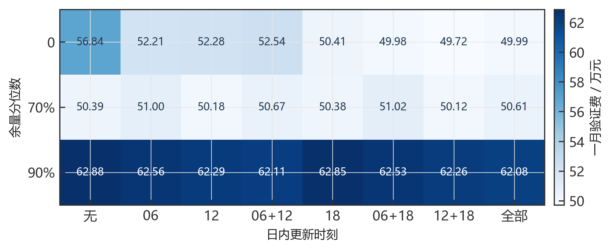
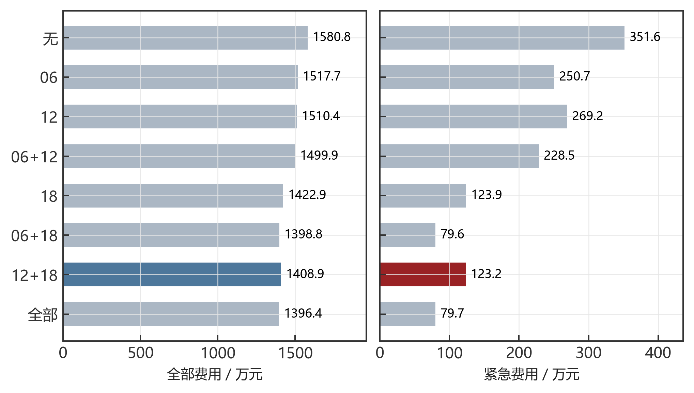
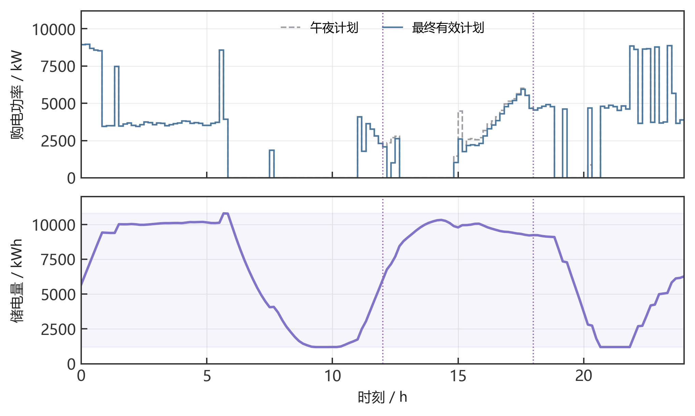
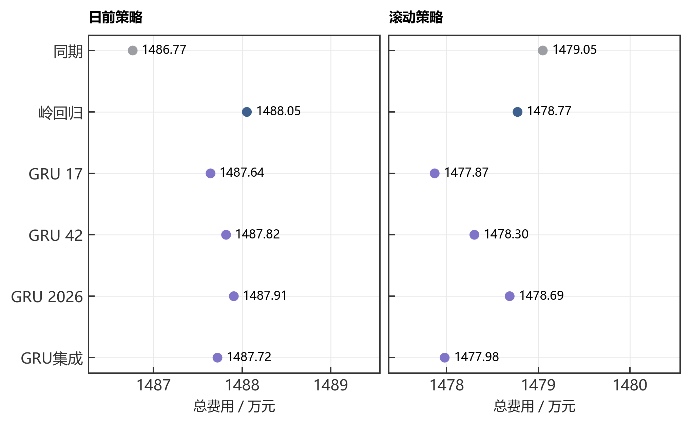

# 预测误差与波动电价下的微网购电和储能调度

## 摘 要

光伏出力、负载需求和外部电价同时影响微网运行，仅提高预测精度不能保证降低购电费用。本文建立统一的能量平衡与储能状态模型，将预测、计划、日内调整和实际结算连接起来，分析四种信息条件下的购电决策。

针对第一问，将十分钟购电和充放电量作为连续变量，引入二元变量保证充放电互斥，建立混合整数线性规划。在两侧效率各为90%的口径下，单日费用为35,126.95元，相较无储能降低26.90%；整数解与线性松弛下界一致。针对第二问，采用因果岭回归和历史净负载误差分位数余量，一月验证选定70%余量；2—12月334天总费用为14,132,612.16元，比同期无余量低26.50%。

针对第三问，将小时光伏预报积分为十分钟电量，建立保留计划版本、冻结已执行区间的滚动优化模型。按主结算假设，一月验证选定12:00和18:00更新、零额外余量，全年费用为14,088,564.93元，比仅午夜预报低10.88%。八种更新时间组合和另一退款口径的实验表明，增加更新次数不保证实际费用单调下降。

针对第四问，在一致历史信息条件下比较同期、岭回归与三个随机种子的残差GRU。GRU集成的全期价格MAE为0.04366元/kWh，岭回归为0.04750元/kWh；但价格误差改善未必转化为电费降低。分别按一月实际费用选择两类策略，日前与滚动方案全年费用为14,880,535.05元和14,790,501.42元。

全部方案检验供电平衡、储能边界、充放电互斥、跨日连续性与费用账本。结论依赖明确的效率、时间标签和退款解释；预测驱动策略为可执行的经验方案，不等同于全局随机最优控制。

关键词：微网调度；混合整数规划；滚动优化；门控循环网络；预测误差

## 一 问题重述

题面研究小区光伏、负载、储能与外部电网之间的电力调控 [1]。储能可以在低价或光伏富余时吸收电量，在高价或供电不足时释放电量；调度既要满足负载，也要尽可能节省购电费用。本文依次研究确定性调度、预测误差、日内更新与波动电价四个层次。

第一问给定每天重复的电价、负载和单日光伏预测，要求每天 00:00 制定全天购电计划，且日初日末储电量相同。需报告指定十分钟时段的购电量、全天总量和费用，以及四小时充放电汇总。第二问中负载与光伏逐日变化，正常购电仍按计划量收费，供电缺口通过五倍交易电价的紧急购电补足，需输出 2—12 月每日完整策略及四个指定日期的结果。

## 二 问题分析

第一问是已知输入曲线下的跨时段资源分配。线性回归不负责决定何时充电；购电、电池和负载之间的能量约束才是主模型。加入二元变量后可直接保证同一时段不同时充放电，避免事后修复改变费用与可行性。

第二问的预测误差具有不对称经济后果：低估净负载可能触发五倍电价补购，高估则可能产生仍需付费的富余计划电量。因此先预测负载与光伏，再构造风险余量并求购电计划，最后用实际观测执行与计费。预测误差用于评价预测器，实际购电总费用用于评价完整策略，两者不能互相替代。

## 三 模型假设与数据处理

### 3.1 参数及工作假设

统一参数见表 1。功率上限按微网母线侧定义，所有决策电量使用 kWh。题面“充放电效率为 90%”可能存在单程与往返解释差异，主实验采用两侧各 90%，并对另一解释单独进行敏感性分析。

表 1 储能参数与时间离散

| 参数 | 数值 | 性质 |
| --- | --- | --- |
| 额定容量 | 12000 kWh | 题面给定 |
| 允许储电量 | 1200—10800 kWh | 题面给定 |
| 最大充放电功率 | 5000 kW | 题面给定 |
| 初始储电量 | 6000 kWh | 1 月 1 日 00:00 给定 |
| 充电／放电效率 | 0.9／0.9 | 主实验解释 |
| 时段长度 | 1/6 h | 十分钟离散 |

（1）将每个功率值解释为以时间标签为右端点的十分钟区间平均值。由此原始 00:10 对应 00:00—00:10，原始 00:00+1 对应 23:50—24:00。结果副本按该时间轴统一标签；该解释并非题面明确说明的采样定义。

（2）不设置题面未给出的售电收入与折旧价格，允许不能使用的电量被弃用。普通购电按计划量结算，富余计划量不退款。电池磨损成本没有纳入当前目标。

（3）实际执行近似每十分钟内功率恒定、当前供需可即时观测并平衡。该近似只服务于区间内的充放电和紧急购电，不允许日前读取当天真实曲线。

（4）第二问实际 SOC 连续跨日。日前名义轨迹的日末下限取 6000 kWh，作为防止计划耗空电池的策略设置；不强制实际日末回到 6000，也不按天重置电池。

### 3.2 输入审计与时间边界

附件 1 有 144 个时段，附件 2 的负载与光伏各有 365×144＝52,560 个观测。读取后检查到完整的 2025 年日期、相同的负载和光伏时间轴，未发现缺失、负数或重复日期，未无依据删除峰值。附件 1 混合存储了时间类型与字符串，统一转换分钟后核对 10、20、…、1440。电量按下式换算：

$$
L_{d,t}=P^{\mathrm{load}}_{d,t}\Delta t,\qquad V_{d,t}=P^{\mathrm{PV}}_{d,t}\Delta t,\qquad \Delta t=\frac{1}{6}\ \mathrm{h}.
$$

重新读取原始工作簿确认：附件 1 的时间列含 60 个时间类型单元格和 84 个字符串，均已规范化；附件 2 的两类序列各 52,560 项无缺失、非有限值或负数，且无重复日期或完全重复的日曲线。全局四分位距规则未标记超界点，但这一检查不能证明不存在局部测量误差。

因此，本次预处理没有执行填补、删点、缩尾或平滑，只执行时间格式与单位规范化。光伏有 23,540 个零值，其本身不是缺失标记，保留在原始记录与回测中。预测值的非负截断属于模型输出规则，训练集标准化属于特征处理，均不等同于修改实际观测。

实际数据的测量不确定性没有单独给出，因此不添加虚构置信区间。全文图线来自原始输入或保存的实际计算结果，时段内不做平滑插值。

## 四 符号说明

下文沿用表 2 的符号。单日模型省略日期下标，日内区间用 1—144，状态包含 145 个边界点；跨日计算另带日期下标。

表 2 主要符号及单位

| 符号 | 含义 | 单位 |
| --- | --- | --- |
| $d,t$ | 日期与十分钟时段 | — |
| $L_{d,t},V_{d,t}$ | 负载与光伏电量 | kWh |
| $\hat L_{d,t},\hat V_{d,t}$ | 日前负载与光伏预测 | kWh |
| $g_{d,t},e_{d,t}$ | 计划购电与紧急购电 | kWh |
| $c_{d,t},d_{d,t}$ | 母线侧充电与放电 | kWh |
| $w_{d,t}$ | 不能利用的富余电量 | kWh |
| $S_{d,t}$ | 区间起点的储电量 | kWh |
| $p_t$ | 固定分时交易电价 | 元/kWh |
| $\eta_c,\eta_d$ | 充电与放电效率 | — |
| $z_t$ | 充电状态二元变量 | — |
| $\lambda,q$ | 岭惩罚强度与余量分位数 | — |
| $r_{d,t}(q)$ | 非负净负载预测余量 | kWh |

日期下标 d 与放电变量的字母 d 通过下标位置区分；为简化实现，程序字段分别使用 date 和 discharge_kwh。

## 五 第一问的模型建立与求解

### 5.1 供需结构与决策目标

已给曲线及固定电价如图 1 所示。光伏集中在白天，而负载覆盖全天，储能调度应同时响应供需差额和分时价格。电价使用独立面板，避免功率与价格共用坐标造成误读。

图 1 第一问供需曲线与分时电价

图中每一阶梯对应一个十分钟平均功率或电价，光伏阴影为功率曲线下区域，不作为置信带。

目标是最小化全天计划购电费：

$$
\min C_1=\sum_{t=1}^{144}p_tg_t.
$$

以母线侧收支写能量守恒，将允许的富余供电显式记为未利用电量：

$$
g_t+V_t+d_t=L_t+c_t+w_t,\qquad g_t,w_t\geq0.
$$

充电损耗发生在进入储能时，放电损耗发生在从储能输出至母线时，因而状态方程为：

$$
S_{t+1}=S_t+\eta_c c_t-\frac{d_t}{\eta_d},\qquad 1200\leq S_t\leq10800.
$$

SOC 上下界施加于全部 145 个状态点，状态递推与其他时段约束对应 t＝1，…，144。令每时段最大母线侧充放电量 M＝5000/6 kWh，用二元变量直接限制互斥：

$$
0\leq c_t\leq Mz_t,\qquad 0\leq d_t\leq M(1-z_t),\qquad z_t\in\{0,1\}.
$$

第一问满足以下初始和终端条件，避免利用电池初始存量净放电造成虚假节省：

$$
S_1=S_{145}=6000.
$$

将上述关系集中写成一般日模型，决策变量为购电、充放电、未利用电量、储电量和状态变量。给定不同供需输入与初末状态条件时，可复用以下结构：

$$
\boxed{\left\{\begin{aligned}\min_{g,c,d,w,S,z}\quad &\sum_{t=1}^{144}p_tg_t\\\mathrm{s.t.}\quad &g_t+V_t+d_t=L_t+c_t+w_t,\\&S_{t+1}=S_t+\eta_c c_t-d_t/\eta_d,\\&1200\leq S_t\leq10800,\quad g_t,w_t\geq0,\\&0\leq c_t\leq Mz_t,\quad0\leq d_t\leq M(1-z_t),\\&z_t\in\{0,1\},\quad S_1=S_{145}=6000.\end{aligned}\right.}
$$

上述模型有 865 个变量，其中 144 个为二元变量。以 SciPy 1.17.1 的 milp 接口调用 HiGHS [2]，相对间隙目标设为 10⁻⁷，每日求解时间上限为 30 秒；超时或无可行解时应停止并报告，而非将空结果视为成功。

### 5.2 调度结果与指定时段

计算得到全天购电量 59,482.70 kWh、费用 35,126.95 元。购电与储能轨迹见图 2，指定时段购电和四小时充放电分别见表 3、表 4。

图 2 第一问电价驱动的购电与储能运行

自上而下为电价、购电与正净负载、充放电、SOC。所有阶梯保留十分钟决策，不作平滑。购电超过正净负载的部分用于充电；SOC 阴影为允许范围。

表 3 第一问指定时段购电量及全天费用

| 时间段 | 购电量 | 时间段 | 购电量 | 时间段 | 购电量 |
| --- | --- | --- | --- | --- | --- |
| 10:00-10:10 | 0.00 | 12:00-12:10 | 480.41 | 14:00-14:10 | 0.00 |
| 16:00-16:10 | 445.43 | 18:00-18:10 | 531.89 | 20:00-20:10 | 0.00 |
| 全天购电量 | 59,482.70 | 全天购电费 | 35,126.95 | — | — |

表中电量单位为 kWh，全天购电费单位为元。

表 4 第一问四小时充放电及日初日末储电量

| 时间段 | 充电量 | 放电量 | 时间段 | 充电量 | 放电量 |
| --- | --- | --- | --- | --- | --- |
| 00:00-04:00 | 4,500.00 | 0.00 | 04:00-08:00 | 833.33 | 6,365.84 |
| 08:00-12:00 | 4,787.96 | 1,703.00 | 12:00-16:00 | 5,286.04 | 91.10 |
| 16:00-20:00 | 0.00 | 5,780.13 | 20:00-24:00 | 5,333.33 | 2,859.87 |
| 00:00 储电量 | 6,000.00 | — | 24:00 储电量 | 6,000.00 | — |

表内所有电量单位为 kWh，充放电量采用母线侧口径。四小时内可先充后放，汇总行两者均正不违反十分钟互斥。图中尖峰主要对应集中充电：22:00—22:10 负载约 3309.39 kW、光伏为零，充电 5000 kW，故购电约 8309.39 kW。相邻时段电价为 0.3859、0.4368 元/kWh，模型分别安排满功率充电与不充电。

当前目标只计购电费，未计充电切换成本或功率爬坡限制，因此低价区间内也可能出现零散充电。这是模型边界，不能由图形尖峰直接判为原始数据异常。固定放电与未利用电量、保持费用不变的充电变差最小化诊断未获得实质不同的轨迹，不能据此声称存在平滑且同成本的替代方案。若需要更平稳的实际操作，应另加爬坡约束或费用容差内的次级目标，重新计算并比较成本。

### 5.3 最优性检验与效率解释

删除整数限制得到线性松弛下界 35,126.94858929 元，与整数解目标之差为 0.00000000 元，求解器相对间隙为零。在本题输入与约束口径下，这支持数值精度内的全局最优性。能量平衡最大残差约 2.27e-13 kWh，SOC 递推与容量、功率边界均通过复核。

以每时段正净负载直接购电构造无储能基线：

$$
g_t^{(0)}=\max(L_t-V_t,0),\qquad C_1^{(0)}=\sum_t p_tg_t^{(0)}.
$$

该基线费用为 48,052.05 元，主模型节省 26.90%。效率解释的对照见图 3：若总往返效率为 0.9，并对称取两侧效率为平方根 0.9，费用为 33,801.50 元。该试验只改变效率，不能与主实验混为同一组结果。

图 3 第一问储能收益与效率解释对照

所有柱形从零开始。前两项比较储能作用，后两项比较效率解释；主文及 Excel 均对应“两侧效率各 90%”。

## 六 第二问的预测与日前策略

### 6.1 训练与评价的时间顺序

以 1 月 22—31 日作为验证窗，选择岭回归惩罚与风险余量。2 月 1 日起固定这些选择规则，执行至 12 月 31 日。模型每七天更新一次，最多使用最近 60 个已结束日期；评价过程中已观察到的数据可以进入后续更新，尚未发生的数据不进入当前决策。这是顺序样本外回测，而不是把全年随机拆分。

一月份共同热身从 1 月 1 日的 6000 kWh 开始；首日无历史时用附件 1 作为冷启动参考，随后不足七天用近三日均值，积累七天后用日／周同期。验证期初 SOC 为 6244.256891 kWh，评价期初为 9902.811288 kWh，各候选策略都从同一状态出发。冷启动的附件 1 仅作为明确的初始化假设，不当作全年可提前获得的预报。

### 6.2 同期基线与岭回归预测

对负载或光伏电量序列 y，同期基线取昨日与上周同日相同时间槽的均值：

$$
\hat y_{d,t}^{\mathrm{seasonal}}=\frac{y_{d-1,t}+y_{d-7,t}}{2}.
$$

岭回归采用 21 个特征：昨日、前日、上周同日的同槽值，三日和七日同槽均值、七日同槽标准差、昨日全天均值和近三日全天均值共八项；前三阶日内正余弦六项；星期指示七项。日期及时间属于决策时已知的日历信息。标准化均值与尺度仅在当次训练集上估计，常量特征尺度置 1。

$$
\min_{\beta,b}\sum_{i\in\mathcal T_d}(y_i-b-\widetilde{x}_i^{\mathsf T}\beta)^2+\lambda\|\beta\|_2^2.
$$

截距不惩罚，负载和光伏分别拟合。按验证 MAE 比较 λ＝1、10、100，均选 1；实现采用 NumPy 线性方程求解，与带截距岭目标一致 [3]。从 1 月 15 日开始具备拟合条件，之后每七日重新拟合。预测截断为非负；某槽过去七日光伏全零时，该槽预测置零，日出日落季节变化可能使此规则产生滞后。

评价指标采用功率单位的 MAE 与 RMSE；不使用夜间分母为零的普通 MAPE：

$$
\mathrm{MAE}=\frac{1}{n}\sum_i|P_i-\widehat P_i|,\qquad\mathrm{RMSE}=\sqrt{\frac{1}{n}\sum_i(P_i-\widehat P_i)^2}.
$$

### 6.3 净负载误差余量与名义优化

定义历史净负载误差及只包含过去信息的误差样本池：

$$
\varepsilon_{j,s}=(L_{j,s}-V_{j,s})-(\hat L_{j,s}-\hat V_{j,s}).
$$

$$
\mathcal E_{d,t}=\{\varepsilon_{j,s}:\max(2,d-28)\leq j<d,\ 1\leq s\leq144,\ |s-t|\leq3\}.
$$

日期下标以 1 月 1 日为 d＝1；排除首日冷启动误差，最多池化 28 个已结束日期和目标槽前后三槽。跨日边界不绕回，不足 28 天时仅取已有历史。余量规则为：

$$
r_{d,t}(q)=\max\{0,Q_q(\mathcal E_{d,t})\}.
$$

无余量候选直接设 r＝0，与“取零分位数”区分。对 q＝0.7、0.8、0.9，分位数使用样本排序后的线性插值。将预测负载加余量作为名义需求，求解第五节同一物理模型：

$$
L_t^{\mathrm{nom}}=\hat L_{d,t}+r_{d,t}(q),\qquad V_t^{\mathrm{nom}}=\hat V_{d,t},\qquad S_{d,145}^{\mathrm{nom}}\geq6000.
$$

70% 分位数不是“全天 70% 概率不缺电”的保证。名义优化只最小化计划费，五倍紧急购电的影响通过验证期对余量方案的筛选间接体现，不能据此称为已精确求解随机规划。

### 6.4 实时执行与跨日状态

当天普通购电计划固定后，定义当前供需剩余。对非负剩余尽量充电，对缺口尽量放电，并分别受可用空间、储电量和功率限制：

$$
u_t=g_t+V_t-L_t.
$$

$$
c_t=\min\left\{\max(u_t,0),M,\frac{10800-S_t}{\eta_c}\right\}.
$$

$$
d_t=\min\left\{\max(-u_t,0),M,\eta_d(S_t-1200)\right\}.
$$

$$
e_t=\max(-u_t-d_t,0),\qquad w_t=\max(u_t-c_t,0).
$$

以上规则使同一时段仅有充电或放电，SOC 仍按状态方程更新，实际日末传给次日：

$$
S_{d+1,1}=S_{d,145}.
$$

所有供电缺口由紧急购电补足。全年评价费用定义为：

$$
C_2=\sum_{d,t}p_tg_{d,t}+5\sum_{d,t}p_te_{d,t}.
$$

将第二问策略概括如下。记 Ω 为第一问中除初末等式之外的物理可行域，输入替换为带余量预测，日初状态取真实已知值；G 表示本节的贪心实时平衡规则：

$$
\boxed{\left\{\begin{aligned}(g^{\mathrm{plan}},\ldots)&\in\arg\min_{(g,c,d,w,S,z)\in\Omega}\sum_t p_tg_t,\\L^{\mathrm{nom}}&=\hat L+r(q),\quad V^{\mathrm{nom}}=\hat V,\\S_1^{\mathrm{nom}}&=S_1^{\mathrm{actual}},\quad S_{145}^{\mathrm{nom}}\geq6000,\\(c_t,d_t,e_t,w_t)&=\mathcal G(g_t^{\mathrm{plan}},L_t,V_t,S_t),\\C_2&=\sum_{d,t}p_t(g_{d,t}^{\mathrm{plan}}+5e_{d,t}).\end{aligned}\right.}
$$

其中 Ω 中每一时段的平衡使用上式名义输入；最后一行是实际策略评价费用，不是声称日前已知实际 e 的优化目标。余量 q 仅由一月验证费用选择，之后冻结。

实际储能动作可以偏离名义动作，但普通计划购电不能按真实曲线事后改写。这一贪心控制具有可行性与因果性，不保证跨时段的实时经济最优。

## 七 第二问的结果与检验

### 7.1 验证期选择与紧急购电权衡

验证结果见表 5 与图 4。各方案使用相同验证初始 SOC，但期末存量不同，因此除费用外同时列出期末储电量，不把存量差异隐藏在成本比较中。

表 5 一月份十天验证结果

| 预测器 | 余量 | 总费/元 | 紧急费/元 | 期末SOC/kWh |
| --- | --- | --- | --- | --- |
| 同期 | 无 | 661,834.09 | 173,098.38 | 9,902.81 |
| 同期 | 70% | 634,179.58 | 110,989.47 | 10,595.98 |
| 同期 | 80% | 666,226.97 | 64,910.51 | 10,800.00 |
| 同期 | 90% | 680,257.72 | 456.98 | 10,800.00 |
| 岭回归 | 无 | 532,888.41 | 61,836.07 | 5,924.08 |
| 岭回归 | 70% | 509,757.47 | 8,765.44 | 6,623.17 |
| 岭回归 | 80% | 529,846.45 | 4.16 | 7,110.16 |
| 岭回归 | 90% | 633,664.05 | 0.00 | 9,039.38 |

图 4 验证期风险余量与费用的权衡

横轴为四种候选方案，其中“无余量”是独立基线。折线只辅助比较候选值，不表示连续参数的精确响应。

岭回归 70% 余量的验证费为 509,757.47 元，其中紧急费 8,765.44 元；90% 余量紧急费为零，但总费升至 633,664.05 元。两者期末储电量相差约 2416 kWh，故不能完全忽略存量影响；当前目标仍按题面购电费用评价，不另添加缺乏依据的残值收入。

### 7.2 全期预测误差与季节变化

按表 6 比较 334 天共 48,096 个十分钟区间的功率预测误差，岭回归在负载预测上的改善大于光伏。四个指定日期的曲线对照见图 5，整年误差仍以全期统计为准。

表 6 第二问全期预测误差

| 预测器 | 负载MAE | 负载RMSE | 光伏MAE | 光伏RMSE |
| --- | --- | --- | --- | --- |
| 同期 | 372.26 | 585.91 | 171.98 | 343.38 |
| 岭回归 | 179.86 | 234.59 | 155.28 | 306.74 |

上述误差单位均为 kW，光伏指标包含夜间零值，不能直接等同于白天发电时段的预测精度。

图 5 四个指定日期的负载与光伏日前预测

各列共用纵轴尺度，日期由题目指定。实线为实际观测，虚线为岭回归预测，不加入平滑后虚构的尖峰。

### 7.3 全期购电费用与运行约束

策略费用分解如图 6，数值及期末存量见表 7。相同初始状态保证比较具有共同起点，实际状态在全年内自行连续演化。

表 7 第二问全期费用及期末储电量

| 策略 | 计划费/万元 | 紧急费/万元 | 总费/万元 | 期末SOC/kWh |
| --- | --- | --- | --- | --- |
| 同期 无余量 | 1,199.19 | 723.59 | 1,922.78 | 5,825.99 |
| 岭回归 无余量 | 1,215.92 | 354.62 | 1,570.54 | 5,903.65 |
| 同期 70%余量 | 1,297.86 | 452.54 | 1,750.40 | 6,217.35 |
| 岭回归 70%余量 | 1,293.50 | 119.76 | 1,413.26 | 5,903.65 |

图 6 第二问四组策略的全期费用分解

蓝色为普通计划购电费，深红为紧急购电费；条形右端标注两者合计。主策略由一月份验证选择。

主策略总费用 14,132,612.16 元，较同期无余量低 26.50%，较岭回归无余量低 10.01%。后两组期末 SOC 均为 5,903.65 kWh，因此此处的余量增益没有被不同期末存量混淆。

主策略紧急购电累计 197,465.10 kWh，涉及 1132 个十分钟区间，不等同于同样数量的独立事件。未利用电量为 2,211,229.49 kWh，其中可包含未消纳光伏和富余计划购电，不能全部称为弃光。

按月费用见图 7，主策略在 11 个评价月份中有 11 个月的总费用低于同期无余量。月度划分仅用于描述已固定策略的季节表现，未用于重新选超参数；月总费也受到月份天数和负载规模影响，不宜直接将其解读为单位供电效率。

图 7 固定策略的月度总费用与紧急费用

上面板为含紧急费用的月总费，下面板为其中的紧急费用。三条曲线依次分离预测改进和风险余量的作用。

月度预测 MAE 进一步见图 8。两块热力图各用自身的颜色上限，不能直接按跨面板颜色深浅比较负载与光伏误差；应读取格内数值。该图用于观察季节变化，不提供未计算的置信区间。

图 8 同期预测与岭回归的月度误差

每格为对应月份全部十分钟区间的 MAE，单位 kW；数值为整数显示，统计文件保留完整精度。

四个指定日期的购电、充放电、日初日末储电量及紧急事件，集中列于附录 A；完整逐日计划分别写入题目指定结果文件。

## 八 第三问的日内滚动调整

### 8.1 新预报的价值与时间对齐

第三问新增的是带有发布时间的光伏信息，而不是未来实际出力。每个更新点应比较新计划可能避免的紧急购电与调整支出，并保护已经执行的交易。负载仍沿用第二问的日前岭回归，日内不使用未来负载真值校正预测；这一设计也使更新时间对照主要反映光伏预报和当前储能状态的作用。滚动优化具有不断用最新可用信息更新未来决策的结构，其思想可参见文献[4]；本文没有照搬该文的潮流或分布式控制模型。

附件3含365天、每日4次、每次24个小时预报，共35,040个数值。1,095个空日期位于同日四行预报的后3行，只在该结构内补齐。预报发布点与提前量逐行核验，无缺失、负数和非有限数；17,525个零值保留。预报“1小时”指发布后一小时，不是当天01:00。附件4的52,560个电价亦完整、非负且严格为正，范围0.0076—1.7936元/kWh。两附件均不做删点、缩尾或平滑观测。

设发布时刻为τ，小时预报端点为 Hτ,h，h＝1，…，24。发布时间处缺少零小时端点，采用刚结束的十分钟实际光伏均值作为边界代理，年初无历史时取零；该代理只用于预报曲线首段。以相邻整点之间的线性函数插值，并对每个十分钟区间作梯形积分：

$$
\hat V_{\tau,t}=\int_{a_t}^{b_t}\tilde P_\tau(u)\,du=\frac{\tilde P_\tau(a_t)+\tilde P_\tau(b_t)}{2}\Delta t.
$$

此过程是预报分辨率转换，不是修改实际数据。实际电量仍按附件2原值乘1/6小时。当前实现每次只优化至本日24:00，预报中次日部分暂不用于跨日承诺，避免题目未规定的提前购入次日电量。图9展示6月21日的实际与不同版本预报。

图 9 同一日期不同发布时刻的光伏预报

各版本只从其发布时刻向后显示。新增预报不保证每个目标时段更接近实际；不能把18:00版本提前用于午夜决策。

### 8.2 多次调整的费用账本

题面给出减购50%违约电价和增购1.5倍价格，但没有完整说明取消部分是否退回原款。主模型取取消原价退款并扣50%违约费，即净回收0.5倍原价；另将“原款不退且额外支付50%违约费”单独重新优化作敏感性。该分歧必须体现在假设和结果中，不能默认为唯一解释。

令 g⁰ 为午夜计划，gᵏ 为第k次更新后的计划。每次调整对最近版本定义非负增购 a⁺ 和减购 a⁻。已执行区间不允许进入调整集合，未来计划保持非负：

$$
g_t^{k}=g_t^{k-1}+a_{k,t}^{+}-a_{k,t}^{-},\quad a_{k,t}^{\pm}\ge0,\quad 0\le a_{k,t}^{-}\le g_t^{k-1}.
$$

单次同一区间不应同时增减。因为价格为正，同时增加和减少同量会额外支付正费用，可从最优解中消去；程序仍检查实际解没有这种循环。完整账本为：

$$
C_3=\sum_t p_tg_t^0+\sum_k\sum_{t\in\mathcal T_k}p_t(1.5a_{k,t}^{+}-0.5a_{k,t}^{-})+5\sum_t p_te_t.
$$

对于多轮操作，新增单位支付1.5倍，随后取消也只净返还0.5倍，绝不返还先前支付的全部1.5倍；因而先增加再取消的往返费用为一倍价格，不产生虚假套利。总费用拆成午夜原始计划、历次增购、历次减购净退款、实际紧急购电四部分。另一个无退款解释只把负0.5系数改为正0.5，并重新求解整个策略。

### 8.3 滚动优化与余量校准

每次重新优化以当前真实已知储电量为初值，沿用物理可行域和名义日末6000 kWh下限。00:00以全部计划费用为目标；其余时刻已付款为常数，仅最小化尚可改变部分的调整费用。余量按对应发布版本、同一目标钟点此前28天净负载误差计算，并池化相邻三槽；不足28天使用已有历史。零余量单独作为候选。

$$
\boxed{\left\{\begin{aligned}\min_{g,c,d,w,S,z,a^+,a^-}\quad&\sum_{t\in\mathcal T_k}\hat p_{k,t}(1.5a_{k,t}^{+}-0.5a_{k,t}^{-})\\\mathrm{s.t.}\quad&g_t=g_t^{k-1}+a_{k,t}^{+}-a_{k,t}^{-},\\&g_t+\hat V_{k,t}+d_t=\hat L_t+r_{k,t}+c_t+w_t,\\&(g,c,d,w,S,z)\in\Omega,\\&S_{\tau_k}=S_{\tau_k}^{\mathrm{actual}},\quad S_{145}\ge6000,\\&a_{k,t}^{+}\ge0,\quad0\le a_{k,t}^{-}\le g_t^{k-1}.\end{aligned}\right.}
$$

Ω沿用第一问中状态递推、所有状态点储能边界、母线侧功率限制和二元互斥，去掉原初末相等等式。第三问 p̂ 就是附件1的已知固定价格。求解后只按实际逐十分钟执行到下一更新点，未来轨迹随后可重新计算。没有更新的组保持已承诺计划，实际电池仍按即时余缺充放电并在不足时紧急补购。该控制规则保证供电可行，但不保证随机控制意义下最优。

一月22—31日验证三种余量与八个更新子集共24组；四组状态同源扩展为全部候选共同初值6244.256891 kWh，评价从2月1日共同状态9902.811288 kWh开始。图10给出验证费用矩阵，选择只依据该矩阵，之后冻结更新时刻和余量。

图 10 余量与更新时间的验证费用

每格是完整10天实际总费用，单位万元；0表示不另加误差余量，横轴“无”仍使用午夜预报。

### 8.4 全年效果及是否需要其他预报

验证选定余量为0%，更新时刻为12:00与18:00。全年费用为14,088,564.93元，相对仅午夜组降低10.88%；紧急购电量为230,671.95 kWh。图11和表8列出同一余量下八个子集的事后比较。

表 8 第三问不同更新时间的全年比较

| 更新时刻 | 总费/万元 | 紧急费/万元 | 期末SOC/kWh |
| --- | --- | --- | --- |
| 仅午夜 | 1,580.79 | 351.63 | 5,903.65 |
| 06 | 1,517.71 | 250.70 | 5,903.65 |
| 12 | 1,510.44 | 269.24 | 5,903.65 |
| 06+12 | 1,499.85 | 228.54 | 5,903.65 |
| 18 | 1,422.89 | 123.86 | 5,903.65 |
| 06+18 | 1,398.78 | 79.60 | 5,903.65 |
| 12+18 | 1,408.86 | 123.15 | 5,903.65 |
| 06+12+18 | 1,396.45 | 79.69 | 5,903.65 |

图 11 更新时间与全年费用

较深颜色为验证选定的12+18方案。全部更新的事后表现可用于解释，但没有用它替换已冻结的主方案。

新增信息能够支持更合适的调整，却伴随预报误差、调整交易和名义终端目标的影响。部分更新时间组合比仅增加另一时刻更差，说明不能简单把“预报更多”写成“回测必然更优”。本题这组数据支持采用日内更新，而具体更新时刻应在历史验证阶段确定。图12展示9月23日原计划、最终有效计划和连续储能状态。

图 12 指定日期的计划变化与储能状态

竖虚线为选定更新时刻；午夜计划以灰虚线显示，最终有效计划以蓝实线显示。图中保留十分钟决策，不平滑购电尖峰。

无退款且额外罚款口径下，保持同一更新时刻与余量并重新求解，全年费用为14,074,210.92元，主口径为14,088,564.93元。两者的实际轨迹不同，不能把差额理解为单纯退费金额。允许退款的名义最优调整可能取消过多电量并在实际误差下增加紧急费用，因此这类经验策略的事后费用不满足确定性“退款越多越省”的单调性。

## 九 第四问的电价预测与两类调度

### 9.1 波动价格的信息与结算

附件4每个供电区间只有一个实际价格，没有提供同一交付区间在不同交易时点的报价面板。主模型将未来价格视为未知，历史值仅在区间结束后可用；预测价格进入优化，实际交付区间价格乘对应系数用于回测结算。这是当前数据能够支持的明确假设，而非声称全年价格已在午夜公开。图13给出实际价格的全年变化。

图 13 全年实际电价的日内范围与日均值

阴影为每天实际最小至最大值，不是置信区间；没有删除价格峰谷。价格低至0.0076元/kWh仍保留，不以MAPE作主指标。

### 9.2 公平预测接口与时间切分

每个起点τ直接预测未来144个十分钟价格。输入为目标钟点前一天和前一周的两条历史曲线，以及目标时刻、星期的正余弦编码；在各起点这些信息全部已知。同期、岭回归与GRU的信息来源相同，表示方式不同。前一天的末项最大为τ前一个已经结束的区间，避免把多步预测的“最近滞后”错误取成未来真值。

$$
\hat p_{\tau,j}^{\mathrm{seasonal}}=\frac{p_{\tau+j-144}+p_{\tau+j-1008}}{2},\qquad j=0,\ldots,143.
$$

岭回归把两条历史价格、日历、两者差和乘积及各历史曲线均值和标准差组合为12维特征，按未来目标逐行拟合。标准化参数仅由训练窗口估计，正则强度在1、10、100中依据一月验证MAE选择，选得1。序列窗口每6小时移动；窗口重叠不能视为完全独立样本。全部训练目标必须在拟合时刻前结束，不能仅检查窗口起点。

模型于1月15日、22日初始化，此后每月月初从最近60天历史重新拟合。GRU每次把最近3天完整目标窗口作为内部早停验证，其他可用窗口训练，跨越分界的目标窗口剔除。内部验证只服务该次训练；一月22—31日外层验证用于比较方案；2—12月结果用于顺序样本外评价，不能反过来选择结构、种子或主方案。

### 9.3 残差 GRU 的训练

为避免小样本网络从零重建已有日周期，先以同期曲线作为基准，再用单层GRU学习偏差。输入维度6，隐藏维度32，每个位置输出一个价格残差，整体一次得到144步，不使用未来标签进行递归输入。门控关系采用PyTorch的实现约定[5]：

$$
r_j=\sigma(W_{ir}x_j+b_{ir}+W_{hr}h_{j-1}+b_{hr}),\quad z_j=\sigma(W_{iz}x_j+b_{iz}+W_{hz}h_{j-1}+b_{hz}).
$$

$$
n_j=\tanh(W_{in}x_j+b_{in}+r_j\odot(W_{hn}h_{j-1}+b_{hn})),\quad h_j=(1-z_j)\odot n_j+z_j\odot h_{j-1}.
$$

$$
\hat p_{\tau,j}=\max\{0.001,\ \hat p_{\tau,j}^{\mathrm{seasonal}}+s_y(w^Th_j+b)\}.
$$

历史价格先按训练集尺度标准化，sy为相应标准差。输出头初始为零，初始预测因此等于同期基线。训练采用平滑L1损失、Adam学习率0.003、批大小32、梯度范数上限1，每次最多50轮；内部验证MAE连续6轮无改善则停止并恢复最好权重。价格下限0.001只作用于预测输出，且低于本数据实际最小价格，不属于清洗实际值。

固定种子17、42、2026；每次重训使用种子与拟合日索引之和，三个模型分别保存，再以等权均值构成预先定义的GRU集成。所有种子均进入结果表，不挑最好的一次替代其他结果。图14展示6月1日重训的内部验证收敛，仅代表该次训练，不能冒充全年的验证曲线。

图 14 GRU 三个种子的内部验证过程

曲线在实际早停轮数结束；各次模型均恢复内部验证最优权重。其他月份的完整训练记录保留在支撑材料中。

### 9.4 预测精度与实际电费的区别

图15按题目指定四个日期展示午夜价格预测，表9统计每次起点当天剩余目标的MAE和RMSE。同一目标可能被不同起点预测，因此评价共120,240个“起点—目标”对，不是120,240个独立价格观测；原始全年观测仍为52,560个。

表 9 第四问价格样本外误差

| 预测器 | MAE/元每kWh | RMSE/元每kWh |
| --- | --- | --- |
| 同期 | 0.05648 | 0.07709 |
| 岭回归 | 0.04750 | 0.06504 |
| GRU 17 | 0.04351 | 0.05880 |
| GRU 42 | 0.04375 | 0.05921 |
| GRU 2026 | 0.04545 | 0.06206 |
| GRU集成 | 0.04366 | 0.05928 |

图 15 四个指定日期的午夜电价预测

实际价红实线、岭回归蓝虚线、GRU集成紫点线，四面板统一尺度。各预测只使用其午夜之前的信息。

GRU集成MAE较岭回归低8.09%，但低平均误差不能保证对极少数廉价充电槽的排序更准，也不能保证减少供需预测造成的紧急补购。为公平识别价格预测作用，两类策略分别固定负载、光伏、风险余量、初始SOC、更新时刻和结算，仅改变价格预测器。

第四问重算第二问时不使用附件3的日内信息，保持70%余量及午夜固定计划；重算第三问时使用其验证选定的12/18点更新与零余量。图16、表10给出全部价格预测器的费用。两类策略的主预测器分别只按一月实际费用在同期、岭回归、GRU集成中选择，得到日前岭回归和滚动同期方案。

表 10 第四问两类策略的实际费用

| 预测器 | 日前总费/万元 | 滚动总费/万元 |
| --- | --- | --- |
| 同期 | 1,486.77 | 1,479.05 |
| 岭回归 | 1,488.05 | 1,478.77 |
| GRU 17 | 1,487.64 | 1,477.87 |
| GRU 42 | 1,487.82 | 1,478.30 |
| GRU 2026 | 1,487.91 | 1,478.69 |
| GRU集成 | 1,487.72 | 1,477.98 |

图 16 价格预测器对两类策略总费用的影响

点图采用局部费用范围以显示小差异，横轴明确标注绝对费用；不是从非零基线截断的柱图。三个种子是重复实验，不将其范围称为统计置信区间。

冻结的日前方案总费14,880,535.05元、紧急购电194,980.07 kWh；冻结滚动方案总费14,790,501.42元、紧急购电229,924.89 kWh。主方案并非各自全年事后最小值，这是严格保留验证／评价边界的结果。GRU试验表明网络能够改善部分价格误差，却不足以单凭该指标替换主购电策略。

## 十 综合验证与模型评价

### 10.1 数值与信息边界

四问共用的能量平衡、储能状态、互斥及单位换算均检查到10⁻⁵ kWh容差。第三、四问进一步按保存的午夜计划逐版本重建调整量，验证旧计划与前一版本一致、执行后的区间不改变、决策初始SOC等于实际轨迹中的对应值。独立读回原表比较实际负载、光伏和价格，并重新计算每个区间、每日与全期账本，避免图表文字只是引用同一个错误汇总。

基础测试包含可手算套利、容量边界、取消退款、无退款时不额外付费取消、增购计价、历史余量前缀不变、价格输入不含当前及未来值、GRU输出维度和梯度有限性。训练日志还逐次检查最后目标区间已经在拟合时结束。二至四问实际SOC连续跨日，表中同时报告期末存量；不能通过每天重置电池获得虚假的免费电量。

### 10.2 适用范围与改进

第一问在给定输入与所列假设下可提供数值精度内的确定性最优性证据。其余三问采用预测、名义优化和即时贪心控制的组合，只有本组实验中的可执行性与相对效果证据，没有解决完整随机最优控制，也没有严格的全年零紧急购电保证。使用更复杂的网络或增加预报次数，均须通过费用和物理执行结果检验。

主要限制包括：时间标签按区间右端点的解释、90%效率的单程／往返歧义、小时预报首段边界代理、减购退款口径、波动价格结算时点，以及较短的一月外层验证。模型暂不计电池寿命、充放电切换成本、爬坡约束及配电网络潮流，因此购电尖峰在数学上可行不等于最适宜直接下发实际设备。

改进应优先针对可检验的瓶颈：以多季节前向验证替代单月选择、学习预报误差随提前量的变化、增加终端储能价值或场景控制、将磨损与平稳性纳入费用，并在新增信息到来时重新评估风险余量。若采用上述改动，应作为新实验重新运行，不能在已经观察全年结果后修改参数却仍称同一测试集独立。

## 十一 结论

统一储能与计费口径后，确定性日调度费用为35,126.95元；供需不确定时，岭回归与风险余量方案全年费用为14,132,612.16元。第三问中，验证选定的12/18点更新方案费用为14,088,564.93元，支持在给定退款口径下利用日内信息，但不能据此保证所有更新时间组合更好。第四问的价格预测和两类调度完整重算表明：GRU有预测精度收益，经济收益还受价格排序、供需误差和调整制度共同影响，应以事先约定的验证费用选择主策略。

## 参考文献

[1] 全国大学生数学建模竞赛组委会. 2026年高教社杯全国大学生数学建模竞赛C题 微网与外部电网电力调控策略. 用户提供题面与附件.

[2] SciPy Developers. scipy.optimize.milp[EB/OL]. https://docs.scipy.org/doc/scipy/reference/generated/scipy.optimize.milp.html. 访问日期2026-09-10.

[3] scikit-learn Developers. Ridge[EB/OL]. https://scikit-learn.org/stable/modules/generated/sklearn.linear_model.Ridge.html. 访问日期2026-09-10. 本文采用NumPy实现相同岭目标.

[4] Morstyn T, Hredzak B, Aguilera R P, Agelidis V G. Model Predictive Control for Distributed Microgrid Battery Energy Storage Systems. IEEE Transactions on Control Systems Technology, 2018, 26(3):1107–1114. DOI:10.1109/TCST.2017.2699159.

[5] PyTorch Contributors. GRU, PyTorch 2.14 documentation[EB/OL]. https://docs.pytorch.org/docs/2.14/generated/torch.nn.GRU.html. 访问日期2026-09-11.

## 附录 A 指定日期与结果文件

以下结果均为最终实际运行口径，电量为kWh，费用为元；计划购电与最终有效购电分别说明，紧急量另外列出。第一问表格已在正文给出。完整结果为result1、result2、result3、result4-2和result4-3五份Excel。

### A.1 第二问指定日期

以下表 11—表 18 按题面并排布局给出四个日期的指定时段购电、全天量费及四小时储能汇总。购电量指普通计划量，全天购电费包含普通与紧急两部分；紧急量在表 19 单列。

2025-03-20 的购电结果见表 11，储能结果见表 12。

##### 2025-03-20 的运行结果

表 11 2025-03-20 指定时段购电与全天费用

| 时间段 | 购电量 | 时间段 | 购电量 | 时间段 | 购电量 |
| --- | --- | --- | --- | --- | --- |
| 10:00-10:10 | 0.00 | 12:00-12:10 | 574.14 | 14:00-14:10 | 0.00 |
| 16:00-16:10 | 488.93 | 18:00-18:10 | 720.76 | 20:00-20:10 | 0.00 |
| 全天购电量 | 68,036.47 | 全天购电费 | 41,276.85 | — | — |

表 12 2025-03-20 充放电与边界储电量

| 时间段 | 充电量 | 放电量 | 时间段 | 充电量 | 放电量 |
| --- | --- | --- | --- | --- | --- |
| 00:00-04:00 | 4,071.86 | 209.79 | 04:00-08:00 | 1,038.99 | 5,515.86 |
| 08:00-12:00 | 6,186.28 | 2,777.38 | 12:00-16:00 | 4,162.63 | 444.57 |
| 16:00-20:00 | 266.98 | 5,659.90 | 20:00-24:00 | 5,687.88 | 2,954.47 |
| 00:00 储电量 | 6,617.05 | — | 24:00 储电量 | 6,376.92 | — |

2025-06-21 的购电结果见表 13，储能结果见表 14。

##### 2025-06-21 的运行结果

表 13 2025-06-21 指定时段购电与全天费用

| 时间段 | 购电量 | 时间段 | 购电量 | 时间段 | 购电量 |
| --- | --- | --- | --- | --- | --- |
| 10:00-10:10 | 0.00 | 12:00-12:10 | 0.00 | 14:00-14:10 | 0.00 |
| 16:00-16:10 | 210.92 | 18:00-18:10 | 0.00 | 20:00-20:10 | 0.00 |
| 全天购电量 | 36,315.40 | 全天购电费 | 21,120.39 | — | — |

表 14 2025-06-21 充放电与边界储电量

| 时间段 | 充电量 | 放电量 | 时间段 | 充电量 | 放电量 |
| --- | --- | --- | --- | --- | --- |
| 00:00-04:00 | 526.76 | 524.94 | 04:00-08:00 | 413.77 | 4,402.74 |
| 08:00-12:00 | 9,426.35 | 0.00 | 12:00-16:00 | 0.00 | 0.00 |
| 16:00-20:00 | 151.96 | 5,493.83 | 20:00-24:00 | 6,132.83 | 2,497.81 |
| 00:00 储电量 | 6,945.01 | — | 24:00 储电量 | 7,576.71 | — |

2025-09-23 的购电结果见表 15，储能结果见表 16。

##### 2025-09-23 的运行结果

表 15 2025-09-23 指定时段购电与全天费用

| 时间段 | 购电量 | 时间段 | 购电量 | 时间段 | 购电量 |
| --- | --- | --- | --- | --- | --- |
| 10:00-10:10 | 0.00 | 12:00-12:10 | 491.40 | 14:00-14:10 | 0.00 |
| 16:00-16:10 | 549.29 | 18:00-18:10 | 788.73 | 20:00-20:10 | 0.00 |
| 全天购电量 | 71,561.09 | 全天购电费 | 44,415.98 | — | — |

表 16 2025-09-23 充放电与边界储电量

| 时间段 | 充电量 | 放电量 | 时间段 | 充电量 | 放电量 |
| --- | --- | --- | --- | --- | --- |
| 00:00-04:00 | 5,252.67 | 0.00 | 04:00-08:00 | 218.14 | 5,830.96 |
| 08:00-12:00 | 5,558.85 | 1,896.62 | 12:00-16:00 | 4,033.40 | 575.17 |
| 16:00-20:00 | 231.66 | 5,642.21 | 20:00-24:00 | 6,050.86 | 2,841.96 |
| 00:00 储电量 | 6,072.60 | — | 24:00 储电量 | 6,631.50 | — |

2025-12-21 的购电结果见表 17，储能结果见表 18。

##### 2025-12-21 的运行结果

表 17 2025-12-21 指定时段购电与全天费用

| 时间段 | 购电量 | 时间段 | 购电量 | 时间段 | 购电量 |
| --- | --- | --- | --- | --- | --- |
| 10:00-10:10 | 0.00 | 12:00-12:10 | 967.61 | 14:00-14:10 | 0.00 |
| 16:00-16:10 | 812.86 | 18:00-18:10 | 739.98 | 20:00-20:10 | 0.00 |
| 全天购电量 | 97,145.51 | 全天购电费 | 62,434.14 | — | — |

表 18 2025-12-21 充放电与边界储电量

| 时间段 | 充电量 | 放电量 | 时间段 | 充电量 | 放电量 |
| --- | --- | --- | --- | --- | --- |
| 00:00-04:00 | 4,629.25 | 143.74 | 04:00-08:00 | 1,398.62 | 1,538.91 |
| 08:00-12:00 | 5,704.82 | 7,168.67 | 12:00-16:00 | 6,940.07 | 2,243.11 |
| 16:00-20:00 | 24.16 | 5,708.86 | 20:00-24:00 | 5,695.76 | 2,842.53 |
| 00:00 储电量 | 6,318.60 | — | 24:00 储电量 | 6,443.34 | — |

表 19 四个指定日期的紧急购电

| 3月20日时段 | 电量 | 6月21日时段 | 电量 | 9月23日时段 | 电量 | 12月21日时段 | 电量 |
| --- | --- | --- | --- | --- | --- | --- | --- |
| 无 | 0.00 | 无 | 0.00 | 20:20-20:30 | 0.33 | 07:50-08:00 | 23.78 |

以上电量单位为 kWh、费用单位为元。3 月 20 日与 6 月 21 日无紧急购电；9 月 23 日发生于 20:20—20:30，12 月 21 日发生于 07:50—08:00。连续正紧急购电槽合并为一个区间，不跨日合并。

### A.2 第三问指定日期

2025-03-20 的购电和储能分别见表 20、表 21。

表 20 2025-03-20 第三问最终有效购电

| 时间段 | 购电量 | 时间段 | 购电量 | 时间段 | 购电量 |
| --- | --- | --- | --- | --- | --- |
| 10:00-10:10 | 0.00 | 12:00-12:10 | 518.93 | 14:00-14:10 | 0.00 |
| 16:00-16:10 | 470.10 | 18:00-18:10 | 697.37 | 20:00-20:10 | 0.00 |
| 全天购电量 | 65,313.50 | 全天购电费 | 48,287.90 |  |  |

表 21 2025-03-20 第三问储能

| 时间段 | 充电量 | 放电量 | 时间段 | 充电量 | 放电量 |
| --- | --- | --- | --- | --- | --- |
| 00:00-04:00 | 4,371.86 | 328.01 | 04:00-08:00 | 877.11 | 6,652.86 |
| 08:00-12:00 | 5,422.50 | 1,697.25 | 12:00-16:00 | 4,664.17 | 576.04 |
| 16:00-20:00 | 37.00 | 5,442.36 | 20:00-24:00 | 5,489.37 | 2,246.55 |
| 00:00 储电量 | 6,118.29 |  | 24:00 储电量 | 6,068.46 |  |

2025-06-21 的购电和储能分别见表 22、表 23。

表 22 2025-06-21 第三问最终有效购电

| 时间段 | 购电量 | 时间段 | 购电量 | 时间段 | 购电量 |
| --- | --- | --- | --- | --- | --- |
| 10:00-10:10 | 0.00 | 12:00-12:10 | 0.00 | 14:00-14:10 | 0.00 |
| 16:00-16:10 | 102.54 | 18:00-18:10 | 0.00 | 20:00-20:10 | 0.00 |
| 全天购电量 | 34,557.56 | 全天购电费 | 19,392.17 |  |  |

表 23 2025-06-21 第三问储能

| 时间段 | 充电量 | 放电量 | 时间段 | 充电量 | 放电量 |
| --- | --- | --- | --- | --- | --- |
| 00:00-04:00 | 275.76 | 271.67 | 04:00-08:00 | 436.62 | 3,940.56 |
| 08:00-12:00 | 9,885.67 | 0.00 | 12:00-16:00 | 0.00 | 0.00 |
| 16:00-20:00 | 69.88 | 5,898.15 | 20:00-24:00 | 5,791.81 | 2,550.02 |
| 00:00 储电量 | 5,942.02 |  | 24:00 储电量 | 6,688.67 |  |

2025-09-23 的购电和储能分别见表 24、表 25。

表 24 2025-09-23 第三问最终有效购电

| 时间段 | 购电量 | 时间段 | 购电量 | 时间段 | 购电量 |
| --- | --- | --- | --- | --- | --- |
| 10:00-10:10 | 0.00 | 12:00-12:10 | 347.56 | 14:00-14:10 | 0.00 |
| 16:00-16:10 | 469.59 | 18:00-18:10 | 756.38 | 20:00-20:10 | 0.00 |
| 全天购电量 | 66,994.26 | 全天购电费 | 47,030.88 |  |  |

表 25 2025-09-23 第三问储能

| 时间段 | 充电量 | 放电量 | 时间段 | 充电量 | 放电量 |
| --- | --- | --- | --- | --- | --- |
| 00:00-04:00 | 5,014.45 | 95.99 | 04:00-08:00 | 899.82 | 6,992.10 |
| 08:00-12:00 | 5,367.42 | 1,749.69 | 12:00-16:00 | 5,076.14 | 592.93 |
| 16:00-20:00 | 26.07 | 5,606.44 | 20:00-24:00 | 5,644.30 | 2,277.64 |
| 00:00 储电量 | 5,693.16 |  | 24:00 储电量 | 6,279.87 |  |

2025-12-21 的购电和储能分别见表 26、表 27。

表 26 2025-12-21 第三问最终有效购电

| 时间段 | 购电量 | 时间段 | 购电量 | 时间段 | 购电量 |
| --- | --- | --- | --- | --- | --- |
| 10:00-10:10 | 0.00 | 12:00-12:10 | 924.13 | 14:00-14:10 | 0.00 |
| 16:00-16:10 | 806.65 | 18:00-18:10 | 739.98 | 20:00-20:10 | 0.00 |
| 全天购电量 | 95,730.08 | 全天购电费 | 61,560.74 |  |  |

表 27 2025-12-21 第三问储能

| 时间段 | 充电量 | 放电量 | 时间段 | 充电量 | 放电量 |
| --- | --- | --- | --- | --- | --- |
| 00:00-04:00 | 4,657.30 | 179.36 | 04:00-08:00 | 1,565.97 | 1,572.10 |
| 08:00-12:00 | 5,758.46 | 7,184.95 | 12:00-16:00 | 7,080.57 | 2,381.34 |
| 16:00-20:00 | 74.14 | 5,779.76 | 20:00-24:00 | 5,676.93 | 2,842.53 |
| 00:00 储电量 | 6,219.20 |  | 24:00 储电量 | 6,395.64 |  |

第三问紧急购电见表 28。

表 28 第三问指定日紧急购电

| 日期 | 时间段 | 紧急购电量 |
| --- | --- | --- |
| 2025-03-20 | 08:40-10:00 | 1,080.13 |
| 2025-03-20 | 20:30-20:40 | 23.71 |
| 2025-03-20 | 21:10-21:50 | 77.93 |
| 2025-06-21 | 无 | 0.00 |
| 2025-09-23 | 09:10-09:50 | 146.92 |
| 2025-09-23 | 20:20-21:40 | 446.80 |
| 2025-12-21 | 07:50-08:00 | 34.79 |

### A.3 第四问指定日期

表 29 汇总两个冻结主方案，完整逐时与调整版本保存在相应结果文件。

表 29 第四问指定日期汇总

| 策略 | 日期 | 有效计划/kWh | 总费用/元 | 紧急量/kWh | 日末SOC/kWh |
| --- | --- | --- | --- | --- | --- |
| 日前 | 2025-03-20 | 67,791.08 | 42,355.14 | 0.00 | 6,409.05 |
| 日前 | 2025-06-21 | 36,422.89 | 18,518.97 | 0.00 | 7,631.37 |
| 日前 | 2025-09-23 | 71,436.45 | 46,451.24 | 10.23 | 6,633.87 |
| 日前 | 2025-12-21 | 97,314.24 | 73,263.64 | 23.78 | 6,493.37 |
| 滚动 | 2025-03-20 | 65,209.56 | 48,894.36 | 1,106.33 | 6,086.93 |
| 滚动 | 2025-06-21 | 34,674.49 | 17,121.57 | 0.00 | 6,745.45 |
| 滚动 | 2025-09-23 | 66,938.61 | 49,004.00 | 602.45 | 6,140.98 |
| 滚动 | 2025-12-21 | 95,671.92 | 72,146.61 | 34.79 | 6,420.72 |

## 附录 B 支撑材料与完整程序

原题附件另行取得，不打包进支撑材料。支撑文件包括五份结果Excel、模型源程序、预测权重与训练日志、关键结果表和正式图。Python需要NumPy、SciPy、pandas、openpyxl、PyTorch；Word和图表重建另需Matplotlib、python-docx、Pandoc及本机文档工具，Excel导出调用Artifact Tool。模型主程序运行参数为 --data-root 指向原题目录，顺序为q12、q34、q4_forecast、q4_run。下面附完整建模与结果生成源程序，图像源和进一步复现说明随支撑文件提供。
