# 考虑供需与电价不确定性的微网购电调度

## 摘 要

针对微网计划购电、储能运行与日内调单的耦合关系，本文以实际总购电费用最小为目标，构建“供需预测—风险校准—库存价值控制”的统一调度框架。在共同的能量平衡和储能约束下，依次扩展可用信息与合同调整权限。模型参数在一月验证期确定，评价期内仅使用决策时已获得的信息，按十分钟区间连续跟踪库存并核算合同、调整和紧急补购费用。

针对问题一，建立**多期线性规划模型**。利用自由弃电条件下的等价变换处理充放电互斥，联合优化购电量与储能状态。最优日购电费为35,126.95元，购电59,482.70 kWh，较无储能节省26.90%，为后续各问提供物理模型与求解基础。

针对问题二，建立**岭回归预测、分位数风险校准与历史路径库存价值模型**。以70%误差余量控制欠购风险，利用过去28日配对残差估计后续缺口费用。2—12月334天总费用为13,991,392.60元；在相同计划规则及初末库存下，库存价值控制节省141,219.56元。

针对问题三，建立**非对称结算滚动优化与可调单库存价值模型**。在6、12、18点利用新预报修订合同，按历史费用逐月选择负载修正方式，并将下次调单机会纳入库存估值。334天总费用为13,479,283.32元；库存价值控制在负载修正基础上再节省9,844.62元。

针对问题四，在第二、三问基础上建立**波动电价下的日前与滚动调度模型**。以历史价格预测驱动计划及库存估值，以当前实际价格执行与结算，并用历史残差范围刻画价格不确定性。两分支334天费用分别为14,765,492.68元与14,210,881.01元，库存价值控制分别节省115,042.37元和5,444.97元。

结果表明，风险校准确定购电规模，日内更新提供合同修订依据，库存价值控制将有限电量配置给成本更高的后续缺口。四问在同一决策结构下逐层扩展，实现计划、调单与实时储能运行的协同。

关键词：微网调度；线性规划；风险校准；库存价值；滚动优化

## 一 问题重述

### 1.1 研究背景

光伏出力与小区负载在时间上存在差异。并网微网通过外部电网补充电力，并利用储能在低价或光伏富余时充电、高价或供电不足时放电，实现电量在时段间的转移。储能的容量、功率和充放电损耗共同限制了电量转移规模，因此购电计划必须与储能运行协同制定。

实际运行受到信息与交易规则的共同约束。运营者需在每天零点申报全天计划，实际负载与光伏尚未完全获知；计划不足会触发高价紧急购电，计划过量则形成额外支出。日内预报允许修订供需判断，但修改合同同样产生费用。波动电价进一步改变储能在不同时段的价值，使购电、调单与放电时机需要联合确定。

### 1.2 问题的提出

题目给出单日分时电价及供需曲线、全年负载与光伏实测数据、日内滚动光伏预报和波动电价四类附件[1]。微网储能额定容量为12,000 kWh，最大充放电功率为5,000 kW，储电量须保持在1,200—10,800 kWh之间，初始储电量为6,000 kWh；充放电效率按题设取值，参数与工作假设见第3.1节。以十分钟为决策间隔，需依次解决以下问题。

**问题一：确定性条件下的购电与储能调度。** 在电价、负载逐日重复且当日光伏预测已给定时，制定全天144个时段的购电与充放电计划，使日初、日末储电量相等且总购电费用最小，给出指定时段购电量、全天费用及四小时储能汇总。

**问题二：供需不确定条件下的日前购电。** 利用决策时已掌握的历史数据，在每日零点制定购电计划；实时供电缺口按交易电价的五倍紧急补购，普通购电按计划量结算。求解2025年2月1日至12月31日的策略，并报告3月20日、6月21日、9月23日和12月21日的指定结果。

**问题三：滚动预报下的计划调整。** 利用0、6、12、18点发布的未来24小时整点光伏预报，调整尚未执行的购电计划；相对午夜计划，取消部分按半价、新增部分按1.5倍交易电价结算。制定全年滚动策略，并比较仅用午夜预报与日内更新的总费用，判断增加预报更新是否必要。

**问题四：波动电价下的策略扩展。** 将固定分时电价改为附件4给出的实时波动电价，重新计算问题二和问题三，给出两类策略的购电、充放电、紧急购电与实际费用。本文对未来价格的信息假设见第3.1节。

## 二 问题分析

### 2.1 问题一的分析

本问的供需与电价均已给定，各时段通过储电量递推相互关联。以购电费用最小为目标，联立能量平衡、容量、功率及日周期约束，得到多期调度模型；自由弃电条件下可用等价线性化处理充放电互斥。该物理可行域在后续各问中保持一致。

### 2.2 问题二的分析

本问在确定性调度中引入供需预测误差。欠购触发五倍补购，多购仍按计划付费，因此先用历史残差校准日前供需输入，再估计库存用于后续缺口的价值，分别确定日前购电量与实时放电量，并以实际总购电费用评价策略。

计划层承担“提前买多少”的决策，执行层承担“当前放多少”的决策。两层共享同一储能状态，但优化时可用的信息不同：日前依赖预测，实时依据已揭示的供需。供需偏差通过紧急购电和弃电进入实际费用核算。

### 2.3 问题三的分析

本问进一步允许修订尚未执行的购电合同。以当前真实储电量为起点，接入新发布的光伏预报与负载修正，在取消和新增费用约束下重新求解剩余时段。由于下次预报发布后仍可调单，库存价值估计也随合同权限更新。

### 2.4 问题四的分析

本问在第二、三问中同时替换计划目标、调单费用和库存价值估计中的电价输入。对尚未发生的时段使用历史价格预测，对已执行时段使用实际价格结算；其余供需预测、风险余量、物理约束和合同规则保持对应关系。重点分析价格波动下的购电与储能行为，以及日内调整的经济效果。

四问在共同物理约束下依次引入供需风险、日内修正与价格不确定性，形成图1所示的统一调度框架。其中，预测提供供需和价格输入，线性规划生成购电计划，库存价值控制确定实时放电量。

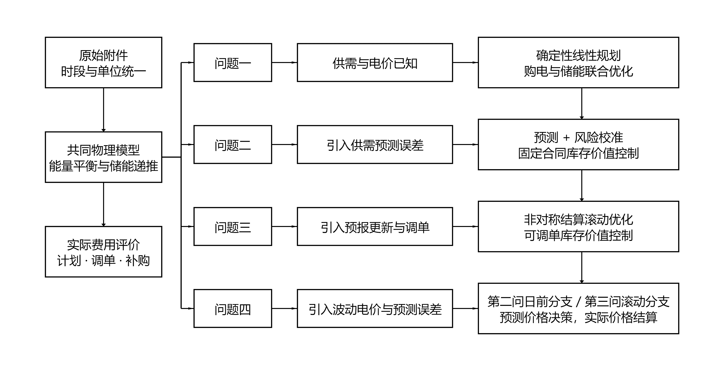

图 1 整体建模思路与四问递进关系

## 三 模型假设与数据处理

### 3.1 参数及工作假设

储能与时间参数见表 1。功率上限定义在微网母线侧，所有决策电量统一使用kWh。将题设90%的充放电效率解释为两侧各90%，对应往返效率81%；效率对运行费用的影响随第一问结果给出。

表 1 储能参数与时间离散

| 参数 | 数值 | 性质 |
| --- | --- | --- |
| 额定容量 | 12000 kWh | 题面给定 |
| 允许储电量 | 1200—10800 kWh | 题面给定 |
| 最大充放电功率 | 5000 kW | 题面给定 |
| 初始储电量 | 6000 kWh | 1 月 1 日 00:00 给定 |
| 充电／放电效率 | 0.9／0.9 | 主实验解释 |
| 时段长度 | 1/6 h | 十分钟离散 |

（1）附件中的00:10、00:20、…、24:00依次对应00:00—00:10、00:10—00:20、…、23:50—24:00区间，区间内功率按常值处理。四问均保持原始记录顺序，状态定义在区间边界，功率乘1/6小时换算为电量。结果工作簿同样按当天00:00—24:00的144个区间顺序填写。

（2）微网仅从外网购电，不计售电收入；无法消纳的电量允许无成本弃用，电池退化成本不纳入目标。第一、二问普通购电按计划量结算，第三、四问主动调整按保留量、取消量和新增量分项结算。

（3）实时运行按十分钟区间内功率恒定建模，以当前可观测供需完成充放电与紧急购电；日前及日内计划仅使用决策时已经获得的信息。

（4）第二至四问的实际储电量连续跨日。日前名义轨迹要求日末储电量不少于6,000 kWh，以保留次日运行所需电量；实际日末状态由实时运行决定，并作为次日初始状态。

（5）第四问将未来交易价格视为决策时未知的量，以历史数据预测；到达交易区间后观测当前价格并按其结算。题面提供全年实际价格，并未明确保证零点已知全天价格，因此本条属于信息可见性的工作假设。计划层采用点预测近似未来价格，历史残差范围描述预测误差，不据此假定未来实际价格必在某一区间内。

### 3.2 数据整理与时间对齐

附件1含144个时段，附件2的负载与光伏各含365×144＝52,560个观测。以2025年完整日期和十分钟时段为索引对齐两类序列，将附件1混合存储的时间类型与字符串统一为分钟，核对序列为10、20、…、1440。功率与电量按下式换算：

$$
L_{d,t}=P^{\mathrm{load}}_{d,t}\Delta t,\qquad V_{d,t}=P^{\mathrm{PV}}_{d,t}\Delta t,\qquad \Delta t=\frac{1}{6}\ \mathrm{h}.
$$

数据核查表明：附件1含60个时间类型单元格和84个字符串，统一转换后得到完整时间序列；附件2两类序列均无缺失、非有限值、负数、重复日期或完全重复日曲线。全局四分位距检验未检出超界观测，原始样本全部保留。

预处理仅规范时间格式与计量单位，无须填补、删点、缩尾或平滑。光伏序列中的23,540个零值按零发电记录保留。训练集标准化和预测值非负截断分别作用于特征及模型输出，不改变实际观测。

## 四 符号说明

下文沿用表 2 的符号。单日模型省略日期下标，日内区间用 1—144，状态包含 145 个边界点；跨日计算另带日期下标。

表 2 主要符号及单位

| 符号 | 含义 | 单位 |
| --- | --- | --- |
| $d,t$ | 日期与十分钟时段 | — |
| $L_{d,t},V_{d,t}$ | 负载与光伏电量 | kWh |
| $\hat L_{d,t},\hat V_{d,t}$ | 日前负载与光伏预测 | kWh |
| $g_{d,t},e_{d,t}$ | 计划购电与紧急购电 | kWh |
| $c_{d,t},d_{d,t}$ | 母线侧充电与放电 | kWh |
| $w_{d,t}$ | 不能利用的富余电量 | kWh |
| $S_{d,t}$ | 区间起点的储电量 | kWh |
| $p_t$ | 固定分时交易电价 | 元/kWh |
| $\eta_c,\eta_d$ | 充电与放电效率 | — |
| $z_t$ | 充电状态二元变量 | — |
| $\lambda,q$ | 岭惩罚强度与余量分位数 | — |
| $r_{d,t}(q)$ | 非负净负载预测余量 | kWh |

日期下标d仅出现在下标位置，放电变量d作为决策变量使用，两者按其在表达式中的位置区分。

## 五 第一问的模型建立与求解

### 5.1 供需结构与决策目标

图 2 给出单日供需曲线与分时电价。光伏集中于白天，负载贯穿全天；储能既可吸收午间富余光伏，也可利用外网峰谷价差转移购电时段。两种作用共同决定购电与充放电计划。

目标是最小化全天计划购电费：

$$
\min C_1=\sum_{t=1}^{144}p_tg_t.
$$

以母线侧收支建立能量平衡，将富余供电记为未利用电量：

$$
g_t+V_t+d_t=L_t+c_t+w_t,\qquad g_t,w_t\geq0.
$$

充电损耗发生在进入储能时，放电损耗发生在从储能输出至母线时，因而状态方程为：

$$
S_{t+1}=S_t+\eta_c c_t-\frac{d_t}{\eta_d},\qquad 1200\leq S_t\leq10800.
$$

SOC 上下界施加于全部 145 个状态点，状态递推与其他时段约束对应 t＝1，…，144。令每时段最大母线侧充放电量 M＝5000/6 kWh，用二元变量直接限制互斥：

$$
0\leq c_t\leq Mz_t,\qquad 0\leq d_t\leq M(1-z_t),\qquad z_t\in\{0,1\}.
$$

第一问要求日末储电量恢复至日初水平：

$$
S_1=S_{145}=6000.
$$

以购电量、充放电量、未利用电量、储电量和充放电状态为变量，得到统一的日调度模型。后续各问通过替换供需输入与初末状态条件扩展该模型：

$$
\boxed{\left\{\begin{aligned}\min_{g,c,d,w,S,z}\quad &\sum_{t=1}^{144}p_tg_t\\\mathrm{s.t.}\quad &g_t+V_t+d_t=L_t+c_t+w_t,\\&S_{t+1}=S_t+\eta_c c_t-d_t/\eta_d,\\&1200\leq S_t\leq10800,\quad g_t,w_t\geq0,\\&0\leq c_t\leq Mz_t,\quad0\leq d_t\leq M(1-z_t),\\&z_t\in\{0,1\},\quad S_1=S_{145}=6000.\end{aligned}\right.}
$$

为进行全年多次求解，利用自由弃电处理互斥。记 $\rho=\eta_c\eta_d$，对任一松弛解令 $x_t=\min\{c_t,d_t/\rho\}$，以 $c_t-x_t$、$d_t-\rho x_t$ 和 $w_t+(1-\rho)x_t$ 分别替代充电、放电与弃电。该变换保持储能递推、母线平衡和购电费用，且充放电至少一项为零。因此可先用HiGHS求解线性规划[2]，再逐时消去循环充放电；后续各问复用相同过程。

该等价性依赖于富余电量可自由弃用且不计额外弃电罚金。若加入必须消纳、售电收益或与充放电吞吐量相关的成本，应重新检查变换是否保持目标与约束。第一问另用含二元互斥变量的模型复核，最优费用与线性规划结果一致。

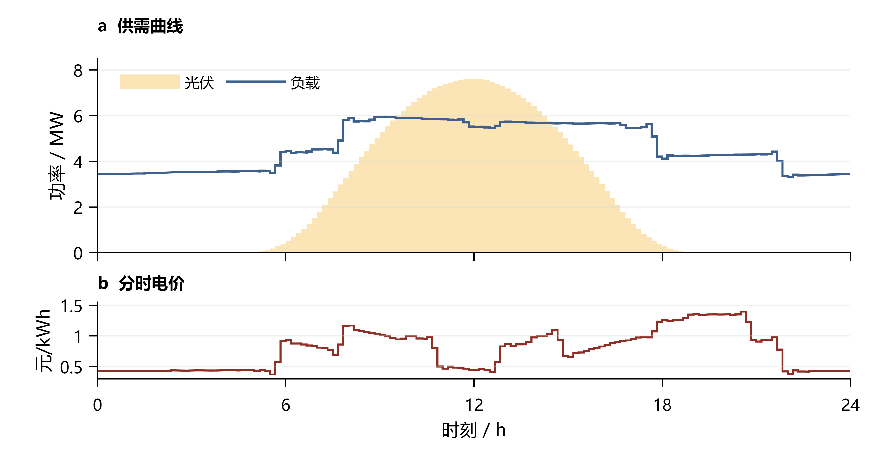

图 2 第一问供需曲线与分时电价

### 5.2 调度结果与指定时段

计算得到全天购电量 59,482.70 kWh、费用 35,126.95 元。购电与储能轨迹见图 3，指定时段购电和四小时充放电分别见表 3、表 4。

低价时段的外网购电同时满足负载与充电，形成集中购电峰值；高价时段由储能放电补充供电，减少外网购电量。储能由此实现购电时段的转移。

储电量接近上限时，继续低价购电的可利用空间受限；接近下限时，后续负载缺口需要外网补足。因此图中的充放电切换既受价格驱动，也受当前库存和未来光伏影响，不能仅以某一固定电价阈值解释全部调度行为。

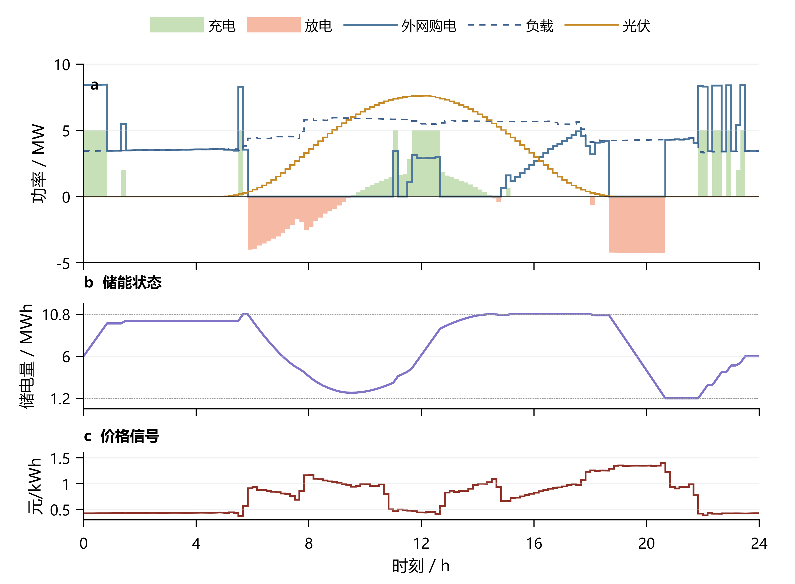

图 3 第一问电价驱动的购电与储能运行

表 3列出指定十分钟区间的购电量及全天汇总。

表 3 第一问指定时段购电量及全天费用

| 时间段 | 购电量 | 时间段 | 购电量 | 时间段 | 购电量 |
| --- | --- | --- | --- | --- | --- |
| 10:00-10:10 | 0.00 | 12:00-12:10 | 480.41 | 14:00-14:10 | 0.00 |
| 16:00-16:10 | 445.43 | 18:00-18:10 | 531.89 | 20:00-20:10 | 0.00 |
| 全天购电量 | 59,482.70 | 全天购电费 | 35,126.95 | — | — |

表 4按四小时汇总充放电量，并列出各块边界储电量。

表 4 第一问四小时充放电及边界储电量

| 时间段 | 充电量 | 放电量 | 时间段 | 充电量 | 放电量 |
| --- | --- | --- | --- | --- | --- |
| 00:00-04:00 | 4,500.00 | 0.00 | 04:00-08:00 | 833.33 | 6,365.84 |
| 08:00-12:00 | 4,787.96 | 1,703.00 | 12:00-16:00 | 5,286.04 | 91.10 |
| 16:00-20:00 | 0.00 | 5,780.13 | 20:00-24:00 | 5,333.33 | 2,859.87 |
| 00:00 储电量 | 6,000.00 | — | 24:00 储电量 | 6,000.00 | — |

四小时汇总块内可先充后放，各十分钟区间仍满足充放电互斥。

无储能时直接按净负载缺口购电，费用为48,052.05元。图4比较无储能、实际效率和无损储能三种条件下的最优费用。实际储能净节省12,925.10元，降幅为26.90%；将充放电损耗设为零后，费用进一步降至32,377.09元。往返效率从64%提高到100%时，最优费用由38,223.65元降至32,377.09元。

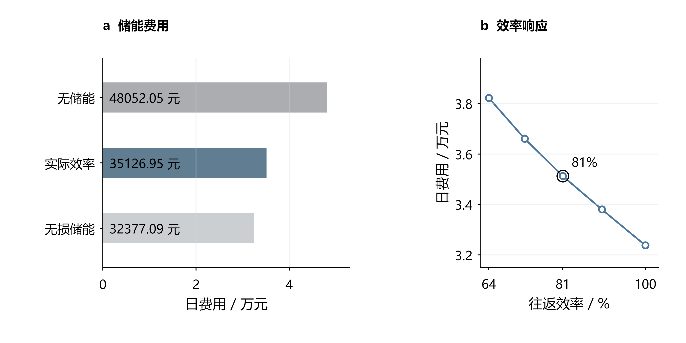

图 4 储能的净收益及效率对最优费用的影响

三种储能条件采用相同供需与日初、日末状态。效率敏感性分析对五组参数分别重新求解，基准为充放电两侧各90%、往返效率81%。

无损储能与实际储能的费用差额包含重新优化后的计划变化，不能直接解释为损耗电量乘某一平均电价。该组敏感性结果说明，提高效率能够扩大跨时段转移的经济收益；具体收益仍取决于光伏富余、负载缺口和峰谷价格的共同分布。

## 六 第二问的预测与日前策略

### 6.1 训练与评价的时间顺序

按时间顺序划分训练、验证与评价阶段：1月22—31日选择参数与执行器，2月1日至12月31日开展顺序回测。模型每七天更新，使用最近至多60个已结束日期。各时点仅使用此前可获得的数据；本次评价属于同年度开发验证，泛化能力仍需跨年度检验。

各候选策略从1月1日6,000 kWh储电量进行共同热身。首日以附件1作为冷启动参考，历史不足七天时使用近三日均值，随后转为日／周同期预测。验证期初与评价期初储电量分别为6,244.256891 kWh和9,902.811288 kWh，保证各策略具有相同起点。附件1仅用于初始化。

### 6.2 供需预测

对负载或光伏电量序列 y，同期基线取昨日与上周同日相同时间槽的均值：

$$
\hat y_{d,t}^{\mathrm{seasonal}}=\frac{y_{d-1,t}+y_{d-7,t}}{2}.
$$

岭回归采用 21 个特征：昨日、前日、上周同日的同槽值，三日和七日同槽均值、七日同槽标准差、昨日全天均值和近三日全天均值共八项；前三阶日内正余弦六项；星期指示七项。日期及时间属于决策时已知的日历信息。标准化均值与尺度仅在当次训练集上估计，常量特征尺度置 1。

$$
\min_{\beta,b}\sum_{i\in\mathcal T_d}(y_i-b-\widetilde{x}_i^{\mathsf T}\beta)^2+\lambda\|\beta\|_2^2.
$$

截距不惩罚，负载和光伏分别拟合。按验证 MAE 比较 λ＝1、10、100，均选 1；实现采用 NumPy 线性方程求解，与带截距岭目标一致 [3]。从 1 月 15 日开始具备拟合条件，之后每七日重新拟合。预测截断为非负；某槽过去七日光伏全零时，该槽预测置零，日出日落季节变化可能使此规则产生滞后。

上述特征兼顾日内周期、周内差异和近期水平变化。正则化用于约束相互相关的滞后特征，参数选择依据验证期误差完成；调度层的风险余量则依据验证费用选择，分别对应预测精度与运营成本两个目标。

评价指标采用功率单位的 MAE 与 RMSE；不使用夜间分母为零的普通 MAPE：

$$
\mathrm{MAE}=\frac{1}{n}\sum_i|P_i-\widehat P_i|,\qquad\mathrm{RMSE}=\sqrt{\frac{1}{n}\sum_i(P_i-\widehat P_i)^2}.
$$

### 6.3 净负载误差余量与名义优化

定义历史净负载误差及只包含过去信息的误差样本池：

$$
\varepsilon_{j,s}=(L_{j,s}-V_{j,s})-(\hat L_{j,s}-\hat V_{j,s}).
$$

$$
\mathcal E_{d,t}=\{\varepsilon_{j,s}:\max(2,d-28)\leq j<d,\ 1\leq s\leq144,\ |s-t|\leq3\}.
$$

日期下标以 1 月 1 日为 d＝1；排除首日冷启动误差，最多池化 28 个已结束日期和目标槽前后三槽。跨日边界不绕回，不足 28 天时仅取已有历史。余量规则为：

$$
r_{d,t}(q)=\max\{0,Q_q(\mathcal E_{d,t})\}.
$$

无余量候选直接设 r＝0，与“取零分位数”区分。对 q＝0.7、0.8、0.9，分位数使用样本排序后的线性插值。将预测负载加余量作为名义需求，求解第五节同一物理模型：

$$
L_t^{\mathrm{nom}}=\hat L_{d,t}+r_{d,t}(q),\qquad V_t^{\mathrm{nom}}=\hat V_{d,t},\qquad S_{d,145}^{\mathrm{nom}}\geq6000.
$$

风险校准通过历史误差分位数提高名义需求，在一月验证中按计划费与五倍紧急费之和选择余量。70%表示误差样本池的分位水平；模型属于分位数校准的确定性日前优化，其供电风险由顺序回测评价。

余量进入名义负载后，会同时改变普通购电和储能预安排；执行阶段仍使用实际供需，不把余量当成必须消耗的实体负载。余量不足可能增加五倍价补购，余量过大则可能形成无法利用但仍需付费的合同电量。

### 6.4 库存价值驱动的实时执行

零点生成计划后，普通购电费已由合同确定，执行阶段的任务是分配储能以减少后续紧急补购。若当前供给富余，先在功率与容量允许范围内充电；若出现缺口，则比较当前放电节费与保留库存的后续价值。

设当前净缺口 $n_t=L_t-V_t-g_t$。对富余供给，充电及弃电量为：

$$
c_t=\min\left\{\max(-n_t,0),M,\frac{10800-S_t}{\eta_c}\right\},\qquad w_t=\max(-n_t-c_t,0).
$$

为估计后续缺口，每次发布取此前至多28个完整日的负载与光伏配对残差，分别叠加至当前预测并截断非负，形成K条净缺口路径。配对保留同一天内负载、光伏误差的联系。对每条路径，以储电量s为状态、紧急补购费为阶段成本，反向递推后续费用：

$$
J_t^{(k)}(s)=\min_{a\in\mathcal A_t^{(k)}(s)}\left\{5p_t e_t^{(k)}(a)+J_{t+1}^{(k)}(s')\right\},\qquad J_{145}^{(k)}(s)=0.
$$

可行集合A包含第一问的储能状态与功率限制，紧急购电只补负载缺口，不能用于充电。路径价值用凸分段线性函数存储[5]，在可行库存区间内计算；其均值近似实际决策的后续费用。历史路径递推用于估值，实时动作始终依据当时可见的供需和库存。

不同历史日期对应不同的未来缺口路径，逐条递推后再取均值，可保留误差沿时间连续变化的特征。该处理给出有限历史样本下的库存价值近似；只有当前时段的动作实际执行，历史路径中的未来状态并不作为已知事实输入实时控制。

在当前真实缺口 $n_t>0$ 时，选择下一储电状态：

$$
s_{t+1}^{*}\in\arg\min_{z\in[\max\{S_{\min},s_t-\min(n_t,M)/\eta_d\},s_t]}\left\{5p_t[n_t-\eta_d(s_t-z)]+\frac1K\sum_{k=1}^{K}J_{t+1}^{(k)}(z)\right\}.
$$

相应放电量为 $\eta_d(s_t-s_{t+1}^{*})$，剩余缺口由紧急购电补足。求解只需比较可达区间端点与价值函数折点。当后续缺口的单位补购费更高时，模型可以保留部分库存，将电量留给更有价值的时段。实际状态按储能方程逐时更新并连续跨日：

$$
S_{d+1,1}=S_{d,145},\qquad C_2=\sum_{d,t}p_t\left(g_{d,t}^{\mathrm{plan}}+5e_{d,t}\right).
$$

将“出现缺口便尽量放电”的即时平衡规则作为结果分析中的参照，以识别库存配置带来的收益。主策略使用上述价值控制；零终端附加价值由一月验证选定，名义计划仍保持日末6,000 kWh的下限。

## 七 第二问的结果分析

### 7.1 验证期选择与紧急购电权衡

表 5 与图 5 比较相同初始储电量下的验证费用及期末状态。随余量增加，紧急补购支出下降，普通购电支出上升；两者的折中决定余量选择。

表 5 一月份十天验证结果

| 预测器 | 余量 | 总费/元 | 紧急费/元 | 期末SOC/kWh |
| --- | --- | --- | --- | --- |
| 同期 | 无 | 661,834.09 | 173,098.38 | 9,902.81 |
| 同期 | 70% | 634,179.58 | 110,989.47 | 10,595.98 |
| 同期 | 80% | 666,226.97 | 64,910.51 | 10,800.00 |
| 同期 | 90% | 680,257.72 | 456.98 | 10,800.00 |
| 岭回归 | 无 | 532,888.41 | 61,836.07 | 5,924.08 |
| 岭回归 | 70% | 509,757.47 | 8,765.44 | 6,623.17 |
| 岭回归 | 80% | 529,846.45 | 4.16 | 7,110.16 |
| 岭回归 | 90% | 633,664.05 | 0.00 | 9,039.38 |

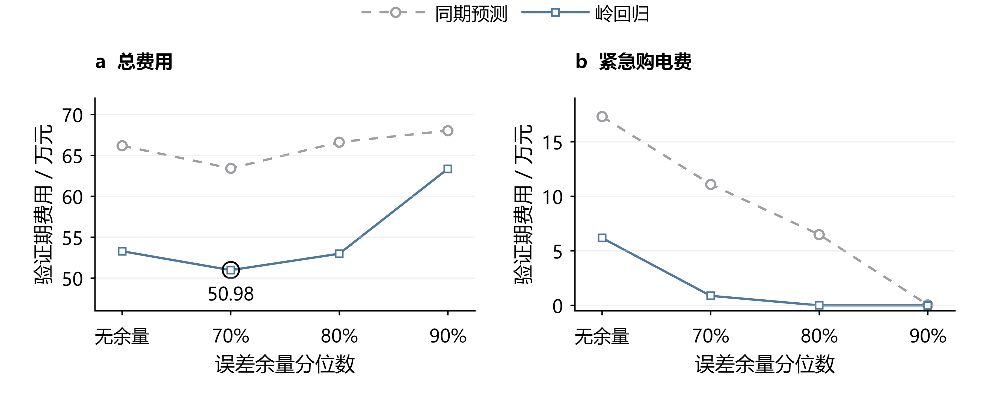

图 5 验证期风险余量与费用的权衡

岭回归70%余量的验证费为509,757.47元，其中紧急费8,765.44元；90%余量虽消除了验证期紧急购电，总费却升至633,664.05元。按总购电费用选择70%余量，说明额外多购支出已超过进一步压缩紧急购电的收益。两方案期末储电量相差约2,416 kWh，相关存量同时列于表 5；费用按题设结算，不计期末残值。

### 7.2 全期预测误差与季节变化

表6汇总334天、48,096个十分钟区间的功率预测误差。相较同期预测，岭回归使负载MAE由372.26降至179.86 kW，光伏MAE由171.98降至155.28 kW，对负载预测的改善更为明显。图6给出四个指定日期的日内曲线，用于分析具体时段的预测偏差；全期预测性能仍以表6的统计结果评价。

负载曲线表现出较稳定的日内水平与时段变化，滞后特征能够提供有效信息；光伏在部分日期仍出现峰值和局部波动偏差。图6用于观察这些时段差异，表6则同时统计全部日期，避免只依据少量展示日期判断全年预测效果。

表 6 第二问全期预测误差

| 预测器 | 负载MAE | 负载RMSE | 光伏MAE | 光伏RMSE |
| --- | --- | --- | --- | --- |
| 同期 | 372.26 | 585.91 | 171.98 | 343.38 |
| 岭回归 | 179.86 | 234.59 | 155.28 | 306.74 |

注：误差单位为kW；光伏统计覆盖全天，包含夜间零值。

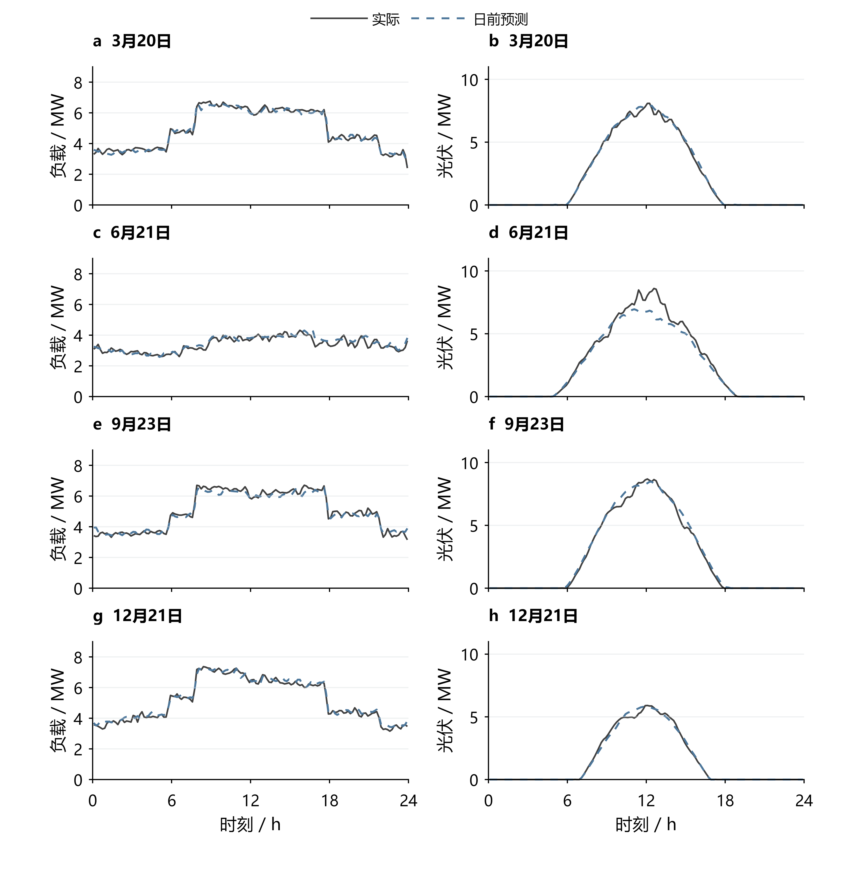

图 6 四个指定日期的负载与光伏日前预测

### 7.3 购电费用与储能配置

表7列出基础策略结果。图7按预测器、风险余量与库存价值控制的引入顺序汇总总费用变化；各项节费在对应的对照条件下分析。

表 7 第二问全期费用及期末储电量

| 策略 | 计划费/万元 | 紧急费/万元 | 总费/万元 | 期末SOC/kWh |
| --- | --- | --- | --- | --- |
| 同期 无余量 | 1,199.19 | 723.59 | 1,922.78 | 5,825.99 |
| 岭回归 无余量 | 1,215.92 | 354.62 | 1,570.54 | 5,903.65 |
| 同期 70%余量 | 1,297.86 | 452.54 | 1,750.40 | 6,217.35 |
| 岭回归 70%余量 | 1,293.50 | 119.76 | 1,413.26 | 5,903.65 |

基础策略总费用为14,132,612.16元，较同期无余量降低26.50%，较岭回归无余量降低10.01%。岭回归两组的期末储电量同为5,903.65 kWh，在相同预测器及初末状态下，10.01%的费用降幅直接反映风险余量的价值。

基础策略紧急购电累计197,465.10 kWh，分布于1,132个十分钟区间；连续区间合并后统计为紧急购电事件。未利用电量为2,211,229.49 kWh，由未消纳光伏与富余计划购电共同构成。风险余量通过增加部分普通购电，减少高价缺口补购。

四个指定日期的购电、充放电和紧急购电结果见附录A。

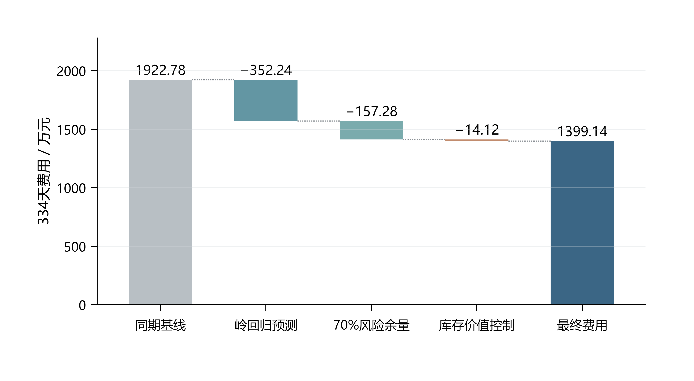

图 7 第二问逐层优化的费用变化与节费来源

### 7.4 库存价值控制的增益

在相同岭回归、70%余量、费用规则和初始储电量下，历史路径价值控制使334天费用由14,132,612.16元降至13,991,392.60元，节省141,219.56元（0.999%）。其中紧急购电费减少141,170.39元，而紧急电量由197,465.10增至198,137.46 kWh。节费来自补购与放电时点的重新分配：以较低价格补足当前缺口，将库存留给更高价格的后续缺口。两方案期末储电量均为5,903.65 kWh。

紧急电量略增而紧急费用下降，说明优化目标与“最少补购电量”并不等价。普通合同已确定后，储能应优先替代边际成本较高的缺口，而非机械地优先满足时间上更早的缺口；费用和电量需要结合分析。

## 八 第三问 日内预报的滚动价值

### 8.1 预报信息与决策时域

附件3含365天、每日4个版本、每版24个整点光伏预报，共35,040个值。按四行组还原1,095个结构性空日期后，未发现缺失、非有限数或负值。预报发布时间分别为0、6、12、18点；时刻τ的新预报只服务于τ之后的调度。小时预报端点之间采用分段线性函数，并在十分钟区间上积分为预测电量；发布点以最近完成区间的光伏观测衔接。

每次更新均以当时真实储电量为起点，固定已执行的购电与充放电量，重新优化剩余区间，构成模型预测控制的滚动决策过程[4]。

例如，6点更新时，0—6点已经执行的结果保持固定，以6点实际储电量为新的边界条件，对6—24点重新规划，只执行至12点。随后重复这一过程，使预测更新、合同修订与实际状态反馈形成闭环。

图8给出指定日期的实际光伏及四版预报，各版预报从对应发布时间起用于后续调度。

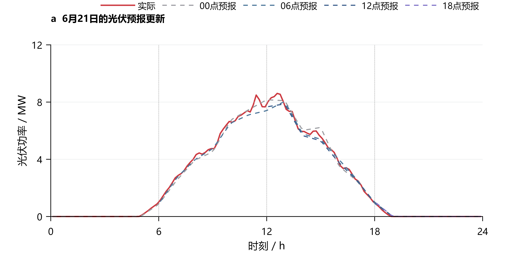

图 8 四个发布版本的光伏预报

### 8.2 保留量、取消量与新增量的结算

记午夜计划为x_t，时段执行前最后一次有效调整量为y_t，紧急购电为e_t。取消量u_t与新增量v_t分别定义为：

$$
u_t=(x_t-y_t)^+,\qquad v_t=(y_t-x_t)^+,\qquad y_t=x_t+v_t-u_t.
$$

保留购电按原价结算，取消部分按半价支付违约费，新增部分按1.5倍价格购买。因此每个区间的完整费用为：

$$
F_t=p_t\min(x_t,y_t)+0.5p_tu_t+1.5p_tv_t+5p_te_t=p_tx_t-0.5p_tu_t+1.5p_tv_t+5p_te_t.
$$

例如，原计划100 kWh、电价1元/kWh时，调整为80 kWh的费用为80＋0.5×20＝90元，调整为120 kWh的费用为100＋1.5×20＝130元。多次更新均按最终有效计划与午夜计划的净偏差结算，不累计尚未交付区间的中间调整量。

采用相对午夜合同的净结算后，同一未来区间即使经历多次修订，也仅在执行时确定最终保留、取消和新增量。这样可以使计划优化中的目标与实际账单一致，避免把尚未交付的中间计划变化重复计费。

### 8.3 滚动优化模型与风险校准

记Tτ为当前尚未执行的区间集合，Ω为第一问去除首末状态等式后的物理可行域。以更新后的光伏预测、负载预测和对应误差余量作为供需输入，求解：

$$
\boxed{\left\{\begin{aligned}\min_{y,c,d,w,S,u,v}\quad&\sum_{t\in T_\tau}\hat p_{\tau,t}(1.5v_t-0.5u_t)\\\mathrm{s.t.}\quad&y_t=x_t+v_t-u_t,\quad0\le u_t\le x_t,\quad v_t\ge0,\\&y_t+\hat V_{\tau,t}+d_t=\hat L_{\tau,t}+r_{\tau,t}+c_t+w_t,\\&(y,c,d,w,S)\in\Omega,\quad S_\tau=S_\tau^{\mathrm{actual}},\quad S_{145}\ge6000.\end{aligned}\right.}
$$

目标函数省略了与当前决策无关的午夜合同常数项。第一至三问的p由附件1给定；第四问替换为当时可获得的价格预测。名义规划满足供电需求，基础执行按第二问即时平衡规则运行，改进执行按第8.6节估计后续库存价值。

风险余量取此前28个完整日期、相同发布版本及目标前后三个区间的净负载误差。将无余量、50%分位余量和70%分位余量分别与8种更新时间组合配对，共比较24组方案。1月22—31日验证选定50%分位余量及6、12、18点更新，随后在2—12月评价。负载预测器和名义日末目标保持一致，以分离预报更新与调整机制的影响。

图9汇总一月验证期24组方案的费用。50%风险余量与三次日内更新的组合被选定为后续评价方案。

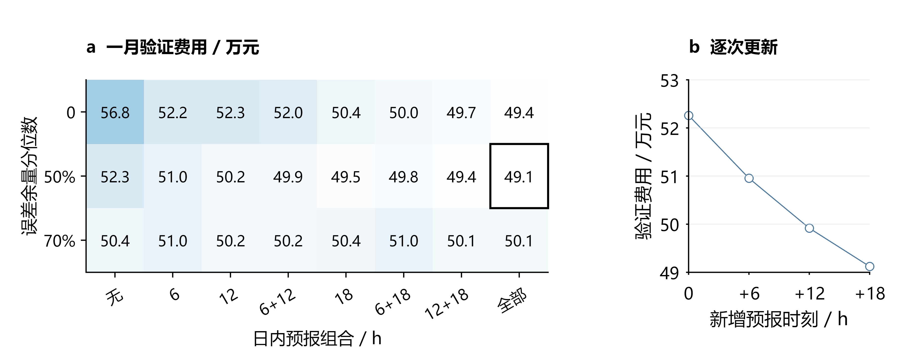

图 9 风险余量与预报更新频次的验证比较

### 8.4 基础滚动策略的更新时间收益

每次预报发布后，以当前储电量为起点优化剩余时段，仅执行至下一次更新，随后根据新信息重新求解。固定50%风险余量与基础执行器，比较三次日内更新和仅午夜预报的运行费用，以评价新增预报信息在可调单条件下的经济价值。

表 8将两方案费用分解为午夜计划、净调整及紧急补购三部分。

表 8 第三问基础策略与仅午夜预报的费用分解

| 费用或运行量 | 仅午夜预报 | 日内滚动 |
| --- | --- | --- |
| 原计划费/元 | 12,530,137.77 | 12,521,239.63 |
| 新增购电费/元 | 0.00 | 678,211.30 |
| 取消量净费用/元 | 0.00 | -203,600.86 |
| 紧急购电费/元 | 2,514,989.16 | 580,126.71 |
| 总费用/元 | 15,045,126.93 | 13,575,976.78 |
| 紧急电量/kWh | 407,324.31 | 101,019.32 |
| 期末储电量/kWh | 5,903.65 | 5,903.65 |

在相同50%余量下，三次更新将总费用由15,045,126.93元降至13,575,976.78元，净节省1,469,150.15元，降幅9.76%；实际紧急购电量降至101,019.32 kWh。新预报使部分供电缺口提前通过计划调整解决，紧急补购费用的下降足以覆盖调整支出。因此，本题有必要引入零点之外的预报。两方案初末储电量相同，节费来自运行策略改善。

因此，预报更新是否值得采用，应以新增信息经过调单规则后形成的净费用变化评价。本例中三次更新的组合在一月验证期确定，2—12月结果用于报告其后续表现；不同更新组合的全年排序不再用于回选策略。

### 8.5 面向提前时长的负载修正与月度模型选择

仅在零点预测负载，会忽略日内已观测偏差的持续性。设零点预测误差为实际负载减零点预测，以每次发布前18个十分钟区间的平均误差作为当前偏差x；历史目标小时的六个区间平均误差作为响应y。分别对6、12、18点及各未来目标小时拟合非负收缩回归：

$$
\hat\beta_{d,v,h}=\operatorname{clip}_{[0,1.5]}\left(\frac{\sum_{i\in H_d}x_{i,v}y_{i,v,h}}{1.2\sum_{i\in H_d}x_{i,v}^{2}}\right),\qquad H_d=\{\max(7,d-28),\ldots,d-1\}.
$$

其中日期从0编号；自第14日起启用，至少使用7个完整历史日；分母为零时系数取零。1.2倍分母对应20%的平方误差尺度惩罚，系数上限1.5限制短样本放大。修正后的预测为：

$$
\hat L^{A}_{d,v,t}=\max\{0,\hat L^{0}_{d,t}+\hat\beta_{d,v,h(t)}x_{d,v}\}.
$$

同一目标小时共享修正量，零点预测不变。50%风险余量仍从该预测方案此前28天的历史误差计算，避免沿用旧误差分布而重复补偿。表 9 比较全期各发布时刻的负载预测误差，单位均为kWh/十分钟。

表 9 负载自适应修正的同目标误差对照

| 发布时刻 | 基础MAE | 修正MAE | 降幅 |
| --- | --- | --- | --- |
| 06:00 | 30.26 | 27.96 | 7.61% |
| 12:00 | 30.98 | 28.85 | 6.85% |
| 18:00 | 31.58 | 27.68 | 12.34% |

固定启用负载修正在1月22—31日使第三、四问滚动验证费分别增加972.85元和1,149.73元。因此采用逐月选择规则：2月使用一月选定的基础预测；3月起，每月首日分别回放此前28天的基础与修正方案。两者从窗口起点的实际储电量出发，以历史实际费用选择当月方案，费用相同时保留基础方案。候选模型、窗口、收缩系数和费用定义在全年评价前固定，月底数据仅用于次月选择。

两类电价情景均在3、6、7、8、9、10月启用修正，其余月份使用基础预测。实际储电量连续跨月传递，历史回放的末状态不覆盖实时状态。全年固定启用修正仅作消融分析，不用于事后改变选择规则。

事后对月度验证末端库存作敏感性检查：将每kWh储电的价值从0变化至样本最高紧急电价折算值，20次模型选择均保持不变，费用排序不依赖低估候选方案的剩余储电量。

### 8.6 计入下次调单机会的库存价值

直接把第6.4节固定合同价值函数用于滚动执行，会将后续全部缺口都按五倍紧急价计值，忽略下次发布后可新增普通合同。该方法在一月验证中增加第三问费用4,210.28元。为修正这一结构偏差，在当前至下次发布的区间仍按五倍价估计缺口，下一发布之后则以1.5倍预测价近似可新增计划的边际费用；每次发布重新构造价值函数并只执行随后36个时段。1.5倍仅用于后续价值估计，实际紧急账单始终按五倍价支付。

修正方案一月费用491,182.82元，较即时平衡低29.11元；据此选定后，全年费用由13,489,127.94元降至13,479,283.32元，再省9,844.62元。固定合同价值法全年反而增加149,493.07元，验证了调单机会必须进入价值估计。该近似未显式求解未来调单、取消与库存的完整联合场景问题，其作用由同口径顺序账单检验。

两执行方案共享第8.5节的负载选择结果，该结果由基础执行器的历史回放生成；两者的实际库存分别连续传递，从而在相同预测规则下比较库存控制的贡献。

至此，第三问延续第二问的“计划—执行”结构，同时改变了可用预报与未来补缺渠道。负载修正更新需求判断，滚动优化修改合同，库存价值控制分配有限储电量；三者依次衔接，并通过同一实际账单评价。

## 九 第四问 波动电价下的购电策略

### 9.1 电价信息与不确定性

第二、三问采用每天重复的分时电价，本问改用附件4的实际价格序列。全年365天共52,560个十分钟电价，范围为0.0076—1.7936元/kWh。图10展示价格的季节变化与日内峰谷结构，同一时刻的交易成本不再逐日相同，储能的跨时段价值也随之变化。

按第3.1节的信息假设，决策时尚未揭示的价格以历史预测替代。以发布时刻τ到目标时刻j的预测记为 $\hat p_{\tau,j}$，实际价格分解为：

$$
p_j=\hat p_{\tau,j}+\varepsilon_{\tau,j}.
$$

日前分支沿用线性预测结构，以昨日、上周同槽价格，日内与星期正余弦，滞后差值、乘积及两组滞后曲线均值和标准差构成12维特征，标准化后用岭回归估计价格。惩罚系数取1，1月15日、22日及后续每月首日重新拟合，训练窗口最多60日，所有训练目标在拟合前已经发生。预测价格下限为0.001元/kWh。

滚动分支采用昨日与上周同目标时段价格的均值，并在0、6、12、18点按最新可见历史生成预测。两个分支的价格输入规则由一月验证费用确定后固定；此处价格预测作为统一调度模型的输入模块。

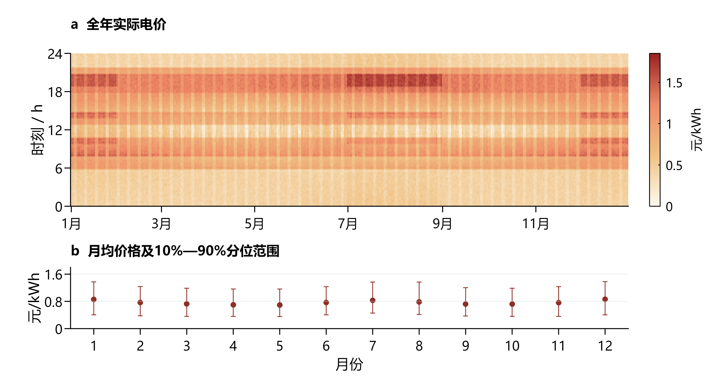

图 10 波动电价的日内结构与月度分布

注：月度范围为当月价格的10%—90%分位区间，表示价格分布。

以过去28个完整日、相同发布时刻和目标时段的价格残差估计预测风险。图11给出四个指定日期的午夜预测；区间由点预测加历史残差的10%—90%分位数得到，下界不低于0.001元/kWh。全期48,096个午夜预测目标的实际覆盖率为74.36%，该范围用于描述预测误差，不作为未来价格的保证边界。

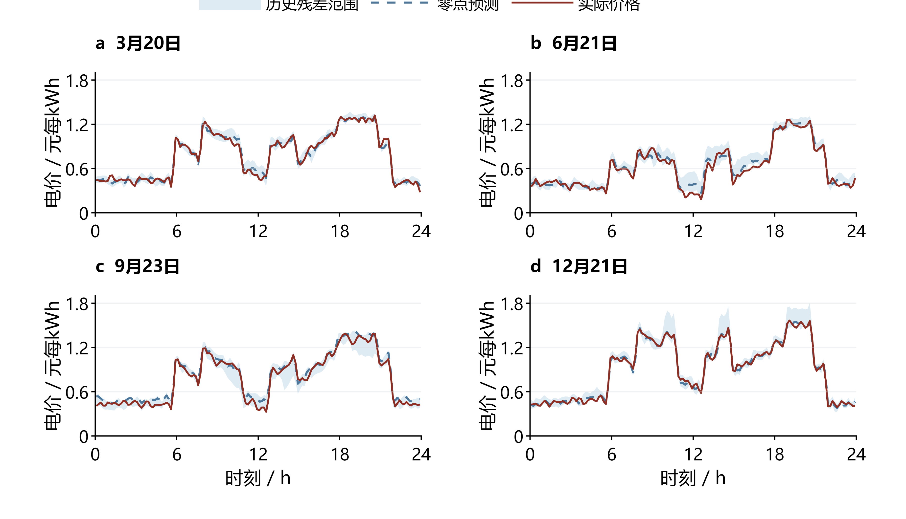

图 11 波动价格的预测偏差与历史残差范围

### 9.2 日前与滚动模型的价格扩展

第四问继承第二问的供需预测、70%风险余量和固定合同价值控制，以及第三问的滚动光伏预报、50%风险余量、负载修正选择和可调单库存价值。新增内容是：计划目标、合同调整和库存估值中的未来价格均换为当次预测，实际结算使用交易区间的真实价格。

对于日前分支，记 $\mathcal F_d$ 为第二问给定当日名义供需、初始库存及日末下限后的可行域，零点计划满足：

$$
g_d^{0}\in\arg\min_{(g,c,d,w,S)\in\mathcal F_d}\sum_{t=1}^{144}\hat p_{d,0,t}g_t.
$$

对于滚动分支，设Rτ为尚未执行的时段，k、a、b分别为相对午夜合同保留、取消和新增的购电量，满足 $k_t+a_t=g_t^0$、$g_t=k_t+b_t$。在第8.2节的合同规则下，用以下目标替换第三问固定电价目标：

$$
\min\sum_{t\in R_\tau}\hat p_{\tau,t}\left(k_t+0.5a_t+1.5b_t\right).
$$

每次滚动使用当前真实储电量、新预报和当前价格预测，已执行结果与午夜原合同保持不变。计划层以预测价格近似未来价格，按历史验证确定输入规则；供需误差由风险余量处理，价格残差区间不作为优化的硬约束。

价格预测误差通过实际交易价格与计划时预期价格的差异影响费用，也会改变库存保留是否合算。历史残差范围用于展示这种误差，模型当前未在计划目标中显式加入价格场景或最坏情形惩罚，因而不将本方法称为具有价格风险保证的鲁棒优化。

实时执行沿用第6.4节的库存价值决策。当前缺口成本使用已揭示的实际价格p；未来路径费用使用 $\hat p_{\tau,t}$。日前合同锁定时，未来缺口以五倍预测价格估值；滚动分支在下次发布前采用五倍价，之后以1.5倍预测价格近似新增合同机会。该近似只影响库存决策，账单仍按真实合同量和交易价格计算：

$$
C_{4,2}=\sum_{d,t}p_{d,t}\left(g^0_{d,t}+5e_{d,t}\right),\qquad C_{4,3}=\sum_{d,t}p_{d,t}\left(k_{d,t}+0.5a_{d,t}+1.5b_{d,t}+5e_{d,t}\right).
$$

价格变化同时影响购电时段、日内调单与库存保留。图12给出2—12月滚动策略的储能运行分布；指定日期的价格预测见图11，购电与储能结果见附录A。

低价区间的充电与高价区间的放电构成主要分布特征，但同一电价下仍可能存在不同功率方向。该差异与负载、光伏、既有合同和储能边界共同有关，分布图展示运行结果中的关联，不单独识别电价的因果效应。

### 9.3 实际费用与调度效果

两类策略均在2025年2月1日至12月31日逐时执行，实际储电量连续跨日传递。表10按保留合同、取消、新增和紧急补购归集费用；日前策略不能主动调单，取消与新增费用均为零。

表 10 波动电价下两类策略的实际费用构成

| 费用项目 | 日前策略/元 | 滚动策略/元 |
| --- | --- | --- |
| 保留合同购电费 | 13,663,460.94 | 12,764,260.61 |
| 取消合同费用 | 0.00 | 234,774.15 |
| 新增合同购电费 | 0.00 | 765,937.23 |
| 紧急购电费 | 1,102,031.74 | 445,909.02 |
| 总费用 | 14,765,492.68 | 14,210,881.01 |

滚动策略总费用较日前低554,611.67元，降幅为3.76%。其中紧急购电费减少656,122.72元，普通合同及调整相关费用合计增加101,511.05元：日内调整付出额外合同成本，同时降低了高价补购支出。该差额是两套完整策略的运行结果，包含预报、预测输入和调单权限的共同作用。两者期末储电量分别为5,939.92和5,952.82 kWh，按题设账单不计期末残值。

进一步检验库存价值控制的贡献。在各自相同价格输入、计划生成规则和初末库存的条件下，相比即时平衡执行，日前节省115,042.37元，滚动节省5,444.97元。后者已能借助调单补足后续缺口，因此进一步优化库存配置的增益较小。

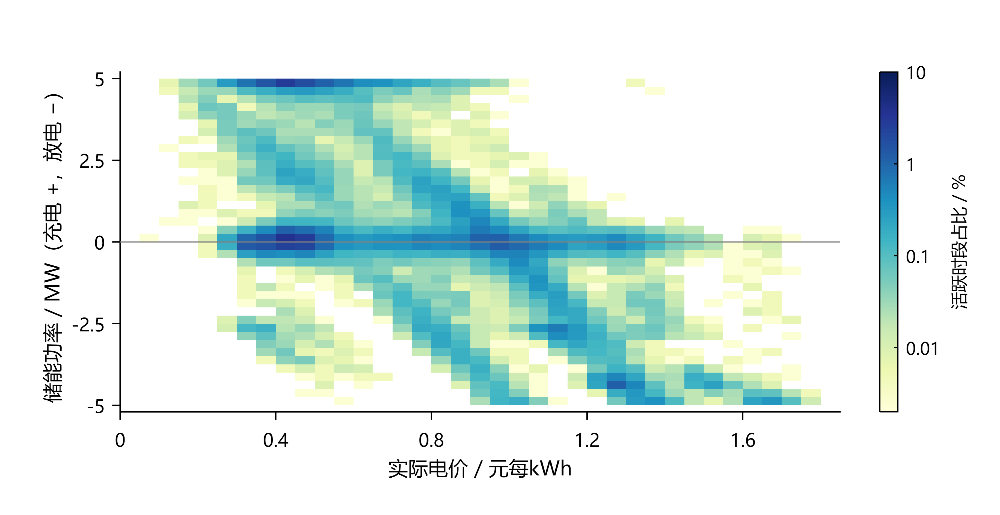

图 12 滚动策略的实际电价与有符号储能功率分布

注：统计范围为全期48,096个区间中的42,989个活跃区间（绝对功率大于0.01 kW）；正功率表示充电，负功率表示放电，横轴为实际交易价格。电价与功率分箱宽度分别为0.05元/kWh和0.25 MW，色阶按活跃区间占比采用对数刻度。

采用2,000次、14日区块的配对重采样，日前节省的95%区间为[59,151.20，186,368.40]元，滚动为[1,953.22，10,500.59]元。区间反映同年固定轨迹的条件波动，不校正模型开发与选择偏差。

两类增益区间对应各自固定策略下的配对日费用差，重采样以连续日期区块为单位，以保留短期相关性。该统计量用于衡量现有年度轨迹上的收益波动，不能替代跨年度、不同市场条件下的独立检验。

表11汇总四问的最终结果，指定日期的购电与储能结果见附录A。

表 11 四问最终策略与购电费用

| 问题 | 新增信息或权限 | 最终策略 | 购电费用/元 |
| --- | --- | --- | --- |
| 一 | 供需与电价已知 | 确定性线性规划 | 35,126.95 |
| 二 | 供需预测误差 | 风险校准与固定合同库存价值 | 13,991,392.60 |
| 三 | 日内预报、合同调整 | 滚动优化与可调单库存价值 | 13,479,283.32 |
| 四：日前 | 未来电价未知 | 预测价格下的日前策略 | 14,765,492.68 |
| 四：滚动 | 未来电价未知 | 预测价格下的滚动策略 | 14,210,881.01 |

第一问为单日费用，其余为334天费用；各分支分别评价，不合并为同一系统的总费用。

## 十 模型的评价与推广

### 10.1 模型的优点

（1）四问共享能量平衡与储能递推，将供需误差、预报更新及波动电价依次接入，模型扩展关系清晰，便于分析信息与合同权限的作用。

（2）计划层以风险余量控制欠购，执行层依据后续缺口成本配置库存；保留、取消、新增与紧急补购分别结算，能够解释节费来源。

（3）自由弃电条件下的等价线性化降低求解规模，分段线性库存价值保留连续状态，适合十分钟决策与全年滚动计算。

### 10.2 模型的不足

（1）供需与电价依赖有限历史估计，残差范围不构成价格覆盖率保证；同年度开发与评价可能高估泛化效果，需要跨年度数据检验。

（2）库存价值采用历史路径均值，滚动分支以1.5倍价格近似后续调单机会，未联合优化所有未来合同与库存决策，因而不保证全局最优。

（3）模型未计入电池老化、区间内快速功率变化及网络约束。效率和合同清算口径采用工作假设，实际应用需按设备参数与交易规则校准。

尤其在临近日出日落、价格突变或储能接近容量边界时，十分钟平均量可能掩盖区间内约束冲突。工程应用需要结合更高频数据检查功率可行性，并在新增约束后重新评估现有节费幅度。

### 10.3 模型的推广

（1）面向园区、商业建筑或充电站，可替换负载、光伏及储能参数，在相同状态递推中加入可控充电负荷与需求响应。

（2）可构造负载、光伏和价格的联合误差场景，以场景平均费用或风险度量扩展计划层，再用多年度数据检验风险与经济性的权衡。

（3）可在目标中加入电池吞吐量、循环寿命、碳成本及峰值需量费用，在经济性之外评价设备寿命与减排效果。

推广时可保持能量平衡、状态递推和费用分项的基本结构，先依据当地交易规则确定可调整的合同范围，再利用独立历史时段校准预测与风险参数。新增成本或约束应进入优化和结算两端，并用相同边界条件比较实施前后的效果。

## 十一 参考文献

[1] 全国大学生数学建模竞赛组委会. 2026年高教社杯全国大学生数学建模竞赛C题 微网与外部电网电力调控策略及附件.

[2] SciPy Developers. scipy.optimize.linprog and scipy.optimize.milp. https://docs.scipy.org/doc/scipy/reference/optimize.html. 访问日期2026-09-11.

[3] scikit-learn Developers. Ridge. https://scikit-learn.org/stable/modules/generated/sklearn.linear_model.Ridge.html. 访问日期2026-09-11.

[4] Morstyn T, Hredzak B, Aguilera R P, Agelidis V G. Model Predictive Control for Distributed Microgrid Battery Energy Storage Systems. IEEE Transactions on Control Systems Technology, 2018, 26(3):1107–1114. DOI:10.1109/TCST.2017.2699159.

[5] Boyd S, Vandenberghe L. Convex Optimization. Cambridge University Press, 2004. https://web.stanford.edu/~boyd/cvxbook/.

## 附录 A 四问指定日期完整结果

电量单位为kWh，费用单位为元，普通购电与紧急购电分列。滚动问题的指定时段和全天购电量指最终有效普通计划；午夜计划和最终调整计划填入题目指定工作表，各次更新记录保存在支撑材料的中间结果中。

### A.1 问题1

对应结果见表 12。

表 12 问题1（单日） 指定时段购电及全天费用

| 时间段 | 购电量 | 时间段 | 购电量 | 时间段 | 购电量 |
| --- | --- | --- | --- | --- | --- |
| 10:00-10:10 | 0.00 | 12:00-12:10 | 480.41 | 14:00-14:10 | 0.00 |
| 16:00-16:10 | 445.43 | 18:00-18:10 | 531.89 | 20:00-20:10 | 0.00 |
| 全天购电量 | 59,482.70 | 全天购电费 | 35,126.95 | — | — |

对应结果见表 13。

表 13 问题1（单日） 储能运行

| 时间段 | 充电量 | 放电量 | 时间段 | 充电量 | 放电量 |
| --- | --- | --- | --- | --- | --- |
| 00:00-04:00 | 4,500.00 | 0.00 | 04:00-08:00 | 833.33 | 6,365.84 |
| 08:00-12:00 | 4,787.96 | 1,703.00 | 12:00-16:00 | 5,286.04 | 91.10 |
| 16:00-20:00 | 0.00 | 5,780.13 | 20:00-24:00 | 5,333.33 | 2,859.87 |
| 00:00 储电量 | 6,000.00 | — | 24:00 储电量 | 6,000.00 | — |

### A.2 问题2

对应结果见表 14。

表 14 问题2（2025-03-20） 指定时段购电及全天费用

| 时间段 | 购电量 | 时间段 | 购电量 | 时间段 | 购电量 |
| --- | --- | --- | --- | --- | --- |
| 10:00-10:10 | 0.00 | 12:00-12:10 | 574.14 | 14:00-14:10 | 0.00 |
| 16:00-16:10 | 488.93 | 18:00-18:10 | 720.76 | 20:00-20:10 | 0.00 |
| 全天购电量 | 68,036.47 | 全天购电费 | 41,302.44 | — | — |

对应结果见表 15。

表 15 问题2（2025-03-20） 储能运行

| 时间段 | 充电量 | 放电量 | 时间段 | 充电量 | 放电量 |
| --- | --- | --- | --- | --- | --- |
| 00:00-04:00 | 4,071.86 | 209.79 | 04:00-08:00 | 1,038.99 | 5,515.86 |
| 08:00-12:00 | 6,186.28 | 2,777.38 | 12:00-16:00 | 4,162.63 | 444.57 |
| 16:00-20:00 | 266.98 | 5,654.71 | 20:00-24:00 | 5,687.88 | 2,954.47 |
| 00:00储电 | 6,617.05 | — | 24:00储电 | 6,382.68 | — |

对应结果见表 16。

表 16 问题2（2025-03-20） 紧急购电

| 时段 | 电量 |
| --- | --- |
| 17:20-17:30 | 5.19 |

对应结果见表 17。

表 17 问题2（2025-06-21） 指定时段购电及全天费用

| 时间段 | 购电量 | 时间段 | 购电量 | 时间段 | 购电量 |
| --- | --- | --- | --- | --- | --- |
| 10:00-10:10 | 0.00 | 12:00-12:10 | 0.00 | 14:00-14:10 | 0.00 |
| 16:00-16:10 | 210.92 | 18:00-18:10 | 0.00 | 20:00-20:10 | 0.00 |
| 全天购电量 | 36,315.40 | 全天购电费 | 21,120.39 | — | — |

对应结果见表 18。

表 18 问题2（2025-06-21） 储能运行

| 时间段 | 充电量 | 放电量 | 时间段 | 充电量 | 放电量 |
| --- | --- | --- | --- | --- | --- |
| 00:00-04:00 | 526.76 | 524.94 | 04:00-08:00 | 413.77 | 4,402.74 |
| 08:00-12:00 | 9,426.35 | 0.00 | 12:00-16:00 | 0.00 | 0.00 |
| 16:00-20:00 | 151.96 | 5,493.83 | 20:00-24:00 | 6,132.83 | 2,497.81 |
| 00:00储电 | 6,945.01 | — | 24:00储电 | 7,576.71 | — |

对应结果见表 19。

表 19 问题2（2025-06-21） 紧急购电

| 时段 | 电量 |
| --- | --- |
| 无 | 0.00 |

对应结果见表 20。

表 20 问题2（2025-09-23） 指定时段购电及全天费用

| 时间段 | 购电量 | 时间段 | 购电量 | 时间段 | 购电量 |
| --- | --- | --- | --- | --- | --- |
| 10:00-10:10 | 0.00 | 12:00-12:10 | 491.40 | 14:00-14:10 | 0.00 |
| 16:00-16:10 | 549.29 | 18:00-18:10 | 788.73 | 20:00-20:10 | 0.00 |
| 全天购电量 | 71,561.09 | 全天购电费 | 44,415.98 | — | — |

对应结果见表 21。

表 21 问题2（2025-09-23） 储能运行

| 时间段 | 充电量 | 放电量 | 时间段 | 充电量 | 放电量 |
| --- | --- | --- | --- | --- | --- |
| 00:00-04:00 | 5,252.67 | 0.00 | 04:00-08:00 | 218.14 | 5,830.96 |
| 08:00-12:00 | 5,558.85 | 1,896.62 | 12:00-16:00 | 4,033.40 | 575.17 |
| 16:00-20:00 | 231.66 | 5,642.21 | 20:00-24:00 | 6,050.86 | 2,841.96 |
| 00:00储电 | 6,072.60 | — | 24:00储电 | 6,631.50 | — |

对应结果见表 22。

表 22 问题2（2025-09-23） 紧急购电

| 时段 | 电量 |
| --- | --- |
| 20:20-20:30 | 0.33 |

对应结果见表 23。

表 23 问题2（2025-12-21） 指定时段购电及全天费用

| 时间段 | 购电量 | 时间段 | 购电量 | 时间段 | 购电量 |
| --- | --- | --- | --- | --- | --- |
| 10:00-10:10 | 0.00 | 12:00-12:10 | 967.61 | 14:00-14:10 | 0.00 |
| 16:00-16:10 | 812.86 | 18:00-18:10 | 739.98 | 20:00-20:10 | 0.00 |
| 全天购电量 | 97,145.51 | 全天购电费 | 62,434.14 | — | — |

对应结果见表 24。

表 24 问题2（2025-12-21） 储能运行

| 时间段 | 充电量 | 放电量 | 时间段 | 充电量 | 放电量 |
| --- | --- | --- | --- | --- | --- |
| 00:00-04:00 | 4,629.25 | 143.74 | 04:00-08:00 | 1,398.62 | 1,538.91 |
| 08:00-12:00 | 5,704.82 | 7,168.67 | 12:00-16:00 | 6,940.07 | 2,243.11 |
| 16:00-20:00 | 24.16 | 5,708.86 | 20:00-24:00 | 5,695.76 | 2,842.53 |
| 00:00储电 | 6,318.60 | — | 24:00储电 | 6,443.34 | — |

对应结果见表 25。

表 25 问题2（2025-12-21） 紧急购电

| 时段 | 电量 |
| --- | --- |
| 07:50-08:00 | 23.78 |

### A.3 问题3

对应结果见表 26。

表 26 问题3（2025-03-20） 指定时段购电及全天费用

| 时间段 | 购电量 | 时间段 | 购电量 | 时间段 | 购电量 |
| --- | --- | --- | --- | --- | --- |
| 10:00-10:10 | 0.00 | 12:00-12:10 | 520.67 | 14:00-14:10 | 0.00 |
| 16:00-16:10 | 638.18 | 18:00-18:10 | 714.94 | 20:00-20:10 | 0.00 |
| 全天购电量 | 66,401.94 | 全天购电费 | 42,938.13 | — | — |

对应结果见表 27。

表 27 问题3（2025-03-20） 储能运行

| 时间段 | 充电量 | 放电量 | 时间段 | 充电量 | 放电量 |
| --- | --- | --- | --- | --- | --- |
| 00:00-04:00 | 4,249.82 | 348.06 | 04:00-08:00 | 1,010.91 | 5,813.27 |
| 08:00-12:00 | 3,254.96 | 2,698.33 | 12:00-16:00 | 6,483.14 | 254.72 |
| 16:00-20:00 | 646.16 | 5,206.99 | 20:00-24:00 | 5,530.12 | 3,018.64 |
| 00:00储电 | 6,309.41 | — | 24:00储电 | 6,100.33 | — |

对应结果见表 28。

表 28 问题3（2025-03-20） 紧急购电

| 时段 | 电量 |
| --- | --- |
| 09:40-10:00 | 79.05 |
| 21:40-21:50 | 4.66 |

对应结果见表 29。

表 29 问题3（2025-06-21） 指定时段购电及全天费用

| 时间段 | 购电量 | 时间段 | 购电量 | 时间段 | 购电量 |
| --- | --- | --- | --- | --- | --- |
| 10:00-10:10 | 0.00 | 12:00-12:10 | 0.00 | 14:00-14:10 | 0.00 |
| 16:00-16:10 | 120.43 | 18:00-18:10 | 0.00 | 20:00-20:10 | 0.00 |
| 全天购电量 | 34,874.69 | 全天购电费 | 19,723.09 | — | — |

对应结果见表 30。

表 30 问题3（2025-06-21） 储能运行

| 时间段 | 充电量 | 放电量 | 时间段 | 充电量 | 放电量 |
| --- | --- | --- | --- | --- | --- |
| 00:00-04:00 | 275.76 | 271.67 | 04:00-08:00 | 449.87 | 3,308.89 |
| 08:00-12:00 | 9,888.78 | 0.00 | 12:00-16:00 | 0.00 | 0.00 |
| 16:00-20:00 | 41.37 | 6,074.66 | 20:00-24:00 | 5,603.72 | 2,654.17 |
| 00:00储电 | 5,225.44 | — | 24:00储电 | 6,181.87 | — |

对应结果见表 31。

表 31 问题3（2025-06-21） 紧急购电

| 时段 | 电量 |
| --- | --- |
| 无 | 0.00 |

对应结果见表 32。

表 32 问题3（2025-09-23） 指定时段购电及全天费用

| 时间段 | 购电量 | 时间段 | 购电量 | 时间段 | 购电量 |
| --- | --- | --- | --- | --- | --- |
| 10:00-10:10 | 0.00 | 12:00-12:10 | 347.56 | 14:00-14:10 | 0.00 |
| 16:00-16:10 | 522.47 | 18:00-18:10 | 784.63 | 20:00-20:10 | 0.00 |
| 全天购电量 | 67,918.94 | 全天购电费 | 44,580.19 | — | — |

对应结果见表 33。

表 33 问题3（2025-09-23） 储能运行

| 时间段 | 充电量 | 放电量 | 时间段 | 充电量 | 放电量 |
| --- | --- | --- | --- | --- | --- |
| 00:00-04:00 | 4,885.98 | 16.12 | 04:00-08:00 | 353.76 | 6,967.82 |
| 08:00-12:00 | 4,885.84 | 1,675.86 | 12:00-16:00 | 6,129.08 | 508.84 |
| 16:00-20:00 | 118.44 | 5,841.36 | 20:00-24:00 | 5,814.52 | 2,695.27 |
| 00:00储电 | 6,102.47 | — | 24:00储电 | 6,398.80 | — |

对应结果见表 34。

表 34 问题3（2025-09-23） 紧急购电

| 时段 | 电量 |
| --- | --- |
| 09:00-09:50 | 220.76 |
| 20:20-20:30 | 6.37 |

对应结果见表 35。

表 35 问题3（2025-12-21） 指定时段购电及全天费用

| 时间段 | 购电量 | 时间段 | 购电量 | 时间段 | 购电量 |
| --- | --- | --- | --- | --- | --- |
| 10:00-10:10 | 0.00 | 12:00-12:10 | 924.13 | 14:00-14:10 | 0.00 |
| 16:00-16:10 | 821.56 | 18:00-18:10 | 739.98 | 20:00-20:10 | 0.00 |
| 全天购电量 | 95,721.86 | 全天购电费 | 62,219.35 | — | — |

对应结果见表 36。

表 36 问题3（2025-12-21） 储能运行

| 时间段 | 充电量 | 放电量 | 时间段 | 充电量 | 放电量 |
| --- | --- | --- | --- | --- | --- |
| 00:00-04:00 | 4,657.30 | 179.36 | 04:00-08:00 | 1,565.97 | 1,572.10 |
| 08:00-12:00 | 5,310.40 | 7,513.79 | 12:00-16:00 | 7,773.62 | 2,250.94 |
| 16:00-20:00 | 57.98 | 5,766.67 | 20:00-24:00 | 5,676.93 | 2,842.53 |
| 00:00储电 | 6,219.20 | — | 24:00储电 | 6,395.64 | — |

对应结果见表 37。

表 37 问题3（2025-12-21） 紧急购电

| 时段 | 电量 |
| --- | --- |
| 07:50-08:00 | 33.89 |

### A.4-2 问题4-2

对应结果见表 38。

表 38 问题4-2（2025-03-20） 指定时段购电及全天费用

| 时间段 | 购电量 | 时间段 | 购电量 | 时间段 | 购电量 |
| --- | --- | --- | --- | --- | --- |
| 10:00-10:10 | 0.00 | 12:00-12:10 | 574.14 | 14:00-14:10 | 0.00 |
| 16:00-16:10 | 488.93 | 18:00-18:10 | 310.56 | 20:00-20:10 | 756.24 |
| 全天购电量 | 67,791.08 | 全天购电费 | 42,355.14 | — | — |

对应结果见表 39。

表 39 问题4-2（2025-03-20） 储能运行

| 时间段 | 充电量 | 放电量 | 时间段 | 充电量 | 放电量 |
| --- | --- | --- | --- | --- | --- |
| 00:00-04:00 | 3,655.77 | 152.63 | 04:00-08:00 | 1,195.22 | 5,572.84 |
| 08:00-12:00 | 6,186.28 | 2,777.38 | 12:00-16:00 | 4,162.63 | 444.57 |
| 16:00-20:00 | 214.58 | 7,108.02 | 20:00-24:00 | 5,717.23 | 1,458.76 |
| 00:00储电 | 6,850.72 | — | 24:00储电 | 6,409.05 | — |

对应结果见表 40。

表 40 问题4-2（2025-03-20） 紧急购电

| 时段 | 电量 |
| --- | --- |
| 无 | 0.00 |

对应结果见表 41。

表 41 问题4-2（2025-06-21） 指定时段购电及全天费用

| 时间段 | 购电量 | 时间段 | 购电量 | 时间段 | 购电量 |
| --- | --- | --- | --- | --- | --- |
| 10:00-10:10 | 0.00 | 12:00-12:10 | 0.00 | 14:00-14:10 | 0.00 |
| 16:00-16:10 | 210.92 | 18:00-18:10 | 0.00 | 20:00-20:10 | 0.00 |
| 全天购电量 | 36,422.89 | 全天购电费 | 18,518.97 | — | — |

对应结果见表 42。

表 42 问题4-2（2025-06-21） 储能运行

| 时间段 | 充电量 | 放电量 | 时间段 | 充电量 | 放电量 |
| --- | --- | --- | --- | --- | --- |
| 00:00-04:00 | 438.52 | 3,694.59 | 04:00-08:00 | 1,239.76 | 1,877.96 |
| 08:00-12:00 | 9,421.97 | 0.00 | 12:00-16:00 | 0.00 | 0.00 |
| 16:00-20:00 | 163.47 | 5,505.34 | 20:00-24:00 | 6,196.26 | 2,497.81 |
| 00:00储电 | 7,001.50 | — | 24:00储电 | 7,631.37 | — |

对应结果见表 43。

表 43 问题4-2（2025-06-21） 紧急购电

| 时段 | 电量 |
| --- | --- |
| 无 | 0.00 |

对应结果见表 44。

表 44 问题4-2（2025-09-23） 指定时段购电及全天费用

| 时间段 | 购电量 | 时间段 | 购电量 | 时间段 | 购电量 |
| --- | --- | --- | --- | --- | --- |
| 10:00-10:10 | 0.00 | 12:00-12:10 | 491.40 | 14:00-14:10 | 0.00 |
| 16:00-16:10 | 549.29 | 18:00-18:10 | 416.70 | 20:00-20:10 | 0.00 |
| 全天购电量 | 71,436.45 | 全天购电费 | 46,451.24 | — | — |

对应结果见表 45。

表 45 问题4-2（2025-09-23） 储能运行

| 时间段 | 充电量 | 放电量 | 时间段 | 充电量 | 放电量 |
| --- | --- | --- | --- | --- | --- |
| 00:00-04:00 | 4,585.50 | 0.00 | 04:00-08:00 | 760.67 | 5,830.96 |
| 08:00-12:00 | 5,687.53 | 1,896.62 | 12:00-16:00 | 3,858.02 | 528.46 |
| 16:00-20:00 | 253.12 | 6,023.40 | 20:00-24:00 | 6,035.33 | 2,472.31 |
| 00:00储电 | 6,184.77 | — | 24:00储电 | 6,633.87 | — |

对应结果见表 46。

表 46 问题4-2（2025-09-23） 紧急购电

| 时段 | 电量 |
| --- | --- |
| 20:10-20:20 | 10.23 |

对应结果见表 47。

表 47 问题4-2（2025-12-21） 指定时段购电及全天费用

| 时间段 | 购电量 | 时间段 | 购电量 | 时间段 | 购电量 |
| --- | --- | --- | --- | --- | --- |
| 10:00-10:10 | 0.00 | 12:00-12:10 | 967.61 | 14:00-14:10 | 0.00 |
| 16:00-16:10 | 812.86 | 18:00-18:10 | 739.98 | 20:00-20:10 | 0.00 |
| 全天购电量 | 97,314.24 | 全天购电费 | 73,263.64 | — | — |

对应结果见表 48。

表 48 问题4-2（2025-12-21） 储能运行

| 时间段 | 充电量 | 放电量 | 时间段 | 充电量 | 放电量 |
| --- | --- | --- | --- | --- | --- |
| 00:00-04:00 | 5,056.07 | 143.74 | 04:00-08:00 | 1,743.90 | 2,155.89 |
| 08:00-12:00 | 5,755.95 | 7,219.80 | 12:00-16:00 | 6,952.06 | 2,243.11 |
| 16:00-20:00 | 24.16 | 5,708.86 | 20:00-24:00 | 5,755.02 | 2,845.49 |
| 00:00储电 | 6,309.24 | — | 24:00储电 | 6,493.37 | — |

对应结果见表 49。

表 49 问题4-2（2025-12-21） 紧急购电

| 时段 | 电量 |
| --- | --- |
| 07:50-08:00 | 23.78 |

### A.4-3 问题4-3

对应结果见表 50。

表 50 问题4-3（2025-03-20） 指定时段购电及全天费用

| 时间段 | 购电量 | 时间段 | 购电量 | 时间段 | 购电量 |
| --- | --- | --- | --- | --- | --- |
| 10:00-10:10 | 0.00 | 12:00-12:10 | 520.67 | 14:00-14:10 | 0.00 |
| 16:00-16:10 | 638.18 | 18:00-18:10 | 714.94 | 20:00-20:10 | 741.44 |
| 全天购电量 | 66,091.31 | 全天购电费 | 43,656.33 | — | — |

对应结果见表 51。

表 51 问题4-3（2025-03-20） 储能运行

| 时间段 | 充电量 | 放电量 | 时间段 | 充电量 | 放电量 |
| --- | --- | --- | --- | --- | --- |
| 00:00-04:00 | 3,255.66 | 249.34 | 04:00-08:00 | 1,840.75 | 5,937.64 |
| 08:00-12:00 | 3,254.96 | 2,698.33 | 12:00-16:00 | 6,863.61 | 254.72 |
| 16:00-20:00 | 291.94 | 6,696.45 | 20:00-24:00 | 5,561.08 | 1,554.74 |
| 00:00储电 | 6,485.79 | — | 24:00储电 | 6,123.41 | — |

对应结果见表 52。

表 52 问题4-3（2025-03-20） 紧急购电

| 时段 | 电量 |
| --- | --- |
| 09:40-10:00 | 79.05 |

对应结果见表 53。

表 53 问题4-3（2025-06-21） 指定时段购电及全天费用

| 时间段 | 购电量 | 时间段 | 购电量 | 时间段 | 购电量 |
| --- | --- | --- | --- | --- | --- |
| 10:00-10:10 | 0.00 | 12:00-12:10 | 0.00 | 14:00-14:10 | 0.00 |
| 16:00-16:10 | 120.43 | 18:00-18:10 | 0.00 | 20:00-20:10 | 0.00 |
| 全天购电量 | 34,998.69 | 全天购电费 | 17,375.08 | — | — |

对应结果见表 54。

表 54 问题4-3（2025-06-21） 储能运行

| 时间段 | 充电量 | 放电量 | 时间段 | 充电量 | 放电量 |
| --- | --- | --- | --- | --- | --- |
| 00:00-04:00 | 275.76 | 2,705.06 | 04:00-08:00 | 1,497.17 | 1,779.01 |
| 08:00-12:00 | 9,921.65 | 0.00 | 12:00-16:00 | 0.00 | 0.00 |
| 16:00-20:00 | 41.37 | 6,074.66 | 20:00-24:00 | 5,613.02 | 2,623.77 |
| 00:00储电 | 5,257.18 | — | 24:00储电 | 6,224.03 | — |

对应结果见表 55。

表 55 问题4-3（2025-06-21） 紧急购电

| 时段 | 电量 |
| --- | --- |
| 无 | 0.00 |

对应结果见表 56。

表 56 问题4-3（2025-09-23） 指定时段购电及全天费用

| 时间段 | 购电量 | 时间段 | 购电量 | 时间段 | 购电量 |
| --- | --- | --- | --- | --- | --- |
| 10:00-10:10 | 0.00 | 12:00-12:10 | 347.56 | 14:00-14:10 | 0.00 |
| 16:00-16:10 | 522.47 | 18:00-18:10 | 628.48 | 20:00-20:10 | 0.00 |
| 全天购电量 | 67,886.23 | 全天购电费 | 46,606.18 | — | — |

对应结果见表 57。

表 57 问题4-3（2025-09-23） 储能运行

| 时间段 | 充电量 | 放电量 | 时间段 | 充电量 | 放电量 |
| --- | --- | --- | --- | --- | --- |
| 00:00-04:00 | 4,249.37 | 22.22 | 04:00-08:00 | 984.97 | 6,967.82 |
| 08:00-12:00 | 4,885.84 | 1,675.86 | 12:00-16:00 | 6,081.90 | 461.66 |
| 16:00-20:00 | 110.65 | 5,980.56 | 20:00-24:00 | 5,668.05 | 2,563.12 |
| 00:00储电 | 6,114.10 | — | 24:00储电 | 6,262.09 | — |

对应结果见表 58。

表 58 问题4-3（2025-09-23） 紧急购电

| 时段 | 电量 |
| --- | --- |
| 09:00-09:50 | 220.76 |
| 18:20-18:30 | 1.08 |
| 20:10-20:20 | 10.23 |

对应结果见表 59。

表 59 问题4-3（2025-12-21） 指定时段购电及全天费用

| 时间段 | 购电量 | 时间段 | 购电量 | 时间段 | 购电量 |
| --- | --- | --- | --- | --- | --- |
| 10:00-10:10 | 0.00 | 12:00-12:10 | 924.13 | 14:00-14:10 | 0.00 |
| 16:00-16:10 | 821.56 | 18:00-18:10 | 739.98 | 20:00-20:10 | 0.00 |
| 全天购电量 | 95,641.71 | 全天购电费 | 72,890.05 | — | — |

对应结果见表 60。

表 60 问题4-3（2025-12-21） 储能运行

| 时间段 | 充电量 | 放电量 | 时间段 | 充电量 | 放电量 |
| --- | --- | --- | --- | --- | --- |
| 00:00-04:00 | 5,169.62 | 178.51 | 04:00-08:00 | 232.98 | 904.57 |
| 08:00-12:00 | 5,347.35 | 7,538.30 | 12:00-16:00 | 8,080.06 | 2,504.57 |
| 16:00-20:00 | 57.98 | 5,766.67 | 20:00-24:00 | 5,708.45 | 2,845.49 |
| 00:00储电 | 6,215.16 | — | 24:00储电 | 6,420.72 | — |

对应结果见表 61。

表 61 问题4-3（2025-12-21） 紧急购电

| 时段 | 电量 |
| --- | --- |
| 07:50-08:00 | 33.89 |

## 附录 B 支撑文件与计算程序

支撑材料包含结果工作簿、逐时计算轨迹、计划更新中间结果、程序和绘图数据。题目原始附件不重复打包，重新计算时由使用者提供C题数据目录。

（1）results/V12/附件5/：result1.xlsx、result2.xlsx、result3.xlsx、result4-2.xlsx、result4-3.xlsx，分别对应第一、二、三问和第四问的两个分支，保持原模板工作表结构。

（2）artifacts/v8/q1_intervals.csv、artifacts/v5b/*selected_intervals.csv.gz：五个分支的完整逐时计算轨迹；artifacts/v5b/*versions.csv.gz保存第三问与第四问滚动分支的三次计划更新记录。

（3）artifacts/v5/online_selection.csv保存历史月度选择结果；artifacts/v8/figure_data.mat与artifacts/v10/dispatch_distribution.mat保存本文图形的数值输入。

（4）src/与scripts/内的完整程序见下文；MATLAB图形导出与检查函数置于support/V12/。运行依赖及命令见压缩包根目录README.md。

复算入口为python -m src.v12_reproduce --data-root <C题目录>。省略--days时计算334天；--days 1只执行首日核验。该入口复算论文已选定策略，采用保存的历史月度选择结果，不重新开展参数搜索。Result填写入口为python -m src.v12_results --templates <附件5目录>，只生成原模板包含的工作表。

绘图先运行python -m src.v10_prepare，再在MATLAB中加入scripts路径并调用v10_figures(pwd,fullfile(pwd,'support','V12'))。以下列出全部计算和绘图源程序，代码中的路径均相对于工作目录。

### src/q12.py

```python
"""Causal forecasts, MILP day-ahead dispatch and independent physical audits.

Run from the repository: python -m src.q12 --data-root <C题 directory> --stage full
All power observations are interpreted as interval means at right-end labels.
"""

from __future__ import annotations

import argparse
from dataclasses import asdict, dataclass
import hashlib
import json
import os
from pathlib import Path
import platform
import subprocess
import time

os.environ.setdefault("OPENBLAS_NUM_THREADS", "1")
os.environ.setdefault("OMP_NUM_THREADS", "1")
import numpy as np
import pandas as pd
import scipy
from scipy.optimize import Bounds, LinearConstraint, milp
from scipy.sparse import lil_matrix

@dataclass(frozen=True)
class Battery:
    minimum: float = 1200.0
    maximum: float = 10800.0
    initial: float = 6000.0
    max_power: float = 5000.0
    eta_c: float = 0.9
    eta_d: float = 0.9
    dt: float = 1 / 6

    @property
    def limit(self):
        return self.max_power * self.dt

B = Battery()
N = 144
TOL = 1e-5

def dump_json(path, obj):
    Path(path).write_text(json.dumps(obj, ensure_ascii=False, indent=2, allow_nan=False), encoding="utf-8")

def interval_label(i):
    def clock(m):
        return f"{m // 60:02d}:{m % 60:02d}"
    return f"{clock(i * 10)}-{clock((i + 1) * 10)}"

def time_minutes(value):
    if hasattr(value, "hour"):
        return value.hour*60 + value.minute
    text = str(value).strip()
    next_day = "+1" in text
    hour, minute, *_ = text.replace("+1", "").split(":")
    return int(hour)*60 + int(minute) + 1440*int(next_day)

def read_inputs(root):
    root = Path(root)
    day = pd.read_excel(root / "附件/附件1.xlsx", sheet_name=0, header=0)
    load = pd.read_excel(root / "附件/附件2.xlsx", sheet_name="小区负载", header=0)
    pv = pd.read_excel(root / "附件/附件2.xlsx", sheet_name="光伏发电实际功率", header=0)
    dates = pd.to_datetime(load.iloc[:, 0])
    if day.shape != (144, 4) or load.shape != (365, 145) or pv.shape != (365, 145):
        raise ValueError("Unexpected input dimensions")
    if not dates.equals(pd.to_datetime(pv.iloc[:, 0])):
        raise ValueError("Load/PV dates differ")
    if list(dates) != list(pd.date_range("2025-01-01", "2025-12-31")):
        raise ValueError("Dates must cover the complete ordered year")
    expected_minutes = list(range(10,1441,10))
    if any([time_minutes(v) for v in labels] != expected_minutes
           for labels in (load.columns[1:], pv.columns[1:], day.iloc[:,0])):
        raise ValueError("Input time labels do not match")
    data = {
        "dates": pd.DatetimeIndex(dates), "price": day.iloc[:, 1].to_numpy(float),
        "q1_load": day.iloc[:, 2].to_numpy(float) * B.dt,
        "q1_pv": day.iloc[:, 3].to_numpy(float) * B.dt,
        "load": load.iloc[:, 1:].to_numpy(float) * B.dt,
        "pv": pv.iloc[:, 1:].to_numpy(float) * B.dt,
    }
    audit = {"shapes": {"attachment1": list(day.shape), "load": list(load.shape), "pv": list(pv.shape)},
             "date_start": str(dates.iloc[0].date()), "date_end": str(dates.iloc[-1].date()),
             "duplicates": int(dates.duplicated().sum()), "input_files": [], "variables": {}}
    for key in ["price", "q1_load", "q1_pv", "load", "pv"]:
        a = data[key]
        if not np.isfinite(a).all() or (a < 0).any():
            raise ValueError(f"Nonfinite or negative data in {key}; investigate, do not silently impute")
        audit["variables"][key] = {"count": int(a.size), "missing": 0, "min": float(a.min()),
                                    "max": float(a.max()), "zero_count": int((a == 0).sum())}
    if (data["price"] <= 0).any():
        raise ValueError("This implementation assumes strictly positive fixed prices")
    for relative in ["C题.pdf", "附件/附件1.xlsx", "附件/附件2.xlsx"]:
        raw = (root / relative).read_bytes()
        audit["input_files"].append({"path": relative, "bytes": len(raw), "sha256": hashlib.sha256(raw).hexdigest()})
    audit["data_treatment"] = "No missing/negative values found; no observations deleted or imputed. Unusual peaks retained."
    return data, audit

def optimize_day(load, pv, price, initial, terminal=6000.0, battery=B, integer=True):
    """Nominal minimum-cost schedule, g/c/d/w/S/z in kWh; terminal is a lower bound.

    For Q1 initial=terminal and terminal_equal=True is obtained by the explicit
    upper bound below when requested by a (value, 'equal') tuple.
    """
    n = len(price)
    eq_terminal = isinstance(terminal, tuple)
    target = terminal[0] if eq_terminal else terminal
    size = 6 * n + 1
    gi, ci, di, wi, si, zi = 0, n, 2*n, 3*n, 4*n, 5*n+1
    objective = np.zeros(size)
    objective[:n] = price
    lb, ub = np.zeros(size), np.full(size, np.inf)
    ub[ci:wi] = battery.limit
    lb[si:zi], ub[si:zi] = battery.minimum, battery.maximum
    lb[si] = ub[si] = initial
    lb[si+n] = target
    if eq_terminal:
        ub[si+n] = target
    ub[zi:] = 1
    integrality = np.zeros(size)
    integrality[zi:] = int(integer)
    a = lil_matrix((4*n, size))
    lower, upper = np.zeros(4*n), np.zeros(4*n)
    for t in range(n):
        a[t, gi+t], a[t, ci+t], a[t, di+t], a[t, wi+t] = 1, -1, 1, -1
        lower[t] = upper[t] = load[t] - pv[t]
        a[n+t, si+t+1], a[n+t, si+t] = 1, -1
        a[n+t, ci+t], a[n+t, di+t] = -battery.eta_c, 1 / battery.eta_d
        a[2*n+t, ci+t], a[2*n+t, zi+t] = 1, -battery.limit
        lower[2*n+t], upper[2*n+t] = -np.inf, 0
        a[3*n+t, di+t], a[3*n+t, zi+t] = 1, battery.limit
        lower[3*n+t], upper[3*n+t] = -np.inf, battery.limit
    start = time.perf_counter()
    result = milp(objective, integrality=integrality, bounds=Bounds(lb, ub),
                  constraints=LinearConstraint(a.tocsc(), lower, upper),
                  options={"time_limit": 30.0, "mip_rel_gap": 1e-7})
    elapsed = time.perf_counter() - start
    if not result.success or result.x is None:
        raise RuntimeError(f"MILP failed: status={result.status}, {result.message}")
    x = result.x
    sol = {"plan_kwh": x[:n], "charge_kwh": x[ci:di], "discharge_kwh": x[di:wi],
           "spill_kwh": x[wi:si], "soc_start_kwh": x[si:si+n], "soc_end_kwh": x[si+1:zi],
           "emergency_kwh": np.zeros(n), "load_kwh": np.asarray(load), "pv_kwh": np.asarray(pv)}
    frame = pd.DataFrame(sol)
    frame["price"] = price
    meta = {"status": int(result.status), "cost": float(np.dot(price, x[:n])),
            "seconds": elapsed, "mip_gap": float(getattr(result, "mip_gap", 0) or 0),
            "dual_bound": float(getattr(result, "mip_dual_bound", result.fun) or result.fun)}
    if integer:
        audit_trace(frame, battery=battery, initial=initial)
    return frame, meta

def execute_day(plan, load, pv, initial, price, battery=B):
    """Causal real-time balancing; does not read future observations.

    Assumes instantaneous regulation within a ten-minute constant-power interval.
    Surplus charges first; deficit exhausts feasible discharge before emergency.
    """
    s = float(initial)
    records = []
    for t, (g, l, v) in enumerate(zip(plan, load, pv)):
        surplus = float(g + v - l)
        c = min(max(surplus, 0), battery.limit, max(0, (battery.maximum-s)/battery.eta_c))
        d = min(max(-surplus, 0), battery.limit, max(0, (s-battery.minimum)*battery.eta_d))
        e = max(0, -surplus-d)
        w = max(0, surplus-c)
        end = s + battery.eta_c*c - d/battery.eta_d
        records.append((g, l, v, c, d, e, w, s, end, price[t]))
        s = end
    frame = pd.DataFrame(records, columns=["plan_kwh", "load_kwh", "pv_kwh", "charge_kwh", "discharge_kwh",
                                          "emergency_kwh", "spill_kwh", "soc_start_kwh", "soc_end_kwh", "price"], dtype=float)
    audit_trace(frame, battery=battery, initial=initial)
    return frame

def audit_trace(frame, battery=B, initial=None):
    """Independent vectorized equations, also applicable to saved full-year traces."""
    f = frame
    balance = f.plan_kwh + f.pv_kwh + f.discharge_kwh + f.emergency_kwh - f.load_kwh - f.charge_kwh - f.spill_kwh
    evolution = f.soc_end_kwh - f.soc_start_kwh - battery.eta_c*f.charge_kwh + f.discharge_kwh/battery.eta_d
    continuity = f.soc_start_kwh.to_numpy()[1:] - f.soc_end_kwh.to_numpy()[:-1]
    metrics = {"max_balance_residual_kwh": float(np.max(np.abs(balance))),
               "max_soc_residual_kwh": float(np.max(np.abs(evolution))),
               "max_soc_discontinuity_kwh": float(np.max(np.abs(continuity))) if len(f)>1 else 0,
               "simultaneous_intervals": int(((f.charge_kwh > TOL) & (f.discharge_kwh > TOL)).sum()),
               "min_soc_kwh": float(min(f.soc_start_kwh.min(), f.soc_end_kwh.min())),
               "max_soc_kwh": float(max(f.soc_start_kwh.max(), f.soc_end_kwh.max()))}
    checks = [np.isfinite(f.select_dtypes(include="number").to_numpy()).all(),
              (f[["plan_kwh", "charge_kwh", "discharge_kwh", "emergency_kwh", "spill_kwh"]].to_numpy() >= -TOL).all(),
              metrics["max_balance_residual_kwh"] < TOL, metrics["max_soc_residual_kwh"] < TOL,
              metrics["max_soc_discontinuity_kwh"] < TOL, metrics["simultaneous_intervals"] == 0,
              metrics["min_soc_kwh"] >= battery.minimum-TOL, metrics["max_soc_kwh"] <= battery.maximum+TOL,
              f.charge_kwh.max() <= battery.limit+TOL, f.discharge_kwh.max() <= battery.limit+TOL]
    if initial is not None:
        checks.append(abs(f.soc_start_kwh.iloc[0]-initial) < TOL)
    if not all(checks):
        raise AssertionError(f"Physical audit failed: {metrics}")
    return {**metrics, "pass": True}

def features(history, day, dates):
    """Features for all 144 targets on a day, using completed days only."""
    if day < 7:
        raise ValueError("Seven completed days required")
    past = history[day-7:day]
    h = (np.arange(N)+0.5)/N
    dow = dates[day].dayofweek
    cols = [past[-1], past[-2], past[0], past[-3:].mean(0), past.mean(0), past.std(0),
            np.full(N, past[-1].mean()), np.full(N, past[-3:].mean())]
    for k in (1, 2, 3):
        cols.extend([np.sin(2*np.pi*k*h), np.cos(2*np.pi*k*h)])
    cols.extend([np.full(N, float(dow == k)) for k in range(7)])
    return np.column_stack(cols)

def ridge_fit(x, y, alpha):
    """Centered ridge via linear solve; intercept unpenalized, no sklearn required."""
    mean, scale = x.mean(0), x.std(0)
    scale[scale < 1e-10] = 1
    z = (x-mean)/scale
    intercept = float(y.mean())
    coef = np.linalg.solve(z.T@z + alpha*np.eye(z.shape[1]), z.T@(y-intercept))
    return mean, scale, coef, intercept

def forecasts(data, method, alphas=(10.0, 10.0), stop=365):
    pred, fit_dates = {}, []
    for k, alpha in zip(("load", "pv"), alphas):
        values = data[k]
        out = np.zeros((stop, N))
        model, fitted_on = None, -1
        all_x = {d: features(values, d, data["dates"]) for d in range(7, stop)}
        for d in range(stop):
            if d == 0:
                out[d] = data[f"q1_{k}"]
            elif d < 7:
                out[d] = values[max(0,d-3):d].mean(0)
            elif method == "seasonal" or d < 14:
                out[d] = 0.5*values[d-1] + 0.5*values[d-7]
            else:
                if model is None or d-fitted_on >= 7:
                    training_days = range(max(7,d-60), d)
                    x = np.concatenate([all_x[j] for j in training_days])
                    y = values[max(7,d-60):d].ravel()
                    model = ridge_fit(x, y, alpha)
                    fitted_on = d
                    fit_dates.append({"variable": k, "decision_date": str(data["dates"][d].date()),
                                      "fit_until": str(data["dates"][d-1].date()), "alpha": alpha,
                                      "training_rows": len(y)})
                mean, scale, coef, intercept = model
                out[d] = ((all_x[d]-mean)/scale)@coef+intercept
            out[d] = np.maximum(out[d], 0)
            if k == "pv" and d:
                out[d, values[max(0,d-7):d].max(0) == 0] = 0
        pred[k] = out
    return pred, fit_dates

def reserve(data, forecast, day, quantile):
    if quantile == 0 or day < 7:
        return np.zeros(N)
    start = max(1, day-28)
    errors = (data["load"][start:day]-data["pv"][start:day]
              -forecast["load"][start:day]+forecast["pv"][start:day])
    # Pool +/- three slots; no wrap at the day boundary, no future residuals.
    return np.array([max(0.0, float(np.quantile(errors[:,max(0,t-3):min(N,t+4)], quantile))) for t in range(N)])

def summarize_day(f, date, name, seconds, gap=0.0):
    normal = float(np.dot(f.plan_kwh, f.price))
    emergency = float(5*np.dot(f.emergency_kwh, f.price))
    return {"date": str(date.date()), "strategy": name, "normal_cost_yuan": normal,
            "emergency_cost_yuan": emergency, "total_cost_yuan": normal+emergency,
            "plan_kwh": float(f.plan_kwh.sum()), "emergency_kwh": float(f.emergency_kwh.sum()),
            "emergency_intervals": int((f.emergency_kwh>TOL).sum()), "spill_kwh": float(f.spill_kwh.sum()),
            "charge_kwh": float(f.charge_kwh.sum()), "discharge_kwh": float(f.discharge_kwh.sum()),
            "soc_start_kwh": float(f.soc_start_kwh.iloc[0]), "soc_end_kwh": float(f.soc_end_kwh.iloc[-1]),
            "solve_seconds": seconds, "mip_gap": gap}

def backtest(data, forecast, start, stop, initial, quantile, name, retain=True):
    s, daily, frames = initial, [], []
    for d in range(start,stop):
        buffer = reserve(data, forecast, d, quantile)
        nominal, meta = optimize_day(forecast["load"][d]+buffer, forecast["pv"][d], data["price"], s)
        f = execute_day(nominal.plan_kwh.to_numpy(), data["load"][d], data["pv"][d], s, data["price"])
        daily.append(summarize_day(f, data["dates"][d], name, meta["seconds"], meta["mip_gap"]))
        if retain:
            f.insert(0,"interval_start", pd.date_range(data["dates"][d],periods=N,freq="10min"))
            f.insert(1,"date", str(data["dates"][d].date()))
            f.insert(2,"slot", np.arange(N))
            f["forecast_load_kwh"], f["forecast_pv_kwh"], f["reserve_kwh"] = forecast["load"][d], forecast["pv"][d], buffer
            frames.append(f)
        s = float(f.soc_end_kwh.iloc[-1])
        if retain and (d == start or data["dates"][d].day == 1):
            print(f"{name}: {data['dates'][d].date()}, cumulative cost={sum(x['total_cost_yuan'] for x in daily):.2f}", flush=True)
    combined = pd.concat(frames,ignore_index=True) if frames else None
    if combined is not None:
        audit_trace(combined, initial=initial)
    return pd.DataFrame(daily), combined, s

def main():
    parser = argparse.ArgumentParser()
    parser.add_argument("--data-root", type=Path, required=True)
    parser.add_argument("--out", type=Path, default=Path("artifacts/q12"))
    parser.add_argument("--stage", choices=["q1","smoke","full"],default="full")
    args = parser.parse_args()
    args.out.mkdir(parents=True,exist_ok=True)
    start = time.perf_counter()
    data, input_audit = read_inputs(args.data_root)
    dump_json(args.out/"input_audit.json", input_audit)
    q1, q1_meta = optimize_day(data["q1_load"], data["q1_pv"], data["price"], B.initial, (B.initial,"equal"))
    lp, lp_meta = optimize_day(data["q1_load"], data["q1_pv"], data["price"], B.initial, (B.initial,"equal"), integer=False)
    q1.insert(0,"slot",np.arange(N));q1.insert(1,"interval",[interval_label(i) for i in range(N)])
    q1.to_csv(args.out/"q1_intervals.csv",index=False)
    no_storage_cost = float(np.dot(np.maximum(data["q1_load"]-data["q1_pv"],0),data["price"]))
    q1_meta.update({"no_storage_cost":no_storage_cost,"saving_percent":100*(no_storage_cost-q1_meta["cost"])/no_storage_cost,
                    "lp_cost_lower_bound":lp_meta["cost"], "lp_gap_yuan": q1_meta["cost"]-lp_meta["cost"],
                    "audit":audit_trace(q1,initial=B.initial), "plan_kwh":float(q1.plan_kwh.sum())})
    dump_json(args.out/"q1_summary.json",q1_meta)
    print("Q1",json.dumps(q1_meta,ensure_ascii=False),flush=True)
    if args.stage == "q1":
        return
    seasonal, _ = forecasts(data,"seasonal")
    tuning = []
    for alpha in (1.0,10.0,100.0):
        pred, _ = forecasts(data,"ridge",(alpha,alpha),stop=31)
        row = {"alpha":alpha}
        for key in ("load","pv"):
            row[key+"_mae_kw"] = float(np.abs(pred[key][21:31]-data[key][21:31]).mean()/B.dt)
        tuning.append(row)
    alpha_load = min(tuning,key=lambda r:r["load_mae_kw"])["alpha"]
    alpha_pv = min(tuning,key=lambda r:r["pv_mae_kw"])["alpha"]
    ridge, fit_log = forecasts(data,"ridge",(alpha_load,alpha_pv))
    dump_json(args.out/"forecast_fit_log.json",fit_log)
    pd.DataFrame(tuning).to_csv(args.out/"ridge_validation.csv",index=False)
    _, _, validation_soc = backtest(data,seasonal,0,21,B.initial,0,"warmup",retain=False)
    warmup, _, evaluation_soc = backtest(data,seasonal,21,31,validation_soc,0,"warmup",retain=False)
    warmup.to_csv(args.out/"warmup_last10days.csv",index=False)
    validation = []
    for method, pred in (("seasonal",seasonal),("ridge",ridge)):
        for q in (0.0,0.7,0.8,0.9):
            daily, _, _ = backtest(data,pred,21,31,validation_soc,q,method,retain=False)
            validation.append({"forecast":method,"quantile":q,"cost_yuan":float(daily.total_cost_yuan.sum()),
                               "emergency_cost_yuan":float(daily.emergency_cost_yuan.sum()),
                               "end_soc_kwh":float(daily.soc_end_kwh.iloc[-1])})
    selected = min(validation,key=lambda r:r["cost_yuan"])
    pd.DataFrame(validation).to_csv(args.out/"policy_validation.csv",index=False)
    stop = 38 if args.stage == "smoke" else 365
    strategies = [("seasonal_q0","seasonal",0.0),("ridge_q0","ridge",0.0)]
    for method in ("seasonal","ridge"):
        best = min((v for v in validation if v["forecast"]==method),key=lambda r:r["cost_yuan"])
        if best["quantile"]:
            strategies.append((f"{method}_q{best['quantile']:g}",method,best["quantile"]))
    selected_name = f"{selected['forecast']}_q{selected['quantile']:g}"
    all_daily, metrics = [], []
    for name, method, q in strategies:
        pred = {"seasonal":seasonal,"ridge":ridge}[method]
        daily, trace, _ = backtest(data,pred,31,stop,evaluation_soc,q,name)
        all_daily.append(daily)
        trace.to_csv(args.out/f"{name}_intervals.csv.gz",index=False,float_format="%.17g")
        audit = audit_trace(trace,initial=evaluation_soc)
        row = {"strategy":name,"forecast":method,"quantile":q,"selected_on_january":name==selected_name,
               "days":len(daily),"total_cost_yuan":float(daily.total_cost_yuan.sum()),
               "normal_cost_yuan":float(daily.normal_cost_yuan.sum()), "emergency_cost_yuan":float(daily.emergency_cost_yuan.sum()),
               "emergency_kwh":float(daily.emergency_kwh.sum()),"emergency_intervals":int(daily.emergency_intervals.sum()),
               "plan_kwh":float(daily.plan_kwh.sum()),"spill_kwh":float(daily.spill_kwh.sum()),
               "solve_seconds":float(daily.solve_seconds.sum()), "initial_soc_kwh":evaluation_soc,
               "final_soc_kwh":float(daily.soc_end_kwh.iloc[-1]),"audit":audit}
        for key in ("load","pv"):
            error = (pred[key][31:stop]-data[key][31:stop])/B.dt
            row[key+"_mae_kw"],row[key+"_rmse_kw"] = float(np.abs(error).mean()),float(np.sqrt(np.mean(error**2)))
        metrics.append(row)
    daily = pd.concat(all_daily,ignore_index=True)
    daily.to_csv(args.out/"q2_daily_metrics.csv",index=False)
    dump_json(args.out/"q2_summary.json",{"selection":selected,"selected_strategy":selected_name,"strategies":metrics})
    command = f'python -m src.q12 --data-root "{args.data_root}" --out "{args.out}" --stage {args.stage}'
    manifest = {"stage":args.stage,"battery":asdict(B),"time_interpretation":"interval mean power, right-end labels",
                "alpha_load":alpha_load,"alpha_pv":alpha_pv,"validation_start":"2025-01-22","validation_end":"2025-01-31",
                "evaluation_start":"2025-02-01","evaluation_end":str(data["dates"][stop-1].date()),
                "validation_initial_soc":validation_soc,"evaluation_initial_soc":evaluation_soc,
                "terminal_nominal_soc_minimum":6000,"refit_period_days":7,"training_window_days":60,
                "residual_window_days":28,"pool_halfwidth_slots":3,"seed":2026,"deterministic":True,
                "selected_strategy":selected_name,"command":command,"total_seconds":time.perf_counter()-start,
                "python":platform.python_version(),"numpy":np.__version__,"scipy":scipy.__version__,"pandas":pd.__version__,
                "platform":platform.platform(),"git_head_before_run":subprocess.check_output(["git","rev-parse","HEAD"],text=True).strip(),
                "source_sha256":hashlib.sha256(Path(__file__).read_bytes()).hexdigest(),"input_files":input_audit["input_files"]}
    dump_json(args.out/"run_manifest.json",manifest)
    print("COMPLETE",json.dumps({"selected":selected_name,"seconds":manifest["total_seconds"],"days":stop-31}),flush=True)

if __name__ == "__main__":
    main()
```

### src/q34_data.py

```python
"""Strict attachment 3/4 parsing and causal hourly forecast alignment."""
from pathlib import Path
import hashlib
import numpy as np
import pandas as pd
import openpyxl
from src.q12 import read_inputs, time_minutes, dump_json

def read_extended(root, audit_path=None):
    root=Path(root);data,base_audit=read_inputs(root)
    wb=openpyxl.load_workbook(root/'附件/附件3.xlsx',read_only=True,data_only=True)
    rows=list(wb.active.values);wb.close()
    assert len(rows)==1461 and len(rows[0])==26
    assert list(rows[0][2:])==[f'预报{i}小时' for i in range(1,25)]
    hourly=np.empty((365,4,24)); filled=0
    for day in range(365):
        date=data['dates'][day]
        for version in range(4):
            row=rows[1+day*4+version]
            if version==0:
                assert pd.Timestamp(row[0])==date
            elif row[0] in (None,''):
                filled+=1
            else:assert pd.Timestamp(row[0])==date
            assert time_minutes(row[1])==version*360
            hourly[day,version]=np.asarray(row[2:],float)
    wb=openpyxl.load_workbook(root/'附件/附件4.xlsx',read_only=True,data_only=True)
    rows=list(wb.active.values);wb.close()
    assert len(rows)==366 and len(rows[0])==145
    assert [time_minutes(v) for v in rows[0][1:]]==list(range(10,1441,10))
    assert pd.DatetimeIndex([r[0] for r in rows[1:]]).equals(data['dates'])
    prices=np.asarray([r[1:] for r in rows[1:]],float)
    checks={}
    for name,values in [('hourly_pv_kw',hourly),('actual_price',prices)]:
        assert np.isfinite(values).all(),f'{name}: missing/nonfinite'
        assert (values>=0).all(),f'{name}: negative values need investigation'
        if name=='actual_price':assert (values>0).all()
        q1,q3=np.quantile(values,[.25,.75]);iqr=q3-q1
        checks[name]={'shape':list(values.shape),'count':values.size,'missing_nonfinite':0,
            'negative':0,'zero':int((values==0).sum()),'min':float(values.min()),'max':float(values.max()),
            'iqr_flags_retained':int(((values<q1-1.5*iqr)|(values>q3+1.5*iqr)).sum()),
            'deleted':0,'imputed_numeric':0,'winsorized':0,'smoothed_observations':0}
    # An hourly point is an instantaneous forecast. Integrate its piecewise-linear
    # curve exactly over 10-minute cells. At lead 0 use the newest completed PV
    # interval (causally known) as a boundary proxy; midnight Jan 1 uses zero.
    pv=np.full((365,4,144),np.nan)
    for day in range(365):
        for version in range(4):
            start=version*36
            anchor=(data['pv'][day,start-1]*6 if start else
                    data['pv'][day-1,-1]*6 if day else 0.0)
            vals=np.r_[anchor,hourly[day,version]]
            edges=np.arange(145-start)/6
            powers=np.interp(edges,np.arange(25),vals)
            pv[day,version,start:]=(powers[:-1]+powers[1:])/12
    data.update(hourly_pv=hourly,pv_issued=pv,actual_price=prices)
    audit={'pass':True,'checks':checks,'date_forward_fills_structural_only':filled,
        'dates':365,'unique_issues':1460,'issue_hours':[0,6,12,18],
        'forecast_horizons_hours':list(range(1,25)),
        'alignment':'Hourly lead endpoints; piecewise-linear integration over 10-minute cells; lead-zero anchor from last completed observed PV interval; only current-day suffix traded.',
        'input_files':base_audit['input_files']+[
            {'path':name,'sha256':hashlib.sha256((root/name).read_bytes()).hexdigest()}
            for name in ['附件/附件3.xlsx','附件/附件4.xlsx']],
        'unusable_past_slots':'NaN intentionally marks targets before each issue; never supplied to a solver',
        'auditor_sha256':hashlib.sha256(Path(__file__).read_bytes()).hexdigest()}
    if audit_path:dump_json(audit_path,audit)
    return data,audit

if __name__=='__main__':
    import argparse,json
    p=argparse.ArgumentParser();p.add_argument('--data-root',required=True)
    p.add_argument('--out',default='artifacts/q34/input_audit.json');args=p.parse_args()
    Path(args.out).parent.mkdir(parents=True,exist_ok=True)
    _,audit=read_extended(args.data_root,args.out)
    print(json.dumps(audit,ensure_ascii=False,indent=2))
```

### src/v3_model.py

```python
"""Exact LP reformulation and causal forecast-corrected dispatch.

Energy in kWh. Same settlement, time axis and realtime regulation as V1.
No training or tuning is performed here; inputs explicitly carry decisions.
"""
from dataclasses import dataclass, asdict
from functools import lru_cache
import time
import numpy as np
import pandas as pd
from scipy.optimize import linprog
from scipy.sparse import lil_matrix
from src.q12 import B, TOL, audit_trace, execute_day

@lru_cache(maxsize=32)
def structure(n, revision):
    # g,c,d,w,S[,increase,decrease]; state has n+1 boundary values.
    size = (7 if revision else 5)*n+1
    a = lil_matrix(((3 if revision else 2)*n, size))
    for t in range(n):
        a[t,t], a[t,n+t], a[t,2*n+t], a[t,3*n+t] = 1,-1,1,-1
        a[n+t,4*n+t+1], a[n+t,4*n+t] = 1,-1
        a[n+t,n+t], a[n+t,2*n+t] = -B.eta_c,1/B.eta_d
        if revision:
            a[2*n+t,t], a[2*n+t,5*n+1+t], a[2*n+t,6*n+1+t] = 1,-1,1
    return a.tocsr()

def remove_cycles(charge, discharge, spill):
    """Preserve grid purchases and ALL SOC values, eliminate simultaneous flow.

    x=min(c,d/(eta_c*eta_d)); c'=c-x; d'=d-eta_c*eta_d*x;
    w'=w+(1-eta_c*eta_d)*x. Requires free unbounded curtailment.
    """
    rho=B.eta_c*B.eta_d
    x=np.minimum(charge,discharge/rho)
    return charge-x,discharge-rho*x,spill+(1-rho)*x

def solve(load,pv,price,initial,terminal=6000.,old=None,refund=True,equal=False):
    load,pv,price=map(lambda x:np.asarray(x,dtype=float),(load,pv,price))
    n=len(price);revision=old is not None;size=(7 if revision else 5)*n+1
    if not all(x.shape==(n,) and np.isfinite(x).all() for x in (load,pv,price)):
        raise ValueError('Nonfinite or misaligned dispatch inputs')
    if np.any(price<=0) or not B.minimum<=terminal<=B.maximum:
        raise ValueError('Positive prices and admissible terminal storage required')
    bounds=[(0,None)]*size
    bounds[n:3*n]=[(0,B.limit)]*(2*n)
    bounds[4*n:5*n+1]=[(B.minimum,B.maximum)]*(n+1)
    bounds[4*n]=(initial,initial);bounds[5*n]=(terminal,terminal if equal else B.maximum)
    cost=np.zeros(size)
    rhs=np.r_[load-pv,np.zeros(n)]
    if revision:
        old=np.asarray(old,dtype=float)
        assert old.shape==(n,) and np.isfinite(old).all() and old.min()>=-TOL
        cost[5*n+1:6*n+1]=1.5*price
        cost[6*n+1:]=(-.5 if refund else .5)*price
        bounds[6*n+1:]=[(0,max(float(v),0)) for v in old]
        rhs=np.r_[rhs,old]
    else:cost[:n]=price
    t=time.perf_counter()
    fit=linprog(cost,A_eq=structure(n,revision),b_eq=rhs,bounds=bounds,method='highs',
                options={'time_limit':30,'dual_feasibility_tolerance':1e-8,'primal_feasibility_tolerance':1e-8})
    if not fit.success:raise RuntimeError(f'LP status={fit.status}: {fit.message}')
    x=fit.x;c,d,w=remove_cycles(x[n:2*n],x[2*n:3*n],x[3*n:4*n])
    f=pd.DataFrame(dict(plan_kwh=x[:n],charge_kwh=c,discharge_kwh=d,spill_kwh=w,
        soc_start_kwh=x[4*n:5*n],soc_end_kwh=x[4*n+1:5*n+1],load_kwh=load,pv_kwh=pv,
        emergency_kwh=np.zeros(n),price=price))
    physical=audit_trace(f,initial=initial)
    return f,dict(objective=float(fit.fun),seconds=time.perf_counter()-t,status=int(fit.status),
                  iterations=int(fit.nit),physical=physical)

@dataclass(frozen=True)
class Policy:
    quantile:float=.7
    terminal:float=6000.
    mask:int=0
    beta:float=0.
    refund:bool=True
    lookback:int=18
    decay:int=36

def corrected_load(data,pred,beta,lookback=18,decay=36):
    """At each release, use only the just-completed <=3h load residuals.

    No observed PV is used to correct load; no current/future interval enters.
    Correction decays with lead, preventing all-day propagation of a short shock.
    """
    out=np.repeat(pred['load'][:,None,:],4,axis=1).copy()
    for v in range(1,4):
        start=36*v;left=max(0,start-lookback)
        err=(data['load'][:,left:start]-pred['load'][:,left:start]).mean(axis=1)
        lead=np.arange(144-start)+.5
        out[:,v,start:]=np.maximum(0,out[:,v,start:]+beta*err[:,None]*np.exp(-lead[None,:]/decay))
    return out

def risk_buffers(data,load_pred,pv_pred,q):
    out=np.zeros_like(load_pred)
    if q==0:return out
    for day in range(7,len(load_pred)):
        left=max(1,day-28)
        error=data['load'][left:day,None,:]-data['pv'][left:day,None,:]-load_pred[left:day]+pv_pred[left:day]
        for v in range(4):
            start=36*v
            # Historical same-release residuals, not errors from unreleased versions.
            for slot in range(start,144):
                out[day,v,slot]=max(0,float(np.quantile(error[:,v,max(start,slot-3):min(144,slot+4)],q)))
    return out

def run(data,load_pred,pv_pred,buffers,policy,*,start,stop,initial,name,prices=None,retain=True):
    state=float(initial);frames=[];days=[];ledger=[];solves=[]
    for day in range(start,stop):
        date=str(data['dates'][day].date());s0=state
        realized=data['price'] if prices is None else data['actual_price'][day]
        p0=data['price'] if prices is None else prices[day,0,:144]
        sol,meta=solve(load_pred[day,0]+buffers[day,0],pv_pred[day,0],p0,state,policy.terminal)
        solves.append({'date':date,'version':0,**{k:meta[k] for k in ['seconds','status','iterations','objective']}})
        plan=np.maximum(sol.plan_kwh.to_numpy(),0);original=plan.copy()
        up=np.zeros(144);down=np.zeros(144);blocks=[]
        for v in range(4):
            first=v*36;last=first+36
            if v and policy.mask & (1<<(v-1)):
                p=data['price'][first:] if prices is None else prices[day,v,:144-first]
                old=plan[first:].copy()
                sol,meta=solve(load_pred[day,v,first:]+buffers[day,v,first:],pv_pred[day,v,first:],
                               p,state,policy.terminal,original[first:],policy.refund)
                solves.append({'date':date,'version':v,**{k:meta[k] for k in ['seconds','status','iterations','objective']}})
                new=np.maximum(sol.plan_kwh.to_numpy(),0);delta=new-old
                up[first:]+=np.maximum(delta,0);down[first:]+=np.maximum(-delta,0);plan[first:]=new
                if retain:
                    for j,slot in enumerate(range(first,144)):
                        ledger.append([date,v,first,slot,float(old[j]),float(new[j]),max(float(delta[j]),0),
                            max(-float(delta[j]),0),float(p[j]),float(load_pred[day,v,slot]),
                            float(pv_pred[day,v,slot]),float(buffers[day,v,slot]),state])
            f=execute_day(plan[first:last],data['load'][day,first:last],data['pv'][day,first:last],state,realized[first:last])
            state=float(f.soc_end_kwh.iloc[-1]);blocks.append(f)
        f=pd.concat(blocks,ignore_index=True);f.insert(0,'date',date);f.insert(1,'slot',np.arange(144))
        # Publication versions control execution; the final bill is relative to
        # the midnight contract, not the sum of intermediate revision movements.
        up=np.maximum(plan-original,0);down=np.maximum(original-plan,0)
        f['original_plan_kwh']=original;f['increase_kwh']=up;f['decrease_kwh']=down
        f['original_cost_yuan']=realized*original;f['increase_cost_yuan']=realized*1.5*up
        f['decrease_cost_yuan']=realized*(-.5 if policy.refund else .5)*down
        f['emergency_cost_yuan']=realized*5*f.emergency_kwh
        f['total_cost_yuan']=f[['original_cost_yuan','increase_cost_yuan','decrease_cost_yuan','emergency_cost_yuan']].sum(axis=1)
        np.testing.assert_allclose(f.plan_kwh,original+up-down,atol=TOL,rtol=0)
        item={'date':date,'strategy':name,'soc_start_kwh':s0,'soc_end_kwh':state}
        for c in f:
            if c.endswith('_yuan') or c in ['original_plan_kwh','plan_kwh','increase_kwh','decrease_kwh',
                'emergency_kwh','spill_kwh','charge_kwh','discharge_kwh']:item[c]=float(f[c].sum())
        item['emergency_intervals']=int((f.emergency_kwh>TOL).sum());days.append(item)
        if retain:frames.append(f)
    daily=pd.DataFrame(days);trace=pd.concat(frames,ignore_index=True) if retain else None
    versions=pd.DataFrame(ledger,columns=['date','version','effective_slot','slot','old_kwh','new_kwh',
        'increase_kwh','decrease_kwh','forecast_price','forecast_load_kwh','forecast_pv_kwh','reserve_kwh','decision_soc_kwh'])
    summary={'strategy':name,'policy':asdict(policy),'days':stop-start,'initial_soc':initial,'final_soc':state,
        'solver_seconds':sum(x['seconds'] for x in solves),'solver_calls':len(solves),
        'physical':audit_trace(trace,initial=initial) if retain else None,
        **{c:float(daily[c].sum()) for c in daily if c.endswith('_yuan') or c in ['emergency_kwh','spill_kwh']}}
    return daily,trace,versions,summary,pd.DataFrame(solves)
```

### src/v5_model.py

```python
"""Past-only, lead-specific online load residual calibration (energy in kWh)."""
import numpy as np

def adaptive_load(data, midnight, window=28, shrink=.2):
    """Fit one nonnegative slope per release/lead-hour using completed days.

    x: last three observed hours' mean midnight-forecast error.
    y: error in the target hour, on historical days only.
    Ridge penalty = shrink * sum(x**2); no future-day normalization.
    Within each target hour the correction is constant. Midnight is unchanged.
    """
    truth=data['load']; count=len(midnight)
    out=np.repeat(midnight[:,None,:],4,axis=1); records=[]
    error=truth[:count]-midnight
    for day in range(14,count):
        left=max(7,day-window)
        for v in range(1,4):
            start=v*36
            x=error[left:day,start-18:start].mean(axis=1)
            current=float(error[day,start-18:start].mean())
            denom=float(x@x)*(1+shrink)
            for slot in range(start,144,6):
                y=error[left:day,slot:slot+6].mean(axis=1)
                beta=float(np.clip(x@y/denom,0,1.5)) if denom>1e-12 else 0.
                out[day,v,slot:slot+6]=np.maximum(0,midnight[day,slot:slot+6]+beta*current)
                records.append(dict(day=day,issue_hour=v*6,target_slot=slot,train_first_day=left,
                    train_last_day=day-1,n_train=day-left,beta=beta,observed_residual_kwh=current))
    return out,records
```

### src/v5b_value.py

```python
"""Continuous convex piecewise-linear storage values; no SOC discretization."""
from dataclasses import dataclass
import numpy as np
import pandas as pd
from src.q12 import B,audit_trace

@dataclass
class Value:
    x:np.ndarray
    y:np.ndarray
    def at(self,s):return np.interp(s,self.x,self.y)
    @property
    def slopes(self):return np.diff(self.y)/np.diff(self.x)

def restrict(f,lo=B.minimum,hi=B.maximum):
    lo=max(lo,float(f.x[0]));hi=min(hi,float(f.x[-1]))
    assert lo<=hi+1e-7
    x=np.unique(np.r_[lo,f.x[(f.x>lo+1e-8)&(f.x<hi-1e-8)],hi])
    y=f.at(x)
    if len(x)>2:
        slopes=np.diff(y)/np.diff(x);keep=np.r_[True,abs(np.diff(slopes))>1e-8,True]
        x,y=x[keep],y[keep]
    return Value(x,y)

def convolve(f,h):
    """Convex infimal convolution by merging segment slopes and lengths."""
    lengths=np.r_[np.diff(f.x),np.diff(h.x)];slopes=np.r_[f.slopes,h.slopes]
    order=np.argsort(slopes,kind='stable');lengths=lengths[order];slopes=slopes[order]
    x=np.r_[f.x[0]+h.x[0],f.x[0]+h.x[0]+np.cumsum(lengths)]
    y=np.r_[f.y[0]+h.y[0],f.y[0]+h.y[0]+np.cumsum(lengths*slopes)]
    return restrict(Value(x,y))

def purchase_stage(net,p):
    # v=s_before-s_after; negative v charges, positive v discharges.
    lo=-B.eta_c*B.limit;hi=B.limit/B.eta_d
    zero=net/B.eta_d if net>=0 else net*B.eta_c
    x=np.unique(np.r_[lo,hi,np.clip(0,lo,hi),np.clip(zero,lo,hi)])
    y=p*np.maximum(0,net+np.where(x>=0,-B.eta_d*x,-x/B.eta_c))
    return Value(x,y)

def deterministic(load,pv,price,initial=6000,terminal=6000):
    n=len(price);values=[None]*(n+1);values[n]=Value(np.array([float(terminal)]),np.array([0.]))
    stages=[purchase_stage(l-v,p) for l,v,p in zip(load,pv,price)]
    for t in range(n-1,-1,-1):values[t]=convolve(values[t+1],stages[t])
    s=float(initial);records=[]
    for t,h in enumerate(stages):
        future=values[t+1];lo=max(future.x[0],s-h.x[-1]);hi=min(future.x[-1],s-h.x[0])
        choices=np.unique(np.clip(np.r_[lo,hi,future.x,s-h.x],lo,hi))
        costs=future.at(choices)+h.at(s-choices);end=float(choices[np.argmin(costs)])
        c=max(0,(end-s)/B.eta_c);d=max(0,(s-end)*B.eta_d);g=max(0,load[t]-pv[t]+c-d);w=g+pv[t]+d-load[t]-c
        records.append([g,c,d,max(0,w),s,end,load[t],pv[t],0.,price[t]]);s=end
    f=pd.DataFrame(records,columns=['plan_kwh','charge_kwh','discharge_kwh','spill_kwh','soc_start_kwh','soc_end_kwh','load_kwh','pv_kwh','emergency_kwh','price'])
    audit_trace(f,initial=initial)
    assert abs(float(price@f.plan_kwh)-float(values[0].at(initial)))<1e-6
    return f,values

def recourse_values(net,price,terminal_rate):
    """A historical path's perfect-information value; used only as an approximation.

    Emergency supply serves deficits only; it cannot charge storage. Surplus
    charges greedily, which is optimal for these nonincreasing future values.
    """
    n=len(net);out=[None]*(n+1)
    out[n]=Value(np.array([B.minimum,6000.,B.maximum]),terminal_rate*np.array([4800.,0.,0.]))
    for t in range(n-1,-1,-1):
        if net[t]>0:
            top=min(float(net[t]),B.limit)/B.eta_d
            h=Value(np.array([0.,top]),5*price[t]*np.array([net[t],net[t]-B.eta_d*top]))
            out[t]=convolve(out[t+1],h)
        else:
            a=min(-float(net[t]),B.limit)*B.eta_c;f=out[t+1]
            x=np.unique(np.r_[B.minimum,np.clip(f.x-a,B.minimum,B.maximum),B.maximum])
            out[t]=restrict(Value(x,f.at(np.minimum(B.maximum,x+a))))
    return out

def execute_value(plan,load,pv,initial,price,paths,terminal_rate):
    all_values=[recourse_values(net,price,terminal_rate) for net in paths]
    s=float(initial);rows=[]
    for t,(g,l,v,p) in enumerate(zip(plan,load,pv,price)):
        net=float(l-v-g);c=d=e=w=0.
        if net<=0:
            c=min(-net,B.limit,(B.maximum-s)/B.eta_c);w=-net-c;end=s+B.eta_c*c
        else:
            lo=max(B.minimum,s-min(net,B.limit)/B.eta_d);hi=s
            choices=np.unique(np.r_[lo,hi,*[f[t+1].x[(f[t+1].x>lo)&(f[t+1].x<hi)] for f in all_values]])
            costs=5*p*(net-B.eta_d*(s-choices))+np.mean([f[t+1].at(choices) for f in all_values],axis=0)
            end=float(choices[np.argmin(costs)]);d=B.eta_d*(s-end);e=max(0,net-d)
        rows.append([g,l,v,c,d,e,w,s,end,p]);s=end
    f=pd.DataFrame(rows,columns=['plan_kwh','load_kwh','pv_kwh','charge_kwh','discharge_kwh','emergency_kwh','spill_kwh','soc_start_kwh','soc_end_kwh','price'])
    audit_trace(f,initial=initial);return f
```

### src/v7_price.py

```python
"""Causal seasonal and ridge price forecasts from observed history."""
from pathlib import Path
import argparse
import json
import numpy as np
from src.q12 import ridge_fit
from src.q34_data import read_extended

def features_at(flat, origin):
    target = np.arange(origin, origin + 144)
    assert (target - 144 < origin).all() and origin >= 1008
    hour = (target % 144 + .5) / 144
    dow = (target // 144 + 2) % 7
    return np.column_stack([flat[target-144], flat[target-1008],
        np.sin(2*np.pi*hour), np.cos(2*np.pi*hour),
        np.sin(2*np.pi*dow/7), np.cos(2*np.pi*dow/7)]).astype('float32')

def ridge_features(x):
    a, b = x[..., 0], x[..., 1]
    context = np.stack([a.mean(-1), b.mean(-1), a.std(-1), b.std(-1)], axis=-1)
    context = np.broadcast_to(context[..., None, :], (*a.shape, 4))
    return np.concatenate([x, np.stack([a-b, a*b], axis=-1), context], axis=-1)

def reconstruct(data):
    flat = data['actual_price'].ravel()
    result = {k: np.full((365, 4, 144), np.nan) for k in ['seasonal', 'ridge']}
    for day in range(7, 365):
        for version in range(4):
            result['seasonal'][day, version] = features_at(flat, day*144+version*36)[:, :2].mean(-1)
    fits = [d for d in range(14, 365) if d in [14, 21] or data['dates'][d].day == 1]
    origins = np.arange(1008, len(flat)-143, 36)
    for i, day in enumerate(fits):
        end = fits[i+1] if i+1 < len(fits) else 365
        oo = origins[(origins+144 <= day*144) & (origins >= max(1008, day*144-60*144))]
        x = np.stack([features_at(flat, o) for o in oo])
        y = np.stack([flat[o:o+144] for o in oo]).astype('float32')
        mean, scale, coef, intercept = ridge_fit(ridge_features(x).reshape(-1, 12), y.ravel(), 1.)
        future = np.stack([features_at(flat, d*144+v*36) for d in range(day, end) for v in range(4)])
        values = ((ridge_features(future)-mean)/scale) @ coef + intercept
        result['ridge'][day:end] = np.maximum(values.reshape(end-day, 4, 144), .001)
    result['ridge'][7:14] = result['seasonal'][7:14]
    return result, fits

def residual_bands(actual, predictions, version=0):
    """Historical 10%-90% residual ranges, not guaranteed coverage intervals."""
    lower = np.full_like(actual, np.nan); upper = lower.copy()
    start = version*36
    for day in range(31, 365):
        left = max(7, day-28)
        residual = actual[left:day, start:] - predictions[left:day, version, :144-start]
        q = np.quantile(residual, [.1, .9], axis=0)
        point = predictions[day, version, :144-start]
        lower[day, start:] = np.maximum(.001, point + q[0])
        upper[day, start:] = np.maximum(.001, point + q[1])
    return lower, upper

def main():
    parser = argparse.ArgumentParser()
    parser.add_argument('--data-root', required=True)
    parser.add_argument('--out', type=Path, default=Path('artifacts/v7'))
    args = parser.parse_args(); args.out.mkdir(parents=True, exist_ok=True)
    data, _ = read_extended(args.data_root); result, fits = reconstruct(data)
    prior = np.load('artifacts/q34/price_forecasts.npz')
    errors = {}
    for key in result:
        errors[key] = float(np.max(np.abs(result[key][14:] - prior[key][14:])))
        np.testing.assert_allclose(result[key][14:], prior[key][14:], atol=1e-10, rtol=0)
    np.savez_compressed(args.out/'price_forecasts.npz', **result)
    audit = dict(status='PASS', ridge_refits=len(fits), max_cache_difference=errors,
        information='All feature prices and training targets precede issue time',
        models=['seasonal', 'ridge'], alpha=1., training_days=60)
    (args.out/'price_audit.json').write_text(json.dumps(audit, ensure_ascii=False, indent=2), encoding='utf-8')
    print(json.dumps(audit, ensure_ascii=False))

if __name__ == '__main__':
    main()
```

### src/v7_dispatch.py

```python
"""State-value control in the remaining three cases, with causal prices."""
from pathlib import Path
import argparse,json,time
import numpy as np
import pandas as pd
from src.q12 import B,forecasts,audit_trace,execute_day,dump_json
from src.q34_data import read_extended
from src.v3_model import solve,risk_buffers
from src.v5_model import adaptive_load
from src.v5b_value import recourse_values

OUT=Path('artifacts/v7/replay')
def execute_prefix(plan,load,pv,initial,actual_price,forecast_price,paths,steps,release_aware=False):
    """Future values use forecast prices; only executed slots read real prices."""
    continuation_price=np.array(forecast_price,copy=True)
    # Beyond the next release, additional ordinary contracts cost 1.5p rather
    # than 5p. This is a value-function approximation, not a new billing rule.
    if release_aware:continuation_price[steps:]*=.3
    values=[recourse_values(path,continuation_price,0.) for path in paths];s=float(initial);rows=[]
    for t in range(steps):
        g,l,v,p=plan[t],load[t],pv[t],actual_price[t];net=float(l-v-g);c=d=e=w=0.
        if net<=0:c=min(-net,B.limit,(B.maximum-s)/B.eta_c);w=-net-c;end=s+B.eta_c*c
        else:
            lo=max(B.minimum,s-min(net,B.limit)/B.eta_d);choices=np.unique(np.r_[lo,s,*[f[t+1].x[(f[t+1].x>lo)&(f[t+1].x<s)] for f in values]])
            costs=5*p*(net-B.eta_d*(s-choices))+np.mean([f[t+1].at(choices) for f in values],axis=0)
            end=float(choices[np.argmin(costs)]);d=B.eta_d*(s-end);e=max(0,net-d)
        rows.append([g,l,v,c,d,e,w,s,end,p]);s=end
    f=pd.DataFrame(rows,columns=['plan_kwh','load_kwh','pv_kwh','charge_kwh','discharge_kwh','emergency_kwh','spill_kwh','soc_start_kwh','soc_end_kwh','price'])
    audit_trace(f,initial=initial);return f

def main():
    ap=argparse.ArgumentParser();ap.add_argument('--data-root',required=True);ap.add_argument('--case',choices=['q3','q42','q43'],required=True);ap.add_argument('--extra-only',action='store_true');a=ap.parse_args()
    OUT.mkdir(parents=True,exist_ok=True)
    case=a.case;rolling=case!='q42';q=.5 if rolling else .7
    controls=['greedy','value','value_release'] if rolling else ['greedy','value']
    dump_json(OUT/f'{case}_design.json',dict(candidates=controls,selection='January cost; greedy wins ties',
        quantile=q,terminal=6000,scenario_days=28,terminal_value_rate=0.,
        load_selector='Retain earlier V5 causal monthly load selections as a shared forecast input',
        price_information='Only the executed slot sees actual prices; future value uses current-release price forecast',
        release_extension='Added after January frozen-contract value performed poorly; assumes future shortage can enter a 1.5p adjusted contract after next issue. Actual bills unchanged.'))
    data,_=read_extended(a.data_root);pred,_=forecasts(data,'ridge',(1.,1.));base=np.repeat(pred['load'][:,None,:],4,axis=1)
    loads={'baseline':base,'adaptive':adaptive_load(data,pred['load'])[0]}
    pv=data['pv_issued'] if rolling else np.repeat(pred['pv'][:,None,:],4,axis=1)
    rr={k:risk_buffers(data,ll,pv,q) for k,ll in loads.items()}
    pp=None if case=='q3' else np.load('artifacts/v7/price_forecasts.npz')['ridge' if case=='q42' else 'seasonal']
    selections=pd.read_csv('artifacts/v5/online_selection.csv');mode=3 if case=='q3' else 4
    choices={int(r.month):r.candidate for r in selections[(selections['mode']==mode)&selections.selected].itertuples()}
    def run(control,start,stop,retain):
        state=6244.256891388887 if start==21 else 9902.811287870369;frames=[];daily=[];versions=[];tick=time.perf_counter()
        for day in range(start,stop):
            date=str(data['dates'][day].date());month=int(data['dates'][day].month);name=choices.get(month,'baseline') if rolling else 'baseline'
            ll=loads[name];buffer=rr[name];p0=data['price'] if pp is None else pp[day,0,:144];actual=data['price'] if pp is None else data['actual_price'][day]
            nominal,_=solve(ll[day,0]+buffer[day,0],pv[day,0],p0,state);original=nominal.plan_kwh.to_numpy().copy();plan=original.copy();blocks=[]
            for ver in (range(4) if rolling else [0]):
                first=ver*36;steps=36 if rolling else 144;p=data['price'][first:] if pp is None else pp[day,ver,:144-first]
                if ver:
                    old=plan[first:].copy();nominal,_=solve(ll[day,ver,first:]+buffer[day,ver,first:],pv[day,ver,first:],p,state,old=original[first:]);plan[first:]=np.maximum(nominal.plan_kwh,0)
                    if retain:
                        for j,t in enumerate(range(first,144)):versions.append([date,ver,first,t,float(old[j]),float(plan[t]),float(p[j]),float(ll[day,ver,t]),float(pv[day,ver,t]),float(buffer[day,ver,t]),state])
                if control=='greedy':f=execute_day(plan[first:first+steps],data['load'][day,first:first+steps],data['pv'][day,first:first+steps],state,actual[first:first+steps])
                else:
                    left=max(7,day-28)
                    L=np.maximum(0,ll[day,ver,first:]+data['load'][left:day,first:]-ll[left:day,ver,first:])
                    V=np.maximum(0,pv[day,ver,first:]+data['pv'][left:day,first:]-pv[left:day,ver,first:])
                    f=execute_prefix(plan[first:],data['load'][day,first:],data['pv'][day,first:],state,actual[first:],p,L-V-plan[first:],steps,control=='value_release')
                state=float(f.soc_end_kwh.iloc[-1]);blocks.append(f)
            f=pd.concat(blocks,ignore_index=True);f.insert(0,'date',date);f.insert(1,'slot',range(144));f['original_plan_kwh']=original
            f['increase_kwh']=np.maximum(plan-original,0);f['decrease_kwh']=np.maximum(original-plan,0)
            f['original_cost_yuan']=actual*original;f['increase_cost_yuan']=1.5*actual*f.increase_kwh;f['decrease_cost_yuan']=-.5*actual*f.decrease_kwh;f['emergency_cost_yuan']=5*actual*f.emergency_kwh
            f['total_cost_yuan']=f[['original_cost_yuan','increase_cost_yuan','decrease_cost_yuan','emergency_cost_yuan']].sum(axis=1)
            daily.append(dict(date=date,soc_start_kwh=float(f.soc_start_kwh.iloc[0]),soc_end_kwh=state,
                **{k:float(f[k].sum()) for k in ['total_cost_yuan','original_cost_yuan','increase_cost_yuan','decrease_cost_yuan','emergency_cost_yuan','plan_kwh','emergency_kwh','charge_kwh','discharge_kwh','spill_kwh']}))
            if retain:frames.append(f)
            if retain and data['dates'][day].day==1:print(case,control,date,flush=True)
        d=pd.DataFrame(daily);s=dict(case=case,control=control,cost=float(d.total_cost_yuan.sum()),final_soc=state,emergency_kwh=float(d.emergency_kwh.sum()),seconds=time.perf_counter()-tick)
        if retain:
            f=pd.concat(frames,ignore_index=True);s['physical']=audit_trace(f,initial=9902.811287870369);d.to_csv(OUT/f'{case}_{control}_daily.csv',index=False,float_format='%.17g');f.to_csv(OUT/f'{case}_{control}_intervals.csv.gz',index=False,float_format='%.17g')
            if versions:pd.DataFrame(versions,columns=['date','version','effective_slot','slot','old_kwh','new_kwh','forecast_price','forecast_load_kwh','forecast_pv_kwh','reserve_kwh','decision_soc_kwh']).to_csv(OUT/f'{case}_{control}_versions.csv.gz',index=False,float_format='%.17g')
        return s
    prior=json.loads((OUT/f'{case}_validation.json').read_text(encoding='utf-8'))['validation'] if a.extra_only else []
    selected_controls=['value_release'] if a.extra_only else controls
    val=prior+[run(c,21,31,False) for c in selected_controls];chosen=min(val,key=lambda x:(x['cost'],x['control']!='greedy'))['control']
    dump_json(OUT/f'{case}_validation.json',{'validation':val,'selected':chosen});print(case,'January',val,chosen,flush=True)
    prior=json.loads((OUT/f'{case}_summary.json').read_text(encoding='utf-8')) if a.extra_only else []
    results=prior+[run(c,31,365,True) for c in selected_controls];dump_json(OUT/f'{case}_summary.json',results);print(case,results,flush=True)
if __name__=='__main__':main()
```

### src/v12_reproduce.py

```python
"""Recompute the manuscript's frozen selected policies from original attachments.

Use --days 1 for a bounded replay; omit it for all 334 evaluation dates.
Monthly policy choices are frozen intermediate results, not refitted here.
"""
from pathlib import Path
import argparse
import json
import numpy as np
import pandas as pd
from src.q12 import forecasts, reserve, optimize_day, audit_trace
from src.q34_data import read_extended
from src.v3_model import solve, risk_buffers
from src.v5_model import adaptive_load
from src.v5b_value import execute_value
from src.v7_price import reconstruct
from src.v7_dispatch import execute_prefix
from src.v12_results import ROOT, SOURCES, EXPECTED

def main():
    ap=argparse.ArgumentParser()
    ap.add_argument('--data-root',type=Path,required=True)
    ap.add_argument('--days',type=int,default=334)
    ap.add_argument('--output',type=Path,default=ROOT/'artifacts/v12/recomputed')
    args=ap.parse_args()
    assert 1<=args.days<=334
    args.output.mkdir(parents=True,exist_ok=True)
    data,_=read_extended(args.data_root)
    pred,_=forecasts(data,'ridge',(1.,1.))
    prices,_=reconstruct(data)
    base=np.repeat(pred['load'][:,None,:],4,axis=1)
    loads={'baseline':base,'adaptive':adaptive_load(data,pred['load'])[0]}
    selected=pd.read_csv(ROOT/'artifacts/v5/online_selection.csv')
    q1,meta=solve(data['q1_load'],data['q1_pv'],data['price'],6000,equal=True)
    assert abs(q1.plan_kwh@data['price']-EXPECTED['1'])<1e-6
    q1.to_csv(args.output/'q1.csv',index=False)
    report={'1':{'cost_yuan':float(q1.plan_kwh@data['price']),'physical':audit_trace(q1,initial=6000)}}
    for key in ['2','3','4-2','4-3']:
        rolling=key in ['3','4-3']
        pv=data['pv_issued'] if rolling else np.repeat(pred['pv'][:,None,:],4,axis=1)
        buffers={k:risk_buffers(data,ll,pv,.5 if rolling else .7) for k,ll in loads.items()} if key!='2' else {}
        mode=3 if key=='3' else 4
        choices={int(r.month):r.candidate for r in selected[(selected['mode']==mode)&selected.selected].itertuples()}
        state=9902.811287870369
        frames=[]
        for day in range(31,31+args.days):
            date=str(data['dates'][day].date())
            if key=='2':
                rr=reserve(data,pred,day,.7)
                nominal,_=optimize_day(pred['load'][day]+rr,pred['pv'][day],data['price'],state)
                original=nominal.plan_kwh.to_numpy().copy()
                left=max(7,day-28)
                ll=np.maximum(0,pred['load'][day]+data['load'][left:day]-pred['load'][left:day])
                vv=np.maximum(0,pred['pv'][day]+data['pv'][left:day]-pred['pv'][left:day])
                f=execute_value(original,data['load'][day],data['pv'][day],state,data['price'],ll-vv-original,0.)
                actual=data['price']
            else:
                name=choices.get(int(data['dates'][day].month),'baseline') if rolling else 'baseline'
                ll=loads[name];rr=buffers[name]
                pp=None if key=='3' else prices['ridge' if key=='4-2' else 'seasonal']
                p0=data['price'] if pp is None else pp[day,0,:144]
                actual=data['price'] if pp is None else data['actual_price'][day]
                nominal,_=solve(ll[day,0]+rr[day,0],pv[day,0],p0,state)
                original=nominal.plan_kwh.to_numpy().copy();plan=original.copy();parts=[]
                for ver in (range(4) if rolling else [0]):
                    first=ver*36;steps=36 if rolling else 144
                    p=data['price'][first:] if pp is None else pp[day,ver,:144-first]
                    if ver:
                        nominal,_=solve(ll[day,ver,first:]+rr[day,ver,first:],pv[day,ver,first:],
                                        p,state,old=original[first:])
                        plan[first:]=np.maximum(nominal.plan_kwh,0)
                    left=max(7,day-28)
                    L=np.maximum(0,ll[day,ver,first:]+data['load'][left:day,first:]-ll[left:day,ver,first:])
                    V=np.maximum(0,pv[day,ver,first:]+data['pv'][left:day,first:]-pv[left:day,ver,first:])
                    part=execute_prefix(plan[first:],data['load'][day,first:],data['pv'][day,first:],
                        state,actual[first:],p,L-V-plan[first:],steps,rolling)
                    state=float(part.soc_end_kwh.iloc[-1]);parts.append(part)
                f=pd.concat(parts,ignore_index=True)
            state=float(f.soc_end_kwh.iloc[-1])
            f.insert(0,'date',date);f.insert(1,'slot',range(144))
            f['original_plan_kwh']=original
            final=f.plan_kwh.to_numpy()
            f['total_cost_yuan']=actual*(np.minimum(original,final)+.5*np.maximum(original-final,0)+
                                        1.5*np.maximum(final-original,0)+5*f.emergency_kwh.to_numpy())
            frames.append(f)
            print(key,date,flush=True)
        result=pd.concat(frames,ignore_index=True)
        reference=pd.read_csv(ROOT/SOURCES[key]).iloc[:len(result)]
        error={}
        for column in ['plan_kwh','charge_kwh','discharge_kwh','emergency_kwh','soc_start_kwh','soc_end_kwh']:
            error[column]=float(np.max(np.abs(result[column].to_numpy()-reference[column].to_numpy())))
            assert error[column]<1e-5,(key,column,error[column])
        result.to_csv(args.output/f'result{key}_intervals.csv.gz',index=False,float_format='%.17g')
        report[key]={'days':args.days,'cost_yuan':float(result.total_cost_yuan.sum()),
                     'max_absolute_difference':error,'physical':audit_trace(result,initial=9902.811287870369)}
        if args.days==334:
            assert abs(result.total_cost_yuan.sum()-EXPECTED[key])<1e-4
    report['status']='PASS'
    (args.output/'replay_audit.json').write_text(json.dumps(report,ensure_ascii=False,indent=2),encoding='utf8')

if __name__=='__main__':main()
```

### src/v12_results.py

```python
"""Fill official Attachment 5 copies from frozen, physically audited trajectories.

Run from the repository root:
python -m src.v12_results --templates PATH/附件5
No solver inputs, decisions, or original attachment files are modified.
"""
from pathlib import Path
from copy import copy
from datetime import datetime
import argparse
import hashlib
import json
import math
import numpy as np
import pandas as pd
import openpyxl
from openpyxl.styles import Alignment, Font, PatternFill
from src.q12 import audit_trace, interval_label

ROOT = Path(__file__).resolve().parents[1]
SOURCES = {
    '1': 'artifacts/v8/q1_intervals.csv',
    '2': 'artifacts/v5b/q2_value_zero_selected_intervals.csv.gz',
    '3': 'artifacts/v5b/q3_value_release_selected_intervals.csv.gz',
    '4-2': 'artifacts/v5b/q42_value_selected_intervals.csv.gz',
    '4-3': 'artifacts/v5b/q43_value_release_selected_intervals.csv.gz',
}
VERSIONS = {
    '3': 'artifacts/v5b/q3_value_release_versions.csv.gz',
    '4-3': 'artifacts/v5b/q43_value_release_versions.csv.gz',
}
EXPECTED = {'1':35126.9485892896, '2':13991392.60398854,
            '3':13479283.31613424, '4-2':14765492.68144737,
            '4-3':14210881.010117685}

def events(g):
    values = g.emergency_kwh.to_numpy()
    result = []
    i = 0
    while i < 144:
        if values[i] <= 1e-7:
            i += 1
            continue
        j = i + 1
        while j < 144 and values[j] > 1e-7:
            j += 1
        result.append([interval_label(i).split('-')[0]+'-'+
                       interval_label(j-1).split('-')[1], float(values[i:j].sum())])
        i = j
    assert abs(sum(x[1] for x in result)-values.sum()) < 1e-5
    return result or [['无', 0.0]]

def trace(key):
    f = pd.read_csv(ROOT/SOURCES[key])
    if 'emergency_kwh' not in f:
        f['emergency_kwh'] = 0.
    if 'original_plan_kwh' not in f:
        f['original_plan_kwh'] = f.plan_kwh
    if key != '1':
        assert f.date.drop_duplicates().tolist() == list(
            pd.date_range('2025-02-01','2025-12-31').strftime('%Y-%m-%d'))
        assert len(f) == 48096
        assert np.array_equal(f.slot.to_numpy(), np.tile(np.arange(144),334))
    else:
        assert len(f) == 144 and np.array_equal(f.slot, np.arange(144))
    physical = audit_trace(f, initial=float(f.soc_start_kwh.iloc[0]))
    original = f.original_plan_kwh.to_numpy()
    final = f.plan_kwh.to_numpy()
    price = f.price.to_numpy()
    cancel = np.maximum(original-final,0)
    added = np.maximum(final-original,0)
    costs = np.column_stack([
        price*np.minimum(original,final), .5*price*cancel,
        1.5*price*added, 5*price*f.emergency_kwh.to_numpy()])
    total = costs.sum(axis=1)
    if 'total_cost_yuan' in f:
        assert np.max(np.abs(total-f.total_cost_yuan)) < 1e-7
    assert abs(total.sum()-EXPECTED[key]) < 1e-5
    for i, name in enumerate(['retained','cancelled','added','emergency']):
        f[name+'_bill'] = costs[:,i]
    f['actual_bill'] = total
    if key in ['1','2','4-2']:
        assert np.max(np.abs(final-original)) < 1e-7
    if key=='1':
        assert abs(f.soc_end_kwh.iloc[-1]-6000) < 1e-7
    return f, physical

def make_payload(key, f):
    times = [interval_label(i) for i in range(144)]
    if key == '1':
        storage = []
        for i,h in enumerate(range(0,24,4)):
            g = f.iloc[h*6:(h+4)*6]
            storage.append([f'{h}:00-{h+4}:00',float(g.charge_kwh.sum()),
                float(g.discharge_kwh.sum()), '0:00' if i==0 else '24:00' if i==1 else None,
                float(f.soc_start_kwh.iloc[0]) if i==0 else float(f.soc_end_kwh.iloc[-1]) if i==1 else None])
        payload = {
            '计划购电量': [['时间段','购电量'], *[[t,float(v)] for t,v in zip(times,f.plan_kwh)]],
            '充放电量': [['时间段','充电量','放电量','时刻','储电量'],*storage],
        }
    else:
        header = ['日期',*times,'全天购电量','全天购电费']
        payload = {'计划购电量':[header]}
        if key in VERSIONS:
            payload['调整购电量'] = [header]
        payload['充放电量'] = [['日期','时间段','充电量','放电量','时刻','储电量']]
        payload['紧急购电量'] = [['日期','购电时间段','购电量']]
        for date,g in f.groupby('date',sort=False):
            dt = datetime.strptime(date,'%Y-%m-%d')
            initial_fee = float((g.price*g.original_plan_kwh).sum())
            payload['计划购电量'].append([dt,*map(float,g.original_plan_kwh),
                float(g.original_plan_kwh.sum()),
                initial_fee if key in VERSIONS else float(g.actual_bill.sum())])
            if key in VERSIONS:
                payload['调整购电量'].append([dt,*map(float,g.plan_kwh),
                    float(g.plan_kwh.sum()),float(g.actual_bill.sum())])
            for i,h in enumerate(range(0,24,4)):
                block = g.iloc[h*6:(h+4)*6]
                payload['充放电量'].append([dt if i==0 else None,f'{h:02d}:00-{h+4:02d}:00',
                    float(block.charge_kwh.sum()),float(block.discharge_kwh.sum()),
                    '00:00' if i==0 else '24:00' if i==1 else None,
                    float(g.soc_start_kwh.iloc[0]) if i==0 else float(g.soc_end_kwh.iloc[-1]) if i==1 else None])
            payload['紧急购电量'].extend([[dt if i==0 else None,*e] for i,e in enumerate(events(g))])
        if key in VERSIONS:
            v = pd.read_csv(ROOT/VERSIONS[key])
            assert len(v)==334*(108+72+36)
            for date,g in f.groupby('date',sort=False):
                plan = g.original_plan_kwh.to_numpy().copy()
                for ver in [1,2,3]:
                    part = v[(v.date==date)&(v.version==ver)].sort_values('slot')
                    first = ver*36
                    assert np.array_equal(part.slot,np.arange(first,144))
                    assert np.max(np.abs(part.old_kwh-plan[first:])) < 1e-7
                    plan[first:] = part.new_kwh
                assert np.max(np.abs(plan-g.plan_kwh.to_numpy())) < 1e-7
    return payload

def write_book(template, dest, payload):
    wb = openpyxl.load_workbook(template)
    original_sheets = list(wb.sheetnames)
    assert not any(c.data_type=='f' for w in wb for row in w for c in row)
    assert not any(w.merged_cells.ranges for w in wb)
    # User chose midnight-to-midnight columns and expressly prohibited added
    # sheets or explanatory material inside Result. Keep only original sheets.
    payload={title:payload[title] for title in original_sheets}
    for title,rows in payload.items():
        if title not in ['计划购电量','调整购电量'] or len(rows[0])==2:
            rows[0]=[c.value for c in wb[title][1]]
        else:
            original_header=[c.value for c in wb[title][1]]
            rows[0][0]=original_header[0]
            rows[0][-2:]=original_header[-2:]
    for title, rows in payload.items():
        existed = title in wb
        ws = wb[title] if existed else wb.create_sheet(title)
        old_height = ws.max_row
        styles = [copy(ws.cell(2,j)._style) for j in range(1,len(rows[0])+1)]
        for row in ws:
            for cell in row:
                cell.value = None
        for i,row in enumerate(rows,1):
            for j,value in enumerate(row,1):
                cell = ws.cell(i,j)
                cell.value = value
                if i>old_height and existed:
                    cell._style = copy(styles[j-1])
                if isinstance(value,datetime):
                    cell.number_format = 'yyyy-mm-dd'
                elif isinstance(value,(float,int)):
                    cell.number_format = '0.00' if isinstance(value,float) else '0'
                if not existed:
                    cell.font = Font(name='宋体',size=11,bold=i==1,color='000000')
                    if i==1:
                        cell.fill = PatternFill('solid',fgColor='E6EDF1')
        if not existed:
            ws.column_dimensions['A'].width=24
            for j in range(2,len(rows[0])+1):
                ws.column_dimensions[openpyxl.utils.get_column_letter(j)].width=18
        if title=='口径说明':
            ws.column_dimensions['B'].width=96
            for row in ws:
                row[1].alignment=Alignment(wrap_text=True,vertical='center')
                ws.row_dimensions[row[0].row].height=36
    assert wb.sheetnames == original_sheets
    wb.properties.creator = 'Modeling'
    wb.properties.lastModifiedBy = 'Modeling'
    wb.properties.title = 'V12 附件5计算结果'
    wb.save(dest)
    wb.close()
    checked = openpyxl.load_workbook(dest,read_only=True,data_only=False)
    count=0
    for title, rows in payload.items():
        ws = checked[title]
        for actual,expected in zip(ws.iter_rows(min_row=1,max_row=len(rows),
                max_col=len(rows[0]),values_only=True),rows):
            for a,e in zip(actual,expected):
                count+=1
                if isinstance(e,(float,int)):
                    assert isinstance(a,(float,int)) and math.isclose(a,e,rel_tol=1e-12,abs_tol=1e-7),(title,a,e)
                else:
                    assert a==e,(title,a,e)
        assert all(c.value is None for row in ws.iter_rows(min_row=len(rows)+1) for c in row)
        assert not any(c.data_type in ['e','f'] for row in ws for c in row)
    checked.close()
    return dict(cells_compared=count,original_sheets=original_sheets,
        rows={k:len(v)-1 for k,v in payload.items()},
        sha256=hashlib.sha256(dest.read_bytes()).hexdigest())

def main():
    ap=argparse.ArgumentParser()
    ap.add_argument('--templates',type=Path,required=True)
    ap.add_argument('--output',type=Path,default=ROOT/'results/V12/附件5')
    args=ap.parse_args()
    args.output.mkdir(parents=True,exist_ok=True)
    report={'status':'PASS','workbooks':{}}
    for key in SOURCES:
        template=args.templates/f'result{key}.xlsx'
        before=hashlib.sha256(template.read_bytes()).hexdigest()
        f,physical=trace(key)
        payload=make_payload(key,f)
        item=write_book(template,args.output/template.name,payload)
        assert before==hashlib.sha256(template.read_bytes()).hexdigest()
        item.update(cost_yuan=float(f.actual_bill.sum()),physical=physical,
                    original_template_sha256=before,original_template_unchanged=True)
        report['workbooks'][key]=item
        print(key,item['cost_yuan'],item['cells_compared'],'cells PASS',flush=True)
    out=ROOT/'artifacts/v12'
    out.mkdir(parents=True,exist_ok=True)
    (out/'xlsx_audit.json').write_text(json.dumps(report,ensure_ascii=False,indent=2),encoding='utf8')

if __name__=='__main__':
    main()
```

### src/v10_prepare.py

```python
"""Aggregate verified full-period dispatch; no fitting, interpolation, or re-solving."""
from pathlib import Path
import hashlib,json
import numpy as np
import pandas as pd
from scipy.io import savemat
ROOT=Path(__file__).resolve().parents[1]
def main():
 out=ROOT/'artifacts/v10';out.mkdir(exist_ok=True)
 e=np.arange(0,2.001,.05);b=np.linspace(-5,5,41)
 data=dict(price_edges=e,power_edges=b,price_centers=(e[1:]+e[:-1])/2,power_centers=(b[1:]+b[:-1])/2)
 audit={}
 for key,filename in [('dayahead','q42_value_selected_intervals.csv.gz'),('rolling','q43_value_release_selected_intervals.csv.gz')]:
  path=ROOT/'artifacts/v5b'/filename;q=pd.read_csv(path)
  assert len(q)==334*144 and not q[['price','charge_kwh','discharge_kwh']].isna().any().any()
  signed=(q.charge_kwh-q.discharge_kwh)*6/1000
  assert signed.abs().max()<5+1e-8
  signed=signed.clip(-5,5)
  active=abs(signed)>1e-5 # 0.01 kW numerical-noise threshold
  hist,_,_=np.histogram2d(q.price[active],signed[active],bins=[e,b])
  assert hist.sum()==active.sum()
  data[key+'_density']=hist.T/hist.sum()*100
  data[key+'_active']=active.sum();data[key+'_n']=len(q);data[key+'_idle']=100*(~active).mean()
  audit[key]=dict(n=len(q),active=int(active.sum()),idle_percent=float(100*(~active).mean()),
   price_min=float(q.price.min()),price_max=float(q.price.max()),signed_min=float(signed.min()),signed_max=float(signed.max()),
   source=str(path.relative_to(ROOT)),sha256=hashlib.sha256(path.read_bytes()).hexdigest())
 savemat(out/'dispatch_distribution.mat',data)
 (out/'dispatch_distribution_audit.json').write_text(json.dumps(audit,ensure_ascii=False,indent=2),encoding='utf8')
 print(json.dumps(audit,ensure_ascii=False))
if __name__=='__main__':main()
```

### scripts/v10_figures.m

```matlab
function v10_figures(root,skillRoot,only)
% V10 final 12 figures: frozen V8 evidence, user-selected proportions and colors.
% Former figures 10 and 14 were removed; old figure 13 is now figure 12.
% Optional ONLY is a cell array of figure names for targeted visual revisions.
if nargin<3,only={};end
cd(root);addpath(fullfile(skillRoot,'references','roles','编程手','scripts'));
D=load('artifacts/v8/figure_data.mat');out='figures/v10';if ~isfolder(out),mkdir(out);end
C.grid=hex('#4D779B');C.soc=hex('#8074C8');C.price=hex('#8D2F25');C.base=hex('#9D9EA3');
C.emergency=hex('#992224');C.orange=hex('#EF8B67');C.gold=hex('#F0C284');C.pale=hex('#A8CBDF');
C.load=hex('#3E608D');C.charge=hex('#7AB656');C.actual=hex('#CD3B42');
h=D.hours(:)';edges=0:1/6:24;
dates={'3月20日','6月21日','9月23日','12月21日'};
% Independent MATLAB optimization uses inequality supply balance, without
% the Python solver's explicit spill variable.
if isempty(only) && exist('linprog','file')==2
 n=144;cost=[D.q1_price(:);zeros(3*n+1,1)];A=sparse(n,4*n+1);
 for t=1:n,A(t,t)=-1;A(t,n+t)=1;A(t,2*n+t)=-1;end
 rhs=D.q1_pv_kwh(:)-D.q1_load_kwh(:);E=sparse(n,4*n+1);
 for t=1:n,E(t,3*n+t+1)=1;E(t,3*n+t)=-1;E(t,n+t)=-.9;E(t,2*n+t)=1/.9;end
 lb=[zeros(3*n,1);1200*ones(n+1,1)];ub=[inf(n,1);(5000/6)*ones(2*n,1);10800*ones(n+1,1)];
 lb(3*n+1)=6000;ub(3*n+1)=6000;lb(end)=6000;ub(end)=6000;
 [~,v,flag]=linprog(cost,A,rhs,E,zeros(n,1),lb,ub,optimoptions('linprog','Display','none'));
 assert(flag>0 && abs(v-D.q1_waterfall(3)*1e4)<1e-6);
 writejson('artifacts/v10/matlab_q1_audit.json',struct('cost_yuan',v,'exitflag',flag,'passed',true));
elseif isempty(only)
 v=sum(D.q1_price.*D.q1_plan_kwh);
 assert(abs(v-D.q1_waterfall(3)*1e4)<1e-6);
 writejson('artifacts/v10/matlab_q1_audit.json',struct('cost_yuan',v,'bill_recomputed',true,...
  'optimization_replayed',false,'reason','Optimization Toolbox unavailable; LP and MILP audited by src/v8_prepare.py'));
end

if wanted(only,'modeling_overview')
 f=fig(3.2);a=axes(f,'Position',[.055 .075 .91 .85]);axis(a,[0 100 0 100]);axis(a,'off');hold(a,'on');
 box(a,[1 81 18 16],{'原始附件','时段与单位统一'});
 box(a,[1 51 18 16],{'共同物理模型','能量平衡与储能递推'});
 box(a,[1 21 18 16],{'实际费用评价','计划 · 调单 · 补购'});
 arrow(a,[10 81],[10 67]);arrow(a,[10 51],[10 37]);
 ys=[89 63 37 11];
 qs={'问题一','问题二','问题三','问题四'};
 inputs={{'供需与电价已知'},{'引入供需预测误差'},{'引入预报更新与调单'},{'引入波动电价与预测误差'}};
 methods={{'确定性线性规划','购电与储能联合优化'},{'预测 + 风险校准','固定合同库存价值控制'},...
 {'非对称结算滚动优化','可调单库存价值控制'},{'第二问日前分支 / 第三问滚动分支','预测价格决策，实际价格结算'}};
 for k=1:4
  box(a,[24 ys(k)-6 12 12],qs(k));box(a,[40 ys(k)-6 24 12],inputs{k});box(a,[68 ys(k)-8 31 16],methods{k});
  arrow(a,[36 ys(k)],[40 ys(k)]);arrow(a,[64 ys(k)],[68 ys(k)]);
 end
 plot(a,[19 22 22],[59 59 89],'k-','LineWidth',.7);plot(a,[22 22],[59 11],'k-','LineWidth',.7);
 for y=ys,arrow(a,[22 y],[24 y]);end
 for k=1:3,arrow(a,[84 ys(k)-8],[84 ys(k+1)+8]);end
 saveout(f,out,'modeling_overview');
end

if wanted(only,'raw_q1_inputs')

 f=fig(7.9/2.54);a=ax(f,[.11 .44 .85 .43]);panel(a,'a','供需曲线');
 steparea(a,edges,D.q1_pv_kwh*6/1000,hex('#FBE4B6'),1);
 stairs(a,edges,[D.q1_load_kwh D.q1_load_kwh(end)]*6/1000,'Color',C.load,'LineWidth',1.1);
 set(a,'XLim',[0 24],'XTick',0:6:24,'XTickLabel',[],'YLim',[0 8.5]);ylabel(a,'功率 / MW');
 legend(a,{'光伏','负载'},'Orientation','horizontal','Box','off','Location','northwest');
 b=ax(f,[.11 .16 .85 .17]);panel(b,'b','分时电价');
 stairs(b,edges,[D.q1_price D.q1_price(end)],'Color',C.price,'LineWidth',1);
 set(b,'XLim',[0 24],'XTick',0:6:24,'YLim',[.3 1.55],'YTick',[.5 1 1.5]);ylabel(b,'元/kWh');xlabel(b,'时刻 / h');
 saveout(f,out,'raw_q1_inputs');
end

if wanted(only,'result_q1_dispatch')

 f=fig(11.39172/2.54);a=ax(f,[.105 .55 .85 .34]);
 steparea(a,edges,D.q1_charge_kwh*6/1000,C.charge,.42);
 steparea(a,edges,-D.q1_discharge_kwh*6/1000,C.orange,.60);
 stairs(a,edges,[D.q1_plan_kwh D.q1_plan_kwh(end)]*6/1000,'Color',C.grid,'LineWidth',1.05);
 stairs(a,edges,[D.q1_load_kwh D.q1_load_kwh(end)]*6/1000,'--','Color',C.load,'LineWidth',.8);
 stairs(a,edges,[D.q1_pv_kwh D.q1_pv_kwh(end)]*6/1000,'Color',hex('#C58A26'),'LineWidth',.85);
 yline(a,0,'k-','HandleVisibility','off');
 set(a,'XLim',[0 24],'XTick',0:4:24,'XTickLabel',[],'YLim',[-5 10],'YTick',[-5 0 5 10]);ylabel(a,'功率 / MW');
 text(a,.01,.95,'a','Units','normalized','FontWeight','bold','VerticalAlignment','top');
 lg=legend(a,{'充电','放电','外网购电','负载','光伏'},'Orientation','horizontal','Box','off','FontSize',7.6);lg.Position=[.17 .935 .76 .045];
 b=ax(f,[.105 .30 .85 .18]);panel(b,'b','储能状态');
 plot(b,edges,[D.q1_soc_start_kwh D.q1_soc_end_kwh(end)]/1000,'Color',C.soc,'LineWidth',1.2);
 for y=[1.2 10.8],yline(b,y,':','Color',[.45 .45 .45]);end
 set(b,'XLim',[0 24],'XTick',0:4:24,'XTickLabel',[],'YLim',[0 12],'YTick',[1.2 6 10.8]);ylabel(b,'储电量 / MWh');
 c=ax(f,[.105 .11 .85 .115]);panel(c,'c','价格信号');
 stairs(c,edges,[D.q1_price D.q1_price(end)],'Color',C.price,'LineWidth',1);
 set(c,'XLim',[0 24],'XTick',0:4:24,'YLim',[.3 1.6],'YTick',[.5 1 1.5]);ylabel(c,'元/kWh');xlabel(c,'时刻 / h');
 saveout(f,out,'result_q1_dispatch');
end

if wanted(only,'q1_efficiency')

 f=fig(3.05);a=ax(f,[.15 .22 .36 .61]);panel(a,'a','储能费用');
 v=D.q1_waterfall([1 3 2]);b=barh(a,1:3,v,.46,'FaceColor','flat','EdgeColor','none');
 b.CData=[.67 .68 .69;.38 .49 .57;.80 .81 .82];
 for k=1:3,text(a,.14,k,sprintf('%.2f 元',v(k)*1e4),'FontSize',8,'VerticalAlignment','middle');end
 set(a,'YDir','reverse','YTick',1:3,'YTickLabel',{'无储能','实际效率','无损储能'},'YLim',[.4 3.6],'XLim',[0 5.3],'XTick',[0 2 4]);
 a.YGrid='off';a.XGrid='on';xlabel(a,'日费用 / 万元');
 b=ax(f,[.70 .22 .26 .61]);panel(b,'b','效率响应');
 plot(b,D.q1_efficiency,D.q1_sensitivity,'-o','Color',C.grid,'MarkerFaceColor','w','MarkerSize',4,'LineWidth',1.1);
 scatter(b,81,D.q1_sensitivity(3),55,'k','LineWidth',.8);
 text(b,83,3.57,'81%','FontSize',8);
 set(b,'XLim',[62 103],'YLim',[3.15 3.98],'XTick',[64 81 100],'YTick',3.2:.2:3.8);
 xlabel(b,'往返效率 / %');ylabel(b,'日费用 / 万元');saveout(f,out,'q1_efficiency');
end

if wanted(only,'q2_validation')
 f=fig(2.5);axeslist=gobjects(1,2);colors=[C.base;C.grid];styles={'--o','-s'};
 for j=1:2
  a=ax(f,[.095+(j-1)*.48 .24 .38 .52]);axeslist(j)=a;
  if j==1,vals=D.validation_cost;ttl='总费用';yl=[46 72];else,vals=D.validation_emergency;ttl='紧急购电费';yl=[-.5 19];end
  for k=1:2,plot(a,1:4,vals(k,:),styles{k},'Color',colors(k,:),'MarkerFaceColor','w','MarkerSize',4,'LineWidth',1);end
  set(a,'XLim',[.75 4.25],'XTick',1:4,'XTickLabel',{'无余量','70%','80%','90%'},'YLim',yl);
  xlabel(a,'误差余量分位数');ylabel(a,'验证期费用 / 万元');panel(a,char('a'+j-1),ttl);
 end
 a=axeslist(1);scatter(a,2,D.validation_cost(2,2),52,'k','o','LineWidth',.8);
 text(a,2,48.2,'50.98','HorizontalAlignment','center','FontSize',8);
 lg=legend(a,{'同期预测','岭回归'},'Orientation','horizontal','Box','off','FontSize',8);lg.Position=[.33 .94 .4 .06];
 saveout(f,out,'q2_validation');
end

if wanted(only,'q2_forecasts')

 f=fig(16.368/2.54);
 for k=1:4
  for j=1:2
   a=ax(f,[.11+(j-1)*.47 .77-(k-1)*.215 .375 .155]);
   if j==1,obs=D.q2_load_kwh;pred=D.q2_forecast_load_kwh;yl=9;unit='负载 / MW';else,obs=D.q2_pv_kwh;pred=D.q2_forecast_pv_kwh;yl=11;unit='光伏 / MW';end
   plot(a,h,obs(k,:)*6/1000,'Color',[.25 .25 .25],'LineWidth',.85);
   plot(a,h,pred(k,:)*6/1000,'--','Color',C.grid,'LineWidth',1);
   set(a,'XLim',[0 24],'XTick',0:6:24,'YLim',[0 yl]);
   panel(a,char('a'+(k-1)*2+j-1),dates{k});ylabel(a,unit);
   if k==4,xlabel(a,'时刻 / h');else,a.XTickLabel={};end
   if k==1&&j==1,lg=legend(a,{'实际','日前预测'},'Orientation','horizontal','Box','off');lg.Position=[.34 .967 .36 .025];end
  end
 end
 saveout(f,out,'q2_forecasts');
end

if wanted(only,'q2_cost')

 f=fig(3.35);ids=[1 2 4 5];tot=sum(D.q2_cost(ids,:),2);sv=-diff(tot);
 a=ax(f,[.14 .20 .79 .70]);
 starts=[0;tot(2:4);0];heights=[tot(1);sv;tot(4)];
 colors=[.72 .75 .77;.39 .59 .64;.48 .67 .68;.76 .55 .43;.23 .40 .52];
 for k=1:5
  rectangle(a,'Position',[k-.30 starts(k) .60 heights(k)],'FaceColor',colors(k,:),'EdgeColor','none');
  if k==1||k==5,label=sprintf('%.2f',heights(k));else,label=sprintf('−%.2f',heights(k));end
  text(a,k,starts(k)+heights(k)+90,label,'FontSize',8.5,'HorizontalAlignment','center');
 end
 for k=1:4,plot(a,[k+.30 k+.70],[tot(k) tot(k)],':','Color',[.55 .57 .59],'LineWidth',.7);end
 set(a,'XLim',[.4 5.6],'YLim',[0 2280],'YTick',[0 500 1000 1500 2000],'XTick',1:5,'XTickLabel',{'同期基线','岭回归预测','70%风险余量','库存价值控制','最终费用'});
 ylabel(a,'334天费用 / 万元');
 saveout(f,out,'q2_cost');
end

if wanted(only,'q3_forecasts')
 f=fig(8.07339/2.54);a=ax(f,[.10 .18 .85 .65]);panel(a,'a','6月21日的光伏预报更新');
 colors=[C.base;C.grid;C.load;C.soc];lines=gobjects(1,5);
 lines(1)=plot(a,h,D.q3_pv_actual,'Color',C.actual,'LineWidth',1.2);
 for k=1:4
  first=(k-1)*36+1;lines(k+1)=plot(a,h(first:end),D.q3_pv_issued(k,first:end),'--','Color',colors(k,:),'LineWidth',.95);
 end
 for t=[6 12 18],xline(a,t,':','Color',[.55 .55 .55],'LineWidth',.5,'HandleVisibility','off');end
 set(a,'XLim',[0 24],'XTick',0:6:24,'YLim',[0 12],'YTick',0:4:12);xlabel(a,'时刻 / h');ylabel(a,'光伏功率 / MW');
 lg=legend(a,lines,{'实际','00点预报','06点预报','12点预报','18点预报'},'Orientation','horizontal','Box','off','FontSize',7.6);lg.Position=[.19 .95 .77 .06];
 saveout(f,out,'q3_forecasts');
end

if wanted(only,'q3_validation')
 f=fig(2.45);a=ax(f,[.095 .25 .51 .53]);panel(a,'a','一月验证费用 / 万元');
 imagesc(a,D.q3_validation);colormap(a,ramp([1 1 1;.64 .80 .90],128));clim(a,[min(D.q3_validation,[],'all') max(D.q3_validation,[],'all')]);
 set(a,'YDir','reverse','XLim',[.5 8.5],'YLim',[.5 3.5],'XTick',1:8,'XTickLabel',{'无','6','12','6+12','18','6+18','12+18','全部'},'YTick',1:3,'YTickLabel',{'0','50%','70%'},'FontSize',7.5);
 for i=1:3,for j=1:8,text(a,j,i,sprintf('%.1f',D.q3_validation(i,j)),'HorizontalAlignment','center','FontSize',7.2);end,end
 rectangle(a,'Position',[7.5 1.5 1 1],'EdgeColor','k','LineWidth',1);
 a.YGrid='off';xlabel(a,'日内预报组合 / h');ylabel(a,'误差余量分位数');
 b=ax(f,[.76 .25 .20 .53]);panel(b,'b','逐次更新');
 plot(b,1:4,D.q3_validation(2,[1 2 4 8]),'-o','Color',C.grid,'MarkerFaceColor','w','MarkerSize',4);
 set(b,'XTick',1:4,'XTickLabel',{'0','+6','+12','+18'});xlabel(b,'新增预报时刻 / h');ylabel(b,'验证费用 / 万元');
 saveout(f,out,'q3_validation');
end

% Reuse the valid V7 price overview and four-date residual panels; make all
% text black and bring fonts/line weights into the V8 publication style.
for name={'annual_price','price_uncertainty'}
 if wanted(only,name{1})
  f=openfig(fullfile('figures/v8',[name{1} '.fig']),'invisible');
  if strcmp(name{1},'price_uncertainty')
   f.Units='inches';f.Position(4)=3.5;
   lg=findall(f,'Type','legend');lg.Position=[.18 .97 .70 .05];
  end
  saveout(f,out,name{1});
 end
end

if wanted(only,'price_dispatch')

 R=load('artifacts/v10/dispatch_distribution.mat');f=fig(3.15);
 a=ax(f,[.12 .20 .72 .66]);
 val=R.rolling_density;z=log10(max(val,.002));
 im=imagesc(a,R.price_centers,R.power_centers,z);im.AlphaData=double(val>0);
 % ColorBrewer YlGnBu: a sequential multi-hue scale, not a diverging scale.
 cols=[hex('#FFFFD9');hex('#EDF8B1');hex('#C7E9B4');hex('#7FCDBB');hex('#41B6C4');hex('#1D91C0');hex('#225EA8');hex('#253494');hex('#081D58')];
 colormap(a,ramp(cols,256));clim(a,log10([.002 10]));
 yline(a,0,'-','Color',[.5 .5 .5],'LineWidth',.65);
 set(a,'YDir','normal','XLim',[0 1.85],'XTick',[0 .4 .8 1.2 1.6],'YLim',[-5.2 5.2],'YTick',[-5 -2.5 0 2.5 5]);a.YGrid='off';
 xlabel(a,'实际电价 / 元每kWh');ylabel(a,'储能功率 / MW（充电 +，放电 −）');
 cb=colorbar(a);cb.Position=[.88 .20 .018 .66];cb.Ticks=log10([.01 .1 1 10]);cb.TickLabels={'0.01','0.1','1','10'};cb.Label.String='活跃时段占比 / %';cb.FontSize=7.5;
 saveout(f,out,'price_dispatch');
end

disp('V10 MATLAB figures complete');
end

function tf=wanted(only,name),tf=isempty(only)||any(strcmp(only,name));end
function f=fig(height)
f=figure('Visible','off','Color','w','Units','inches','Position',[1 1 6.10 height]);
set(f,'DefaultAxesFontName','Microsoft YaHei','DefaultTextFontName','Microsoft YaHei',...
 'DefaultAxesFontSize',8,'DefaultTextFontSize',8,'DefaultTextColor','k',...
 'DefaultTextInterpreter','none','DefaultLegendInterpreter','none','DefaultAxesTickLabelInterpreter','none');
end
function a=ax(f,p)
a=axes(f,'Position',p);hold(a,'on');
set(a,'FontSize',8,'LineWidth',.6,'TickDir','out','Box','off','YGrid','on','GridColor',[.82 .84 .86],'GridAlpha',.35,'Layer','top','XColor','k','YColor','k');
end
function panel(a,letter,title)
text(a,0,1.12,[letter '  ' title],'Units','normalized','FontWeight','bold','FontSize',8.2,'VerticalAlignment','bottom','Color','k');
end
function steparea(a,edges,y,c,alpha)
y=y(:)';x=reshape([edges(1:end-1);edges(2:end)],1,[]);z=repelem(y,2);
fill(a,[x fliplr(x)],[z zeros(size(z))],c,'FaceAlpha',alpha,'EdgeColor','none');
end
function c=hex(s),c=sscanf(s(2:end),'%2x%2x%2x',[1 3])/255;end
function m=ramp(c,n),m=interp1(linspace(0,1,size(c,1)),c,linspace(0,1,n));end
function box(a,p,t)
rectangle(a,'Position',p,'EdgeColor','k','FaceColor','w','LineWidth',.7);
text(a,p(1)+p(3)/2,p(2)+p(4)/2,t,'HorizontalAlignment','center','VerticalAlignment','middle','FontSize',7.5,'Color','k');
end
function arrow(a,p,q)
plot(a,[p(1) q(1)],[p(2) q(2)],'k-','LineWidth',.6);v=(q-p)/norm(q-p);n=[-v(2) v(1)];u=q-.9*v;
patch(a,[q(1) u(1)+.35*n(1) u(1)-.35*n(1)],[q(2) u(2)+.35*n(2) u(2)-.35*n(2)],'k','EdgeColor','none');
end
function writejson(path,value)
fid=fopen(path,'w','n','UTF-8');fwrite(fid,jsonencode(value),'char');fclose(fid);
end
function saveout(f,out,name)
set(findall(f,'Type','text'),'Color','k');
for a=findall(f,'Type','axes')',a.XColor='k';a.YColor='k';end
for lg=findall(f,'Type','legend')',lg.TextColor='k';lg.Box='off';end
for cb=findall(f,'Type','colorbar')',cb.Color='k';end
drawnow;issues=audit_publication_figure(f);
writejson(fullfile(out,[name '_audit.json']),struct('design_issues',{issues},'all_text_black',true,'source','scripts/v10_figures.m'));
export_publication_figure(f,string(fullfile(out,name)),600,true,false);
% Preserve the specified manuscript canvas instead of automatic tight cropping.
exportgraphics(f,fullfile(out,[name '.png']),'Resolution',600,'Padding','figure');
exportgraphics(f,fullfile(out,[name '.svg']),'ContentType','vector','Padding','figure');
im=imread(fullfile(out,[name '.png']));imwrite(rgb2gray(im),fullfile(out,'_qa',[name '_grayscale.png']));
exportgraphics(f,fullfile(out,[name '.pdf']),'ContentType','vector');
savefig(f,fullfile(out,[name '.fig']));close(f);disp(['Exported ' name]);
end
```

### support/V12/references/roles/编程手/scripts/export_publication_figure.m

```matlab
function outputs = export_publication_figure(fig, outputStem, dpi, grayscalePreview, strictDesign)
%EXPORT_PUBLICATION_FIGURE 通过设计门禁后输出 SVG、PNG 与灰度质检图。
arguments
    fig (1,1) matlab.ui.Figure
    outputStem (1,1) string
    dpi (1,1) double {mustBeInteger,mustBeGreaterThanOrEqual(dpi,300)} = 300
    grayscalePreview (1,1) logical = true
    strictDesign (1,1) logical = true
end

[folder, name, ~] = fileparts(outputStem);
if strlength(folder) == 0
    folder = ".";
end
if ~isfolder(folder)
    mkdir(folder);
end
stem = fullfile(folder, name);
svgPath = stem + ".svg";
pngPath = stem + ".png";
fig.PaperPositionMode = "auto";
drawnow;
designIssues = audit_publication_figure(fig);
if strictDesign && ~isempty(designIssues)
    error("出版设计预检未通过：%s", join(designIssues, "；"));
end
exportgraphics(fig, svgPath, "ContentType", "vector");
exportgraphics(fig, pngPath, "Resolution", dpi);
outputs = struct("svg", svgPath, "png", pngPath);
if grayscalePreview
    qaFolder = fullfile(folder, "_qa");
    if ~isfolder(qaFolder)
        mkdir(qaFolder);
    end
    image = imread(pngPath);
    rgb = double(image(:,:,1:3));
    if isinteger(image)
        rgb = rgb / double(intmax(class(image)));
    end
    gray = 0.2126 * rgb(:,:,1) + 0.7152 * rgb(:,:,2) + 0.0722 * rgb(:,:,3);
    grayPath = fullfile(qaFolder, name + "_grayscale.png");
    imwrite(gray, grayPath);
    outputs.grayscale = grayPath;
end
end
```

### support/V12/references/roles/编程手/scripts/audit_publication_figure.m

```matlab
function issues = audit_publication_figure(fig)
%AUDIT_PUBLICATION_FIGURE 检查可由 MATLAB 图形对象确定的高风险出版设计。
arguments
    fig (1,1) matlab.ui.Figure
end

drawnow;
issues = strings(0,1);
axesList = findall(fig, "Type", "axes");

for k = 1:numel(axesList)
    ax = axesList(k);
    originalUnits = ax.Units;
    ax.Units = "normalized";
    position = ax.Position;
    inset = ax.TightInset;
    contentBounds = [
        position(1) - inset(1)
        position(2) - inset(2)
        position(1) + position(3) + inset(3)
        position(2) + position(4) + inset(4)
    ];
    ax.Units = originalUnits;
    if any(contentBounds(1:2) < -0.005) || any(contentBounds(3:4) > 1.005)
        issues(end+1) = "第 " + k + ...
            " 个坐标轴的标题、标签或刻度可能超出画布"; %#ok<AGROW>
    end

    titleParts = string(ax.Title.String);
    titleText = strtrim(join(titleParts(:), " "));
    if strlength(titleText) > 20 || numel(titleParts) > 1
        issues(end+1) = "第 " + k + ...
            " 个坐标轴标题过长；完整论述应移到图注，面板内只保留短标题"; %#ok<AGROW>
    end

    lineList = findall(ax, "Type", "line");
    for line = reshape(lineList, 1, [])
        marker = string(line.Marker);
        if marker == "none" || marker == ""
            continue;
        end
        hasSparseMarkers = isprop(line, "MarkerIndices") && ~isempty(line.MarkerIndices);
        if numel(line.XData) > 25 && ~hasSparseMarkers
            issues(end+1) = "第 " + k + ...
                " 个坐标轴对稠密曲线逐点绘制标记；应取消标记或设置 MarkerIndices"; %#ok<AGROW>
            break;
        end
    end

    barList = findall(ax, "Type", "bar");
    for barObject = reshape(barList, 1, [])
        isHorizontal = isprop(barObject, "Horizontal") && ...
            string(barObject.Horizontal) == "on";
        if isHorizontal
            limits = ax.XLim;
        else
            limits = ax.YLim;
        end
        tolerance = max(abs(diff(limits)), 1) * 1e-9;
        if abs(barObject.BaseValue) > tolerance || ...
                limits(1) > tolerance || limits(2) < -tolerance
            issues(end+1) = "第 " + k + ...
                " 个坐标轴的柱状图未从零开始；若必须截断，应改用点图/区间图并显式说明"; %#ok<AGROW>
            break;
        end
    end

    imageList = findall(ax, "Type", "image");
    textList = findall(ax, "Type", "text");
    hasOwnColorbar = false;
    if isprop(ax, "Colorbar") && ~isempty(ax.Colorbar)
        hasOwnColorbar = isvalid(ax.Colorbar);
    elseif isappdata(ax, "ColorbarPeerHandle")
        colorbarHandle = getappdata(ax, "ColorbarPeerHandle");
        hasOwnColorbar = ~isempty(colorbarHandle) && isvalid(colorbarHandle);
    end
    for imageObject = reshape(imageList, 1, [])
        valueCount = numel(imageObject.CData);
        if valueCount <= 4 && numel(textList) >= valueCount && hasOwnColorbar
            issues(end+1) = "第 " + k + ...
                " 个坐标轴是已标数值的 2×2 小矩阵，不应再使用冗余 colorbar"; %#ok<AGROW>
            break;
        end
    end
end

legendList = findall(fig, "Type", "legend");
for legendObject = reshape(legendList, 1, [])
    labels = string(legendObject.String);
    if numel(labels) > 5
        issues(end+1) = "图例超过 5 项；应直接标注、改为共享图例或拆分证据"; %#ok<AGROW>
        break;
    end
end

issues = unique(issues, "stable");
end
```
