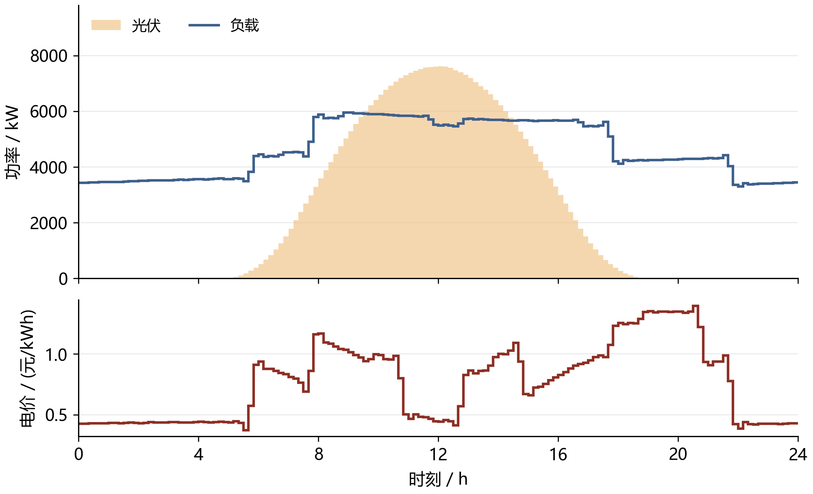
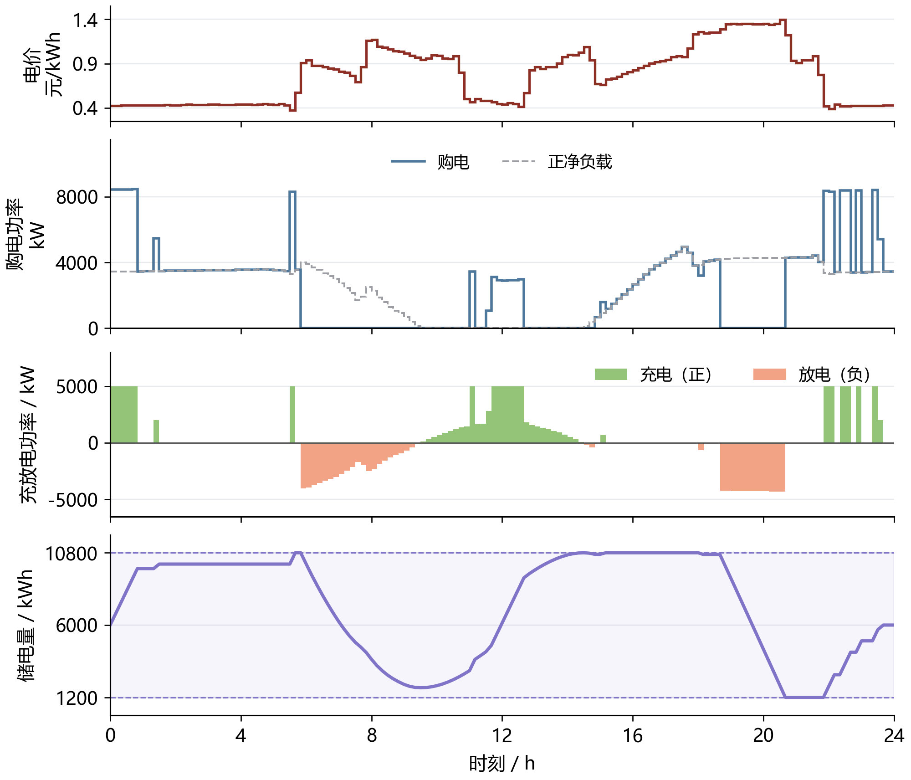
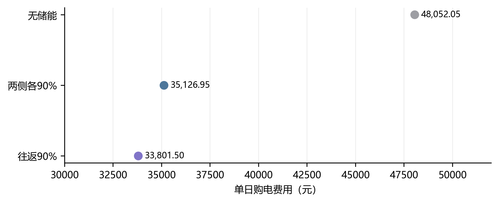
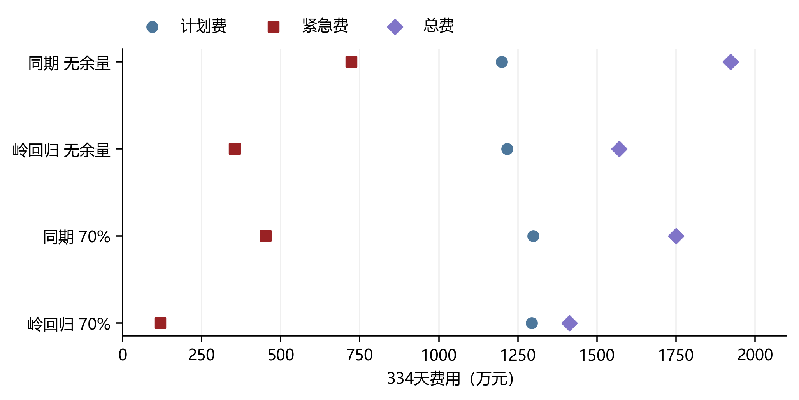
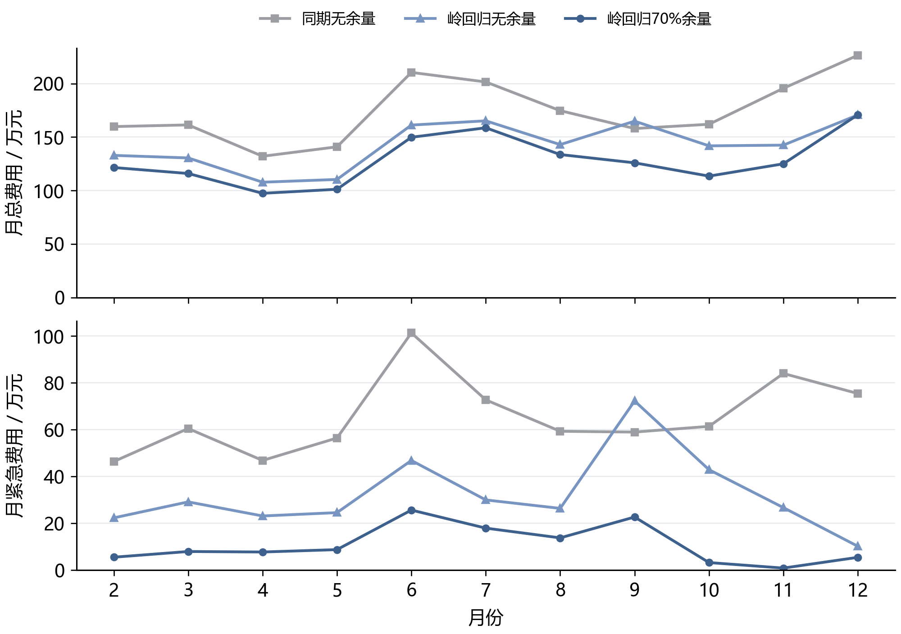
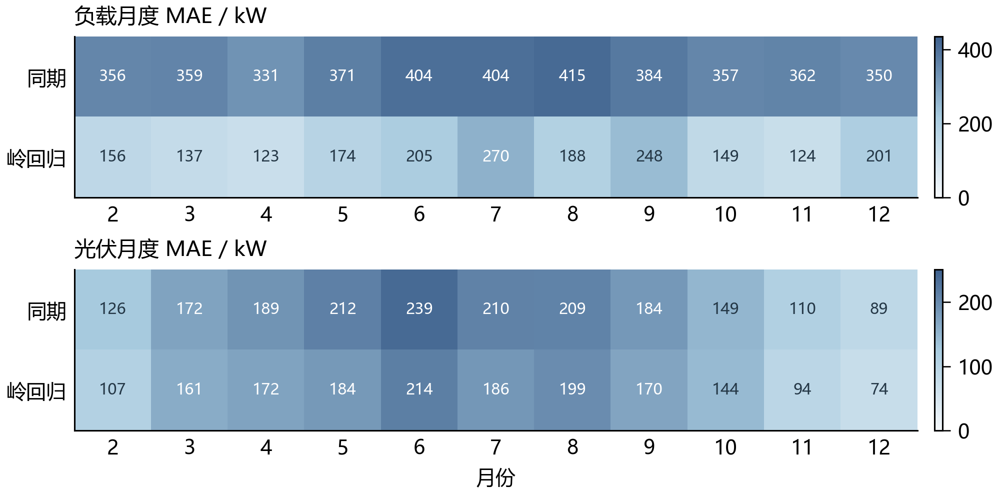
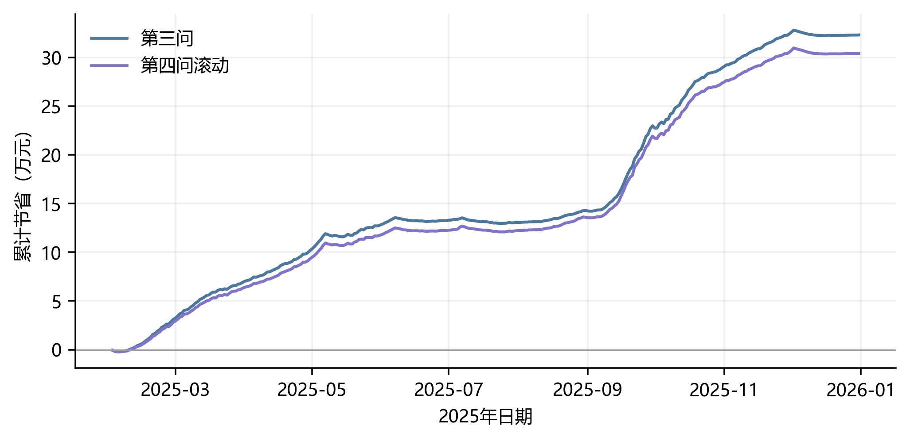

# 预测误差与波动电价下的微网购电和储能调度（Version 2）

## 摘 要

光伏和负载预测误差会同时影响计划购电、储能状态与紧急购电，预测精度的提高未必带来电费下降。本文建立统一的能量与费用账本，并对确定性、日前不确定性、日内更新和波动电价四种条件逐层建模。

针对第一问，在允许无成本弃电的条件下，证明充放电循环可以在保持购电量与全部储电状态不变的情况下消除，因而线性规划可给出与互斥整数模型同等费用的物理解。单日费用35,126.95元，较无储能降低26.90%。针对第二问，保留因果岭回归与70%历史误差余量，334天费用14,132,612.16元；降低名义日末储能目标的候选在一月较优、全年反而较差，未替换原策略。

针对第三问，以发布版本匹配的历史净负载误差补充50%分位数候选，一月选择12:00及18:00更新、日末名义下限6000 kWh、不作额外日内负载校正。全年费用降至13,765,317.70元，相比原策略降低2.29%，紧急购电量为166,980.76 kWh。针对第四问，保留日前岭回归策略，采用相同改进的滚动模型与一月选择的同期价格预测，费用为14,486,341.42元，较原滚动策略降低2.06%。

两项滚动改进与各自原策略的期末储电量相同，费用改善并非来自净消耗电池库存。保留GRU三种种子与集成的预测对照，按发布时刻分解误差，同时公开未改善的候选与事后表现更好的消融。研究属于同一年度数据上的模型修订与顺序回测，不构成新的独立年度验证。

关键词：微网调度；线性规划；误差校准；滚动优化；储能

## 一 问题重述

题面研究小区光伏、负载、储能与外部电网之间的电力调控 [1]。储能可以在低价或光伏富余时吸收电量，在高价或供电不足时释放电量；调度既要满足负载，也要尽可能节省购电费用。本文依次研究确定性调度、预测误差、日内更新与波动电价四个层次。

第一问给定每天重复的电价、负载和单日光伏预测，要求每天 00:00 制定全天购电计划，且日初日末储电量相同。需报告指定十分钟时段的购电量、全天总量和费用，以及四小时充放电汇总。第二问中负载与光伏逐日变化，正常购电仍按计划量收费，供电缺口通过五倍交易电价的紧急购电补足，需输出 2—12 月每日完整策略及四个指定日期的结果。

第三问进一步利用每日四个发布时刻的光伏预报，决定是否以及何时调整未执行的购电计划，并计入增购和减购费用。第四问使用附件中的实际波动电价，比较不同价格预测器在日前与滚动两类策略下的实际费用。

## 二 问题分析

第一问是已知输入曲线下的跨时段资源分配。线性回归不负责决定何时充电；购电、电池和负载之间的能量约束才是主模型。加入二元变量后可直接保证同一时段不同时充放电，避免事后修复改变费用与可行性。

第二问的预测误差具有不对称经济后果：低估净负载可能触发五倍电价补购，高估则可能产生仍需付费的富余计划电量。因此先预测负载与光伏，再构造风险余量并求购电计划，最后用实际观测执行与计费。预测误差用于评价预测器，实际购电总费用用于评价完整策略，两者不能互相替代。

## 三 模型假设与数据处理

### 3.1 参数及工作假设

统一参数见表 1。功率上限按微网母线侧定义，所有决策电量使用 kWh。题面“充放电效率为 90%”可能存在单程与往返解释差异，主实验采用两侧各 90%，并对另一解释单独进行敏感性分析。

表 1 储能参数与时间离散

| 参数 | 数值 | 性质 |
| --- | --- | --- |
| 额定容量 | 12000 kWh | 题面给定 |
| 允许储电量 | 1200—10800 kWh | 题面给定 |
| 最大充放电功率 | 5000 kW | 题面给定 |
| 初始储电量 | 6000 kWh | 1 月 1 日 00:00 给定 |
| 充电／放电效率 | 0.9／0.9 | 主实验解释 |
| 时段长度 | 1/6 h | 十分钟离散 |

（1）将每个功率值解释为以时间标签为右端点的十分钟区间平均值。由此原始 00:10 对应 00:00—00:10，原始 00:00+1 对应 23:50—24:00。结果副本按该时间轴统一标签；该解释并非题面明确说明的采样定义。

（2）不设置题面未给出的售电收入与折旧价格，允许不能使用的电量被弃用。第一、二问普通购电按计划量结算，富余计划量不退款；第三、四问主动减购另按第八节的调整账本结算。电池磨损成本没有纳入当前目标。

（3）实际执行近似每十分钟内功率恒定、当前供需可即时观测并平衡。该近似只服务于区间内的充放电和紧急购电，不允许日前读取当天真实曲线。

（4）第二问实际 SOC 连续跨日。日前名义轨迹的日末下限取 6000 kWh，作为防止计划耗空电池的策略设置；不强制实际日末回到 6000，也不按天重置电池。

### 3.2 输入审计与时间边界

附件 1 有 144 个时段，附件 2 的负载与光伏各有 365×144＝52,560 个观测。读取后检查到完整的 2025 年日期、相同的负载和光伏时间轴，未发现缺失、负数或重复日期，未无依据删除峰值。附件 1 混合存储了时间类型与字符串，统一转换分钟后核对 10、20、…、1440。电量按下式换算：

$$
L_{d,t}=P^{\mathrm{load}}_{d,t}\Delta t,\qquad V_{d,t}=P^{\mathrm{PV}}_{d,t}\Delta t,\qquad \Delta t=\frac{1}{6}\ \mathrm{h}.
$$

重新读取原始工作簿确认：附件 1 的时间列含 60 个时间类型单元格和 84 个字符串，均已规范化；附件 2 的两类序列各 52,560 项无缺失、非有限值或负数，且无重复日期或完全重复的日曲线。全局四分位距规则未标记超界点，但这一检查不能证明不存在局部测量误差。

因此，本次预处理没有执行填补、删点、缩尾或平滑，只执行时间格式与单位规范化。光伏有 23,540 个零值，其本身不是缺失标记，保留在原始记录与回测中。预测值的非负截断属于模型输出规则，训练集标准化属于特征处理，均不等同于修改实际观测。

实际数据的测量不确定性没有单独给出，因此不添加虚构置信区间。全文图线来自原始输入或保存的实际计算结果，时段内不做平滑插值。

## 四 符号说明

下文沿用表 2 的符号。单日模型省略日期下标，日内区间用 1—144，状态包含 145 个边界点；跨日计算另带日期下标。

表 2 主要符号及单位

| 符号 | 含义 | 单位 |
| --- | --- | --- |
| $d,t$ | 日期与十分钟时段 | — |
| $L_{d,t},V_{d,t}$ | 负载与光伏电量 | kWh |
| $\hat L_{d,t},\hat V_{d,t}$ | 日前负载与光伏预测 | kWh |
| $g_{d,t},e_{d,t}$ | 计划购电与紧急购电 | kWh |
| $c_{d,t},d_{d,t}$ | 母线侧充电与放电 | kWh |
| $w_{d,t}$ | 不能利用的富余电量 | kWh |
| $S_{d,t}$ | 区间起点的储电量 | kWh |
| $p_t$ | 固定分时交易电价 | 元/kWh |
| $\eta_c,\eta_d$ | 充电与放电效率 | — |
| $z_t$ | 充电状态二元变量 | — |
| $\lambda,q$ | 岭惩罚强度与余量分位数 | — |
| $r_{d,t}(q)$ | 非负净负载预测余量 | kWh |

日期下标 d 与放电变量的字母 d 通过下标位置区分；为简化实现，程序字段分别使用 date 和 discharge_kwh。

## 五 第一问的模型建立与求解

### 5.1 供需结构与决策目标

已给曲线及固定电价如图 1 所示。光伏集中在白天，而负载覆盖全天，储能调度应同时响应供需差额和分时价格。电价使用独立面板，避免功率与价格共用坐标造成误读。

图 1 第一问供需曲线与分时电价

图中每一阶梯对应一个十分钟平均功率或电价，光伏阴影为功率曲线下区域，不作为置信带。

目标是最小化全天计划购电费：

$$
\min C_1=\sum_{t=1}^{144}p_tg_t.
$$

以母线侧收支写能量守恒，将允许的富余供电显式记为未利用电量：

$$
g_t+V_t+d_t=L_t+c_t+w_t,\qquad g_t,w_t\geq0.
$$

充电损耗发生在进入储能时，放电损耗发生在从储能输出至母线时，因而状态方程为：

$$
S_{t+1}=S_t+\eta_c c_t-\frac{d_t}{\eta_d},\qquad 1200\leq S_t\leq10800.
$$

SOC 上下界施加于全部 145 个状态点，状态递推与其他时段约束对应 t＝1，…，144。令每时段最大母线侧充放电量 M＝5000/6 kWh，用二元变量直接限制互斥：

$$
0\leq c_t\leq Mz_t,\qquad 0\leq d_t\leq M(1-z_t),\qquad z_t\in\{0,1\}.
$$

第一问满足以下初始和终端条件，避免利用电池初始存量净放电造成虚假节省：

$$
S_1=S_{145}=6000.
$$

将上述关系集中写成一般日模型，决策变量为购电、充放电、未利用电量、储电量和状态变量。给定不同供需输入与初末状态条件时，可复用以下结构：

$$
\boxed{\left\{\begin{aligned}\min_{g,c,d,w,S,z}\quad &\sum_{t=1}^{144}p_tg_t\\\mathrm{s.t.}\quad &g_t+V_t+d_t=L_t+c_t+w_t,\\&S_{t+1}=S_t+\eta_c c_t-d_t/\eta_d,\\&1200\leq S_t\leq10800,\quad g_t,w_t\geq0,\\&0\leq c_t\leq Mz_t,\quad0\leq d_t\leq M(1-z_t),\\&z_t\in\{0,1\},\quad S_1=S_{145}=6000.\end{aligned}\right.}
$$

上述模型有 865 个变量，其中 144 个为二元变量。原方案以 SciPy 1.17.1 的 milp 接口调用 HiGHS [2]，相对间隙目标设为 10⁻⁷，每日求解时间上限为 30 秒；超时或无可行解时应停止并报告，而非将空结果视为成功。

### 5.2 调度结果与指定时段

计算得到全天购电量 59,482.70 kWh、费用 35,126.95 元。购电与储能轨迹见图 2，指定时段购电和四小时充放电分别见表 3、表 4。

图 2 第一问电价驱动的购电与储能运行

自上而下为电价、购电与正净负载、充放电、SOC。所有阶梯保留十分钟决策，不作平滑。购电超过正净负载的部分用于充电；SOC 阴影为允许范围。

表 3 第一问指定时段购电量及全天费用

| 时间段 | 购电量 | 时间段 | 购电量 | 时间段 | 购电量 |
| --- | --- | --- | --- | --- | --- |
| 10:00-10:10 | 0.00 | 12:00-12:10 | 480.41 | 14:00-14:10 | 0.00 |
| 16:00-16:10 | 445.43 | 18:00-18:10 | 531.89 | 20:00-20:10 | 0.00 |
| 全天购电量 | 59,482.70 | 全天购电费 | 35,126.95 | — | — |

表中电量单位为 kWh，全天购电费单位为元。

表 4 第一问四小时充放电及日初日末储电量

| 时间段 | 充电量 | 放电量 | 时间段 | 充电量 | 放电量 |
| --- | --- | --- | --- | --- | --- |
| 00:00-04:00 | 4,500.00 | 0.00 | 04:00-08:00 | 833.33 | 6,365.84 |
| 08:00-12:00 | 4,787.96 | 1,703.00 | 12:00-16:00 | 5,286.04 | 91.10 |
| 16:00-20:00 | 0.00 | 5,780.13 | 20:00-24:00 | 5,333.33 | 2,859.87 |
| 00:00 储电量 | 6,000.00 | — | 24:00 储电量 | 6,000.00 | — |

表内所有电量单位为 kWh，充放电量采用母线侧口径。四小时内可先充后放，汇总行两者均正不违反十分钟互斥。图中尖峰主要对应集中充电：22:00—22:10 负载约 3309.39 kW、光伏为零，充电 5000 kW，故购电约 8309.39 kW。相邻时段电价为 0.3859、0.4368 元/kWh，模型分别安排满功率充电与不充电。

当前目标只计购电费，未计充电切换成本或功率爬坡限制，因此低价区间内也可能出现零散充电。这是模型边界，不能由图形尖峰直接判为原始数据异常。固定放电与未利用电量、保持费用不变的充电变差最小化诊断未获得实质不同的轨迹，不能据此声称存在平滑且同成本的替代方案。若需要更平稳的实际操作，应另加爬坡约束或费用容差内的次级目标，重新计算并比较成本。

### 5.3 最优性检验与效率解释

删除整数限制得到线性松弛下界 35,126.94858929 元，与整数解目标之差为 0.00000000 元，求解器相对间隙为零。在本题输入与约束口径下，这支持数值精度内的全局最优性。能量平衡最大残差约 2.27e-13 kWh，SOC 递推与容量、功率边界均通过复核。

以每时段正净负载直接购电构造无储能基线：

$$
g_t^{(0)}=\max(L_t-V_t,0),\qquad C_1^{(0)}=\sum_t p_tg_t^{(0)}.
$$

该基线费用为 48,052.05 元，主模型节省 26.90%。效率解释的对照见图 3：若总往返效率为 0.9，并对称取两侧效率为平方根 0.9，费用为 33,801.50 元。该试验只改变效率，不能与主实验混为同一组结果。

图 3 第一问储能收益与效率解释对照

点图以绝对费用标注。各点分别比较无储能、主效率和往返效率解释；主文及 Excel 均对应“两侧效率各 90%”。

### 5.4 互斥约束的等价线性化

互斥不能由一般LP自动保证，但本题的自由弃电变量允许给出更强的结构结论。令ρ＝ηcηd≤1。对松弛解任一时段，作如下变换：

$$
x_t=\min\{c_t,d_t/\rho\},\quad c'_t=c_t-x_t,\quad d'_t=d_t-\rho x_t,\quad w'_t=w_t+(1-\rho)x_t.
$$

充电量和放电量均不增加，且至少一个变为零。由于ηc x＝ρx/ηd，储能增量完全不变；由于d′−c′−w′＝d−c−w，母线平衡也保持不变。购电、紧急购电和所有计划增减量不变，因此本文各类费用均不变。逐槽处理后得到符合互斥约束的物理解：

$$
C_{\mathrm{LP}}^{*}\le C_{\mathrm{MILP}}^{*}\le C_{\mathrm{transformed\ LP}}=C_{\mathrm{LP}}^{*}.
$$

因此，在本模型条件下，二者最优费用相等。Q1的变量可从865个减少到721个，并去掉144个二元变量；日内调整模型同理。实现使用HiGHS线性规划，求解后显式消除循环并重新核验物理约束，绝不直接把同时充放电的松弛解作为运行方案。

证明依赖允许非负、无上界、无额外费用的未利用电量，以及仅由购电和调整量决定的目标函数。若加入严格弃电限制、禁止弃用已买电量、充放电最短持续时间、切换费用等约束，应重新证明或恢复整数模型。本结论不等于所有储能规划都可删除互斥变量。相同最优费用也不保证求解器返回同一计划；在不确定输入下，不同同价计划仍可能产生不同事后费用。

## 六 第二问的预测与日前策略

### 6.1 训练与评价的时间顺序

以 1 月 22—31 日作为验证窗，选择岭回归惩罚与风险余量。2 月 1 日起固定这些选择规则，执行至 12 月 31 日。模型每七天更新一次，最多使用最近 60 个已结束日期；评价过程中已观察到的数据可以进入后续更新，尚未发生的数据不进入当前决策。这是顺序样本外回测，而不是把全年随机拆分。

一月份共同热身从 1 月 1 日的 6000 kWh 开始；首日无历史时用附件 1 作为冷启动参考，随后不足七天用近三日均值，积累七天后用日／周同期。验证期初 SOC 为 6244.256891 kWh，评价期初为 9902.811288 kWh，各候选策略都从同一状态出发。冷启动的附件 1 仅作为明确的初始化假设，不当作全年可提前获得的预报。

### 6.2 同期基线与岭回归预测

对负载或光伏电量序列 y，同期基线取昨日与上周同日相同时间槽的均值：

$$
\hat y_{d,t}^{\mathrm{seasonal}}=\frac{y_{d-1,t}+y_{d-7,t}}{2}.
$$

岭回归采用 21 个特征：昨日、前日、上周同日的同槽值，三日和七日同槽均值、七日同槽标准差、昨日全天均值和近三日全天均值共八项；前三阶日内正余弦六项；星期指示七项。日期及时间属于决策时已知的日历信息。标准化均值与尺度仅在当次训练集上估计，常量特征尺度置 1。

$$
\min_{\beta,b}\sum_{i\in\mathcal T_d}(y_i-b-\widetilde{x}_i^{\mathsf T}\beta)^2+\lambda\|\beta\|_2^2.
$$

截距不惩罚，负载和光伏分别拟合。按验证 MAE 比较 λ＝1、10、100，均选 1；实现采用 NumPy 线性方程求解，与带截距岭目标一致 [3]。从 1 月 15 日开始具备拟合条件，之后每七日重新拟合。预测截断为非负；某槽过去七日光伏全零时，该槽预测置零，日出日落季节变化可能使此规则产生滞后。

评价指标采用功率单位的 MAE 与 RMSE；不使用夜间分母为零的普通 MAPE：

$$
\mathrm{MAE}=\frac{1}{n}\sum_i|P_i-\widehat P_i|,\qquad\mathrm{RMSE}=\sqrt{\frac{1}{n}\sum_i(P_i-\widehat P_i)^2}.
$$

### 6.3 净负载误差余量与名义优化

定义历史净负载误差及只包含过去信息的误差样本池：

$$
\varepsilon_{j,s}=(L_{j,s}-V_{j,s})-(\hat L_{j,s}-\hat V_{j,s}).
$$

$$
\mathcal E_{d,t}=\{\varepsilon_{j,s}:\max(2,d-28)\leq j<d,\ 1\leq s\leq144,\ |s-t|\leq3\}.
$$

日期下标以 1 月 1 日为 d＝1；排除首日冷启动误差，最多池化 28 个已结束日期和目标槽前后三槽。跨日边界不绕回，不足 28 天时仅取已有历史。余量规则为：

$$
r_{d,t}(q)=\max\{0,Q_q(\mathcal E_{d,t})\}.
$$

无余量候选直接设 r＝0，与“取零分位数”区分。对 q＝0.7、0.8、0.9，分位数使用样本排序后的线性插值。将预测负载加余量作为名义需求，求解第五节同一物理模型：

$$
L_t^{\mathrm{nom}}=\hat L_{d,t}+r_{d,t}(q),\qquad V_t^{\mathrm{nom}}=\hat V_{d,t},\qquad S_{d,145}^{\mathrm{nom}}\geq6000.
$$

70% 分位数不是“全天 70% 概率不缺电”的保证。名义优化只最小化计划费，五倍紧急购电的影响通过验证期对余量方案的筛选间接体现，不能据此称为已精确求解随机规划。

### 6.4 实时执行与跨日状态

当天普通购电计划固定后，定义当前供需剩余。对非负剩余尽量充电，对缺口尽量放电，并分别受可用空间、储电量和功率限制：

$$
u_t=g_t+V_t-L_t.
$$

$$
c_t=\min\left\{\max(u_t,0),M,\frac{10800-S_t}{\eta_c}\right\}.
$$

$$
d_t=\min\left\{\max(-u_t,0),M,\eta_d(S_t-1200)\right\}.
$$

$$
e_t=\max(-u_t-d_t,0),\qquad w_t=\max(u_t-c_t,0).
$$

以上规则使同一时段仅有充电或放电，SOC 仍按状态方程更新，实际日末传给次日：

$$
S_{d+1,1}=S_{d,145}.
$$

所有供电缺口由紧急购电补足。全年评价费用定义为：

$$
C_2=\sum_{d,t}p_tg_{d,t}+5\sum_{d,t}p_te_{d,t}.
$$

将第二问策略概括如下。记 Ω 为第一问中除初末等式之外的物理可行域，输入替换为带余量预测，日初状态取真实已知值；G 表示本节的贪心实时平衡规则：

$$
\boxed{\left\{\begin{aligned}(g^{\mathrm{plan}},\ldots)&\in\arg\min_{(g,c,d,w,S,z)\in\Omega}\sum_t p_tg_t,\\L^{\mathrm{nom}}&=\hat L+r(q),\quad V^{\mathrm{nom}}=\hat V,\\S_1^{\mathrm{nom}}&=S_1^{\mathrm{actual}},\quad S_{145}^{\mathrm{nom}}\geq6000,\\(c_t,d_t,e_t,w_t)&=\mathcal G(g_t^{\mathrm{plan}},L_t,V_t,S_t),\\C_2&=\sum_{d,t}p_t(g_{d,t}^{\mathrm{plan}}+5e_{d,t}).\end{aligned}\right.}
$$

其中 Ω 中每一时段的平衡使用上式名义输入；最后一行是实际策略评价费用，不是声称日前已知实际 e 的优化目标。余量 q 仅由一月验证费用选择，之后冻结。

实际储能动作可以偏离名义动作，但普通计划购电不能按真实曲线事后改写。这一贪心控制具有可行性与因果性，不保证跨时段的实时经济最优。

## 七 第二问的结果与检验

### 7.1 验证期选择与紧急购电权衡

验证结果见表 5 与图 4。各方案使用相同验证初始 SOC，但期末存量不同，因此除费用外同时列出期末储电量，不把存量差异隐藏在成本比较中。

表 5 一月份十天验证结果

| 预测器 | 余量 | 总费/元 | 紧急费/元 | 期末SOC/kWh |
| --- | --- | --- | --- | --- |
| 同期 | 无 | 661,834.09 | 173,098.38 | 9,902.81 |
| 同期 | 70% | 634,179.58 | 110,989.47 | 10,595.98 |
| 同期 | 80% | 666,226.97 | 64,910.51 | 10,800.00 |
| 同期 | 90% | 680,257.72 | 456.98 | 10,800.00 |
| 岭回归 | 无 | 532,888.41 | 61,836.07 | 5,924.08 |
| 岭回归 | 70% | 509,757.47 | 8,765.44 | 6,623.17 |
| 岭回归 | 80% | 529,846.45 | 4.16 | 7,110.16 |
| 岭回归 | 90% | 633,664.05 | 0.00 | 9,039.38 |

图 4 验证期风险余量与费用的权衡

横轴为四种候选方案，其中“无余量”是独立基线。折线只辅助比较候选值，不表示连续参数的精确响应。

岭回归 70% 余量的验证费为 509,757.47 元，其中紧急费 8,765.44 元；90% 余量紧急费为零，但总费升至 633,664.05 元。两者期末储电量相差约 2416 kWh，故不能完全忽略存量影响；当前目标仍按题面购电费用评价，不另添加缺乏依据的残值收入。

### 7.2 全期预测误差与季节变化

按表 6 比较 334 天共 48,096 个十分钟区间的功率预测误差，岭回归在负载预测上的改善大于光伏。四个指定日期的曲线对照见图 5，整年误差仍以全期统计为准。

表 6 第二问全期预测误差

| 预测器 | 负载MAE | 负载RMSE | 光伏MAE | 光伏RMSE |
| --- | --- | --- | --- | --- |
| 同期 | 372.26 | 585.91 | 171.98 | 343.38 |
| 岭回归 | 179.86 | 234.59 | 155.28 | 306.74 |

上述误差单位均为 kW，光伏指标包含夜间零值，不能直接等同于白天发电时段的预测精度。

图 5 四个指定日期的负载与光伏日前预测

各列共用纵轴尺度，日期由题目指定。实线为实际观测，虚线为岭回归预测，不加入平滑后虚构的尖峰。

### 7.3 全期购电费用与运行约束

策略费用分解如图 6，数值及期末存量见表 7。相同初始状态保证比较具有共同起点，实际状态在全年内自行连续演化。

表 7 第二问全期费用及期末储电量

| 策略 | 计划费/万元 | 紧急费/万元 | 总费/万元 | 期末SOC/kWh |
| --- | --- | --- | --- | --- |
| 同期 无余量 | 1,199.19 | 723.59 | 1,922.78 | 5,825.99 |
| 岭回归 无余量 | 1,215.92 | 354.62 | 1,570.54 | 5,903.65 |
| 同期 70%余量 | 1,297.86 | 452.54 | 1,750.40 | 6,217.35 |
| 岭回归 70%余量 | 1,293.50 | 119.76 | 1,413.26 | 5,903.65 |

图 6 第二问四组策略的全期费用分解

蓝色为普通计划购电费，深红为紧急购电费；用点的位置分别表示两项及总费用。主策略由一月份验证选择。

主策略总费用 14,132,612.16 元，较同期无余量低 26.50%，较岭回归无余量低 10.01%。后两组期末 SOC 均为 5,903.65 kWh，因此此处的余量增益没有被不同期末存量混淆。

主策略紧急购电累计 197,465.10 kWh，涉及 1132 个十分钟区间，不等同于同样数量的独立事件。未利用电量为 2,211,229.49 kWh，其中可包含未消纳光伏和富余计划购电，不能全部称为弃光。

按月费用见图 7，主策略在 11 个评价月份中有 11 个月的总费用低于同期无余量。月度划分仅用于描述已固定策略的季节表现，未用于重新选超参数；月总费也受到月份天数和负载规模影响，不宜直接将其解读为单位供电效率。

图 7 固定策略的月度总费用与紧急费用

上面板为含紧急费用的月总费，下面板为其中的紧急费用。三条曲线依次分离预测改进和风险余量的作用。

月度预测 MAE 进一步见图 8。两块热力图各用自身的颜色上限，不能直接按跨面板颜色深浅比较负载与光伏误差；应读取格内数值。该图用于观察季节变化，不提供未计算的置信区间。

图 8 同期预测与岭回归的月度误差

每格为对应月份全部十分钟区间的 MAE，单位 kW；数值为整数显示，统计文件保留完整精度。

四个指定日期的购电、充放电、日初日末储电量及紧急事件，集中列于附录 A；完整逐日计划分别写入题目指定结果文件。

### 7.4 日末目标修订的失败证据

名义日末6000 kWh是策略设置，而非问题二的硬约束。新增候选比较余量0、0.5、0.7、0.8、0.9与名义日末1200、6000、9000 kWh，共15组，均只用一月22—31日费用选择。选择到0.7和1200 kWh。但该候选全年费用与库存状况如下。

对应结果见表 8。

表 8 第二问新终端候选与保留方案

| 方案 | 总费/元 | 期末SOC/kWh |
| --- | --- | --- |
| 原策略（保留） | 14,132,612.16 | 5,903.65 |
| 一月选择的新候选 | 14,142,959.63 | 1,311.08 |

候选全年增加费用10,347.47元，并少保留4,592.57 kWh库存，不能称为改善。按全期最大固定电价估计补齐差额所需购电的压力金额为7,119.51元；它只是存量核算压力分析，不是虚构发生在年末后的实际交易。V2交付继续采用原策略。本次保留与替换属于同一数据集上的修订选择，不能再把交付组合声称为未经观察的独立测试结果。

## 八 第三问的日内滚动调整

### 8.1 新预报的价值与时间对齐

第三问新增的是带有发布时间的光伏信息，而不是未来实际出力。每个更新点应比较新计划可能避免的紧急购电与调整支出，并保护已经执行的交易。负载仍沿用第二问的日前岭回归，日内不使用未来负载真值校正预测；这一设计也使更新时间对照主要反映光伏预报和当前储能状态的作用。滚动优化具有不断用最新可用信息更新未来决策的结构，其思想可参见文献[4]；本文没有照搬该文的潮流或分布式控制模型。

附件3含365天、每日4次、每次24个小时预报，共35,040个数值。1,095个空日期位于同日四行预报的后3行，只在该结构内补齐。预报发布点与提前量逐行核验，无缺失、负数和非有限数；17,525个零值保留。预报“1小时”指发布后一小时，不是当天01:00。附件4的52,560个电价亦完整、非负且严格为正，范围0.0076—1.7936元/kWh。两附件均不做删点、缩尾或平滑观测。

设发布时刻为τ，小时预报端点为 Hτ,h，h＝1，…，24。发布时间处缺少零小时端点，采用刚结束的十分钟实际光伏均值作为边界代理，年初无历史时取零；该代理只用于预报曲线首段。以相邻整点之间的线性函数插值，并对每个十分钟区间作梯形积分：

$$
\hat V_{\tau,t}=\int_{a_t}^{b_t}\tilde P_\tau(u)\,du=\frac{\tilde P_\tau(a_t)+\tilde P_\tau(b_t)}{2}\Delta t.
$$

此过程是预报分辨率转换，不是修改实际数据。实际电量仍按附件2原值乘1/6小时。当前实现每次只优化至本日24:00，预报中次日部分暂不用于跨日承诺，避免题目未规定的提前购入次日电量。图9展示6月21日的实际与不同版本预报。

图 9 同一日期不同发布时刻的光伏预报

各版本只从其发布时刻向后显示。新增预报不保证每个目标时段更接近实际；不能把18:00版本提前用于午夜决策。

### 8.2 多次调整的费用账本

题面给出减购50%违约电价和增购1.5倍价格，但没有完整说明取消部分是否退回原款。主模型取取消原价退款并扣50%违约费，即净回收0.5倍原价；另将“原款不退且额外支付50%违约费”单独重新优化作敏感性。该分歧必须体现在假设和结果中，不能默认为唯一解释。

令 g⁰ 为午夜计划，gᵏ 为第k次更新后的计划。每次调整对最近版本定义非负增购 a⁺ 和减购 a⁻。已执行区间不允许进入调整集合，未来计划保持非负：

$$
g_t^{k}=g_t^{k-1}+a_{k,t}^{+}-a_{k,t}^{-},\quad a_{k,t}^{\pm}\ge0,\quad 0\le a_{k,t}^{-}\le g_t^{k-1}.
$$

单次同一区间不应同时增减。因为价格为正，同时增加和减少同量会额外支付正费用，可从最优解中消去；程序仍检查实际解没有这种循环。完整账本为：

$$
C_3=\sum_t p_tg_t^0+\sum_k\sum_{t\in\mathcal T_k}p_t(1.5a_{k,t}^{+}-0.5a_{k,t}^{-})+5\sum_t p_te_t.
$$

对于多轮操作，新增单位支付1.5倍，随后取消也只净返还0.5倍，绝不返还先前支付的全部1.5倍；因而先增加再取消的往返费用为一倍价格，不产生虚假套利。总费用拆成午夜原始计划、历次增购、历次减购净退款、实际紧急购电四部分。另一个无退款解释只把负0.5系数改为正0.5，并重新求解整个策略。

### 8.3 滚动优化与余量校准

每次重新优化以当前真实已知储电量为初值，沿用物理可行域和名义日末6000 kWh下限。00:00以全部计划费用为目标；其余时刻已付款为常数，仅最小化尚可改变部分的调整费用。余量按对应发布版本、同一目标钟点此前28天净负载误差计算，并池化相邻三槽；不足28天使用已有历史。零余量单独作为候选。

$$
\boxed{\left\{\begin{aligned}\min_{g,c,d,w,S,z,a^+,a^-}\quad&\sum_{t\in\mathcal T_k}\hat p_{k,t}(1.5a_{k,t}^{+}-0.5a_{k,t}^{-})\\\mathrm{s.t.}\quad&g_t=g_t^{k-1}+a_{k,t}^{+}-a_{k,t}^{-},\\&g_t+\hat V_{k,t}+d_t=\hat L_t+r_{k,t}+c_t+w_t,\\&(g,c,d,w,S,z)\in\Omega,\\&S_{\tau_k}=S_{\tau_k}^{\mathrm{actual}},\quad S_{145}\ge6000,\\&a_{k,t}^{+}\ge0,\quad0\le a_{k,t}^{-}\le g_t^{k-1}.\end{aligned}\right.}
$$

Ω沿用第一问中状态递推、所有状态点储能边界、母线侧功率限制和二元互斥，去掉原初末相等等式。第三问 p̂ 就是附件1的已知固定价格。求解后只按实际逐十分钟执行到下一更新点，未来轨迹随后可重新计算。没有更新的组保持已承诺计划，实际电池仍按即时余缺充放电并在不足时紧急补购。该控制规则保证供电可行，但不保证随机控制意义下最优。

一月22—31日新增比较余量0、0.5、0.7，负载校正强度0、0.5、1，以及12/18点或6/12/18点更新，共18组，名义日末下限均为6000 kWh。此前原方案只比较0、0.7、0.9三个余量，因此没有覆盖适中的0.5。新增参数的价值来自更贴近调整制度下的欠购与多购权衡，而非使用更复杂的预测器。

校正候选只取更新时刻之前最近18个已完成区间的负载预测残差均值，并随未来提前量按36个时段的尺度指数衰减。午夜校正为零，更新点当前区间和未来实际值均不可进入：

$$
\bar\epsilon_\tau=\frac1m\sum_{i=\max(0,\tau-18)}^{\tau-1}(L_i-\hat L_i),\quad
\hat L'_{\tau,t}=\max\{0,\hat L_t+\beta\bar\epsilon_\tau\exp[-(t-\tau+1/2)/36]\}.
$$

残差池对相同发布版本与相同校正规则建立，使用此前28个完整日期及目标前后三槽。过去时段绝不按后来发布的信息回填。选择仍以验证实际费用为准，结果为q＝0.5、β＝0、12/18点更新。额外负载校正在验证期未得到支持，故主模型保留β＝0。

### 8.4 成本改善及来源

对应结果见表 9。

表 9 第三问费用账本与运行量

| 指标 | 原策略 | V2 |
| --- | --- | --- |
| 午夜计划费/元 | 12,282,761.23 | 12,521,335.94 |
| 增购费/元 | 720,056.59 | 503,962.50 |
| 减购净费用/元 | -145,798.31 | -148,871.09 |
| 紧急费/元 | 1,231,545.41 | 888,890.35 |
| 总费/元 | 14,088,564.93 | 13,765,317.70 |
| 紧急购电/kWh | 230,671.95 | 166,980.76 |
| 未利用电量/kWh | 1,375,609.93 | 1,485,682.88 |
| 期末SOC/kWh | 5,903.65 | 5,903.65 |

V2节省323,247.23元，降幅2.29%。午夜多购增加常规支出，同时减少昂贵日内增购和五倍紧急购电，形成净节省。但未利用电量有所增加，因此不应把成本改善写成所有运行指标同时改善。两种方案均从9902.811288 kWh开始，期末均为5,903.65 kWh，比较没有被期末存量差异混淆。

图10进一步给出两项滚动策略的累计节省路径。

图 10 第三问与第四问滚动策略相对各自原策略的累计节省；曲线上升表示累计节省扩大，局部回落表示该时段改进方案反而更贵。全部日期连续纳入，不挑选有利月份。

原稿八种更新组合的全年结果仍保留，但属于原余量设置下的比较；不能当作新q＝0.5的八组合结果。原策略相对只午夜更新具有收益，这支持研究日内信息价值。新策略只在事前列明的两个更新集合内选择，不能宣称12/18点已在所有可能更新时间中全局最优。

### 8.5 消融与结算敏感性

对应结果见表 10。

表 10 第三问受控对照

| 方案 | 总费/元 | 紧急购电/kWh |
| --- | --- | --- |
| LP、原q=0规则 | 14,088,571.35 | 230,671.95 |
| 主方案q=0.5、β=0 | 13,765,317.70 | 166,980.76 |
| 相同q与时刻、β=1消融 | 13,714,319.42 | 151,040.79 |
| 不退款另罚50%，重新求解 | 13,825,450.94 | 165,118.76 |

仅改为LP的全年费用与原MILP结果有数元差异，不是节省的主要来源；相同名义最优值不等于浮点运算、同价计划与跨日执行路径逐位相同。β＝1消融的全年费用更低，但这是事后观察，不能覆盖一月选择。它说明负载校正值得后续独立季节验证，不能据此将其提升为已验证主策略。不退款敏感性保持参数不变并重新优化，实际计划也随之变化，差额不能解释为单纯退款金额。

## 九 第四问的电价预测与两类调度

### 9.1 波动价格的信息与结算

附件4每个供电区间只有一个实际价格，没有提供同一交付区间在不同交易时点的报价面板。主模型将未来价格视为未知，历史值仅在区间结束后可用；预测价格进入优化，实际交付区间价格乘对应系数用于回测结算。这是当前数据能够支持的明确假设，而非声称全年价格已在午夜公开。图11给出实际价格的全年变化。

图 11 全年实际电价的日内范围与日均值

阴影为每天实际最小至最大值，不是置信区间；没有删除价格峰谷。价格低至0.0076元/kWh仍保留，不以MAPE作主指标。

### 9.2 公平预测接口与时间切分

每个起点τ直接预测未来144个十分钟价格。输入为目标钟点前一天和前一周的两条历史曲线，以及目标时刻、星期的正余弦编码；在各起点这些信息全部已知。同期、岭回归与GRU的信息来源相同，表示方式不同。前一天的末项最大为τ前一个已经结束的区间，避免把多步预测的“最近滞后”错误取成未来真值。

$$
\hat p_{\tau,j}^{\mathrm{seasonal}}=\frac{p_{\tau+j-144}+p_{\tau+j-1008}}{2},\qquad j=0,\ldots,143.
$$

岭回归把两条历史价格、日历、两者差和乘积及各历史曲线均值和标准差组合为12维特征，按未来目标逐行拟合。标准化参数仅由训练窗口估计，正则强度在1、10、100中依据一月验证MAE选择，选得1。序列窗口每6小时移动；窗口重叠不能视为完全独立样本。全部训练目标必须在拟合时刻前结束，不能仅检查窗口起点。

模型于1月15日、22日初始化，此后每月月初从最近60天历史重新拟合。GRU每次把最近3天完整目标窗口作为内部早停验证，其他可用窗口训练，跨越分界的目标窗口剔除。内部验证只服务该次训练；一月22—31日外层验证用于比较方案；2—12月结果用于顺序样本外评价，不能反过来选择结构、种子或主方案。

### 9.3 残差 GRU 的训练

为避免小样本网络从零重建已有日周期，先以同期曲线作为基准，再用单层GRU学习偏差。输入维度6，隐藏维度32，每个位置输出一个价格残差，整体一次得到144步，不使用未来标签进行递归输入。门控关系采用PyTorch的实现约定[5]：

$$
r_j=\sigma(W_{ir}x_j+b_{ir}+W_{hr}h_{j-1}+b_{hr}),\quad z_j=\sigma(W_{iz}x_j+b_{iz}+W_{hz}h_{j-1}+b_{hz}).
$$

$$
n_j=\tanh(W_{in}x_j+b_{in}+r_j\odot(W_{hn}h_{j-1}+b_{hn})),\quad h_j=(1-z_j)\odot n_j+z_j\odot h_{j-1}.
$$

$$
\hat p_{\tau,j}=\max\{0.001,\ \hat p_{\tau,j}^{\mathrm{seasonal}}+s_y(w^Th_j+b)\}.
$$

历史价格先按训练集尺度标准化，sy为相应标准差。输出头初始为零，初始预测因此等于同期基线。训练采用平滑L1损失、Adam学习率0.003、批大小32、梯度范数上限1，每次最多50轮；内部验证MAE连续6轮无改善则停止并恢复最好权重。价格下限0.001只作用于预测输出，且低于本数据实际最小价格，不属于清洗实际值。

固定种子17、42、2026；每次重训使用种子与拟合日索引之和，三个模型分别保存，再以等权均值构成预先定义的GRU集成。所有种子均进入结果表，不挑最好的一次替代其他结果。图12展示6月1日重训的内部验证收敛，仅代表该次训练，不能冒充全年的验证曲线。

图 12 GRU 三个种子的内部验证过程

曲线在实际早停轮数结束；各次模型均恢复内部验证最优权重。其他月份的完整训练记录保留在支撑材料中。

### 9.4 按发布时间核对预测误差

全年价误差按发布时间拆分，避免把Q4-2实际只用午夜预报的情形与四次发布混合评价。同一目标在不同起点重复出现，不能作为独立重复观测。以下是未更改的已保存价格预测，在原始实际价格上重新计算的误差；本轮未重新训练GRU，原39次训练与三种种子权重均保留。

对应结果见表 11。

表 11 各发布起点价格预测误差

| 预测器 | 发布时刻 | MAE/元每kWh | RMSE/元每kWh | 配对数 |
| --- | --- | --- | --- | --- |
| seasonal | 00:00 | 0.05527 | 0.07554 | 48096 |
| seasonal | 06:00 | 0.06117 | 0.08282 | 36072 |
| seasonal | 12:00 | 0.05761 | 0.07870 | 24048 |
| seasonal | 18:00 | 0.04499 | 0.06033 | 12024 |
| ridge | 00:00 | 0.04567 | 0.06212 | 48096 |
| ridge | 06:00 | 0.04938 | 0.06717 | 36072 |
| ridge | 12:00 | 0.04928 | 0.06763 | 24048 |
| ridge | 18:00 | 0.04566 | 0.06464 | 12024 |
| gru_mean | 00:00 | 0.04253 | 0.05726 | 48096 |
| gru_mean | 06:00 | 0.04603 | 0.06198 | 36072 |
| gru_mean | 12:00 | 0.04448 | 0.06097 | 24048 |
| gru_mean | 18:00 | 0.03941 | 0.05546 | 12024 |

### 9.5 两类策略与候选保留原则

日前策略的低终端候选同时改变了储能目标。新候选的价格预测器只根据一月费用在同期、岭回归与GRU集成中选择；全年对照未显示其优于原日前方案。因此正式结果4-2保留原70%余量、6000 kWh名义下限及岭回归价格预测，不用事后最小费用的预测器替换。滚动策略采用q＝0.5、β＝0、12/18点更新，同期价格预测仍是一月选择结果。

对应结果见表 12。

表 12 第四问交付与试验结果

| 方案 | 总费/元 | 期末SOC/kWh |
| --- | --- | --- |
| 日前原策略（交付保留） | 14,880,535.05 | 5,939.92 |
| 日前一月选择的新候选（未采用） | 14,887,016.72 | 1,311.08 |
| 滚动原策略 | 14,790,501.42 | 5,952.82 |
| 滚动V2（交付采用） | 14,486,341.42 | 5,952.82 |

对应结果见表 13。

表 13 同一新滚动模型中的价格预测对照

| 预测器 | 总费/元 | 紧急费/元 |
| --- | --- | --- |
| seasonal | 14,486,341.42 | 877,626.11 |
| ridge | 14,485,242.95 | 863,094.25 |
| gru_mean | 14,477,646.38 | 861,918.33 |

滚动V2比原策略节省304,160.00元，降幅2.06%，期末SOC相同。GRU集成的全期误差与新滚动费用均有优势，但不能因已经看到全年结果就取代一月选出的同期主模型。网络预测、风险余量和调整制度共同决定经济效果，单一平均误差不足以选购电策略。

## 十 综合核验与稳健性

### 10.1 原始数据与费用复算

四个输入附件与题面指纹逐一比对；原始时间与单位规范化后，逐时实际负载、光伏和价格与保存轨迹对照，未发现数值篡改或主费用算错。原稿4组Q2与21组Q3/Q4轨迹重新通过核验。本轮另对12组334天新轨迹检查供需平衡、SOC递推与跨日连续、容量与功率上限、互斥和全部费用分项；对保存的午夜计划逐版本重建增减及最终计划。每次求解状态与耗时单独保存，失败结果不得进入汇总。

第一问LP与MILP在原始输入及含光伏富余的随机小实例中交叉比较，并对退费与不退费两种修订目标比较最优费用。前缀扰动测试改变当前及未来输入，确认此前负载校正和风险余量不变。实际执行允许区间内即时平衡的近似仍保留，不能把它说成区间开始时知道完整实际平均值。

### 10.2 配对日费用与时间依赖

将原策略与候选在同一天的费用差配对，按7、14、28天循环区块重采样，每种长度2000次，考察结论对时间相关性的敏感性。下面区间是本年度日差序列的经验不确定性描述，不是不同年份的可靠覆盖保证。方法仍依赖区块可交换近似；季节非平稳性与模型修订后的选择偏差不能被Bootstrap消除。

对应结果见表 14。

表 14 区块重采样下的全年节省区间

| 问题 | 区块/天 | 2.5%/元 | 97.5%/元 |
| --- | --- | --- | --- |
| q3 | 7 | 224,299.28 | 434,641.36 |
| q3 | 14 | 195,472.59 | 463,325.38 |
| q3 | 28 | 167,271.07 | 495,927.99 |
| q4-3 | 7 | 214,698.67 | 405,955.00 |
| q4-3 | 14 | 184,778.68 | 439,933.75 |
| q4-3 | 28 | 160,265.81 | 474,847.76 |

对应结果见表 15。

表 15 各月滚动改进节省

| 月份 | 第三问/元 | 第四问滚动/元 |
| --- | --- | --- |
| 2025-02 | 31,004.43 | 28,078.75 |
| 2025-03 | 38,074.21 | 35,036.63 |
| 2025-04 | 32,458.93 | 30,038.92 |
| 2025-05 | 26,062.81 | 24,077.61 |
| 2025-06 | 5,022.58 | 5,051.48 |
| 2025-07 | -1,945.48 | -50.54 |
| 2025-08 | 12,288.14 | 13,846.58 |
| 2025-09 | 86,983.91 | 83,229.08 |
| 2025-10 | 59,552.90 | 54,498.80 |
| 2025-11 | 34,749.76 | 31,622.03 |
| 2025-12 | -1,004.96 | -1,269.34 |

第三问与第四问滚动的各长度区块区间均为正，支持本数据内费用改善的稳定性；仍需新的季节或独立年度数据检验。第二问与第四问日前候选的区间跨越零且库存更少，不支持宣布其优于原模型。

### 10.3 模型边界与复现限制

时间按右端点解释、两侧90%效率、逐版本净退款50%、波动价按交付区间结算，均为明确工作口径。若官方进一步明确其它解释，需要全量重算。只优化到本日24:00没有充分利用次日预报，未来可研究跨日价值函数，但不能提前把未知次日实际曲线加入决策。

本轮没有凭观察峰值就删数，没有新增虚构气象或运行数据，也没有声称全局随机最优或全年零紧急购电。线性化减少的是计算复杂度；风险校准改善的是本数据中的决策费用，两种贡献应分开。低终端目标与简单负载校正的失败或不一致结果表明，单一一月窗口对季节泛化仍有限。

## 十一 结论

四问共用能量、时标、效率与结算约定。第一问给出可证明等价的LP求解形式并维持原最优费用；第二问保留原日前策略，避免把短窗内的库存消耗误当作全年改善。第三问新增适中风险分位数，降低昂贵补购与日内增购；第四问在波动价格下复现该滚动收益。完整指定日表和五份结果工作簿补齐第四问原稿展示不足。所有采用与未采用的候选均保留，交付属于可复算的Version 2研究稿。

## 参考文献

[1] 全国大学生数学建模竞赛组委会. 2026年高教社杯全国大学生数学建模竞赛C题：微网与外部电网电力调控策略. 用户提供题面与附件.

[2] SciPy Developers. scipy.optimize.milp; scipy.optimize.linprog. https://docs.scipy.org/doc/scipy/reference/generated/scipy.optimize.linprog.html. 访问日期2026-09-11. 本文计算使用SciPy 1.17.1.

[3] scikit-learn Developers. Ridge. https://scikit-learn.org/stable/modules/generated/sklearn.linear_model.Ridge.html. 访问日期2026-09-11. 本文以NumPy实现带截距岭目标.

[4] Morstyn T, Hredzak B, Aguilera R P, Agelidis V G. Model Predictive Control for Distributed Microgrid Battery Energy Storage Systems. IEEE Transactions on Control Systems Technology, 2018, 26(3):1107–1114. DOI:10.1109/TCST.2017.2699159.

[5] PyTorch Contributors. GRU. https://docs.pytorch.org/docs/2.14/generated/torch.nn.GRU.html. 原试验使用CPU PyTorch 2.14，V2保留原模型权重与预测.

## 附录 A 四问指定日期完整结果

电量单位为kWh，费用单位为元。普通购电与紧急购电分列。滚动问题的指定时段和全天购电量指最终有效普通计划；午夜计划及每次更新完整保存在Excel中。所有表由实际轨迹自动生成。

### A.1 问题1

对应结果见表 16。

表 16 指定时段购电及全天费用

| 时间段 | 购电量 | 时间段 | 购电量 | 时间段 | 购电量 |
| --- | --- | --- | --- | --- | --- |
| 10:00-10:10 | 0.00 | 12:00-12:10 | 480.41 | 14:00-14:10 | 0.00 |
| 16:00-16:10 | 445.43 | 18:00-18:10 | 531.89 | 20:00-20:10 | 0.00 |
| 全天购电量 | 59,482.70 | 全天购电费 | 35,126.95 | — | — |

对应结果见表 17。

表 17 储能运行

| 时间段 | 充电量 | 放电量 | 时间段 | 充电量 | 放电量 |
| --- | --- | --- | --- | --- | --- |
| 00:00-04:00 | 4,500.00 | 0.00 | 04:00-08:00 | 833.33 | 6,365.84 |
| 08:00-12:00 | 4,787.96 | 1,703.00 | 12:00-16:00 | 5,286.04 | 91.10 |
| 16:00-20:00 | 0.00 | 5,780.13 | 20:00-24:00 | 5,333.33 | 2,859.87 |
| 00:00储电 | 6,000.00 | — | 24:00储电 | 6,000.00 | — |

### A.2 问题2

对应结果见表 18。

表 18 指定时段购电及全天费用

| 时间段 | 购电量 | 时间段 | 购电量 | 时间段 | 购电量 |
| --- | --- | --- | --- | --- | --- |
| 10:00-10:10 | 0.00 | 12:00-12:10 | 574.14 | 14:00-14:10 | 0.00 |
| 16:00-16:10 | 488.93 | 18:00-18:10 | 720.76 | 20:00-20:10 | 0.00 |
| 全天购电量 | 68,036.47 | 全天购电费 | 41,276.85 | — | — |

对应结果见表 19。

表 19 储能运行

| 时间段 | 充电量 | 放电量 | 时间段 | 充电量 | 放电量 |
| --- | --- | --- | --- | --- | --- |
| 00:00-04:00 | 4,071.86 | 209.79 | 04:00-08:00 | 1,038.99 | 5,515.86 |
| 08:00-12:00 | 6,186.28 | 2,777.38 | 12:00-16:00 | 4,162.63 | 444.57 |
| 16:00-20:00 | 266.98 | 5,659.90 | 20:00-24:00 | 5,687.88 | 2,954.47 |
| 00:00储电 | 6,617.05 | — | 24:00储电 | 6,376.92 | — |

对应结果见表 20。

表 20 紧急购电

| 时段 | 电量 |
| --- | --- |
| 无 | 0.00 |

对应结果见表 21。

表 21 指定时段购电及全天费用

| 时间段 | 购电量 | 时间段 | 购电量 | 时间段 | 购电量 |
| --- | --- | --- | --- | --- | --- |
| 10:00-10:10 | 0.00 | 12:00-12:10 | 0.00 | 14:00-14:10 | 0.00 |
| 16:00-16:10 | 210.92 | 18:00-18:10 | 0.00 | 20:00-20:10 | 0.00 |
| 全天购电量 | 36,315.40 | 全天购电费 | 21,120.39 | — | — |

对应结果见表 22。

表 22 储能运行

| 时间段 | 充电量 | 放电量 | 时间段 | 充电量 | 放电量 |
| --- | --- | --- | --- | --- | --- |
| 00:00-04:00 | 526.76 | 524.94 | 04:00-08:00 | 413.77 | 4,402.74 |
| 08:00-12:00 | 9,426.35 | 0.00 | 12:00-16:00 | 0.00 | 0.00 |
| 16:00-20:00 | 151.96 | 5,493.83 | 20:00-24:00 | 6,132.83 | 2,497.81 |
| 00:00储电 | 6,945.01 | — | 24:00储电 | 7,576.71 | — |

对应结果见表 23。

表 23 紧急购电

| 时段 | 电量 |
| --- | --- |
| 无 | 0.00 |

对应结果见表 24。

表 24 指定时段购电及全天费用

| 时间段 | 购电量 | 时间段 | 购电量 | 时间段 | 购电量 |
| --- | --- | --- | --- | --- | --- |
| 10:00-10:10 | 0.00 | 12:00-12:10 | 491.40 | 14:00-14:10 | 0.00 |
| 16:00-16:10 | 549.29 | 18:00-18:10 | 788.73 | 20:00-20:10 | 0.00 |
| 全天购电量 | 71,561.09 | 全天购电费 | 44,415.98 | — | — |

对应结果见表 25。

表 25 储能运行

| 时间段 | 充电量 | 放电量 | 时间段 | 充电量 | 放电量 |
| --- | --- | --- | --- | --- | --- |
| 00:00-04:00 | 5,252.67 | 0.00 | 04:00-08:00 | 218.14 | 5,830.96 |
| 08:00-12:00 | 5,558.85 | 1,896.62 | 12:00-16:00 | 4,033.40 | 575.17 |
| 16:00-20:00 | 231.66 | 5,642.21 | 20:00-24:00 | 6,050.86 | 2,841.96 |
| 00:00储电 | 6,072.60 | — | 24:00储电 | 6,631.50 | — |

对应结果见表 26。

表 26 紧急购电

| 时段 | 电量 |
| --- | --- |
| 20:20-20:30 | 0.33 |

对应结果见表 27。

表 27 指定时段购电及全天费用

| 时间段 | 购电量 | 时间段 | 购电量 | 时间段 | 购电量 |
| --- | --- | --- | --- | --- | --- |
| 10:00-10:10 | 0.00 | 12:00-12:10 | 967.61 | 14:00-14:10 | 0.00 |
| 16:00-16:10 | 812.86 | 18:00-18:10 | 739.98 | 20:00-20:10 | 0.00 |
| 全天购电量 | 97,145.51 | 全天购电费 | 62,434.14 | — | — |

对应结果见表 28。

表 28 储能运行

| 时间段 | 充电量 | 放电量 | 时间段 | 充电量 | 放电量 |
| --- | --- | --- | --- | --- | --- |
| 00:00-04:00 | 4,629.25 | 143.74 | 04:00-08:00 | 1,398.62 | 1,538.91 |
| 08:00-12:00 | 5,704.82 | 7,168.67 | 12:00-16:00 | 6,940.07 | 2,243.11 |
| 16:00-20:00 | 24.16 | 5,708.86 | 20:00-24:00 | 5,695.76 | 2,842.53 |
| 00:00储电 | 6,318.60 | — | 24:00储电 | 6,443.34 | — |

对应结果见表 29。

表 29 紧急购电

| 时段 | 电量 |
| --- | --- |
| 07:50-08:00 | 23.78 |

### A.3 问题3

对应结果见表 30。

表 30 指定时段购电及全天费用

| 时间段 | 购电量 | 时间段 | 购电量 | 时间段 | 购电量 |
| --- | --- | --- | --- | --- | --- |
| 10:00-10:10 | 0.00 | 12:00-12:10 | 518.93 | 14:00-14:10 | 0.00 |
| 16:00-16:10 | 507.43 | 18:00-18:10 | 714.07 | 20:00-20:10 | 0.00 |
| 全天购电量 | 65,574.46 | 全天购电费 | 46,485.41 | — | — |

对应结果见表 31。

表 31 储能运行

| 时间段 | 充电量 | 放电量 | 时间段 | 充电量 | 放电量 |
| --- | --- | --- | --- | --- | --- |
| 00:00-04:00 | 4,249.82 | 348.06 | 04:00-08:00 | 877.38 | 6,637.46 |
| 08:00-12:00 | 5,422.50 | 1,763.71 | 12:00-16:00 | 4,951.55 | 394.86 |
| 16:00-20:00 | 231.00 | 5,237.19 | 20:00-24:00 | 5,562.08 | 2,970.81 |
| 00:00储电 | 6,306.89 | — | 24:00储电 | 6,191.68 | — |

对应结果见表 32。

表 32 紧急购电

| 时段 | 电量 |
| --- | --- |
| 08:40-10:00 | 1,013.66 |

对应结果见表 33。

表 33 指定时段购电及全天费用

| 时间段 | 购电量 | 时间段 | 购电量 | 时间段 | 购电量 |
| --- | --- | --- | --- | --- | --- |
| 10:00-10:10 | 0.00 | 12:00-12:10 | 0.00 | 14:00-14:10 | 0.00 |
| 16:00-16:10 | 117.96 | 18:00-18:10 | 0.00 | 20:00-20:10 | 0.00 |
| 全天购电量 | 34,802.44 | 全天购电费 | 19,766.30 | — | — |

对应结果见表 34。

表 34 储能运行

| 时间段 | 充电量 | 放电量 | 时间段 | 充电量 | 放电量 |
| --- | --- | --- | --- | --- | --- |
| 00:00-04:00 | 275.76 | 271.67 | 04:00-08:00 | 436.62 | 4,038.73 |
| 08:00-12:00 | 9,885.67 | 0.00 | 12:00-16:00 | 0.00 | 0.00 |
| 16:00-20:00 | 57.62 | 5,815.22 | 20:00-24:00 | 5,796.74 | 2,550.02 |
| 00:00储电 | 6,051.09 | — | 24:00储电 | 6,774.21 | — |

对应结果见表 35。

表 35 紧急购电

| 时段 | 电量 |
| --- | --- |
| 无 | 0.00 |

对应结果见表 36。

表 36 指定时段购电及全天费用

| 时间段 | 购电量 | 时间段 | 购电量 | 时间段 | 购电量 |
| --- | --- | --- | --- | --- | --- |
| 10:00-10:10 | 0.00 | 12:00-12:10 | 0.00 | 14:00-14:10 | 0.00 |
| 16:00-16:10 | 518.73 | 18:00-18:10 | 781.45 | 20:00-20:10 | 0.00 |
| 全天购电量 | 68,447.36 | 全天购电费 | 44,018.76 | — | — |

对应结果见表 37。

表 37 储能运行

| 时间段 | 充电量 | 放电量 | 时间段 | 充电量 | 放电量 |
| --- | --- | --- | --- | --- | --- |
| 00:00-04:00 | 5,292.60 | 16.12 | 04:00-08:00 | 469.64 | 6,419.11 |
| 08:00-12:00 | 5,753.28 | 1,896.62 | 12:00-16:00 | 4,814.88 | 515.80 |
| 16:00-20:00 | 103.68 | 5,866.55 | 20:00-24:00 | 5,726.09 | 2,705.70 |
| 00:00储电 | 5,736.51 | — | 24:00储电 | 6,325.22 | — |

对应结果见表 38。

表 38 紧急购电

| 时段 | 电量 |
| --- | --- |
| 20:20-20:40 | 18.88 |
| 20:50-21:10 | 61.36 |
| 21:20-21:40 | 31.77 |

对应结果见表 39。

表 39 指定时段购电及全天费用

| 时间段 | 购电量 | 时间段 | 购电量 | 时间段 | 购电量 |
| --- | --- | --- | --- | --- | --- |
| 10:00-10:10 | 0.00 | 12:00-12:10 | 924.13 | 14:00-14:10 | 0.00 |
| 16:00-16:10 | 821.56 | 18:00-18:10 | 739.98 | 20:00-20:10 | 0.00 |
| 全天购电量 | 95,848.10 | 全天购电费 | 61,614.26 | — | — |

对应结果见表 40。

表 40 储能运行

| 时间段 | 充电量 | 放电量 | 时间段 | 充电量 | 放电量 |
| --- | --- | --- | --- | --- | --- |
| 00:00-04:00 | 4,657.30 | 179.36 | 04:00-08:00 | 1,565.97 | 1,572.10 |
| 08:00-12:00 | 5,758.46 | 7,184.95 | 12:00-16:00 | 7,045.59 | 2,353.00 |
| 16:00-20:00 | 57.98 | 5,766.67 | 20:00-24:00 | 5,676.93 | 2,842.53 |
| 00:00储电 | 6,219.20 | — | 24:00储电 | 6,395.64 | — |

对应结果见表 41。

表 41 紧急购电

| 时段 | 电量 |
| --- | --- |
| 07:50-08:00 | 34.79 |

### A.4-2 问题4-2

对应结果见表 42。

表 42 指定时段购电及全天费用

| 时间段 | 购电量 | 时间段 | 购电量 | 时间段 | 购电量 |
| --- | --- | --- | --- | --- | --- |
| 10:00-10:10 | 0.00 | 12:00-12:10 | 574.14 | 14:00-14:10 | 0.00 |
| 16:00-16:10 | 488.93 | 18:00-18:10 | 310.56 | 20:00-20:10 | 756.24 |
| 全天购电量 | 67,791.08 | 全天购电费 | 42,355.14 | — | — |

对应结果见表 43。

表 43 储能运行

| 时间段 | 充电量 | 放电量 | 时间段 | 充电量 | 放电量 |
| --- | --- | --- | --- | --- | --- |
| 00:00-04:00 | 3,655.77 | 152.63 | 04:00-08:00 | 1,195.22 | 5,572.84 |
| 08:00-12:00 | 6,186.28 | 2,777.38 | 12:00-16:00 | 4,162.63 | 444.57 |
| 16:00-20:00 | 214.58 | 7,108.02 | 20:00-24:00 | 5,717.23 | 1,458.76 |
| 00:00储电 | 6,850.72 | — | 24:00储电 | 6,409.05 | — |

对应结果见表 44。

表 44 紧急购电

| 时段 | 电量 |
| --- | --- |
| 无 | 0.00 |

对应结果见表 45。

表 45 指定时段购电及全天费用

| 时间段 | 购电量 | 时间段 | 购电量 | 时间段 | 购电量 |
| --- | --- | --- | --- | --- | --- |
| 10:00-10:10 | 0.00 | 12:00-12:10 | 0.00 | 14:00-14:10 | 0.00 |
| 16:00-16:10 | 210.92 | 18:00-18:10 | 0.00 | 20:00-20:10 | 0.00 |
| 全天购电量 | 36,422.89 | 全天购电费 | 18,518.97 | — | — |

对应结果见表 46。

表 46 储能运行

| 时间段 | 充电量 | 放电量 | 时间段 | 充电量 | 放电量 |
| --- | --- | --- | --- | --- | --- |
| 00:00-04:00 | 438.52 | 3,694.59 | 04:00-08:00 | 1,239.76 | 1,877.96 |
| 08:00-12:00 | 9,421.97 | 0.00 | 12:00-16:00 | 0.00 | 0.00 |
| 16:00-20:00 | 163.47 | 5,505.34 | 20:00-24:00 | 6,196.26 | 2,497.81 |
| 00:00储电 | 7,001.50 | — | 24:00储电 | 7,631.37 | — |

对应结果见表 47。

表 47 紧急购电

| 时段 | 电量 |
| --- | --- |
| 无 | 0.00 |

对应结果见表 48。

表 48 指定时段购电及全天费用

| 时间段 | 购电量 | 时间段 | 购电量 | 时间段 | 购电量 |
| --- | --- | --- | --- | --- | --- |
| 10:00-10:10 | 0.00 | 12:00-12:10 | 491.40 | 14:00-14:10 | 0.00 |
| 16:00-16:10 | 549.29 | 18:00-18:10 | 416.70 | 20:00-20:10 | 0.00 |
| 全天购电量 | 71,436.45 | 全天购电费 | 46,451.24 | — | — |

对应结果见表 49。

表 49 储能运行

| 时间段 | 充电量 | 放电量 | 时间段 | 充电量 | 放电量 |
| --- | --- | --- | --- | --- | --- |
| 00:00-04:00 | 4,585.50 | 0.00 | 04:00-08:00 | 760.67 | 5,830.96 |
| 08:00-12:00 | 5,687.53 | 1,896.62 | 12:00-16:00 | 3,858.02 | 528.46 |
| 16:00-20:00 | 253.12 | 6,023.40 | 20:00-24:00 | 6,035.33 | 2,472.31 |
| 00:00储电 | 6,184.77 | — | 24:00储电 | 6,633.87 | — |

对应结果见表 50。

表 50 紧急购电

| 时段 | 电量 |
| --- | --- |
| 20:10-20:20 | 10.23 |

对应结果见表 51。

表 51 指定时段购电及全天费用

| 时间段 | 购电量 | 时间段 | 购电量 | 时间段 | 购电量 |
| --- | --- | --- | --- | --- | --- |
| 10:00-10:10 | 0.00 | 12:00-12:10 | 967.61 | 14:00-14:10 | 0.00 |
| 16:00-16:10 | 812.86 | 18:00-18:10 | 739.98 | 20:00-20:10 | 0.00 |
| 全天购电量 | 97,314.24 | 全天购电费 | 73,263.64 | — | — |

对应结果见表 52。

表 52 储能运行

| 时间段 | 充电量 | 放电量 | 时间段 | 充电量 | 放电量 |
| --- | --- | --- | --- | --- | --- |
| 00:00-04:00 | 5,056.07 | 143.74 | 04:00-08:00 | 1,743.90 | 2,155.89 |
| 08:00-12:00 | 5,755.95 | 7,219.80 | 12:00-16:00 | 6,952.06 | 2,243.11 |
| 16:00-20:00 | 24.16 | 5,708.86 | 20:00-24:00 | 5,755.02 | 2,845.49 |
| 00:00储电 | 6,309.24 | — | 24:00储电 | 6,493.37 | — |

对应结果见表 53。

表 53 紧急购电

| 时段 | 电量 |
| --- | --- |
| 07:50-08:00 | 23.78 |

### A.4-3 问题4-3

对应结果见表 54。

表 54 指定时段购电及全天费用

| 时间段 | 购电量 | 时间段 | 购电量 | 时间段 | 购电量 |
| --- | --- | --- | --- | --- | --- |
| 10:00-10:10 | 0.00 | 12:00-12:10 | 518.93 | 14:00-14:10 | 0.00 |
| 16:00-16:10 | 507.43 | 18:00-18:10 | 714.07 | 20:00-20:10 | 741.44 |
| 全天购电量 | 65,384.55 | 全天购电费 | 46,964.57 | — | — |

对应结果见表 55。

表 55 储能运行

| 时间段 | 充电量 | 放电量 | 时间段 | 充电量 | 放电量 |
| --- | --- | --- | --- | --- | --- |
| 00:00-04:00 | 3,264.78 | 249.34 | 04:00-08:00 | 1,707.22 | 6,637.46 |
| 08:00-12:00 | 4,898.64 | 1,890.35 | 12:00-16:00 | 5,475.40 | 394.86 |
| 16:00-20:00 | 215.46 | 6,655.69 | 20:00-24:00 | 5,594.46 | 1,541.15 |
| 00:00储电 | 6,477.58 | — | 24:00储电 | 6,219.23 | — |

对应结果见表 56。

表 56 紧急购电

| 时段 | 电量 |
| --- | --- |
| 08:40-10:00 | 887.03 |

对应结果见表 57。

表 57 指定时段购电及全天费用

| 时间段 | 购电量 | 时间段 | 购电量 | 时间段 | 购电量 |
| --- | --- | --- | --- | --- | --- |
| 10:00-10:10 | 0.00 | 12:00-12:10 | 0.00 | 14:00-14:10 | 0.00 |
| 16:00-16:10 | 117.96 | 18:00-18:10 | 0.00 | 20:00-20:10 | 0.00 |
| 全天购电量 | 34,875.45 | 全天购电费 | 17,386.19 | — | — |

对应结果见表 58。

表 58 储能运行

| 时间段 | 充电量 | 放电量 | 时间段 | 充电量 | 放电量 |
| --- | --- | --- | --- | --- | --- |
| 00:00-04:00 | 248.99 | 3,229.59 | 04:00-08:00 | 1,265.39 | 1,786.95 |
| 08:00-12:00 | 9,917.23 | 0.00 | 12:00-16:00 | 0.00 | 0.00 |
| 16:00-20:00 | 57.62 | 5,815.22 | 20:00-24:00 | 5,858.38 | 2,548.85 |
| 00:00储电 | 6,085.48 | — | 24:00储电 | 6,831.00 | — |

对应结果见表 59。

表 59 紧急购电

| 时段 | 电量 |
| --- | --- |
| 无 | 0.00 |

对应结果见表 60。

表 60 指定时段购电及全天费用

| 时间段 | 购电量 | 时间段 | 购电量 | 时间段 | 购电量 |
| --- | --- | --- | --- | --- | --- |
| 10:00-10:10 | 0.00 | 12:00-12:10 | 261.91 | 14:00-14:10 | 0.00 |
| 16:00-16:10 | 518.73 | 18:00-18:10 | 536.06 | 20:00-20:10 | 0.00 |
| 全天购电量 | 68,344.63 | 全天购电费 | 46,150.40 | — | — |

对应结果见表 61。

表 61 储能运行

| 时间段 | 充电量 | 放电量 | 时间段 | 充电量 | 放电量 |
| --- | --- | --- | --- | --- | --- |
| 00:00-04:00 | 4,679.06 | 22.22 | 04:00-08:00 | 1,100.85 | 6,419.11 |
| 08:00-12:00 | 5,846.61 | 1,896.62 | 12:00-16:00 | 4,673.65 | 467.89 |
| 16:00-20:00 | 96.43 | 6,092.82 | 20:00-24:00 | 5,575.37 | 2,482.67 |
| 00:00储电 | 5,727.38 | — | 24:00储电 | 6,189.57 | — |

对应结果见表 62。

表 62 紧急购电

| 时段 | 电量 |
| --- | --- |
| 18:20-18:30 | 1.08 |
| 20:10-20:20 | 10.23 |
| 20:30-20:40 | 16.63 |
| 20:50-21:10 | 61.36 |
| 21:20-21:40 | 31.77 |

对应结果见表 63。

表 63 指定时段购电及全天费用

| 时间段 | 购电量 | 时间段 | 购电量 | 时间段 | 购电量 |
| --- | --- | --- | --- | --- | --- |
| 10:00-10:10 | 0.00 | 12:00-12:10 | 924.13 | 14:00-14:10 | 0.00 |
| 16:00-16:10 | 821.56 | 18:00-18:10 | 739.98 | 20:00-20:10 | 0.00 |
| 全天购电量 | 95,797.09 | 全天购电费 | 72,212.36 | — | — |

对应结果见表 64。

表 64 储能运行

| 时间段 | 充电量 | 放电量 | 时间段 | 充电量 | 放电量 |
| --- | --- | --- | --- | --- | --- |
| 00:00-04:00 | 5,169.62 | 178.51 | 04:00-08:00 | 232.98 | 904.57 |
| 08:00-12:00 | 5,772.83 | 7,199.32 | 12:00-16:00 | 7,536.30 | 2,747.75 |
| 16:00-20:00 | 57.98 | 5,766.67 | 20:00-24:00 | 5,708.45 | 2,845.49 |
| 00:00储电 | 6,215.16 | — | 24:00储电 | 6,420.72 | — |

对应结果见表 65。

表 65 紧急购电

| 时段 | 电量 |
| --- | --- |
| 07:50-08:00 | 34.79 |

## 附录 B 可运行支撑材料

五份结果文件位于artifacts/v2；src/v2_model.py为线性规划及因果调度，src/v2_experiments.py生成全部候选，src/v2_verify.py复算物理与费用，src/v2_delivery.py生成结果工作簿，src/v2_report.py生成正文。原价格预测由src/q4_forecast.py及其权重和日志复现，原日前保留方案由src/q12.py、src/q4_run.py复现。完整可运行源程序随支撑材料提供，不用截图替代代码。复现顺序见docs/RUN_V2.md。
