# 基于风险校准与价格信息价值的微网购电调度

## 摘 要

微网购电的关键在于协调分时套利与供电风险：储能能够转移低价电量，而预测不足会触发高价紧急购电。本文建立统一的能量平衡模型，将确定性优化、预测误差校准、日内滚动调整和价格信息评价连接起来，形成四层递进的调度方法。

针对第一问，建立十分钟分辨率的购电与储能联合规划，证明在允许无成本弃电时，充放电循环可在保持费用与储电状态不变的条件下消除，将含144个二元变量的模型化为等价线性规划。最优日购电量为59,482.70 kWh，费用35,126.85元，比无储能节省26.90%。

针对第二问，以岭回归预测负载和光伏，采用历史净负载误差的70%分位数补足风险余量。334天总费用为14,132,612.16元，比同期预测无余量策略降低26.50%，比岭回归无余量降低10.01%，说明风险校准是预测转化为经济收益的重要环节。

针对第三问，按午夜计划与最终有效购电量建立非对称结算函数，在新预报到达后重解剩余时域。一月验证选定50%分位余量及6、12、18点更新，全年费用为13,575,976.78元，比相同余量下仅用午夜预报节省1,469,150.15元，降幅9.76%。

针对第四问，构建残差GRU与非神经网络预测器的同信息对照。GRU集成在四个发布时刻均取得最低价格MAE，全期MAE为0.04366元/kWh，比岭回归降低8.09%。滚动GRU总费为14,312,347.70元，比同期价格预测再节省2,094.78元。进一步建立共同名义可行域上的真实价格下界，计算得GRU计划费用的剩余改进上限为136,842.64元，占其名义费用1.002%。

研究表明，滚动预报和风险余量决定主要节费空间，GRU进一步改善价格预测；将预测精度、实际费用与最优值差距分开评价，能够准确识别算法的贡献和后续优化重点。

关键词：微网调度；线性规划；风险校准；滚动优化；GRU；信息价值

## 一 问题重述

题面研究小区光伏、负载、储能与外部电网之间的电力调控 [1]。储能可以在低价或光伏富余时吸收电量，在高价或供电不足时释放电量；调度既要满足负载，也要尽可能节省购电费用。本文依次研究确定性调度、预测误差、日内更新与波动电价四个层次。

第一问给定每天重复的电价、负载和单日光伏预测，要求每天 00:00 制定全天购电计划，且日初日末储电量相同。需报告指定十分钟时段的购电量、全天总量和费用，以及四小时充放电汇总。第二问中负载与光伏逐日变化，正常购电仍按计划量收费，供电缺口通过五倍交易电价的紧急购电补足，需输出 2—12 月每日完整策略及四个指定日期的结果。

第三问进一步利用每日四个发布时刻的光伏预报，决定是否以及何时调整未执行的购电计划，并计入增购和减购费用。第四问使用附件中的实际波动电价，比较不同价格预测器在日前与滚动两类策略下的实际费用。

## 二 问题分析

第一问的核心是利用价差在144个时段之间转移电量。储能效率决定套利门槛，容量与功率决定转移规模。本文先建立完整互斥模型，再证明可消除循环充放电，以线性规划取得全局最优解并解释集中充放电行为。

第二问中，低估净负载需要按五倍电价补购，而高估仍需支付计划费用。因此采用“预测—风险校准—调度”三步法，以历史误差分位数平衡欠购和多购，再通过全年实际费用检验余量收益。

第三问增加了日内重新申报的机会。新预报降低未来供需的不确定性，但增购和减购价格不对称。需要同时决定更新时间、购电调整量和储能动作，并将已执行区间固定。比较不同更新时间的完整费用，才能判断预报更新的净价值。

第四问的价格预测同时影响套利时机与购电规模。本文以残差GRU捕捉周期基线之外的变化，与同期预测及岭回归共享历史信息，并将输出接入同一调度器。在此基础上引入真实电价的名义最优下界，既检验预测精度，也量化距离最优计划的剩余空间。

## 三 模型假设与数据处理

### 3.1 参数及工作假设

统一参数见表 1。功率上限按微网母线侧定义，所有决策电量使用 kWh。题面“充放电效率为 90%”可能存在单程与往返解释差异，主实验采用两侧各 90%，并对另一解释单独进行敏感性分析。

表 1 储能参数与时间离散

| 参数 | 数值 | 性质 |
| --- | --- | --- |
| 额定容量 | 12000 kWh | 题面给定 |
| 允许储电量 | 1200—10800 kWh | 题面给定 |
| 最大充放电功率 | 5000 kW | 题面给定 |
| 初始储电量 | 6000 kWh | 1 月 1 日 00:00 给定 |
| 充电／放电效率 | 0.9／0.9 | 主实验解释 |
| 时段长度 | 1/6 h | 十分钟离散 |

（1）第一问按模板起点采样，周期曲线以24:00值补齐00:00，功率在十分钟区间内取常值；全年历史序列按记录终点对应十分钟区间均值建模。状态统一定义在区间边界，功率乘1/6小时换算为电量。

（2）不设置题面未给出的售电收入与折旧价格，允许不能使用的电量被弃用。第一、二问普通购电按计划量结算；第三、四问主动调整按第八节的保留量、取消量和新增量分项结算。电池磨损成本没有纳入当前目标。

（3）实际执行近似每十分钟内功率恒定、当前供需可即时观测并平衡。该近似只服务于区间内的充放电和紧急购电，不允许日前读取当天真实曲线。

（4）第二问实际 SOC 连续跨日。日前名义轨迹的日末下限取 6000 kWh，作为防止计划耗空电池的策略设置；不强制实际日末回到 6000，也不按天重置电池。

### 3.2 输入审计与时间边界

附件 1 有 144 个时段，附件 2 的负载与光伏各有 365×144＝52,560 个观测。读取后检查到完整的 2025 年日期、相同的负载和光伏时间轴，未发现缺失、负数或重复日期，未无依据删除峰值。附件 1 混合存储了时间类型与字符串，统一转换分钟后核对 10、20、…、1440。电量按下式换算：

$$
L_{d,t}=P^{\mathrm{load}}_{d,t}\Delta t,\qquad V_{d,t}=P^{\mathrm{PV}}_{d,t}\Delta t,\qquad \Delta t=\frac{1}{6}\ \mathrm{h}.
$$

重新读取原始工作簿确认：附件 1 的时间列含 60 个时间类型单元格和 84 个字符串，均已规范化；附件 2 的两类序列各 52,560 项无缺失、非有限值或负数，且无重复日期或完全重复的日曲线。全局四分位距规则未标记超界点，但这一检查不能证明不存在局部测量误差。

因此，本次预处理没有执行填补、删点、缩尾或平滑，只执行时间格式与单位规范化。光伏有 23,540 个零值，其本身不是缺失标记，保留在原始记录与回测中。预测值的非负截断属于模型输出规则，训练集标准化属于特征处理，均不等同于修改实际观测。

实际数据的测量不确定性没有单独给出，因此不添加虚构置信区间。全文图线来自原始输入或保存的实际计算结果，时段内不做平滑插值。

## 四 符号说明

下文沿用表 2 的符号。单日模型省略日期下标，日内区间用 1—144，状态包含 145 个边界点；跨日计算另带日期下标。

表 2 主要符号及单位

| 符号 | 含义 | 单位 |
| --- | --- | --- |
| $d,t$ | 日期与十分钟时段 | — |
| $L_{d,t},V_{d,t}$ | 负载与光伏电量 | kWh |
| $\hat L_{d,t},\hat V_{d,t}$ | 日前负载与光伏预测 | kWh |
| $g_{d,t},e_{d,t}$ | 计划购电与紧急购电 | kWh |
| $c_{d,t},d_{d,t}$ | 母线侧充电与放电 | kWh |
| $w_{d,t}$ | 不能利用的富余电量 | kWh |
| $S_{d,t}$ | 区间起点的储电量 | kWh |
| $p_t$ | 固定分时交易电价 | 元/kWh |
| $\eta_c,\eta_d$ | 充电与放电效率 | — |
| $z_t$ | 充电状态二元变量 | — |
| $\lambda,q$ | 岭惩罚强度与余量分位数 | — |
| $r_{d,t}(q)$ | 非负净负载预测余量 | kWh |

日期下标 d 与放电变量的字母 d 通过下标位置区分；为简化实现，程序字段分别使用 date 和 discharge_kwh。

## 五 第一问的模型建立与求解

### 5.1 供需结构与决策目标

已给曲线及固定电价如图 1 所示。光伏集中在白天，而负载覆盖全天，储能调度应同时响应供需差额和分时价格。电价使用独立面板，避免功率与价格共用坐标造成误读。

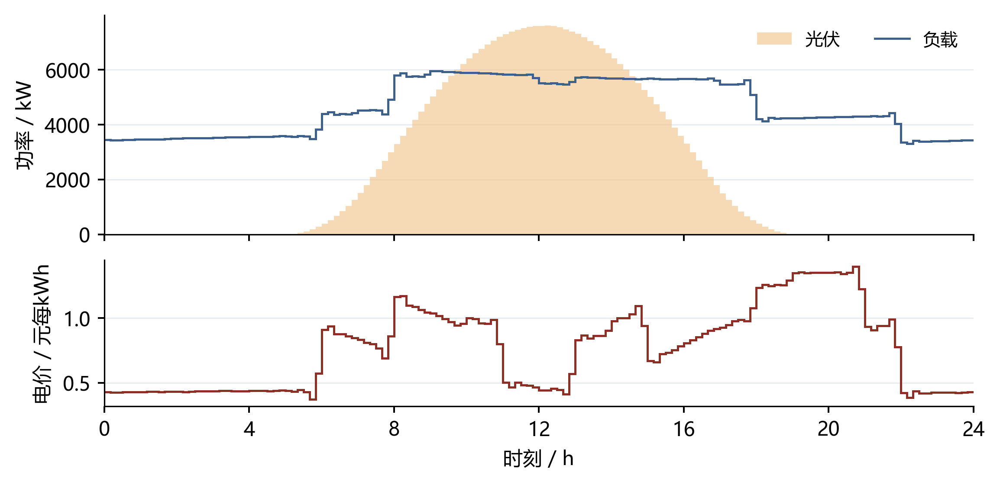

图 1 第一问供需曲线与分时电价

图中每一阶梯对应一个十分钟平均功率或电价，光伏阴影为功率曲线下区域，不作为置信带。

目标是最小化全天计划购电费：

$$
\min C_1=\sum_{t=1}^{144}p_tg_t.
$$

以母线侧收支写能量守恒，将允许的富余供电显式记为未利用电量：

$$
g_t+V_t+d_t=L_t+c_t+w_t,\qquad g_t,w_t\geq0.
$$

充电损耗发生在进入储能时，放电损耗发生在从储能输出至母线时，因而状态方程为：

$$
S_{t+1}=S_t+\eta_c c_t-\frac{d_t}{\eta_d},\qquad 1200\leq S_t\leq10800.
$$

SOC 上下界施加于全部 145 个状态点，状态递推与其他时段约束对应 t＝1，…，144。令每时段最大母线侧充放电量 M＝5000/6 kWh，用二元变量直接限制互斥：

$$
0\leq c_t\leq Mz_t,\qquad 0\leq d_t\leq M(1-z_t),\qquad z_t\in\{0,1\}.
$$

第一问满足以下初始和终端条件，避免利用电池初始存量净放电造成虚假节省：

$$
S_1=S_{145}=6000.
$$

将上述关系集中写成一般日模型，决策变量为购电、充放电、未利用电量、储电量和状态变量。给定不同供需输入与初末状态条件时，可复用以下结构：

$$
\boxed{\left\{\begin{aligned}\min_{g,c,d,w,S,z}\quad &\sum_{t=1}^{144}p_tg_t\\\mathrm{s.t.}\quad &g_t+V_t+d_t=L_t+c_t+w_t,\\&S_{t+1}=S_t+\eta_c c_t-d_t/\eta_d,\\&1200\leq S_t\leq10800,\quad g_t,w_t\geq0,\\&0\leq c_t\leq Mz_t,\quad0\leq d_t\leq M(1-z_t),\\&z_t\in\{0,1\},\quad S_1=S_{145}=6000.\end{aligned}\right.}
$$

上述模型有 865 个变量，其中 144 个为二元变量。以 SciPy 1.17.1 的 milp 接口调用 HiGHS [2]，相对间隙目标设为 10⁻⁷，每日求解时间上限为30秒，全部运行取得成功求解状态。

### 5.2 调度结果与指定时段

计算得到全天购电量 59,482.70 kWh、费用 35,126.85 元。购电与储能轨迹见图 2，指定时段购电和四小时充放电分别见表 3、表 4。

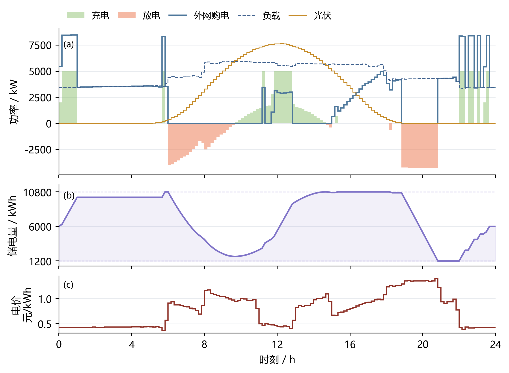

图 2 第一问电价驱动的购电与储能运行

上面板合并供需、购电与充放电功率；中面板显示储电量及上下限，下面板显示电价。共用时间轴保留十分钟决策。

对应结果见表 3。

表 3 第一问指定时段购电量及全天费用

| 时间段 | 购电量 | 时间段 | 购电量 | 时间段 | 购电量 |
| --- | --- | --- | --- | --- | --- |
| 10:00-10:10 | 0.00 | 12:00-12:10 | 486.40 | 14:00-14:10 | 0.00 |
| 16:00-16:10 | 394.93 | 18:00-18:10 | 636.98 | 20:00-20:10 | 0.00 |
| 全天购电量 | 59,482.70 | 全天购电费 | 35,126.85 | — | — |

对应结果见表 4。

表 4 第一问四小时充放电及边界储电量

| 时间段 | 充电量 | 放电量 | 时间段 | 充电量 | 放电量 |
| --- | --- | --- | --- | --- | --- |
| 00:00-04:00 | 4,500.00 | 0.00 | 04:00-08:00 | 833.33 | 5,947.42 |
| 08:00-12:00 | 3,954.63 | 2,121.42 | 12:00-16:00 | 6,119.37 | 91.10 |
| 16:00-20:00 | 0.00 | 5,068.69 | 20:00-24:00 | 5,333.33 | 3,571.31 |
| 00:00 储电量 | 6,000.00 | — | 24:00 储电量 | 6,000.00 | — |

低价时段的外网购电同时满足负载与充电，形成集中购电峰值；高价时段由储能补充供电，降低外网购电量。图2把购电、负载和充放电放在同一功率面板，并以储电状态、电价辅助解释各次动作。表内电量均为kWh，费用为元；四小时内先充后放不影响十分钟内充放电互斥。

### 5.3 最优性检验与效率解释

删除整数限制得到线性松弛下界 35,126.84858929 元，与整数解目标之差为 0.00000000 元，求解器相对间隙为零。整数解与松弛下界一致，达到该模型的全局最优费用。能量平衡最大残差约 2.27e-13 kWh，SOC 递推与容量、功率边界均通过复核。

以每时段正净负载直接购电构造无储能基线：

$$
g_t^{(0)}=\max(L_t-V_t,0),\qquad C_1^{(0)}=\sum_t p_tg_t^{(0)}.
$$

该基线费用为 48,052.05 元，主模型节省 26.90%。效率解释的对照见图 3：若总往返效率为 0.9，并对称取两侧效率为平方根 0.9，费用为 33,801.48 元。提高往返效率可进一步降低套利损耗。

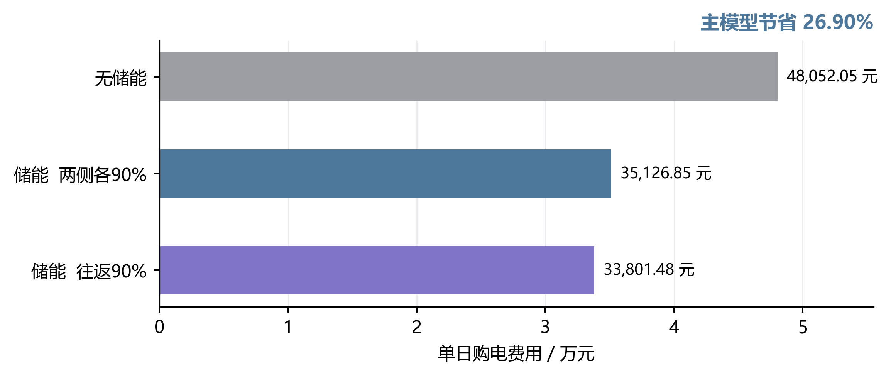

图 3 第一问储能收益与效率解释对照

三组条形从零起算，并在末端标注绝对费用。主文及 Excel 均对应“两侧效率各 90%”。

### 5.4 互斥约束的等价线性化

互斥不能由一般LP自动保证，但本题的自由弃电变量允许给出更强的结构结论。令ρ＝ηcηd≤1。对松弛解任一时段，作如下变换：

$$
x_t=\min\{c_t,d_t/\rho\},\quad c'_t=c_t-x_t,\quad d'_t=d_t-\rho x_t,\quad w'_t=w_t+(1-\rho)x_t.
$$

充电量和放电量均不增加，且至少一个变为零。由于ηc x＝ρx/ηd，储能增量完全不变；由于d′−c′−w′＝d−c−w，母线平衡也保持不变。购电、紧急购电和所有计划增减量不变，因此本文各类费用均不变。逐槽处理后得到符合互斥约束的物理解：

$$
C_{\mathrm{LP}}^{*}\le C_{\mathrm{MILP}}^{*}\le C_{\mathrm{transformed\ LP}}=C_{\mathrm{LP}}^{*}.
$$

因此，在本模型条件下，二者最优费用相等。Q1的变量可从865个减少到721个，并去掉144个二元变量；日内调整模型同理。实现使用HiGHS线性规划，求解后显式消除循环并重新核验物理约束，得到满足充放电互斥的可执行解。

该等价性建立在可自由弃电和线性购电成本上。若加入切换成本或严格弃电限制，应恢复相应约束后重新求解。

## 六 第二问的预测与日前策略

### 6.1 训练与评价的时间顺序

以 1 月 22—31 日作为验证窗，选择岭回归惩罚与风险余量。2 月 1 日起固定这些选择规则，执行至 12 月 31 日。模型每七天更新一次，最多使用最近 60 个已结束日期；评价过程中已观察到的数据可以进入后续更新，尚未发生的数据不进入当前决策。这是顺序样本外回测，而不是把全年随机拆分。

一月份共同热身从 1 月 1 日的 6000 kWh 开始；首日无历史时用附件 1 作为冷启动参考，随后不足七天用近三日均值，积累七天后用日／周同期。验证期初 SOC 为 6244.256891 kWh，评价期初为 9902.811288 kWh，各候选策略都从同一状态出发。冷启动的附件 1 仅作为明确的初始化假设，不当作全年可提前获得的预报。

### 6.2 同期基线与岭回归预测

对负载或光伏电量序列 y，同期基线取昨日与上周同日相同时间槽的均值：

$$
\hat y_{d,t}^{\mathrm{seasonal}}=\frac{y_{d-1,t}+y_{d-7,t}}{2}.
$$

岭回归采用 21 个特征：昨日、前日、上周同日的同槽值，三日和七日同槽均值、七日同槽标准差、昨日全天均值和近三日全天均值共八项；前三阶日内正余弦六项；星期指示七项。日期及时间属于决策时已知的日历信息。标准化均值与尺度仅在当次训练集上估计，常量特征尺度置 1。

$$
\min_{\beta,b}\sum_{i\in\mathcal T_d}(y_i-b-\widetilde{x}_i^{\mathsf T}\beta)^2+\lambda\|\beta\|_2^2.
$$

截距不惩罚，负载和光伏分别拟合。按验证 MAE 比较 λ＝1、10、100，均选 1；实现采用 NumPy 线性方程求解，与带截距岭目标一致 [3]。从 1 月 15 日开始具备拟合条件，之后每七日重新拟合。预测截断为非负；某槽过去七日光伏全零时，该槽预测置零，日出日落季节变化可能使此规则产生滞后。

评价指标采用功率单位的 MAE 与 RMSE；不使用夜间分母为零的普通 MAPE：

$$
\mathrm{MAE}=\frac{1}{n}\sum_i|P_i-\widehat P_i|,\qquad\mathrm{RMSE}=\sqrt{\frac{1}{n}\sum_i(P_i-\widehat P_i)^2}.
$$

### 6.3 净负载误差余量与名义优化

定义历史净负载误差及只包含过去信息的误差样本池：

$$
\varepsilon_{j,s}=(L_{j,s}-V_{j,s})-(\hat L_{j,s}-\hat V_{j,s}).
$$

$$
\mathcal E_{d,t}=\{\varepsilon_{j,s}:\max(2,d-28)\leq j<d,\ 1\leq s\leq144,\ |s-t|\leq3\}.
$$

日期下标以 1 月 1 日为 d＝1；排除首日冷启动误差，最多池化 28 个已结束日期和目标槽前后三槽。跨日边界不绕回，不足 28 天时仅取已有历史。余量规则为：

$$
r_{d,t}(q)=\max\{0,Q_q(\mathcal E_{d,t})\}.
$$

无余量候选直接设 r＝0，与“取零分位数”区分。对 q＝0.7、0.8、0.9，分位数使用样本排序后的线性插值。将预测负载加余量作为名义需求，求解第五节同一物理模型：

$$
L_t^{\mathrm{nom}}=\hat L_{d,t}+r_{d,t}(q),\qquad V_t^{\mathrm{nom}}=\hat V_{d,t},\qquad S_{d,145}^{\mathrm{nom}}\geq6000.
$$

70% 分位数不是“全天 70% 概率不缺电”的保证。名义优化只最小化计划费，五倍紧急购电的影响通过验证期对余量方案的筛选间接体现，不能据此称为已精确求解随机规划。

### 6.4 实时执行与跨日状态

当天普通购电计划固定后，定义当前供需剩余。对非负剩余尽量充电，对缺口尽量放电，并分别受可用空间、储电量和功率限制：

$$
u_t=g_t+V_t-L_t.
$$

$$
c_t=\min\left\{\max(u_t,0),M,\frac{10800-S_t}{\eta_c}\right\}.
$$

$$
d_t=\min\left\{\max(-u_t,0),M,\eta_d(S_t-1200)\right\}.
$$

$$
e_t=\max(-u_t-d_t,0),\qquad w_t=\max(u_t-c_t,0).
$$

以上规则使同一时段仅有充电或放电，SOC 仍按状态方程更新，实际日末传给次日：

$$
S_{d+1,1}=S_{d,145}.
$$

所有供电缺口由紧急购电补足。全年评价费用定义为：

$$
C_2=\sum_{d,t}p_tg_{d,t}+5\sum_{d,t}p_te_{d,t}.
$$

将第二问策略概括如下。记 Ω 为第一问中除初末等式之外的物理可行域，输入替换为带余量预测，日初状态取真实已知值；G 表示本节的贪心实时平衡规则：

$$
\boxed{\left\{\begin{aligned}(g^{\mathrm{plan}},\ldots)&\in\arg\min_{(g,c,d,w,S,z)\in\Omega}\sum_t p_tg_t,\\L^{\mathrm{nom}}&=\hat L+r(q),\quad V^{\mathrm{nom}}=\hat V,\\S_1^{\mathrm{nom}}&=S_1^{\mathrm{actual}},\quad S_{145}^{\mathrm{nom}}\geq6000,\\(c_t,d_t,e_t,w_t)&=\mathcal G(g_t^{\mathrm{plan}},L_t,V_t,S_t),\\C_2&=\sum_{d,t}p_t(g_{d,t}^{\mathrm{plan}}+5e_{d,t}).\end{aligned}\right.}
$$

其中 Ω 中每一时段的平衡使用上式名义输入；最后一行是实际策略评价费用，不是声称日前已知实际 e 的优化目标。余量 q 仅由一月验证费用选择，之后冻结。

实际储能动作可以偏离名义动作，但普通计划购电不能按真实曲线事后改写。这一贪心控制具有可行性与因果性，不保证跨时段的实时经济最优。

## 七 第二问的结果与检验

### 7.1 验证期选择与紧急购电权衡

验证结果见表 5 与图 4。各方案使用相同验证初始 SOC，但期末存量不同，因此除费用外同时列出期末储电量，不把存量差异隐藏在成本比较中。

表 5 一月份十天验证结果

| 预测器 | 余量 | 总费/元 | 紧急费/元 | 期末SOC/kWh |
| --- | --- | --- | --- | --- |
| 同期 | 无 | 661,834.09 | 173,098.38 | 9,902.81 |
| 同期 | 70% | 634,179.58 | 110,989.47 | 10,595.98 |
| 同期 | 80% | 666,226.97 | 64,910.51 | 10,800.00 |
| 同期 | 90% | 680,257.72 | 456.98 | 10,800.00 |
| 岭回归 | 无 | 532,888.41 | 61,836.07 | 5,924.08 |
| 岭回归 | 70% | 509,757.47 | 8,765.44 | 6,623.17 |
| 岭回归 | 80% | 529,846.45 | 4.16 | 7,110.16 |
| 岭回归 | 90% | 633,664.05 | 0.00 | 9,039.38 |

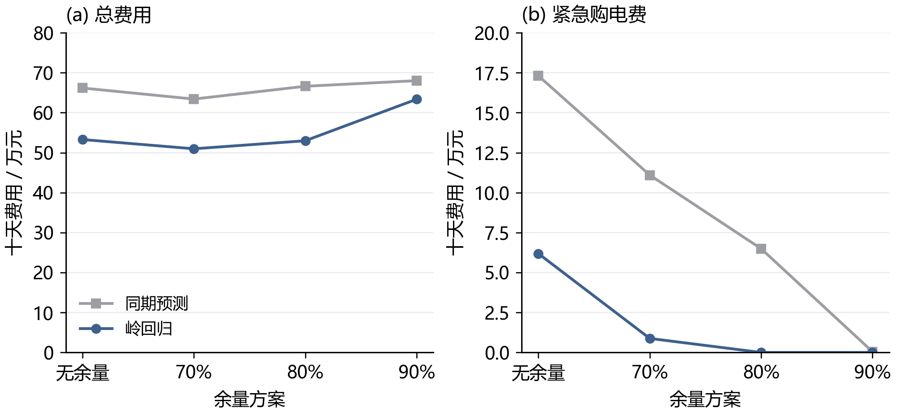

图 4 验证期风险余量与费用的权衡

横轴为四种候选方案，其中“无余量”是独立基线。折线只辅助比较候选值，不表示连续参数的精确响应。

岭回归 70% 余量的验证费为 509,757.47 元，其中紧急费 8,765.44 元；90% 余量紧急费为零，但总费升至 633,664.05 元。两者期末储电量相差约 2416 kWh，故不能完全忽略存量影响；当前目标仍按题面购电费用评价，不另添加缺乏依据的残值收入。

### 7.2 全期预测误差与季节变化

按表 6 比较 334 天共 48,096 个十分钟区间的功率预测误差，岭回归在负载预测上的改善大于光伏。四个指定日期的曲线对照见图 5，整年误差仍以全期统计为准。

表 6 第二问全期预测误差

| 预测器 | 负载MAE | 负载RMSE | 光伏MAE | 光伏RMSE |
| --- | --- | --- | --- | --- |
| 同期 | 372.26 | 585.91 | 171.98 | 343.38 |
| 岭回归 | 179.86 | 234.59 | 155.28 | 306.74 |

上述误差单位均为 kW，光伏指标包含夜间零值，不能直接等同于白天发电时段的预测精度。

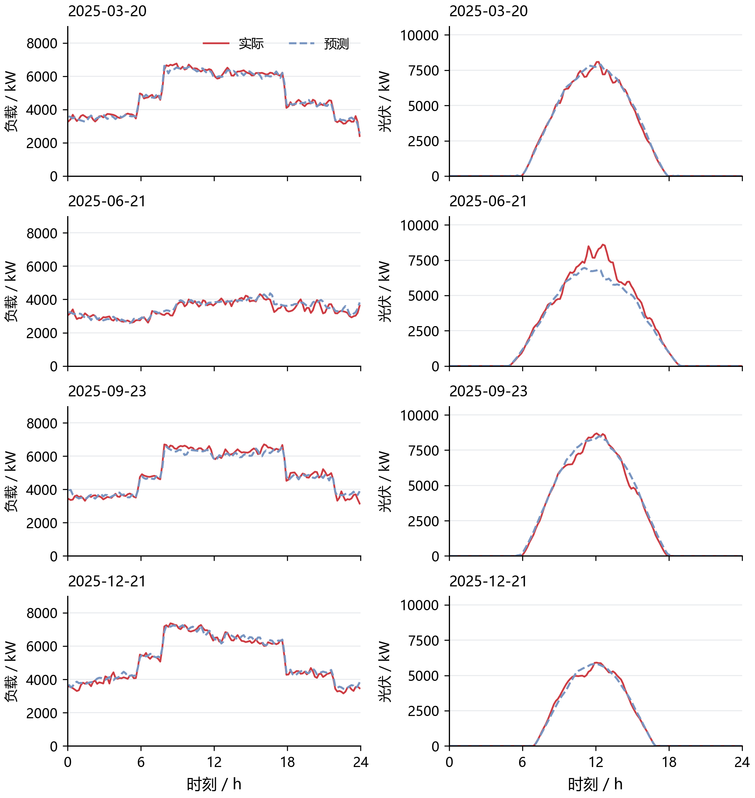

图 5 四个指定日期的负载与光伏日前预测

各列共用纵轴尺度，日期由题目指定。实线为实际观测，虚线为岭回归预测，展示十分钟分辨率下的预测偏差。

### 7.3 全期购电费用与运行约束

策略费用分解如图 6，数值及期末存量见表 7。相同初始状态保证比较具有共同起点，实际状态在全年内自行连续演化。

表 7 第二问全期费用及期末储电量

| 策略 | 计划费/万元 | 紧急费/万元 | 总费/万元 | 期末SOC/kWh |
| --- | --- | --- | --- | --- |
| 同期 无余量 | 1,199.19 | 723.59 | 1,922.78 | 5,825.99 |
| 岭回归 无余量 | 1,215.92 | 354.62 | 1,570.54 | 5,903.65 |
| 同期 70%余量 | 1,297.86 | 452.54 | 1,750.40 | 6,217.35 |
| 岭回归 70%余量 | 1,293.50 | 119.76 | 1,413.26 | 5,903.65 |

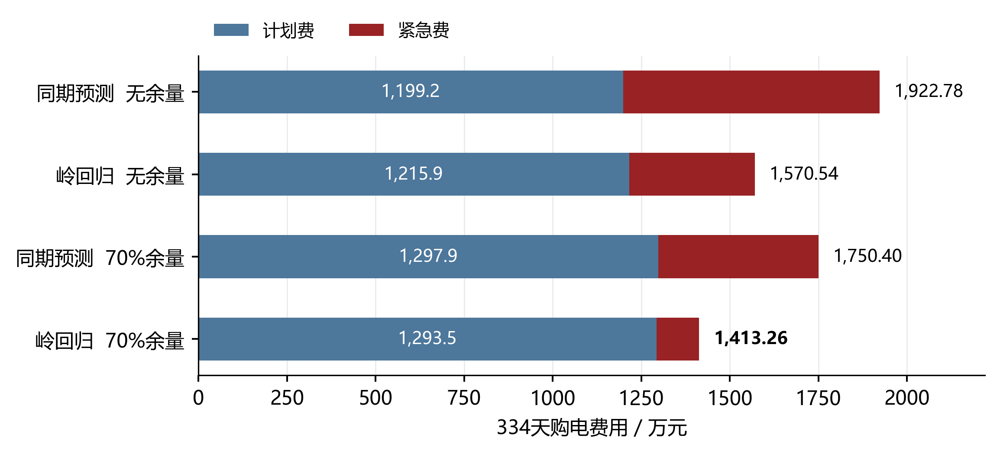

图 6 第二问四组策略的全期费用分解

蓝色为普通计划购电费，深红为紧急购电费；条形右端标注总费用。主策略由一月份验证选择。

主策略总费用 14,132,612.16 元，较同期无余量低 26.50%，较岭回归无余量低 10.01%。后两组期末 SOC 均为 5,903.65 kWh，因此此处的余量增益没有被不同期末存量混淆。

主策略紧急购电累计 197,465.10 kWh，涉及 1132 个十分钟区间，不等同于同样数量的独立事件。未利用电量为 2,211,229.49 kWh，其中可包含未消纳光伏和富余计划购电，不能全部称为弃光。

四个指定日期的购电、充放电和紧急购电结果见附录A。

## 八 第三问 日内预报的滚动价值

### 8.1 预报信息与决策时域

附件3含365天、每日4个版本、每版24个整点光伏预报，共35,040个值。按四行组还原1,095个结构性空日期后，未发现缺失、非有限数或负值。预报发布时间分别为0、6、12、18点；时刻τ的新预报只服务于τ之后的调度。小时预报端点之间采用分段线性函数，并在十分钟区间上积分为预测电量；发布点以最近完成区间的光伏观测衔接。

这一处理保留了预报更新带来的信息差异。每次求解均以当时真实储电量为起点，固定已经执行的购电与充放电量，重新配置其余区间。该时域推进方式与储能模型预测控制的基本框架一致[4]。

图7展示指定日期的实际光伏及各版预报；曲线从各自发布时间开始。较晚预报能够改变午后供需判断，为调整计划提供新依据。

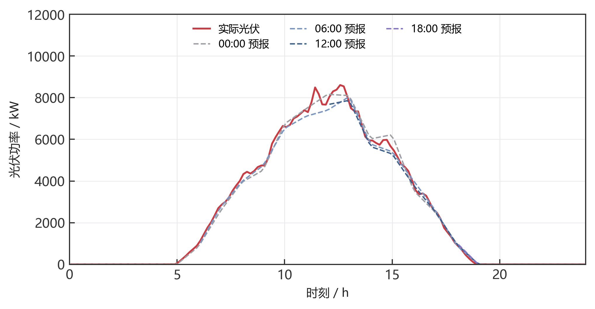

图 7 四个发布版本的光伏预报

### 8.2 保留量 取消量与新增量的结算

记午夜计划为x_t，时段执行前最后一次有效调整量为y_t，紧急购电为e_t。取消量u_t与新增量v_t分别定义为：

$$
u_t=(x_t-y_t)^+,\qquad v_t=(y_t-x_t)^+,\qquad y_t=x_t+v_t-u_t.
$$

保留购电按原价结算，取消部分按半价支付违约费，新增部分按1.5倍价格购买。因此每个区间的完整费用为：

$$
F_t=p_t\min(x_t,y_t)+0.5p_tu_t+1.5p_tv_t+5p_te_t=p_tx_t-0.5p_tu_t+1.5p_tv_t+5p_te_t.
$$

原计划100 kWh、调整为80 kWh、电价1元/kWh时，总费用为80＋0.5×20＝90元；调整为120 kWh时，费用为100＋1.5×20＝130元。前式按保留量计普通费用，后式按原计划记账，两种表达完全等价。多次预报更新均相对同一午夜计划确定偏差；中途计划用于运行与追溯，不重复累计尚未交付区间的修改费用。

### 8.3 滚动优化模型与风险校准

记Tτ为当前尚未执行的区间集合，Ω为第一问去除首末状态等式后的物理可行域。以更新后的光伏预测、负载预测和对应误差余量作为供需输入，求解：

$$
\boxed{\left\{\begin{aligned}\min_{y,c,d,w,S,u,v}\quad&\sum_{t\in T_\tau}\hat p_{\tau,t}(1.5v_t-0.5u_t)\\\mathrm{s.t.}\quad&y_t=x_t+v_t-u_t,\quad0\le u_t\le x_t,\quad v_t\ge0,\\&y_t+\hat V_{\tau,t}+d_t=\hat L_{\tau,t}+r_{\tau,t}+c_t+w_t,\\&(y,c,d,w,S)\in\Omega,\quad S_\tau=S_\tau^{\mathrm{actual}},\quad S_{145}\ge6000.\end{aligned}\right.}
$$

目标函数省略了与当前决策无关的午夜合同常数项。第一至三问的p由附件1给定；第四问替换为当时可获得的价格预测。名义规划满足供电需求，实际执行按第二问的实时平衡规则应对残余预测误差。

风险余量使用此前28个完整日期、相同发布版本和目标前后三个区间的净负载误差。比较0、50%、70%三个分位数与8种更新时间组合，共24组。一月22—31日选择50%分位数及6、12、18点更新，随后运行2—12月。负载预测器和日末名义目标保持一致，使比较集中反映预报更新与调整制度的作用。

图8展示一月验证费用和全年累计收益。左图用于确定参数，右图分别比较固定电价下午夜与滚动策略、波动电价下日前与滚动主策略。

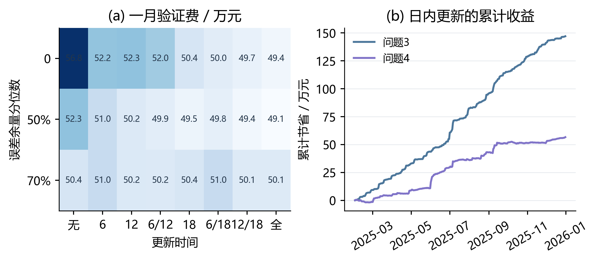

图 8 风险余量选择与滚动收益积累

### 8.4 更新时间的收益与费用构成

图9展示同一50%余量下的全部更新时间组合。深蓝标出验证期选定的主方案，红色为紧急购电费用。

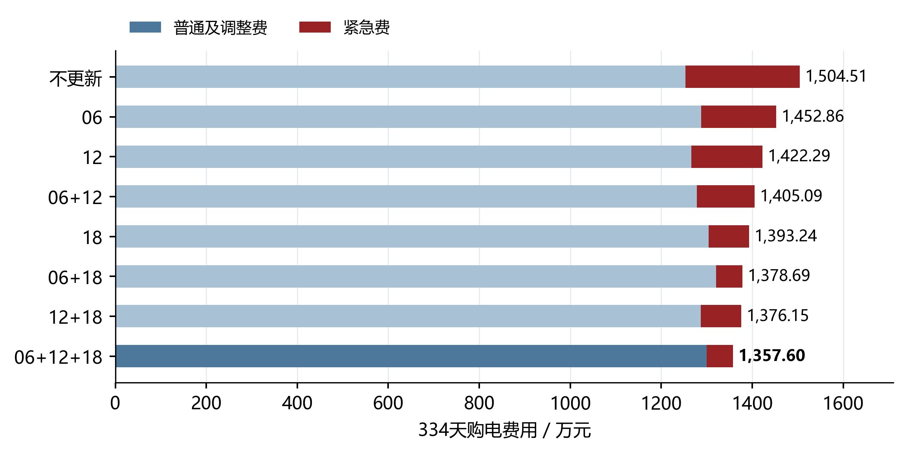

图 9 八种更新时间组合的费用对比

对应结果见表 8。

表 8 第三问主策略与仅午夜预报的费用分解

| 费用或运行量 | 仅午夜预报 | 日内滚动 |
| --- | --- | --- |
| 原计划费/元 | 12,530,137.77 | 12,521,239.63 |
| 新增购电费/元 | 0.00 | 678,211.30 |
| 取消量净费用/元 | 0.00 | -203,600.86 |
| 紧急购电费/元 | 2,514,989.16 | 580,126.71 |
| 总费用/元 | 15,045,126.93 | 13,575,976.78 |
| 紧急电量/kWh | 407,324.31 | 101,019.32 |
| 期末储电量/kWh | 5,903.65 | 5,903.65 |

全年总费用由15,045,126.93元降至13,575,976.78元，减少1,469,150.15元，降幅9.76%。实际紧急电量降至101,019.32 kWh。三次更新把部分五倍电价的紧急补购提前转化为常规调整，节省额超过调整成本，因而有必要引入零点之外的预报。两方案初末储电状态相同，净节费不依赖消耗更多期末库存。

## 九 第四问 GRU预测与价格信息的优化空间

### 9.1 波动电价与共同预测信息

附件4给出365天、每天144个电价，共52,560点，范围为0.0076—1.7936元/kWh。所有价格保留原值，不对峰谷截尾。各预测器使用发布前的价格历史以及已知日历信息，输出未来144个十分钟目标；当日调度只读取其中尚未执行的区间。

图10展示日均价格与每日最小—最大范围。稳定的日内结构与随机幅度共同影响购电的时机和规模。

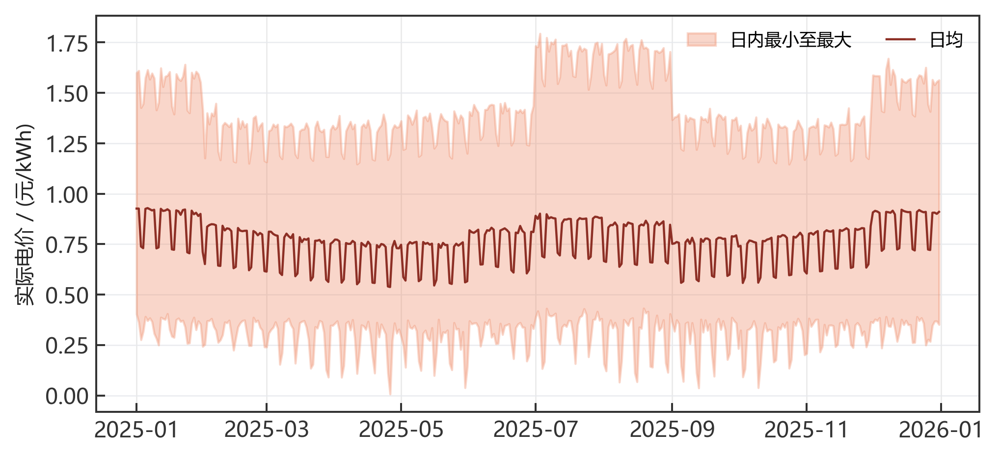

图 10 全年实际电价的日内范围

同期预测取昨日与上周同目标区间价格的平均值。岭回归在这两组历史价格、日历周期特征及滞后统计量上构造12维输入。残差GRU使用6维输入：昨日价、上周价、日内正余弦和星期正余弦。三类预测器共享历史可见范围，区别在于对非线性依赖的表示能力。

$$
\hat p^{\mathrm{seasonal}}_{\tau,j}=\frac{p_{\tau+j-144}+p_{\tau+j-1008}}2,\qquad j=0,\ldots,143.
$$

### 9.2 残差GRU的结构与训练

GRU以门控结构选择保留的历史信息[6]。本文采用单层32维隐藏状态，在同期基线之上预测残差，输出头从零初始化，使初始预测与同期方法一致。输入维度较小、序列固定为144步，有利于在有限历史数据上控制训练规模。网络按PyTorch的GRU形式实现[5]：

$$
r_j=\sigma(W_{ir}x_j+b_{ir}+W_{hr}h_{j-1}+b_{hr}),\quad z_j=\sigma(W_{iz}x_j+b_{iz}+W_{hz}h_{j-1}+b_{hz}).
$$

$$
n_j=\tanh(W_{in}x_j+b_{in}+r_j\odot(W_{hn}h_{j-1}+b_{hn})),\quad h_j=(1-z_j)\odot n_j+z_j\odot h_{j-1}.
$$

$$
\hat p_{\tau,j}=\max\{0.001,\hat p^{\mathrm{seasonal}}_{\tau,j}+s_y(w^\mathsf{T}h_j+b)\}.
$$

前两个价格特征的均值和标准差仅从训练集估计，sy为训练价格标准差。网络采用SmoothL1损失与Adam优化器，学习率0.003，批量32，梯度范数截断为1；最多训练50轮，内部验证连续6轮无改进即早停。输入窗口每6小时取样，只有全部预测目标已发生的窗口进入训练。

1月15日、22日和之后每月首日重新训练，每次最多使用此前60天数据；内部验证为最近3个完整日期，跨越训练—验证边界的目标窗口不进入训练。三个随机种子17、42、2026分别训练，最终等权平均，共39次拟合，CPU实测训练约126.56秒。图中的训练曲线展示一次月初拟合的内部验证过程。

图11展示同一月初拟合中三个网络随训练轮数变化的内部验证MAE；早停分别保留各自最优权重。

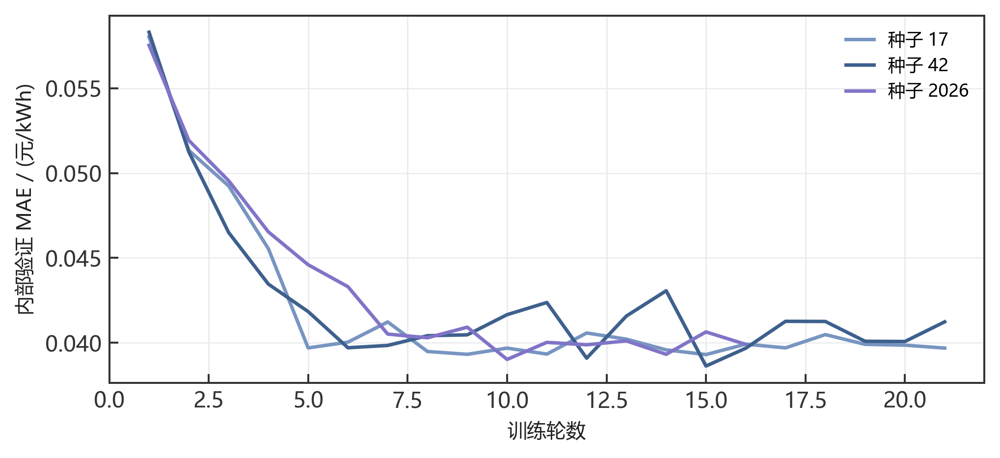

图 11 三个随机种子的GRU验证误差

### 9.3 四个发布时刻的预测优势

图12展示各发布时刻相同目标范围上的MAE。GRU在四组比较中均取得最低误差。

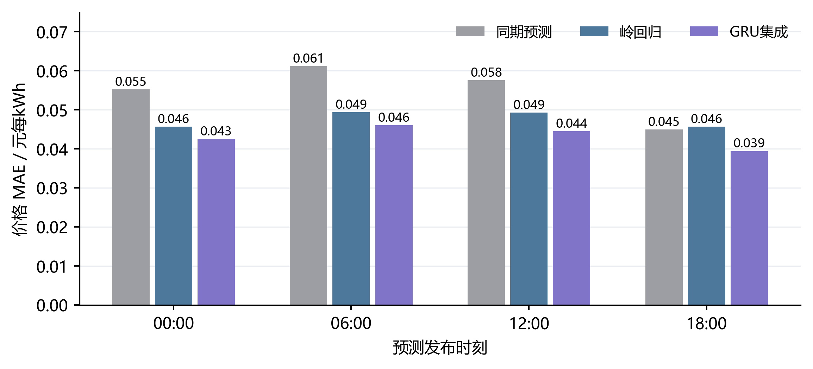

图 12 GRU与非神经网络预测的误差对比

对应结果见表 9。

表 9 各发布时刻价格MAE及GRU相对岭回归的改进

| 发布时刻 | 同期 | 岭回归 | GRU集成 | 改进比例 |
| --- | --- | --- | --- | --- |
| 00:00 | 0.05527 | 0.04567 | 0.04253 | 6.88% |
| 06:00 | 0.06117 | 0.04938 | 0.04603 | 6.78% |
| 12:00 | 0.05761 | 0.04928 | 0.04448 | 9.74% |
| 18:00 | 0.04499 | 0.04566 | 0.03941 | 13.68% |

按全部发布—目标配对加权，GRU集成MAE为0.04366元/kWh，较同期预测降低22.70%，较岭回归降低8.09%。共120,240个配对，其中同一目标可由不同发布时刻预测；分时评价保证各模型比较的是相同信息时点。

图13展示实际价与岭回归、GRU预测的逐时对照。GRU主要修正同期结构之外的变化，部分突变仍由实时运行承担。

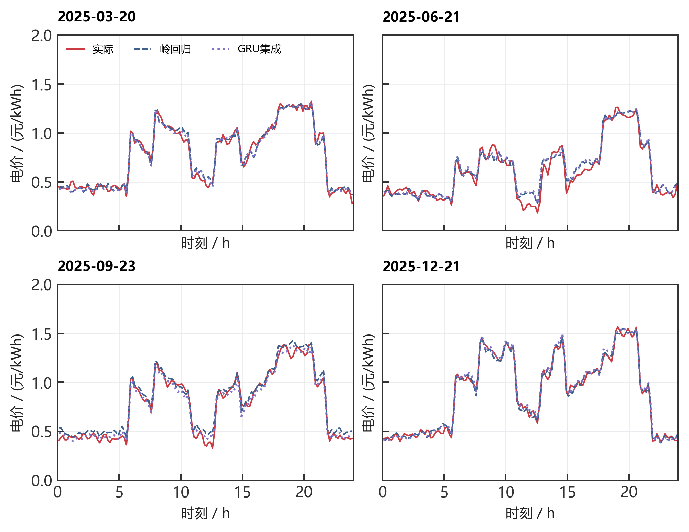

图 13 四个指定日期的午夜价格预测

### 9.4 预测优势如何转化为费用收益

对应结果见表 10。

表 10 波动电价下两类策略的全年费用

| 价格预测器 | 日前总费/元 | 滚动总费/元 |
| --- | --- | --- |
| 同期预测 | 14,867,653.20 | 14,314,442.48 |
| 岭回归 | 14,880,535.05 | 14,320,233.59 |
| GRU集成 | 14,877,217.55 | 14,312,347.70 |
| 真实电价对照 | 14,818,406.37 | 14,212,407.27 |

一月实际费用选择的日前主策略为岭回归，滚动主策略为同期预测，全年分别为14,880,535.05元和14,314,442.48元，滚动方案降低566,092.57元（3.80%）。保持同一滚动策略，GRU将总费进一步降至14,312,347.70元，比同期预测节省2,094.78元，比岭回归节省7,885.90元。前者是策略层面的改进，后者是价格预测模块的增益。

图14展示相对同期价格预测的节省额。零点右侧表示节省、左侧表示增加费用；真实电价对照只用于事后评价。

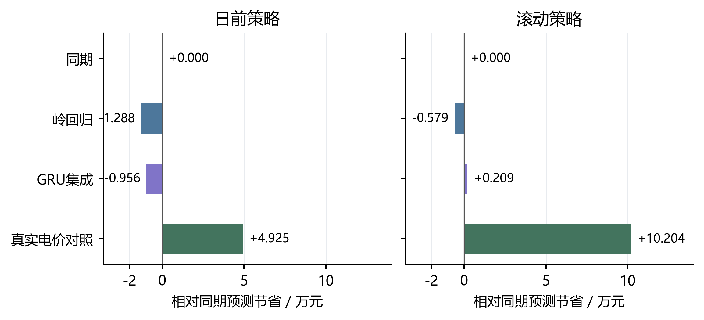

图 14 价格预测器对实际购电费用的影响

价格MAE改善没有按相同比例转化为电费下降。储能功率、容量和高低价次序限制了可改变的动作，部分预测改进发生在计划不变的区间。GRU在本组滚动比较中费用最低；其相对同期的配对日节省在7、14、28天区块重采样下均有跨零区间，因此该小幅费用优势体现为本年度实测收益，而主要、稳定的证据是四个发布时刻一致的精度改善。结果文件采用一月选定的主策略，GRU完整轨迹另随支撑材料保存。

### 9.5 名义最优下界与剩余改进上限

为直接回答价格预测还有多大优化空间，对每个日期固定相同的负载与光伏预测、风险余量、日初状态和日末目标，得到共同可行域Fd。各预测器只改变目标函数中的价格；事后将真实电价代入同一可行域求解线性规划[7]：

$$
J_d^*=\min_{g\in\mathcal F_d}p_d^\mathsf{T}g,\qquad J_{m,d}=p_d^\mathsf{T}g_{m,d},\qquad g_{m,d}\in\mathcal F_d.
$$

由于真实电价解在相同可行域内最优，任一预测器的可行计划都满足Jm,d≥Jd*。因此模型m仅通过改善价格预测能够获得的名义费用节省Δm受到下式约束：

$$
0\le\Delta_m\le R_m=\sum_d(J_{m,d}-J_d^*),\qquad \gamma_m=\frac{R_m}{\sum_dJ_{m,d}}\times100\%.
$$

对应结果见表 11。

表 11 相同名义可行域中的真实价格下界

| 预测器 | 名义费用/元 | 真实价格下界/元 | 剩余差额/元 |
| --- | --- | --- | --- |
| 同期 | 13,650,909.99 | 13,519,514.66 | 131,395.33 |
| 岭回归 | 13,663,504.91 | 13,519,514.66 | 143,990.25 |
| GRU集成 | 13,656,357.29 | 13,519,514.66 | 136,842.64 |

图15展示334个共同可行域上计算的最优值差距。该差额为相同名义调度问题内的改进上限，数值越小表示越接近真实价格最优计划。

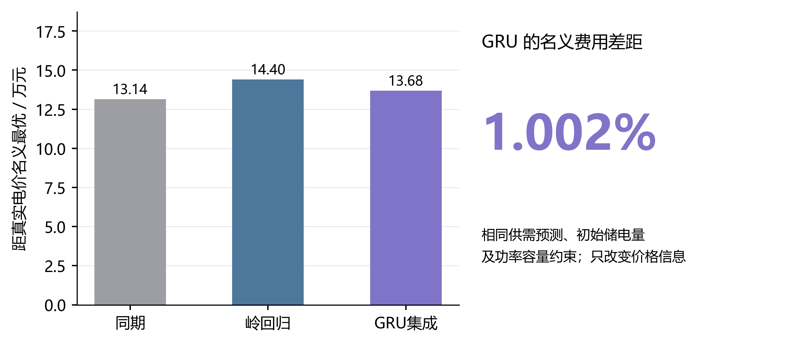

图 15 价格预测的名义费用改进空间

GRU的名义计划费用为13,656,357.29元，真实电价最优下界为13,519,514.66元，两者相差136,842.64元，即1.002%。这说明在既定供需预测和储能条件下，继续改进电价预测最多只能削减约1%的名义计划费用。同期与岭回归也处于相近量级，表明费用接近最优主要来自稳定的调度结构，而GRU的附加价值在于降低预测误差并改善部分滚动决策。

实际执行的真实电价对照另得：滚动费用为14,212,407.27元，相比同期预测改善0.713%。该对照包含真实供需偏差与紧急购电，属于固定执行规则下的事后实验；上述约1%的数学上限则限定于共同名义可行域。两者共同指向：提高供需预报和调整策略的收益空间，比单独精细化电价预测更值得优先投入。

## 十 模型检验与评价

### 10.1 数值验证与结论稳健性

从原始附件到实际轨迹逐项检查日期、时段、单位和非有限值。第一问的LP与MILP费用一致；其余16组全年轨迹均满足供需平衡、储能递推、充放电互斥、功率容量边界和跨日连续性。费用复算独立采用“保留量＋取消量＋新增量＋紧急量”公式，并从午夜计划逐次恢复最后有效计划，验证运行结果与费用结算一致。

时间因果性通过训练标签截止检查及未来输入扰动测试检验：改变未来实际数据，不应改变此前的预测与风险余量。原始观测未删点、截尾或平滑；价格预测输出的正值截断属于预测器约束。对GRU成本增益采用配对日区块重采样，保留日间相关性，其区间跨零；对所有方法，则通过共同名义可行域和最优下界验证价格优化空间。

### 10.2 模型的优点 局限与推广

模型的主要优点有三项。其一，利用循环消除证明将混合整数模型等价化为线性规划，保留物理可行性并降低求解复杂度。其二，把预测误差分位数与滚动结算共同纳入调度，直接压缩高价补购而非只追求误差指标。其三，在价格预测之外给出费用最优下界，使神经网络的效果能够从精度、实际收益和剩余空间三个方面解释。

模型采用区间平均功率近似，实时层按即时平衡规则执行；电池退化与功率爬坡未纳入费用。年度数据及一月验证窗口限制了跨年推广，后续可增加气象变量、滚动交叉验证和电池循环成本，并将日末固定目标替换为跨日储能价值函数。加入线路与多节点约束后，同一费用结构可扩展至多个微网的协同购电。

## 十一 结论

四问结果汇总如下，各情景分别对应不同信息和计费条件。

对应结果见表 12。

表 12 四问模型与主策略结果

| 问题 | 模型及策略 | 总费用/元 | 评价区间 |
| --- | --- | --- | --- |
| 一 | 等价LP与周期储能 | 35,126.85 | 单日 |
| 二 | 岭回归＋70%余量 | 14,132,612.16 | 334天 |
| 三 | 滚动LP＋50%余量 | 13,575,976.78 | 334天 |
| 四 日前 | 岭回归电价 | 14,880,535.05 | 334天 |
| 四 滚动 | 同期电价与滚动LP | 14,314,442.48 | 334天 |
| 四 GRU对照 | 残差GRU与滚动LP | 14,312,347.70 | 334天 |

储能使第一问节费26.90%；第二问的风险余量在相同预测器下再降费10.01%；第三问引入三次预报更新，较仅午夜预报降低9.76%。第四问中，GRU在四个发布时刻均提升预测精度，滚动费用为1,431.23万元；其名义计划费用距真实电价最优下界仅1.002%。由此可见，风险校准与日内信息更新决定主要经济收益，价格算法的作用是进一步细化已接近最优的购电决策。

## 参考文献

[1] 全国大学生数学建模竞赛组委会. 2026年高教社杯全国大学生数学建模竞赛C题 微网与外部电网电力调控策略及附件.

[2] SciPy Developers. scipy.optimize.linprog and scipy.optimize.milp. https://docs.scipy.org/doc/scipy/reference/optimize.html. 访问日期2026-09-11.

[3] scikit-learn Developers. Ridge. https://scikit-learn.org/stable/modules/generated/sklearn.linear_model.Ridge.html. 访问日期2026-09-11.

[4] Morstyn T, Hredzak B, Aguilera R P, Agelidis V G. Model Predictive Control for Distributed Microgrid Battery Energy Storage Systems. IEEE Transactions on Control Systems Technology, 2018, 26(3):1107–1114. DOI:10.1109/TCST.2017.2699159.

[5] PyTorch Contributors. GRU. https://docs.pytorch.org/docs/2.14/generated/torch.nn.GRU.html. 访问日期2026-09-11.

[6] Cho K, van Merrienboer B, Gulcehre C, et al. Learning Phrase Representations using RNN Encoder-Decoder for Statistical Machine Translation. EMNLP, 2014. arXiv:1406.1078.

[7] Boyd S, Vandenberghe L. Convex Optimization. Cambridge University Press, 2004. https://web.stanford.edu/~boyd/cvxbook/.

## 附录 A 四问指定日期完整结果

电量单位为kWh，费用单位为元。普通购电与紧急购电分列。滚动问题的指定时段和全天购电量指最终有效普通计划；午夜计划及每次更新完整保存在Excel中。所有表由实际轨迹自动生成。

### A.1 问题1

对应结果见表 13。

表 13 问题1（单日） 指定时段购电及全天费用

| 时间段 | 购电量 | 时间段 | 购电量 | 时间段 | 购电量 |
| --- | --- | --- | --- | --- | --- |
| 10:00-10:10 | 0.00 | 12:00-12:10 | 486.40 | 14:00-14:10 | 0.00 |
| 16:00-16:10 | 394.93 | 18:00-18:10 | 636.98 | 20:00-20:10 | 0.00 |
| 全天购电量 | 59,482.70 | 全天购电费 | 35,126.85 | — | — |

对应结果见表 14。

表 14 问题1（单日） 储能运行

| 时间段 | 充电量 | 放电量 | 时间段 | 充电量 | 放电量 |
| --- | --- | --- | --- | --- | --- |
| 00:00-04:00 | 4,500.00 | 0.00 | 04:00-08:00 | 833.33 | 5,947.42 |
| 08:00-12:00 | 3,954.63 | 2,121.42 | 12:00-16:00 | 6,119.37 | 91.10 |
| 16:00-20:00 | 0.00 | 5,068.69 | 20:00-24:00 | 5,333.33 | 3,571.31 |
| 00:00储电 | 6,000.00 | — | 24:00储电 | 6,000.00 | — |

### A.2 问题2

对应结果见表 15。

表 15 问题2（2025-03-20） 指定时段购电及全天费用

| 时间段 | 购电量 | 时间段 | 购电量 | 时间段 | 购电量 |
| --- | --- | --- | --- | --- | --- |
| 10:00-10:10 | 0.00 | 12:00-12:10 | 574.14 | 14:00-14:10 | 0.00 |
| 16:00-16:10 | 488.93 | 18:00-18:10 | 720.76 | 20:00-20:10 | 0.00 |
| 全天购电量 | 68,036.47 | 全天购电费 | 41,276.85 | — | — |

对应结果见表 16。

表 16 问题2（2025-03-20） 储能运行

| 时间段 | 充电量 | 放电量 | 时间段 | 充电量 | 放电量 |
| --- | --- | --- | --- | --- | --- |
| 00:00-04:00 | 4,071.86 | 209.79 | 04:00-08:00 | 1,038.99 | 5,515.86 |
| 08:00-12:00 | 6,186.28 | 2,777.38 | 12:00-16:00 | 4,162.63 | 444.57 |
| 16:00-20:00 | 266.98 | 5,659.90 | 20:00-24:00 | 5,687.88 | 2,954.47 |
| 00:00储电 | 6,617.05 | — | 24:00储电 | 6,376.92 | — |

对应结果见表 17。

表 17 问题2（2025-03-20） 紧急购电

| 时段 | 电量 |
| --- | --- |
| 无 | 0.00 |

对应结果见表 18。

表 18 问题2（2025-06-21） 指定时段购电及全天费用

| 时间段 | 购电量 | 时间段 | 购电量 | 时间段 | 购电量 |
| --- | --- | --- | --- | --- | --- |
| 10:00-10:10 | 0.00 | 12:00-12:10 | 0.00 | 14:00-14:10 | 0.00 |
| 16:00-16:10 | 210.92 | 18:00-18:10 | 0.00 | 20:00-20:10 | 0.00 |
| 全天购电量 | 36,315.40 | 全天购电费 | 21,120.39 | — | — |

对应结果见表 19。

表 19 问题2（2025-06-21） 储能运行

| 时间段 | 充电量 | 放电量 | 时间段 | 充电量 | 放电量 |
| --- | --- | --- | --- | --- | --- |
| 00:00-04:00 | 526.76 | 524.94 | 04:00-08:00 | 413.77 | 4,402.74 |
| 08:00-12:00 | 9,426.35 | 0.00 | 12:00-16:00 | 0.00 | 0.00 |
| 16:00-20:00 | 151.96 | 5,493.83 | 20:00-24:00 | 6,132.83 | 2,497.81 |
| 00:00储电 | 6,945.01 | — | 24:00储电 | 7,576.71 | — |

对应结果见表 20。

表 20 问题2（2025-06-21） 紧急购电

| 时段 | 电量 |
| --- | --- |
| 无 | 0.00 |

对应结果见表 21。

表 21 问题2（2025-09-23） 指定时段购电及全天费用

| 时间段 | 购电量 | 时间段 | 购电量 | 时间段 | 购电量 |
| --- | --- | --- | --- | --- | --- |
| 10:00-10:10 | 0.00 | 12:00-12:10 | 491.40 | 14:00-14:10 | 0.00 |
| 16:00-16:10 | 549.29 | 18:00-18:10 | 788.73 | 20:00-20:10 | 0.00 |
| 全天购电量 | 71,561.09 | 全天购电费 | 44,415.98 | — | — |

对应结果见表 22。

表 22 问题2（2025-09-23） 储能运行

| 时间段 | 充电量 | 放电量 | 时间段 | 充电量 | 放电量 |
| --- | --- | --- | --- | --- | --- |
| 00:00-04:00 | 5,252.67 | 0.00 | 04:00-08:00 | 218.14 | 5,830.96 |
| 08:00-12:00 | 5,558.85 | 1,896.62 | 12:00-16:00 | 4,033.40 | 575.17 |
| 16:00-20:00 | 231.66 | 5,642.21 | 20:00-24:00 | 6,050.86 | 2,841.96 |
| 00:00储电 | 6,072.60 | — | 24:00储电 | 6,631.50 | — |

对应结果见表 23。

表 23 问题2（2025-09-23） 紧急购电

| 时段 | 电量 |
| --- | --- |
| 20:20-20:30 | 0.33 |

对应结果见表 24。

表 24 问题2（2025-12-21） 指定时段购电及全天费用

| 时间段 | 购电量 | 时间段 | 购电量 | 时间段 | 购电量 |
| --- | --- | --- | --- | --- | --- |
| 10:00-10:10 | 0.00 | 12:00-12:10 | 967.61 | 14:00-14:10 | 0.00 |
| 16:00-16:10 | 812.86 | 18:00-18:10 | 739.98 | 20:00-20:10 | 0.00 |
| 全天购电量 | 97,145.51 | 全天购电费 | 62,434.14 | — | — |

对应结果见表 25。

表 25 问题2（2025-12-21） 储能运行

| 时间段 | 充电量 | 放电量 | 时间段 | 充电量 | 放电量 |
| --- | --- | --- | --- | --- | --- |
| 00:00-04:00 | 4,629.25 | 143.74 | 04:00-08:00 | 1,398.62 | 1,538.91 |
| 08:00-12:00 | 5,704.82 | 7,168.67 | 12:00-16:00 | 6,940.07 | 2,243.11 |
| 16:00-20:00 | 24.16 | 5,708.86 | 20:00-24:00 | 5,695.76 | 2,842.53 |
| 00:00储电 | 6,318.60 | — | 24:00储电 | 6,443.34 | — |

对应结果见表 26。

表 26 问题2（2025-12-21） 紧急购电

| 时段 | 电量 |
| --- | --- |
| 07:50-08:00 | 23.78 |

### A.3 问题3

对应结果见表 27。

表 27 问题3（2025-03-20） 指定时段购电及全天费用

| 时间段 | 购电量 | 时间段 | 购电量 | 时间段 | 购电量 |
| --- | --- | --- | --- | --- | --- |
| 10:00-10:10 | 0.00 | 12:00-12:10 | 518.93 | 14:00-14:10 | 0.00 |
| 16:00-16:10 | 638.18 | 18:00-18:10 | 714.94 | 20:00-20:10 | 0.00 |
| 全天购电量 | 66,321.27 | 全天购电费 | 43,773.17 | — | — |

对应结果见表 28。

表 28 问题3（2025-03-20） 储能运行

| 时间段 | 充电量 | 放电量 | 时间段 | 充电量 | 放电量 |
| --- | --- | --- | --- | --- | --- |
| 00:00-04:00 | 4,249.82 | 348.06 | 04:00-08:00 | 985.61 | 5,965.48 |
| 08:00-12:00 | 3,123.27 | 2,523.36 | 12:00-16:00 | 6,532.46 | 254.72 |
| 16:00-20:00 | 674.89 | 5,121.85 | 20:00-24:00 | 5,562.08 | 3,004.05 |
| 00:00储电 | 6,306.89 | — | 24:00储电 | 6,191.65 | — |

对应结果见表 29。

表 29 问题3（2025-03-20） 紧急购电

| 时段 | 电量 |
| --- | --- |
| 09:10-10:00 | 254.02 |

对应结果见表 30。

表 30 问题3（2025-06-21） 指定时段购电及全天费用

| 时间段 | 购电量 | 时间段 | 购电量 | 时间段 | 购电量 |
| --- | --- | --- | --- | --- | --- |
| 10:00-10:10 | 0.00 | 12:00-12:10 | 0.00 | 14:00-14:10 | 0.00 |
| 16:00-16:10 | 117.96 | 18:00-18:10 | 0.00 | 20:00-20:10 | 0.00 |
| 全天购电量 | 34,802.44 | 全天购电费 | 19,709.89 | — | — |

对应结果见表 31。

表 31 问题3（2025-06-21） 储能运行

| 时间段 | 充电量 | 放电量 | 时间段 | 充电量 | 放电量 |
| --- | --- | --- | --- | --- | --- |
| 00:00-04:00 | 275.76 | 271.67 | 04:00-08:00 | 436.62 | 4,038.73 |
| 08:00-12:00 | 9,885.67 | 0.00 | 12:00-16:00 | 0.00 | 0.00 |
| 16:00-20:00 | 57.45 | 5,815.05 | 20:00-24:00 | 5,796.74 | 2,550.02 |
| 00:00储电 | 6,051.09 | — | 24:00储电 | 6,774.25 | — |

对应结果见表 32。

表 32 问题3（2025-06-21） 紧急购电

| 时段 | 电量 |
| --- | --- |
| 无 | 0.00 |

对应结果见表 33。

表 33 问题3（2025-09-23） 指定时段购电及全天费用

| 时间段 | 购电量 | 时间段 | 购电量 | 时间段 | 购电量 |
| --- | --- | --- | --- | --- | --- |
| 10:00-10:10 | 0.00 | 12:00-12:10 | 347.56 | 14:00-14:10 | 0.00 |
| 16:00-16:10 | 518.73 | 18:00-18:10 | 779.85 | 20:00-20:10 | 0.00 |
| 全天购电量 | 68,335.67 | 全天购电费 | 44,072.98 | — | — |

对应结果见表 34。

表 34 问题3（2025-09-23） 储能运行

| 时间段 | 充电量 | 放电量 | 时间段 | 充电量 | 放电量 |
| --- | --- | --- | --- | --- | --- |
| 00:00-04:00 | 5,292.60 | 16.12 | 04:00-08:00 | 395.29 | 6,697.97 |
| 08:00-12:00 | 5,033.01 | 1,896.62 | 12:00-16:00 | 5,842.71 | 515.80 |
| 16:00-20:00 | 100.73 | 5,868.44 | 20:00-24:00 | 5,726.09 | 2,611.46 |
| 00:00储电 | 5,736.51 | — | 24:00储电 | 6,325.22 | — |

对应结果见表 35。

表 35 问题3（2025-09-23） 紧急购电

| 时段 | 电量 |
| --- | --- |
| 20:20-20:40 | 19.24 |
| 20:50-21:10 | 61.36 |
| 21:20-21:40 | 31.77 |

对应结果见表 36。

表 36 问题3（2025-12-21） 指定时段购电及全天费用

| 时间段 | 购电量 | 时间段 | 购电量 | 时间段 | 购电量 |
| --- | --- | --- | --- | --- | --- |
| 10:00-10:10 | 0.00 | 12:00-12:10 | 924.13 | 14:00-14:10 | 0.00 |
| 16:00-16:10 | 821.56 | 18:00-18:10 | 739.98 | 20:00-20:10 | 0.00 |
| 全天购电量 | 95,721.86 | 全天购电费 | 62,219.35 | — | — |

对应结果见表 37。

表 37 问题3（2025-12-21） 储能运行

| 时间段 | 充电量 | 放电量 | 时间段 | 充电量 | 放电量 |
| --- | --- | --- | --- | --- | --- |
| 00:00-04:00 | 4,657.30 | 179.36 | 04:00-08:00 | 1,565.97 | 1,572.10 |
| 08:00-12:00 | 5,310.40 | 7,513.79 | 12:00-16:00 | 7,773.62 | 2,250.94 |
| 16:00-20:00 | 57.98 | 5,766.67 | 20:00-24:00 | 5,676.93 | 2,842.53 |
| 00:00储电 | 6,219.20 | — | 24:00储电 | 6,395.64 | — |

对应结果见表 38。

表 38 问题3（2025-12-21） 紧急购电

| 时段 | 电量 |
| --- | --- |
| 07:50-08:00 | 33.89 |

### A.4-2 问题4-2

对应结果见表 39。

表 39 问题4-2（2025-03-20） 指定时段购电及全天费用

| 时间段 | 购电量 | 时间段 | 购电量 | 时间段 | 购电量 |
| --- | --- | --- | --- | --- | --- |
| 10:00-10:10 | 0.00 | 12:00-12:10 | 574.14 | 14:00-14:10 | 0.00 |
| 16:00-16:10 | 488.93 | 18:00-18:10 | 310.56 | 20:00-20:10 | 756.24 |
| 全天购电量 | 67,791.08 | 全天购电费 | 42,355.14 | — | — |

对应结果见表 40。

表 40 问题4-2（2025-03-20） 储能运行

| 时间段 | 充电量 | 放电量 | 时间段 | 充电量 | 放电量 |
| --- | --- | --- | --- | --- | --- |
| 00:00-04:00 | 3,655.77 | 152.63 | 04:00-08:00 | 1,195.22 | 5,572.84 |
| 08:00-12:00 | 6,186.28 | 2,777.38 | 12:00-16:00 | 4,162.63 | 444.57 |
| 16:00-20:00 | 214.58 | 7,108.02 | 20:00-24:00 | 5,717.23 | 1,458.76 |
| 00:00储电 | 6,850.72 | — | 24:00储电 | 6,409.05 | — |

对应结果见表 41。

表 41 问题4-2（2025-03-20） 紧急购电

| 时段 | 电量 |
| --- | --- |
| 无 | 0.00 |

对应结果见表 42。

表 42 问题4-2（2025-06-21） 指定时段购电及全天费用

| 时间段 | 购电量 | 时间段 | 购电量 | 时间段 | 购电量 |
| --- | --- | --- | --- | --- | --- |
| 10:00-10:10 | 0.00 | 12:00-12:10 | 0.00 | 14:00-14:10 | 0.00 |
| 16:00-16:10 | 210.92 | 18:00-18:10 | 0.00 | 20:00-20:10 | 0.00 |
| 全天购电量 | 36,422.89 | 全天购电费 | 18,518.97 | — | — |

对应结果见表 43。

表 43 问题4-2（2025-06-21） 储能运行

| 时间段 | 充电量 | 放电量 | 时间段 | 充电量 | 放电量 |
| --- | --- | --- | --- | --- | --- |
| 00:00-04:00 | 438.52 | 3,694.59 | 04:00-08:00 | 1,239.76 | 1,877.96 |
| 08:00-12:00 | 9,421.97 | 0.00 | 12:00-16:00 | 0.00 | 0.00 |
| 16:00-20:00 | 163.47 | 5,505.34 | 20:00-24:00 | 6,196.26 | 2,497.81 |
| 00:00储电 | 7,001.50 | — | 24:00储电 | 7,631.37 | — |

对应结果见表 44。

表 44 问题4-2（2025-06-21） 紧急购电

| 时段 | 电量 |
| --- | --- |
| 无 | 0.00 |

对应结果见表 45。

表 45 问题4-2（2025-09-23） 指定时段购电及全天费用

| 时间段 | 购电量 | 时间段 | 购电量 | 时间段 | 购电量 |
| --- | --- | --- | --- | --- | --- |
| 10:00-10:10 | 0.00 | 12:00-12:10 | 491.40 | 14:00-14:10 | 0.00 |
| 16:00-16:10 | 549.29 | 18:00-18:10 | 416.70 | 20:00-20:10 | 0.00 |
| 全天购电量 | 71,436.45 | 全天购电费 | 46,451.24 | — | — |

对应结果见表 46。

表 46 问题4-2（2025-09-23） 储能运行

| 时间段 | 充电量 | 放电量 | 时间段 | 充电量 | 放电量 |
| --- | --- | --- | --- | --- | --- |
| 00:00-04:00 | 4,585.50 | 0.00 | 04:00-08:00 | 760.67 | 5,830.96 |
| 08:00-12:00 | 5,687.53 | 1,896.62 | 12:00-16:00 | 3,858.02 | 528.46 |
| 16:00-20:00 | 253.12 | 6,023.40 | 20:00-24:00 | 6,035.33 | 2,472.31 |
| 00:00储电 | 6,184.77 | — | 24:00储电 | 6,633.87 | — |

对应结果见表 47。

表 47 问题4-2（2025-09-23） 紧急购电

| 时段 | 电量 |
| --- | --- |
| 20:10-20:20 | 10.23 |

对应结果见表 48。

表 48 问题4-2（2025-12-21） 指定时段购电及全天费用

| 时间段 | 购电量 | 时间段 | 购电量 | 时间段 | 购电量 |
| --- | --- | --- | --- | --- | --- |
| 10:00-10:10 | 0.00 | 12:00-12:10 | 967.61 | 14:00-14:10 | 0.00 |
| 16:00-16:10 | 812.86 | 18:00-18:10 | 739.98 | 20:00-20:10 | 0.00 |
| 全天购电量 | 97,314.24 | 全天购电费 | 73,263.64 | — | — |

对应结果见表 49。

表 49 问题4-2（2025-12-21） 储能运行

| 时间段 | 充电量 | 放电量 | 时间段 | 充电量 | 放电量 |
| --- | --- | --- | --- | --- | --- |
| 00:00-04:00 | 5,056.07 | 143.74 | 04:00-08:00 | 1,743.90 | 2,155.89 |
| 08:00-12:00 | 5,755.95 | 7,219.80 | 12:00-16:00 | 6,952.06 | 2,243.11 |
| 16:00-20:00 | 24.16 | 5,708.86 | 20:00-24:00 | 5,755.02 | 2,845.49 |
| 00:00储电 | 6,309.24 | — | 24:00储电 | 6,493.37 | — |

对应结果见表 50。

表 50 问题4-2（2025-12-21） 紧急购电

| 时段 | 电量 |
| --- | --- |
| 07:50-08:00 | 23.78 |

### A.4-3 问题4-3

对应结果见表 51。

表 51 问题4-3（2025-03-20） 指定时段购电及全天费用

| 时间段 | 购电量 | 时间段 | 购电量 | 时间段 | 购电量 |
| --- | --- | --- | --- | --- | --- |
| 10:00-10:10 | 0.00 | 12:00-12:10 | 518.93 | 14:00-14:10 | 0.00 |
| 16:00-16:10 | 638.18 | 18:00-18:10 | 714.94 | 20:00-20:10 | 741.44 |
| 全天购电量 | 66,016.42 | 全天购电费 | 44,515.75 | — | — |

对应结果见表 52。

表 52 问题4-3（2025-03-20） 储能运行

| 时间段 | 充电量 | 放电量 | 时间段 | 充电量 | 放电量 |
| --- | --- | --- | --- | --- | --- |
| 00:00-04:00 | 3,264.78 | 249.34 | 04:00-08:00 | 1,804.98 | 6,081.65 |
| 08:00-12:00 | 3,123.27 | 2,525.35 | 12:00-16:00 | 6,961.11 | 254.72 |
| 16:00-20:00 | 292.25 | 6,623.44 | 20:00-24:00 | 5,594.46 | 1,541.15 |
| 00:00储电 | 6,477.58 | — | 24:00储电 | 6,219.19 | — |

对应结果见表 53。

表 53 问题4-3（2025-03-20） 紧急购电

| 时段 | 电量 |
| --- | --- |
| 09:10-10:00 | 252.03 |

对应结果见表 54。

表 54 问题4-3（2025-06-21） 指定时段购电及全天费用

| 时间段 | 购电量 | 时间段 | 购电量 | 时间段 | 购电量 |
| --- | --- | --- | --- | --- | --- |
| 10:00-10:10 | 0.00 | 12:00-12:10 | 0.00 | 14:00-14:10 | 0.00 |
| 16:00-16:10 | 117.96 | 18:00-18:10 | 0.00 | 20:00-20:10 | 0.00 |
| 全天购电量 | 34,875.45 | 全天购电费 | 17,362.67 | — | — |

对应结果见表 55。

表 55 问题4-3（2025-06-21） 储能运行

| 时间段 | 充电量 | 放电量 | 时间段 | 充电量 | 放电量 |
| --- | --- | --- | --- | --- | --- |
| 00:00-04:00 | 248.99 | 3,229.59 | 04:00-08:00 | 1,265.39 | 1,786.95 |
| 08:00-12:00 | 9,917.23 | 0.00 | 12:00-16:00 | 0.00 | 0.00 |
| 16:00-20:00 | 57.45 | 5,815.05 | 20:00-24:00 | 5,858.38 | 2,548.85 |
| 00:00储电 | 6,085.48 | — | 24:00储电 | 6,831.03 | — |

对应结果见表 56。

表 56 问题4-3（2025-06-21） 紧急购电

| 时段 | 电量 |
| --- | --- |
| 无 | 0.00 |

对应结果见表 57。

表 57 问题4-3（2025-09-23） 指定时段购电及全天费用

| 时间段 | 购电量 | 时间段 | 购电量 | 时间段 | 购电量 |
| --- | --- | --- | --- | --- | --- |
| 10:00-10:10 | 0.00 | 12:00-12:10 | 347.56 | 14:00-14:10 | 0.00 |
| 16:00-16:10 | 518.73 | 18:00-18:10 | 607.08 | 20:00-20:10 | 0.00 |
| 全天购电量 | 68,304.99 | 全天购电费 | 46,106.59 | — | — |

对应结果见表 58。

表 58 问题4-3（2025-09-23） 储能运行

| 时间段 | 充电量 | 放电量 | 时间段 | 充电量 | 放电量 |
| --- | --- | --- | --- | --- | --- |
| 00:00-04:00 | 4,679.06 | 22.22 | 04:00-08:00 | 1,026.50 | 6,697.97 |
| 08:00-12:00 | 5,033.01 | 1,896.62 | 12:00-16:00 | 5,821.44 | 467.89 |
| 16:00-20:00 | 95.08 | 6,023.69 | 20:00-24:00 | 5,575.37 | 2,482.31 |
| 00:00储电 | 5,727.38 | — | 24:00储电 | 6,189.57 | — |

对应结果见表 59。

表 59 问题4-3（2025-09-23） 紧急购电

| 时段 | 电量 |
| --- | --- |
| 18:20-18:30 | 1.08 |
| 20:10-20:20 | 10.23 |
| 20:30-20:40 | 16.99 |
| 20:50-21:10 | 61.36 |
| 21:20-21:40 | 31.77 |

对应结果见表 60。

表 60 问题4-3（2025-12-21） 指定时段购电及全天费用

| 时间段 | 购电量 | 时间段 | 购电量 | 时间段 | 购电量 |
| --- | --- | --- | --- | --- | --- |
| 10:00-10:10 | 0.00 | 12:00-12:10 | 924.13 | 14:00-14:10 | 0.00 |
| 16:00-16:10 | 821.56 | 18:00-18:10 | 739.98 | 20:00-20:10 | 0.00 |
| 全天购电量 | 95,641.71 | 全天购电费 | 72,890.05 | — | — |

对应结果见表 61。

表 61 问题4-3（2025-12-21） 储能运行

| 时间段 | 充电量 | 放电量 | 时间段 | 充电量 | 放电量 |
| --- | --- | --- | --- | --- | --- |
| 00:00-04:00 | 5,169.62 | 178.51 | 04:00-08:00 | 232.98 | 904.57 |
| 08:00-12:00 | 5,347.35 | 7,538.30 | 12:00-16:00 | 8,080.06 | 2,504.57 |
| 16:00-20:00 | 57.98 | 5,766.67 | 20:00-24:00 | 5,708.45 | 2,845.49 |
| 00:00储电 | 6,215.16 | — | 24:00储电 | 6,420.72 | — |

对应结果见表 62。

表 62 问题4-3（2025-12-21） 紧急购电

| 时段 | 电量 |
| --- | --- |
| 07:50-08:00 | 33.89 |

## 附录 B 支撑文件与完整程序

五份结果文件result1、result2、result3、result4-2、result4-3保存购电、储能和紧急购电结果。逐时轨迹CSV、计划版本CSV、价格预测权重与训练日志、名义价格下界表和PNG/SVG图形随支撑材料提供。原始题目附件单独读取。

代码采用Python、NumPy、SciPy、pandas和PyTorch；绘图使用Matplotlib。src/q12.py负责基础数据与日前策略，src/q34_data.py处理小时预报，src/q4_forecast.py训练价格预测器；src/v3_q1.py求解周期第一问，src/v3_model.py实现最终合同结算与滚动LP，src/v3_experiments.py比较全年策略和名义价格下界，src/v3_verify.py复算轨迹，src/v3_payload.py及scripts/export_v3_xlsx.mjs导出结果。下列附录给出全部核心计算程序。

