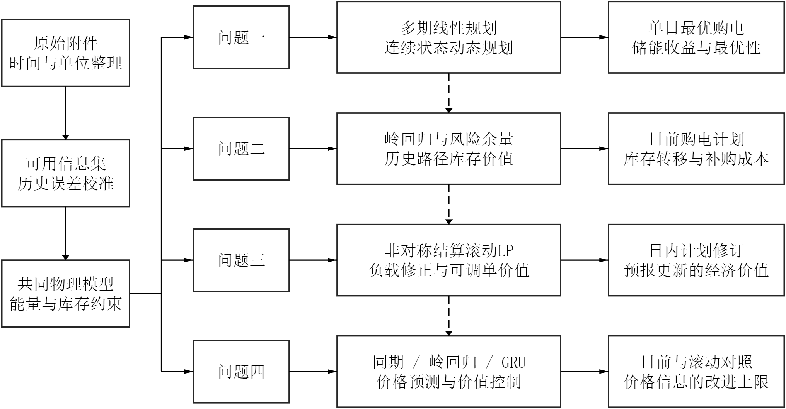
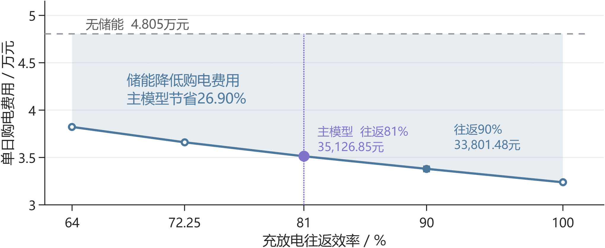
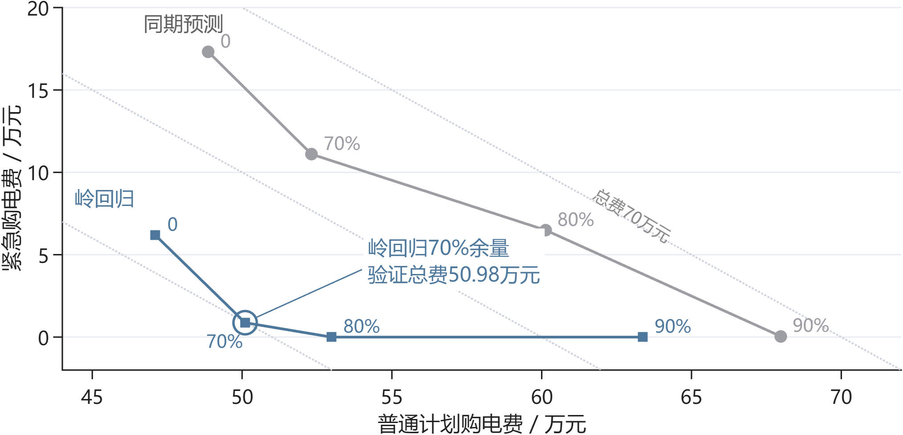
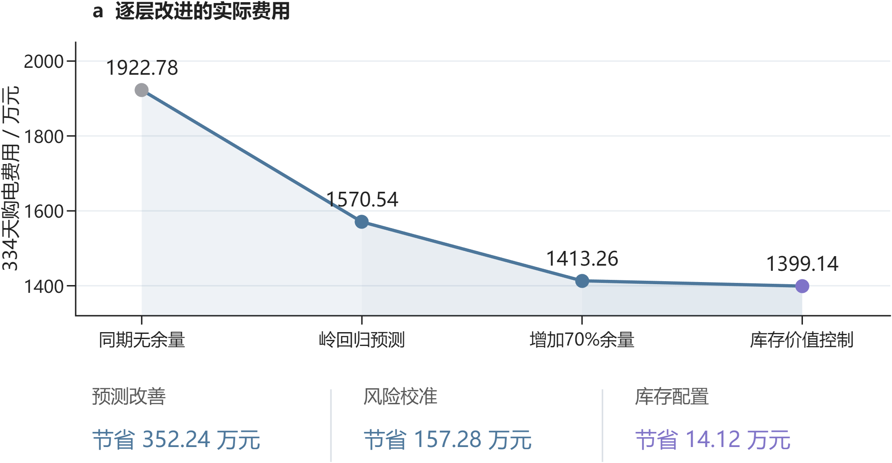
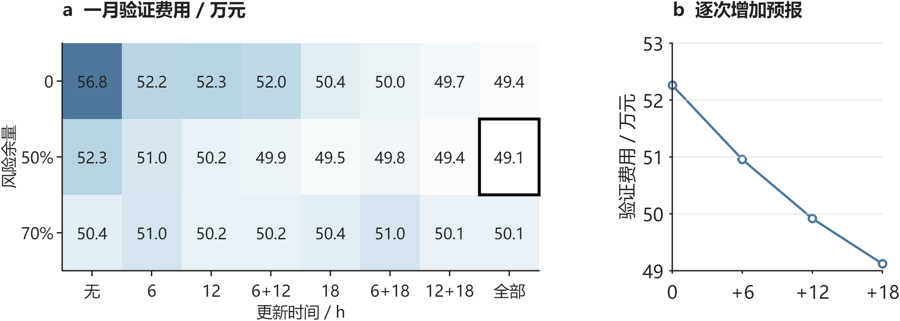
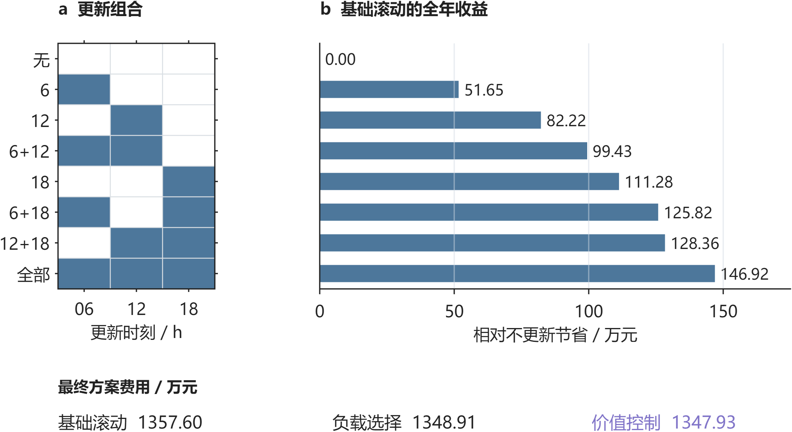
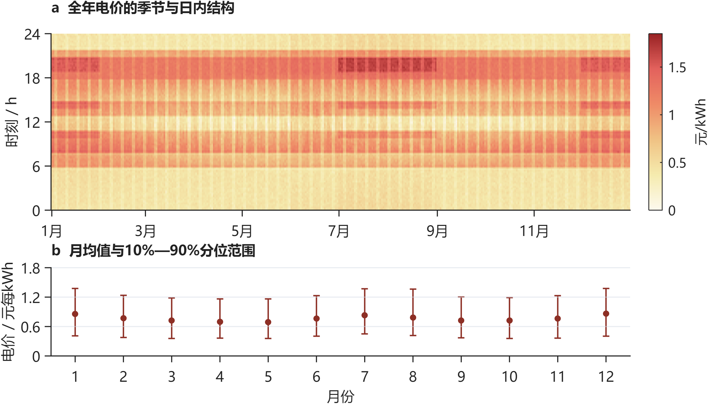
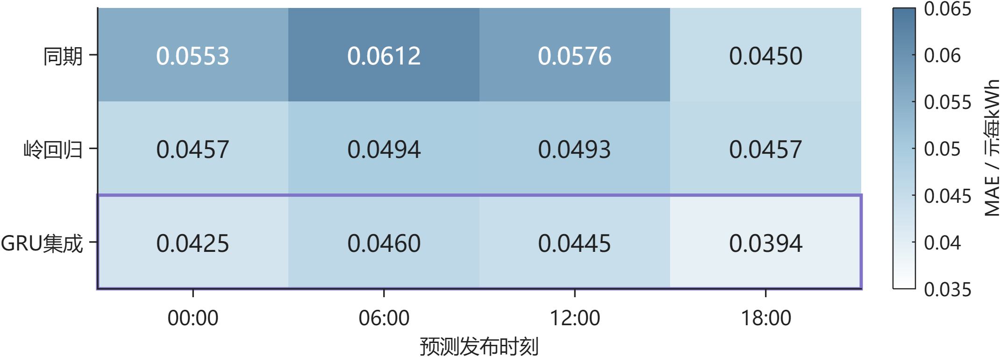
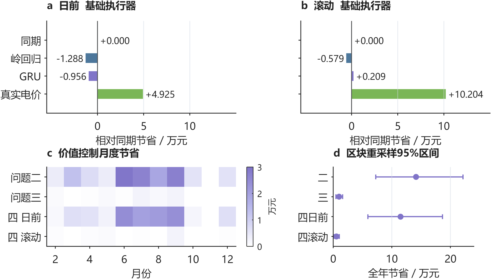
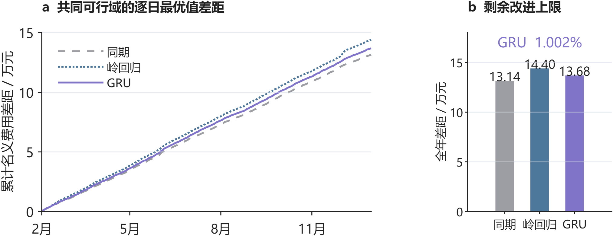

# 基于风险校准与库存价值控制的微网购电调度

## 摘 要

针对计划购电、储能运行与日内调单的耦合关系，本文以实际总购电费用最小为目标，构建“库存状态—可见信息—合同费用”统一调度框架。

针对问题一，建立**多期线性规划与连续状态动态规划模型**，证明自由弃电条件下充放电互斥的等价线性化，并以凸分段线性价值函数实现无SOC网格递推。两种方法均得最优日费用35,126.85元，购电59,482.70 kWh，较无储能节省26.90%；九个初始库存的DP值与混合整数规划一致。

针对问题二，建立**岭回归预测、分位数风险校准与历史路径价值控制模型**。70%误差余量控制欠购风险，过去28日配对残差刻画后续缺口费用。2—12月334天总费用为13,991,392.60元，较相同计划生成规则的即时平衡执行器节省141,219.56元，主要来自库存向高价缺口时段转移。

针对问题三，建立**非对称结算滚动LP与可调单库存价值模型**，结合**负载收缩回归及月度模型选择**，在6、12、18点更新信息。计入下次调单机会后，总费用为13,479,283.32元，较仅加入月度负载选择的策略再省9,844.62元；固定合同价值函数直接移用于滚动问题反而增费，说明续期价值必须匹配合同权限。

针对问题四，比较**同期、岭回归与残差GRU价格预测模型**。GRU价格MAE为0.04366元/kWh，较岭回归降低8.09%；按验证费用选择价格模型并加入库存价值控制，日前与滚动费用分别为14,765,492.68元和14,210,881.01元，较对应基础执行器节省115,042.37元和5,444.97元。共同名义可行域下的价格改善空间为1.002%，与实际运行收益分别评价。

11条全年候选轨迹通过物理约束与合同账单复核，四组节费对照均保持相同初末库存。结果表明，风险校准确定合理购电规模，滚动预报降低供需偏差，库存价值控制将有限电量配置给更昂贵的后续缺口，三者共同提升微网运行经济性。

关键词：微网调度；线性规划；连续动态规划；库存价值；滚动优化

## 一 问题重述

### 1.1 研究背景

光伏出力与小区负载在时间上存在差异。并网微网通过外部电网补充电力，并利用储能在低价或光伏富余时充电、高价或供电不足时放电，实现电量在时段间的转移。储能的容量、功率和充放电损耗共同限制了电量转移规模，因此购电计划必须与储能运行协同制定。

实际运行还受到信息与交易规则的双重约束。运营者需在每天零点申报全天计划，当天负载、光伏和波动电价尚未完全获知；计划不足会触发高价紧急购电，计划过量则形成额外支出。日内预报提供了修正供需判断的机会，但调整购电同样产生费用。如何在保障供电的前提下，协调峰谷套利、预测风险与计划调整成本，是本题的核心问题。

### 1.2 问题的提出

题目给出单日分时电价及供需曲线、全年负载与光伏实测数据、日内滚动光伏预报和波动电价四类附件[1]。微网储能额定容量为12,000 kWh，最大充放电功率为5,000 kW，储电量须保持在1,200—10,800 kWh之间，初始储电量为6,000 kWh；充放电效率按题设取值，具体解释见第3.1节。以十分钟为决策间隔，需依次解决以下问题。

**问题一：确定性条件下的购电与储能调度。** 在电价、负载逐日重复且当日光伏预测已给定时，制定全天144个时段的购电与充放电计划，使日初、日末储电量相等且总购电费用最小，给出指定时段购电量、全天费用及四小时储能汇总。

**问题二：供需不确定条件下的日前购电。** 利用决策时已掌握的历史数据，在每日零点制定购电计划；实时供电缺口按交易电价的五倍紧急补购，普通购电按计划量结算。求解2025年2月1日至12月31日的策略，并报告3月20日、6月21日、9月23日和12月21日的指定结果。

**问题三：滚动预报下的计划调整。** 利用0、6、12、18点发布的未来24小时整点光伏预报，调整尚未执行的购电计划；相对午夜计划，取消部分按半价、新增部分按1.5倍交易电价结算。制定全年滚动策略，并比较仅用午夜预报与日内更新的总费用，判断增加预报更新是否必要。

**问题四：波动电价下的策略扩展。** 在当天电价未知且实时波动的条件下，建立电价预测与购电调度模型，分别重新求解问题二的日前策略和问题三的滚动策略，按实际交易电价计算费用并给出相应结果。

## 二 问题分析

### 2.1 问题一的分析

本问的供需与电价均已给定，关键在于利用储能将低价电量转移至高价时段。各时段通过储电量递推相互关联，不能独立优化。以购电费用最小为目标，联立能量平衡、容量、功率和日周期约束，建立多期规划；再利用无成本弃电条件消除循环充放电，将互斥模型等价化为线性规划。所得模型构成后续三问的共同物理基础。

### 2.2 问题二的分析

本问新增供需预测误差，欠购五倍补购与多购计划支出形成非对称风险。先以岭回归预测、历史误差分位数校准日前计划，再利用过去28日配对残差构造后续费用函数，按当前储电量选择实时放电。预测层控制缺口规模，执行层分配有限库存，两层共同以实际账单评价。

### 2.3 问题三的分析

本问允许修订未执行合同。以保留、取消和新增量列式，随光伏预报和负载偏差更新滚动求解；后续库存价值须计入下次调单机会，不能沿用固定合同下的五倍缺口成本。由此协调当前放电、后续补购与调单费用。

### 2.4 问题四的分析

本问进一步引入电价不确定性。比较同期、岭回归和GRU的价格预测，在相同信息条件下区分预测精度与调度收益；日前执行采用固定合同价值估计，滚动执行采用可调单价值估计。当前交易使用已揭示电价，后续价值仅使用当前价格预测。

四问按“确定性基准—供需风险—日内修正—价格不确定性”逐步扩展，整体建模思路如图 1 所示。各问共用能量平衡与储能约束，新增模型仅处理对应的信息与结算机制。

图 1 整体建模思路与四问递进关系

## 三 模型假设与数据处理

### 3.1 参数及工作假设

储能与时间参数见表 1。功率上限定义在微网母线侧，所有决策电量统一使用kWh。基础模型将题设90%的充放电效率解释为两侧各90%，对应往返效率81%；第5.3节另以往返效率90%检验结果对效率解释的敏感性。

表 1 储能参数与时间离散

| 参数 | 数值 | 性质 |
| --- | --- | --- |
| 额定容量 | 12000 kWh | 题面给定 |
| 允许储电量 | 1200—10800 kWh | 题面给定 |
| 最大充放电功率 | 5000 kW | 题面给定 |
| 初始储电量 | 6000 kWh | 1 月 1 日 00:00 给定 |
| 充电／放电效率 | 0.9／0.9 | 主实验解释 |
| 时段长度 | 1/6 h | 十分钟离散 |

（1）第一问按模板起点采样，周期曲线以24:00值补齐00:00，功率在十分钟区间内取常值；全年历史序列按记录终点对应十分钟区间均值建模。状态统一定义在区间边界，功率乘1/6小时换算为电量。

（2）微网仅从外网购电，不计售电收入；无法消纳的电量允许无成本弃用，电池退化成本不纳入目标。第一、二问普通购电按计划量结算，第三、四问主动调整按保留量、取消量和新增量分项结算。

（3）实时运行按十分钟区间内功率恒定建模，以当前可观测供需完成充放电与紧急购电；日前及日内计划仅使用决策时已经获得的信息。

（4）第二至四问的实际储电量连续跨日。日前名义轨迹的日末储电量下限为6,000 kWh，用于保留次日运行所需电量；实际日末状态由实时运行决定，并作为次日初始状态。

### 3.2 输入审计与时间边界

附件1含144个时段，附件2的负载与光伏各含365×144＝52,560个观测。以2025年完整日期和十分钟时段为索引对齐两类序列，将附件1混合存储的时间类型与字符串统一为分钟，核对序列为10、20、…、1440。功率与电量按下式换算：

$$
L_{d,t}=P^{\mathrm{load}}_{d,t}\Delta t,\qquad V_{d,t}=P^{\mathrm{PV}}_{d,t}\Delta t,\qquad \Delta t=\frac{1}{6}\ \mathrm{h}.
$$

数据核查表明：附件1含60个时间类型单元格和84个字符串，统一转换后得到完整时间序列；附件2两类序列均无缺失、非有限值、负数、重复日期或完全重复日曲线。全局四分位距检验未检出超界观测，原始样本全部保留。

预处理仅规范时间格式与计量单位，无须填补、删点、缩尾或平滑。光伏序列中的23,540个零值按零发电记录保留。训练集标准化和预测值非负截断分别作用于特征及模型输出，不改变实际观测。

原始供需和调度轨迹保留十分钟分辨率。图中的月均值、分位范围和累计费用均由原始记录直接汇总，分别刻画季节结构、价格分布与策略收益。

### 3.3 单位、富余电量与计划计费核验

附件1—4的五张工作表均无公式、隐藏行列或隐藏工作表。以另一读取程序逐值核对附件2的105,120个负载与光伏观测，换算后与建模输入一致；附件3的1,095处空日期是四行一组的结构记录，只补齐日期标识，不插补预测值。实际光伏零值和0.0076元/kWh的低电价均保留。

全篇采用电量平衡：功率乘1/6小时得到kWh，5,000 kW对应单时段充放电上限833.33 kWh。平衡式中的非负弃电变量允许供给富余；将其移项后即为“购电＋光伏＋放电＋紧急购电≥负载＋充电”，因此等式与供给不小于需求的约束等价。取消弃电变量而强行取等号才会错误地要求全部消纳。

普通费用按合同量核算。针对性测试取电池已满、计划购电1,000 kWh、负载100 kWh、无光伏、电价2元/kWh，实际弃电900 kWh，普通购电费仍为2,000元。第三、四问则按最终合同的保留、取消和新增量结算，未把实际消纳量代替计划量。

## 四 符号说明

下文沿用表 2 的符号。单日模型省略日期下标，日内区间用 1—144，状态包含 145 个边界点；跨日计算另带日期下标。

表 2 主要符号及单位

| 符号 | 含义 | 单位 |
| --- | --- | --- |
| $d,t$ | 日期与十分钟时段 | — |
| $L_{d,t},V_{d,t}$ | 负载与光伏电量 | kWh |
| $\hat L_{d,t},\hat V_{d,t}$ | 日前负载与光伏预测 | kWh |
| $g_{d,t},e_{d,t}$ | 计划购电与紧急购电 | kWh |
| $c_{d,t},d_{d,t}$ | 母线侧充电与放电 | kWh |
| $w_{d,t}$ | 不能利用的富余电量 | kWh |
| $S_{d,t}$ | 区间起点的储电量 | kWh |
| $p_t$ | 固定分时交易电价 | 元/kWh |
| $\eta_c,\eta_d$ | 充电与放电效率 | — |
| $z_t$ | 充电状态二元变量 | — |
| $\lambda,q$ | 岭惩罚强度与余量分位数 | — |
| $r_{d,t}(q)$ | 非负净负载预测余量 | kWh |

日期下标与放电变量均使用字母d，前者仅出现在下标位置，后者作为决策变量出现；两者由位置及上下文区分。

## 五 第一问的模型建立与求解

### 5.1 供需结构与决策目标

图 2 给出单日供需曲线与分时电价。光伏集中于白天，负载贯穿全天；储能既可吸收午间富余光伏，也可利用外网峰谷价差转移购电时段。两种作用共同决定购电与充放电计划。

图 2 第一问供需曲线与分时电价

图 2 的每个阶梯对应一个十分钟区间，功率与电价分别使用独立坐标，光伏填充区域表示其出力过程。

目标是最小化全天计划购电费：

$$
\min C_1=\sum_{t=1}^{144}p_tg_t.
$$

以母线侧收支写能量守恒，将允许的富余供电显式记为未利用电量：

$$
g_t+V_t+d_t=L_t+c_t+w_t,\qquad g_t,w_t\geq0.
$$

充电损耗发生在进入储能时，放电损耗发生在从储能输出至母线时，因而状态方程为：

$$
S_{t+1}=S_t+\eta_c c_t-\frac{d_t}{\eta_d},\qquad 1200\leq S_t\leq10800.
$$

SOC 上下界施加于全部 145 个状态点，状态递推与其他时段约束对应 t＝1，…，144。令每时段最大母线侧充放电量 M＝5000/6 kWh，用二元变量直接限制互斥：

$$
0\leq c_t\leq Mz_t,\qquad 0\leq d_t\leq M(1-z_t),\qquad z_t\in\{0,1\}.
$$

第一问满足以下初始和终端条件，避免利用电池初始存量净放电造成虚假节省：

$$
S_1=S_{145}=6000.
$$

将上述关系集中写成一般日模型，决策变量为购电、充放电、未利用电量、储电量和状态变量。给定不同供需输入与初末状态条件时，可复用以下结构：

$$
\boxed{\left\{\begin{aligned}\min_{g,c,d,w,S,z}\quad &\sum_{t=1}^{144}p_tg_t\\\mathrm{s.t.}\quad &g_t+V_t+d_t=L_t+c_t+w_t,\\&S_{t+1}=S_t+\eta_c c_t-d_t/\eta_d,\\&1200\leq S_t\leq10800,\quad g_t,w_t\geq0,\\&0\leq c_t\leq Mz_t,\quad0\leq d_t\leq M(1-z_t),\\&z_t\in\{0,1\},\quad S_1=S_{145}=6000.\end{aligned}\right.}
$$

完整互斥模型含865个变量，其中144个为二元变量，使用SciPy的milp接口调用HiGHS[2]。设置相对最优间隙10⁻⁷、单次求解上限30秒，求得最优整数解。第5.4节进一步证明等价线性化，并用于后续滚动模型求解。

### 5.2 调度结果与指定时段

计算得到全天购电量 59,482.70 kWh、费用 35,126.85 元。购电与储能轨迹见图 3，指定时段购电和四小时充放电分别见表 3、表 4。

图 3 第一问电价驱动的购电与储能运行

图 3 的上面板给出供需、购电与充放电功率，中面板给出储电量及边界，下方面板给出电价。三者共用时间轴，可逐时核对价格、动作和储电状态之间的关系。

表 3列出指定十分钟区间的购电量及全天汇总。

表 3 第一问指定时段购电量及全天费用

| 时间段 | 购电量 | 时间段 | 购电量 | 时间段 | 购电量 |
| --- | --- | --- | --- | --- | --- |
| 10:00-10:10 | 0.00 | 12:00-12:10 | 486.40 | 14:00-14:10 | 0.00 |
| 16:00-16:10 | 394.93 | 18:00-18:10 | 636.98 | 20:00-20:10 | 0.00 |
| 全天购电量 | 59,482.70 | 全天购电费 | 35,126.85 | — | — |

表 4按四小时汇总充放电量，并列出各块边界储电量。

表 4 第一问四小时充放电及边界储电量

| 时间段 | 充电量 | 放电量 | 时间段 | 充电量 | 放电量 |
| --- | --- | --- | --- | --- | --- |
| 00:00-04:00 | 4,500.00 | 0.00 | 04:00-08:00 | 833.33 | 5,947.42 |
| 08:00-12:00 | 3,954.63 | 2,121.42 | 12:00-16:00 | 6,119.37 | 91.10 |
| 16:00-20:00 | 0.00 | 5,068.69 | 20:00-24:00 | 5,333.33 | 3,571.31 |
| 00:00 储电量 | 6,000.00 | — | 24:00 储电量 | 6,000.00 | — |

低价时段的外网购电同时满足负载与充电，形成集中购电峰值；高价时段由储能放电补充供电，压低外网购电量。图 3 中购电峰值与充电动作对应，反映储能的跨时段套利。表 3、表 4分别按十分钟和四小时汇总；四小时块内可先充后放，各十分钟区间仍保持互斥。

### 5.3 最优性检验与效率解释

删除整数限制得到线性松弛下界 35,126.84858929 元，与整数解目标之差为 0.00000000 元，求解器相对间隙为零。整数解与松弛下界一致，达到该模型的全局最优费用。能量平衡最大残差约 2.27e-13 kWh，SOC 递推与容量、功率边界均通过复核。

以每时段正净负载直接购电构造无储能基线：

$$
g_t^{(0)}=\max(L_t-V_t,0),\qquad C_1^{(0)}=\sum_t p_tg_t^{(0)}.
$$

该基线费用为 48,052.05 元，基础模型节省 26.90%。效率解释的对照见图 4：若总往返效率为 0.9，并对称取两侧效率为平方根 0.9，费用为 33,801.48 元。提高往返效率可进一步降低套利损耗。

图 4 储能往返效率与最优购电费用的关系

图 4给出五组往返效率下的最优费用，并以无储能费用为参照。储能降低购电支出，效率提升进一步减少能量转移损耗；主结果采用两侧各90%、即往返81%的效率。

### 5.4 互斥约束的等价线性化

为降低多次滚动求解的规模，考察互斥约束的结构性质。在允许无成本且无上界弃电的条件下，可将任意线性松弛可行解转化为同费用的互斥可行解。令ρ＝ηcηd≤1，对任一时段作如下变换：

$$
x_t=\min\{c_t,d_t/\rho\},\quad c'_t=c_t-x_t,\quad d'_t=d_t-\rho x_t,\quad w'_t=w_t+(1-\rho)x_t.
$$

充电量和放电量均不增加，且至少一个变为零。由于ηc x＝ρx/ηd，储能增量完全不变；由于d′−c′−w′＝d−c−w，母线平衡也保持不变。购电、紧急购电和所有计划增减量不变，因此本文各类费用均不变。逐槽处理后得到符合互斥约束的物理解：

$$
C_{\mathrm{LP}}^{*}\le C_{\mathrm{MILP}}^{*}\le C_{\mathrm{transformed\ LP}}=C_{\mathrm{LP}}^{*}.
$$

由上下界相等可知，线性规划与混合整数规划的最优费用相同。第一问由865个变量降至721个变量，消去全部144个二元变量；滚动调整模型采用相同变换。求解后逐时消除循环充放电并复核约束，即得到可执行的互斥解。

上述等价性以自由弃电、线性购电成本及所列储能约束为前提。引入切换成本或弃电上限后，需重新判断变换的可行性与费用保持性。

### 5.5 连续状态价值函数与精确递推

线性规划给出指定初始状态下的最优轨迹；为刻画其他库存水平的后续费用，以储电量s为状态，令v＝s−s′，n＝L−V。单时段净放电v≥0时向母线提供ηd v，净充电v＜0时从母线吸收−v/ηc。最小普通购电费及递推为：

$$
h_t(v)=p_t\max\{n_t-\phi(v),0\},\quad \phi(v)=\begin{cases}\eta_dv,&v\geq0,\\v/\eta_c,&v<0,\end{cases}\qquad J_t(s)=\min_{s'\in\mathcal S_t(s)}\{h_t(s-s')+J_{t+1}(s')\}.
$$

集合S限定储电量1,200—10,800 kWh、单时段充放电不超过833.33 kWh；终端函数在s＝6,000处为0，其余为正无穷。由于价格非负且ηcηd≤1，h为凸分段线性函数。凸函数的下确界卷积与区间限制保持凸性[7]，故各J均可由有限折点精确表示。实现将两函数线段按斜率归并，再截取可行库存区间，无需离散SOC网格。凸性意味着库存边际节费−J的斜率随库存增加而不增；严格期末等式下J未必处处递减，不把全部斜率解释为正收益。

初始价值函数含14个折点。在1,200至10,800 kWh的九个初始库存下，其函数值均与独立混合整数规划一致；s＝6,000时费用为35,126.84858929元，与前述LP完全相同。DP的新增作用是给出状态变化对应的费用函数，并未降低已达全局最优的确定性费用。参数化LP亦可描述全状态价值，二者是同一优化结构的不同表达。

## 六 第二问的预测与日前策略

### 6.1 训练与评价的时间顺序

采用按时间推进的训练、验证与评价划分：1月22—31日选择参数与执行器，2月1日至12月31日开展顺序回测。模型每七天更新，使用最近至多60个已结束日期。此次模型修订属于同年度数据上的开发复核；各时点决策遵守历史可见性，评价区间不作为从未接触的外部测试集。

各候选策略从1月1日6,000 kWh储电量进行共同热身。首日以附件1作为冷启动参考，历史不足七天时使用近三日均值，随后转为日／周同期预测。验证期初与评价期初储电量分别为6,244.256891 kWh和9,902.811288 kWh，保证各策略具有相同起点。附件1仅用于初始化。

### 6.2 同期基线与岭回归预测

对负载或光伏电量序列 y，同期基线取昨日与上周同日相同时间槽的均值：

$$
\hat y_{d,t}^{\mathrm{seasonal}}=\frac{y_{d-1,t}+y_{d-7,t}}{2}.
$$

岭回归采用 21 个特征：昨日、前日、上周同日的同槽值，三日和七日同槽均值、七日同槽标准差、昨日全天均值和近三日全天均值共八项；前三阶日内正余弦六项；星期指示七项。日期及时间属于决策时已知的日历信息。标准化均值与尺度仅在当次训练集上估计，常量特征尺度置 1。

$$
\min_{\beta,b}\sum_{i\in\mathcal T_d}(y_i-b-\widetilde{x}_i^{\mathsf T}\beta)^2+\lambda\|\beta\|_2^2.
$$

截距不惩罚，负载和光伏分别拟合。按验证 MAE 比较 λ＝1、10、100，均选 1；实现采用 NumPy 线性方程求解，与带截距岭目标一致 [3]。从 1 月 15 日开始具备拟合条件，之后每七日重新拟合。预测截断为非负；某槽过去七日光伏全零时，该槽预测置零，日出日落季节变化可能使此规则产生滞后。

评价指标采用功率单位的 MAE 与 RMSE；不使用夜间分母为零的普通 MAPE：

$$
\mathrm{MAE}=\frac{1}{n}\sum_i|P_i-\widehat P_i|,\qquad\mathrm{RMSE}=\sqrt{\frac{1}{n}\sum_i(P_i-\widehat P_i)^2}.
$$

### 6.3 净负载误差余量与名义优化

定义历史净负载误差及只包含过去信息的误差样本池：

$$
\varepsilon_{j,s}=(L_{j,s}-V_{j,s})-(\hat L_{j,s}-\hat V_{j,s}).
$$

$$
\mathcal E_{d,t}=\{\varepsilon_{j,s}:\max(2,d-28)\leq j<d,\ 1\leq s\leq144,\ |s-t|\leq3\}.
$$

日期下标以 1 月 1 日为 d＝1；排除首日冷启动误差，最多池化 28 个已结束日期和目标槽前后三槽。跨日边界不绕回，不足 28 天时仅取已有历史。余量规则为：

$$
r_{d,t}(q)=\max\{0,Q_q(\mathcal E_{d,t})\}.
$$

无余量候选直接设 r＝0，与“取零分位数”区分。对 q＝0.7、0.8、0.9，分位数使用样本排序后的线性插值。将预测负载加余量作为名义需求，求解第五节同一物理模型：

$$
L_t^{\mathrm{nom}}=\hat L_{d,t}+r_{d,t}(q),\qquad V_t^{\mathrm{nom}}=\hat V_{d,t},\qquad S_{d,145}^{\mathrm{nom}}\geq6000.
$$

风险校准通过历史误差分位数提高名义需求，在一月验证中按计划费与五倍紧急费之和选择余量。70%表示误差样本池的分位水平；模型属于分位数校准的确定性日前优化，其供电风险由顺序回测评价。

### 6.4 实时执行与跨日状态

当天普通购电计划固定后，定义当前供需剩余。对非负剩余尽量充电，对缺口尽量放电，并分别受可用空间、储电量和功率限制：

$$
u_t=g_t+V_t-L_t.
$$

$$
c_t=\min\left\{\max(u_t,0),M,\frac{10800-S_t}{\eta_c}\right\}.
$$

$$
d_t=\min\left\{\max(-u_t,0),M,\eta_d(S_t-1200)\right\}.
$$

$$
e_t=\max(-u_t-d_t,0),\qquad w_t=\max(u_t-c_t,0).
$$

以上规则使同一时段仅有充电或放电，SOC 仍按状态方程更新，实际日末传给次日：

$$
S_{d+1,1}=S_{d,145}.
$$

所有供电缺口由紧急购电补足。全年评价费用定义为：

$$
C_2=\sum_{d,t}p_tg_{d,t}+5\sum_{d,t}p_te_{d,t}.
$$

将第二问策略概括如下。记 Ω 为第一问中除初末等式之外的物理可行域，输入替换为带余量预测，日初状态取真实已知值；G 表示本节的贪心实时平衡规则：

$$
\boxed{\left\{\begin{aligned}(g^{\mathrm{plan}},\ldots)&\in\arg\min_{(g,c,d,w,S,z)\in\Omega}\sum_t p_tg_t,\\L^{\mathrm{nom}}&=\hat L+r(q),\quad V^{\mathrm{nom}}=\hat V,\\S_1^{\mathrm{nom}}&=S_1^{\mathrm{actual}},\quad S_{145}^{\mathrm{nom}}\geq6000,\\(c_t,d_t,e_t,w_t)&=\mathcal G(g_t^{\mathrm{plan}},L_t,V_t,S_t),\\C_2&=\sum_{d,t}p_t(g_{d,t}^{\mathrm{plan}}+5e_{d,t}).\end{aligned}\right.}
$$

Ω中各时段的平衡约束采用带余量的名义供需。计划层最小化普通购电费，实际缺口在执行时揭示并计入评价费用；余量q以一月验证总费用确定，随后固定。

上述即时平衡规则作为基础执行器：出现缺口便尽量放电，余下部分紧急补购。该规则未区分库存用于当前与后续时段的价值，改进执行器见第6.5节；普通购电仍按计划量结算。

### 6.5 历史路径价值驱动的实时放电

普通计划锁定后，计划费为执行阶段的已付成本。每次发布用此前至多28个完整日的负载、光伏配对残差，分别叠加至当前预测并截断非负，形成保持日内关联的净缺口路径。对每条历史路径按第5.5节递推计算紧急补购费用函数，终端附加价值取零；名义计划仍要求日末储电量不少于6,000 kWh。以这些路径函数的均值估计后续费用，在当前真实缺口n＝L−V−g＞0时选择下一储电状态：

$$
s_{t+1}^{*}\in\arg\min_{z\in[\max\{S_{\min},s_t-\min(n_t,M)/\eta_d\},s_t]}\left\{5p_t[n_t-\eta_d(s_t-z)]+\frac1K\sum_{k=1}^{K}J_{t+1}^{(k)}(z)\right\}.
$$

M为单时段放电上限；最优解只需比较可达区间端点和路径价值折点。富余时优先充电，超出容量或功率上限的部分弃电；紧急购电仅补当前负载缺口，不用于给电池充电。当库存的预计后续节费超过当前放电节费时，保留部分库存并紧急补购是可行且有经济意义的动作。题面要求及时补足缺口，并未规定必须先耗尽可放电量。

各历史路径的后续费用经递推后取均值，形成当前库存的续期价值估计；执行动作由当前真实供需和这一价值函数共同决定。1月验证中，零终端价值与低谷价终端价值均得到509,140.53元，较即时平衡节省616.94元，按预设候选顺序选取零终端价值。

## 七 第二问的结果与检验

### 7.1 验证期选择与紧急购电权衡

表 5 与图 5 比较相同初始储电量下的验证费用及期末状态。随余量增加，紧急补购支出下降，普通购电支出上升；两者的折中决定余量选择。

表 5 一月份十天验证结果

| 预测器 | 余量 | 总费/元 | 紧急费/元 | 期末SOC/kWh |
| --- | --- | --- | --- | --- |
| 同期 | 无 | 661,834.09 | 173,098.38 | 9,902.81 |
| 同期 | 70% | 634,179.58 | 110,989.47 | 10,595.98 |
| 同期 | 80% | 666,226.97 | 64,910.51 | 10,800.00 |
| 同期 | 90% | 680,257.72 | 456.98 | 10,800.00 |
| 岭回归 | 无 | 532,888.41 | 61,836.07 | 5,924.08 |
| 岭回归 | 70% | 509,757.47 | 8,765.44 | 6,623.17 |
| 岭回归 | 80% | 529,846.45 | 4.16 | 7,110.16 |
| 岭回归 | 90% | 633,664.05 | 0.00 | 9,039.38 |

图 5 验证期风险余量与费用的权衡

图 5将普通计划费与紧急费置于同一费用平面，虚线为总费用等值线，点旁数字为误差余量分位数。沿各预测器的四个候选增加余量，紧急支出下降而普通支出上升；圈出的岭回归70%余量方案取得最低验证总费。

岭回归70%余量的验证费为509,757.47元，其中紧急费8,765.44元；90%余量虽消除了验证期紧急购电，总费却升至633,664.05元。按总购电费用选择70%余量，说明额外多购支出已超过进一步压缩紧急购电的收益。两方案期末储电量相差约2,416 kWh，相关存量同时列于表 5；费用按题设结算，不计期末残值。

### 7.2 全期预测误差与季节变化

按表 6 比较 334 天共 48,096 个十分钟区间的功率预测误差，岭回归在负载预测上的改善大于光伏。四个指定日期的曲线对照见图 6，整年误差仍以全期统计为准。

表 6 第二问全期预测误差

| 预测器 | 负载MAE | 负载RMSE | 光伏MAE | 光伏RMSE |
| --- | --- | --- | --- | --- |
| 同期 | 372.26 | 585.91 | 171.98 | 343.38 |
| 岭回归 | 179.86 | 234.59 | 155.28 | 306.74 |

表 6的误差单位为kW，光伏统计覆盖全天并包含夜间零值，表示全时段平均预测水平。

图 6 四个指定日期的负载与光伏日前预测

各列共用纵轴尺度，日期由题目指定。实线为实际观测，虚线为岭回归预测，展示十分钟分辨率下的预测偏差。

### 7.3 全期购电费用与运行约束

表 7列出基础策略，图 7按实际替换顺序展示从同期无余量到岭回归预测、70%风险余量及库存价值控制的费用变化。每一步均与前一步配对，直接给出各层改进的费用贡献。

表 7 第二问全期费用及期末储电量

| 策略 | 计划费/万元 | 紧急费/万元 | 总费/万元 | 期末SOC/kWh |
| --- | --- | --- | --- | --- |
| 同期 无余量 | 1,199.19 | 723.59 | 1,922.78 | 5,825.99 |
| 岭回归 无余量 | 1,215.92 | 354.62 | 1,570.54 | 5,903.65 |
| 同期 70%余量 | 1,297.86 | 452.54 | 1,750.40 | 6,217.35 |
| 岭回归 70%余量 | 1,293.50 | 119.76 | 1,413.26 | 5,903.65 |

图 7 第二问逐层优化的费用变化与节费来源

图 7的折线按模型实际替换顺序连接四个策略，末端为最终库存价值控制方案；下方分别列出预测改善、风险校准和库存配置带来的节省。各组件的费用贡献由相邻策略的同条件比较确定，体现预测、风险与控制的协同作用。

基础策略总费用为14,132,612.16元，较同期无余量降低26.50%，较岭回归无余量降低10.01%。岭回归两组的期末储电量同为5,903.65 kWh，在相同预测器及初末状态下，10.01%的费用降幅直接反映风险余量的价值。

基础策略紧急购电累计197,465.10 kWh，分布于1,132个十分钟区间；连续区间合并后统计为紧急购电事件。未利用电量为2,211,229.49 kWh，由未消纳光伏与富余计划购电共同构成。风险余量通过增加部分普通购电，减少高价缺口补购。

四个指定日期的购电、充放电和紧急购电结果见附录A。

### 7.4 库存价值控制的增益

在相同岭回归、70%余量、费用规则和初始储电量下，历史路径价值控制使334天费用由14,132,612.16元降至13,991,392.60元，节省141,219.56元（0.999%）。其中紧急购电费减少141,170.39元，而紧急电量由197,465.10增至198,137.46 kWh。由此可见，收益来自补购与放电时点的重新分配：以较低价格补足当前缺口，将库存留给更高价格的后续缺口。两方案期末均为5,903.65 kWh，库存转移的经济收益得到同状态对照支持。

负载同槽七日相关系数为0.9855，日总量七日相关为0.9880，周周期特征具有明确的数据依据。28、56、60、84日训练窗的固定控制器敏感性费用分别为14,211,345.15、14,152,541.05、14,132,612.16、14,033,154.46元，说明窗口长度通过历史信息量与时效性共同影响预测。四种窗口在一月短历史下的验证结果相同，主方案保留60日窗，其余结果用于检验窗口敏感性。

## 八 第三问 日内预报的滚动价值

### 8.1 预报信息与决策时域

附件3含365天、每日4个版本、每版24个整点光伏预报，共35,040个值。按四行组还原1,095个结构性空日期后，未发现缺失、非有限数或负值。预报发布时间分别为0、6、12、18点；时刻τ的新预报只服务于τ之后的调度。小时预报端点之间采用分段线性函数，并在十分钟区间上积分为预测电量；发布点以最近完成区间的光伏观测衔接。

这一处理保留了预报更新带来的信息差异。每次求解均以当时真实储电量为起点，固定已经执行的购电与充放电量，重新配置其余区间。该时域推进方式与储能模型预测控制的基本框架一致[4]。

图 8给出指定日期的实际光伏及各版预报，各预报从对应发布时间起展示。日内预报对剩余时段的光伏判断持续更新，为重配购电和储能提供信息。

图 8 四个发布版本的光伏预报

### 8.2 保留量、取消量与新增量的结算

记午夜计划为x_t，时段执行前最后一次有效调整量为y_t，紧急购电为e_t。取消量u_t与新增量v_t分别定义为：

$$
u_t=(x_t-y_t)^+,\qquad v_t=(y_t-x_t)^+,\qquad y_t=x_t+v_t-u_t.
$$

保留购电按原价结算，取消部分按半价支付违约费，新增部分按1.5倍价格购买。因此每个区间的完整费用为：

$$
F_t=p_t\min(x_t,y_t)+0.5p_tu_t+1.5p_tv_t+5p_te_t=p_tx_t-0.5p_tu_t+1.5p_tv_t+5p_te_t.
$$

原计划100 kWh、调整为80 kWh、电价1元/kWh时，总费用为80＋0.5×20＝90元；调整为120 kWh时，费用为100＋1.5×20＝130元。前式按保留量计普通费用，后式按原计划记账，两种表达完全等价。多次预报更新均相对同一午夜计划确定偏差；中途计划用于运行与追溯，不重复累计尚未交付区间的修改费用。

### 8.3 滚动优化模型与风险校准

记Tτ为当前尚未执行的区间集合，Ω为第一问去除首末状态等式后的物理可行域。以更新后的光伏预测、负载预测和对应误差余量作为供需输入，求解：

$$
\boxed{\left\{\begin{aligned}\min_{y,c,d,w,S,u,v}\quad&\sum_{t\in T_\tau}\hat p_{\tau,t}(1.5v_t-0.5u_t)\\\mathrm{s.t.}\quad&y_t=x_t+v_t-u_t,\quad0\le u_t\le x_t,\quad v_t\ge0,\\&y_t+\hat V_{\tau,t}+d_t=\hat L_{\tau,t}+r_{\tau,t}+c_t+w_t,\\&(y,c,d,w,S)\in\Omega,\quad S_\tau=S_\tau^{\mathrm{actual}},\quad S_{145}\ge6000.\end{aligned}\right.}
$$

目标函数省略了与当前决策无关的午夜合同常数项。第一至三问的p由附件1给定；第四问替换为当时可获得的价格预测。名义规划满足供电需求，基础执行按第二问即时平衡规则运行，改进执行按第8.6节估计后续库存价值。

风险余量取此前28个完整日期、相同发布版本及目标前后三个区间的净负载误差。将无余量、50%分位余量和70%分位余量分别与8种更新时间组合配对，共比较24组方案。1月22—31日验证选定50%分位余量及6、12、18点更新，随后在2—12月评价。负载预测器和名义日末目标保持一致，以分离预报更新与调整机制的影响。

图 9以一月验证数据比较风险余量与更新时间。左图给出24组候选的费用矩阵，黑框标出50%余量、三次日内更新的选定方案；右图沿0、6、12、18点的顺序增加预报，展示信息更新对验证费用的影响。

图 9 风险余量与预报更新频次的验证比较

### 8.4 基础滚动策略的更新时间收益

图 10在同一50%余量下比较八种更新时间组合。左侧蓝格表示启用该时刻预报，右侧条形给出相对仅午夜预报的全年节费；下方汇总基础滚动、负载选择与库存价值控制的最终费用。

图 10 预报更新组合的全年收益与第三问最终费用

表 8将两方案费用分解为午夜计划、净调整及紧急补购三部分。

表 8 第三问基础策略与仅午夜预报的费用分解

| 费用或运行量 | 仅午夜预报 | 日内滚动 |
| --- | --- | --- |
| 原计划费/元 | 12,530,137.77 | 12,521,239.63 |
| 新增购电费/元 | 0.00 | 678,211.30 |
| 取消量净费用/元 | 0.00 | -203,600.86 |
| 紧急购电费/元 | 2,514,989.16 | 580,126.71 |
| 总费用/元 | 15,045,126.93 | 13,575,976.78 |
| 紧急电量/kWh | 407,324.31 | 101,019.32 |
| 期末储电量/kWh | 5,903.65 | 5,903.65 |

在相同50%余量下，三次更新将总费用由15,045,126.93元降至13,575,976.78元，净节省1,469,150.15元，降幅9.76%；实际紧急购电量降至101,019.32 kWh。新预报使部分供电缺口提前通过计划调整解决，紧急补购费用的下降足以覆盖调整支出。因此，本题有必要引入零点之外的预报。两方案初末储电量相同，节费来自运行策略改善。

### 8.5 面向提前时长的负载修正与月度模型选择

仅在零点预测负载，会忽略日内已观测偏差的持续性。设零点预测误差为实际负载减零点预测，以每次发布前18个十分钟区间的平均误差作为当前偏差x；历史目标小时的六个区间平均误差作为响应y。分别对6、12、18点及各未来目标小时拟合非负收缩回归：

$$
\hat\beta_{d,v,h}=\operatorname{clip}_{[0,1.5]}\left(\frac{\sum_{i\in H_d}x_{i,v}y_{i,v,h}}{1.2\sum_{i\in H_d}x_{i,v}^{2}}\right),\qquad H_d=\{\max(7,d-28),\ldots,d-1\}.
$$

其中日期从0编号；自第14日起启用，至少使用7个完整历史日；分母为零时系数取零。1.2倍分母对应20%的平方误差尺度惩罚，系数上限1.5限制短样本放大。修正后的预测为：

$$
\hat L^{A}_{d,v,t}=\max\{0,\hat L^{0}_{d,t}+\hat\beta_{d,v,h(t)}x_{d,v}\}.
$$

同一目标小时共享修正量，零点预测不变。50%风险余量仍从该预测方案此前28天的历史误差计算，避免沿用旧误差分布而重复补偿。表 9 比较全期各发布时刻的负载预测误差，单位均为kWh/十分钟。

表 9 负载自适应修正的同目标误差对照

| 发布时刻 | 基础MAE | 修正MAE | 降幅 |
| --- | --- | --- | --- |
| 06:00 | 30.26 | 27.96 | 7.61% |
| 12:00 | 30.98 | 28.85 | 6.85% |
| 18:00 | 31.58 | 27.68 | 12.34% |

固定启用修正在1月22—31日使第三、四问滚动验证费分别增加972.85元和1,149.73元，因此不能依据后续全年收益回选一月方案。本文在验证结束后固定一项月度更新规则：2月使用一月选定的基础预测；3月起，每月首日分别回放此前28天的基础与修正方案，两者从该窗口起点的实际储电量出发，按历史真实费用选择下月方案，平局保留基础方案。候选模型、窗口、收缩系数与费用口径在全年评价前固定，月底真实数据仅在次月选择时可见。

两类电价情景均在3、6、7、8、9、10月启用修正，在其余月份使用基础预测。实际储电量连续跨月传递，历史回放的末状态不覆盖实时状态。全年固定启用修正的费用另作消融结果保存，其收益不作为回选规则。该比较属于同一年度数据上的顺序开发验证，并非未接触过的外部测试集。

事后对月度验证末端库存作敏感性检查：将每kWh储电的价值从0变化至样本最高紧急电价折算值，20次模型选择均保持不变，费用排序不依赖低估候选方案的剩余储电量。

### 8.6 计入下次调单机会的库存价值

直接把第6.5节固定合同价值函数用于滚动执行，会将后续全部缺口都按五倍紧急价计值，忽略下次发布后可新增普通合同。该方法在一月验证中增加第三问费用4,210.28元。为修正这一结构偏差，在当前至下次发布的区间仍按五倍价估计缺口，下一发布之后则以1.5倍预测价近似可新增计划的边际费用；每次发布重新构造价值函数并只执行随后36个时段。1.5倍仅用于后续价值估计，实际紧急账单始终按五倍价支付。

修正方案一月费用491,182.82元，较即时平衡低29.11元；据此选定后，全年费用由13,489,127.94元降至13,479,283.32元，再省9,844.62元。固定合同价值法全年反而增加149,493.07元，验证了调单机会必须进入价值估计。该近似未显式求解未来调单、取消与库存的完整联合场景问题，其作用由同口径顺序账单检验。

为单独识别执行器贡献，两执行方案共享第8.5节因果负载选择信号；该信号由基础执行器的历史影子回放生成，实际库存分别连续传递，不用改进方案的未来费用重选预测模型。

## 九 第四问 GRU预测与价格信息的优化空间

### 9.1 波动电价与共同预测信息

附件4给出365天、每天144个电价，共52,560点，范围为0.0076—1.7936元/kWh。所有价格保留原值，不对峰谷截尾。各预测器使用发布前的价格历史以及已知日历信息，输出未来144个十分钟目标；当日调度只读取其中尚未执行的区间。

图 11展示全年电价的日内结构与月度分布。峰谷时段决定储能转移方向，价格幅度及季节变化影响各时段购电规模。

图 11 全年电价的时刻结构与月度分布

图 11a以十分钟原始记录展示电价的日内峰谷及季节差异，颜色表示电价，范围覆盖全部观测。图 11b的点为各月均价，线段为该月全部十分钟电价的10%—90%分位范围，表示分布离散程度。

同期预测取昨日与上周同目标区间价格的平均值。岭回归在这两组历史价格、日历周期特征及滞后统计量上构造12维输入。残差GRU使用6维输入：昨日价、上周价、日内正余弦和星期正余弦。三类预测器共享历史可见范围，分别表达周期基线、线性修正与非线性时序依赖。

$$
\hat p^{\mathrm{seasonal}}_{\tau,j}=\frac{p_{\tau+j-144}+p_{\tau+j-1008}}2,\qquad j=0,\ldots,143.
$$

### 9.2 残差GRU的结构与训练

GRU以门控结构选择保留的历史信息[6]。本文采用单层32维隐藏状态，在同期基线之上预测残差，输出头从零初始化，使初始预测与同期方法一致。输入维度较小、序列固定为144步，有利于在有限历史数据上控制训练规模。网络按PyTorch的GRU形式实现[5]：

$$
r_j=\sigma(W_{ir}x_j+b_{ir}+W_{hr}h_{j-1}+b_{hr}),\quad z_j=\sigma(W_{iz}x_j+b_{iz}+W_{hz}h_{j-1}+b_{hz}).
$$

$$
n_j=\tanh(W_{in}x_j+b_{in}+r_j\odot(W_{hn}h_{j-1}+b_{hn})),\quad h_j=(1-z_j)\odot n_j+z_j\odot h_{j-1}.
$$

$$
\hat p_{\tau,j}=\max\{0.001,\hat p^{\mathrm{seasonal}}_{\tau,j}+s_y(w^\mathsf{T}h_j+b)\}.
$$

前两个价格特征的均值和标准差仅从训练集估计，sy为训练价格标准差。网络采用SmoothL1损失与Adam优化器，学习率0.003，批量32，梯度范数截断为1；最多训练50轮，内部验证连续6轮无改进即早停。输入窗口每6小时取样，只有全部预测目标已发生的窗口进入训练。

1月15日、22日和之后每月首日重新训练，每次最多使用此前60天数据；内部验证为最近3个完整日期，跨越训练—验证边界的目标窗口不进入训练。以17、42、2026为三个基种子，实际随机种子为基种子加拟合日编号，分别训练，最终等权平均，共39次拟合，原实验CPU训练约126.56秒。39份权重重新加载后的预测与缓存逐值一致；同期预测由原始价格重建，岭回归13次重新拟合亦与缓存一致。图中的训练曲线展示一次月初拟合的内部验证过程。

图 12展示同一月初拟合中三个网络随训练轮数变化的内部验证MAE；早停分别保留各自最优权重。

图 12 三个随机种子的GRU验证误差

### 9.3 四个发布时刻的预测优势

图 13展示各发布时刻相同目标范围上的MAE。GRU在四组比较中均取得最低误差。

图 13 四个发布时刻的价格预测MAE

表 10按发布时刻列出价格MAE及GRU相对岭回归的降幅。

表 10 各发布时刻价格MAE及GRU相对岭回归的改进

| 发布时刻 | 同期 | 岭回归 | GRU集成 | 改进比例 |
| --- | --- | --- | --- | --- |
| 00:00 | 0.05527 | 0.04567 | 0.04253 | 6.88% |
| 06:00 | 0.06117 | 0.04938 | 0.04603 | 6.78% |
| 12:00 | 0.05761 | 0.04928 | 0.04448 | 9.74% |
| 18:00 | 0.04499 | 0.04566 | 0.03941 | 13.68% |

按全部发布—目标配对加权，GRU集成MAE为0.04366元/kWh，较同期预测降低22.70%，较岭回归降低8.09%。共120,240个配对，其中同一目标可由不同发布时刻预测；分时评价保证各模型比较的是相同信息时点。

图 14比较实际电价与岭回归、GRU的逐时预测。曲线显示两类模型对日内变化的拟合差异；未被预测捕捉的价格变化最终反映在实际结算费用中。

图 14 四个指定日期的午夜价格预测

### 9.4 基础调度下的价格预测收益

表 11在日前与滚动两类策略内分别比较各价格预测器的实际费用。

表 11 波动电价下两类策略的全年费用

| 价格预测器 | 日前总费/元 | 滚动总费/元 |
| --- | --- | --- |
| 同期预测 | 14,867,653.20 | 14,314,442.48 |
| 岭回归 | 14,880,535.05 | 14,320,233.59 |
| GRU集成 | 14,877,217.55 | 14,312,347.70 |
| 真实电价对照 | 14,818,406.37 | 14,212,407.27 |

按一月验证总费用，日前基础策略选取岭回归电价预测，滚动基础策略选取同期预测，2—12月费用分别为14,880,535.05元和14,314,442.48元，后者减少566,092.57元（3.80%）。固定滚动调度规则后，GRU费用为14,312,347.70元，较同期预测节省2,094.78元，较岭回归节省7,885.90元。两类基础策略比较反映整体方案差异，同一滚动规则下的比较则分离出价格预测器的贡献。

图 15a、b在相同基础执行器内比较价格预测器的节费贡献，零点右侧为节省、左侧为增费。图 15c、d进一步给出库存价值控制相对各自即时平衡基线的月度节费及全年区间，将预测模块和执行模块的经济作用分别呈现。

图 15 价格预测与库存价值控制的费用贡献

GRU改善了四个发布时刻的价格预测精度，其费用贡献取决于预测修正是否改变可行调度动作。固定基础滚动执行器后，GRU相对同期节省2,094.78元，配对区块重采样区间跨零；因此按一月验证费用保留原价格模型，并在执行层引入库存价值控制。图 15d采用2,000次、14天配对区块重采样，点为全年节费，线为95%区间；四个分支分别比较，不叠加为同一系统收益。最终费用见表 13。

### 9.5 名义最优下界与剩余改进上限

为直接回答价格预测还有多大优化空间，对每个日期固定相同的负载与光伏预测、风险余量、日初状态和日末目标，得到共同可行域Fd。各预测器只改变目标函数中的价格；事后将真实电价代入同一可行域求解线性规划[7]：

$$
J_d^*=\min_{g\in\mathcal F_d}p_d^\mathsf{T}g,\qquad J_{m,d}=p_d^\mathsf{T}g_{m,d},\qquad g_{m,d}\in\mathcal F_d.
$$

由于真实电价解在相同可行域内最优，任一预测器的可行计划都满足Jm,d≥Jd*。因此模型m仅通过改善价格预测能够获得的名义费用节省Δm受到下式约束：

$$
0\le\Delta_m\le R_m=\sum_d(J_{m,d}-J_d^*),\qquad \gamma_m=\frac{R_m}{\sum_dJ_{m,d}}\times100\%.
$$

表 12列出共同名义可行域内的真实电价最优费用及各预测器的费用差距。

表 12 相同名义可行域中的真实价格下界

| 预测器 | 名义费用/元 | 真实价格下界/元 | 剩余差额/元 |
| --- | --- | --- | --- |
| 同期 | 13,650,909.99 | 13,519,514.66 | 131,395.33 |
| 岭回归 | 13,663,504.91 | 13,519,514.66 | 143,990.25 |
| GRU集成 | 13,656,357.29 | 13,519,514.66 | 136,842.64 |

图 16a累计334个共同名义可行域上的逐日最优值差距，图 16b汇总全年剩余改进上限。GRU的名义费用距真实电价最优值13.68万元，占其名义费用1.002%；在既定供需预测和储能约束下，进一步提高价格预测精度的费用改善空间已接近这一量级。

图 16 价格预测的累计名义差距与剩余改进上限

GRU的名义计划费用为13,656,357.29元，真实电价最优下界为13,519,514.66元；由未舍入值计算，两者相差136,842.64元，占GRU名义费用的1.002%。在固定供需预测、余量及储能条件下，即使完全消除电价预测误差，名义费用的进一步下降也受此差额限制。同期与岭回归处于相近量级，表明三类预测器形成的名义购电计划均已接近该共同可行域的最优值。

在固定实时执行规则下，使用真实电价进行事后调度的滚动费用为14,212,407.27元，较同期预测降低0.713%。这一结果包含供需误差与紧急购电，衡量特定执行规则下的反事实收益；1.002%的上限则仅约束共同名义可行域内的计划费用。结合风险余量与滚动更新的对照，当前优化应优先改进供需预测和储能控制，再细化电价预测。

### 9.6 波动电价下的库存价值与最终费用

日前策略在午夜以岭回归预测价格构造固定合同后续价值，执行时仅揭示当前交易电价；滚动策略采用同期价格预测并按第8.6节计入下次调单机会。一月验证分别节省593.25元和99.55元，随后保持执行器规则，全年日前费用为14,765,492.68元，滚动费用为14,210,881.01元，较仅含月度负载选择的对应方案分别节省115,042.37元和5,444.97元。

因此，四问共享“库存状态—可见信息—合同费用”的决策结构：第一问精确求值，第二问引入供需路径，第三问计入后续调单，第四问增加价格预测。库存价值随合同权限改变，统一结构不要求各问使用相同的近似函数。

## 十 模型检验与评价

### 10.1 数值验证与结论稳健性

本次逐时复核11条334天候选轨迹，共529,056个十分钟时段，原始供需、功率电量换算、跨日库存、互斥动作及合同费用均一致。另以消去状态变量的累计库存LP独立重建24个指定日滚动实例，最优值与对偶证书均通过；连同基础实验109例独立列式，支持名义优化层的最优性。连续DP经九个初始库存的MILP及随机算例交叉核对；扰动未来实际供需或电价不改变当前动作。

四组改进均保持相同初末库存。以日节费作2,000次14天配对区块重采样，第二问、第三问、第四问日前及滚动的95%区间依次为[72,476.63, 221,616.33]、[4,558.94, 15,996.50]、[59,151.20, 186,368.40]、[1,953.22, 10,500.59]元，7与28天区块下也均为正。这些是同年固定轨迹的条件重采样结果，不校正反复开发与模型选择造成的偏差；跨年推广仍需独立数据。

十分钟平均功率与线性效率忽略区间内快速波动、退化和爬坡。确定性DP精确求解所列模型，历史路径均值及滚动1.5倍续期成本则是后续价值近似；日末名义6,000 kWh目标仍为工作假设。后续应以跨年数据检验策略，并在多阶段场景树中联合处理未来调单与跨日终端价值。

## 十一 结论

表 13汇总四问交付结果及库存价值控制增益。基础列与改进列采用相同费用规则和初末库存；图 7、图 10及图 15共同展示最终方案、收益来源和月份分布，指定日期的购电及储能结果见附录A。

表 13 四问交付结果与库存价值增益

| 问题 | 交付策略 | 基础费用/元 | 改进费用/元 | 节省/元 |
| --- | --- | --- | --- | --- |
| 一 | LP／连续DP | 35,126.85 | 35,126.85 | 0.00 |
| 2 | 配对路径价值 | 14,132,612.16 | 13,991,392.60 | 141,219.56 |
| 3 | 可调单价值＋负载选择 | 13,489,127.94 | 13,479,283.32 | 9,844.62 |
| 4-2 | 岭价格＋配对路径价值 | 14,880,535.05 | 14,765,492.68 | 115,042.37 |
| 4-3 | 同期价格＋可调单价值 | 14,216,325.98 | 14,210,881.01 | 5,444.97 |

第一问通过LP与连续DP得到一致的最优费用35,126.85元，确立确定性调度基准。第二问结合风险校准与库存价值控制，将全年费用降至13,991,392.60元；第三问进一步利用日内预报、负载选择与调单机会，费用降至13,479,283.32元。波动电价下，日前与滚动费用分别为14,765,492.68元和14,210,881.01元。四问结果共同表明，微网优化的关键在于根据后续缺口价格和合同调整机会配置库存，并以完整购电账单评价信息与控制的价值。

## 参考文献

[1] 全国大学生数学建模竞赛组委会. 2026年高教社杯全国大学生数学建模竞赛C题 微网与外部电网电力调控策略及附件.

[2] SciPy Developers. scipy.optimize.linprog and scipy.optimize.milp. https://docs.scipy.org/doc/scipy/reference/optimize.html. 访问日期2026-09-11.

[3] scikit-learn Developers. Ridge. https://scikit-learn.org/stable/modules/generated/sklearn.linear_model.Ridge.html. 访问日期2026-09-11.

[4] Morstyn T, Hredzak B, Aguilera R P, Agelidis V G. Model Predictive Control for Distributed Microgrid Battery Energy Storage Systems. IEEE Transactions on Control Systems Technology, 2018, 26(3):1107–1114. DOI:10.1109/TCST.2017.2699159.

[5] PyTorch Contributors. GRU. https://docs.pytorch.org/docs/2.14/generated/torch.nn.GRU.html. 访问日期2026-09-11.

[6] Cho K, van Merrienboer B, Gulcehre C, et al. Learning Phrase Representations using RNN Encoder-Decoder for Statistical Machine Translation. EMNLP, 2014. arXiv:1406.1078.

[7] Boyd S, Vandenberghe L. Convex Optimization. Cambridge University Press, 2004. https://web.stanford.edu/~boyd/cvxbook/.

## 附录 A 四问指定日期完整结果

电量单位为kWh，费用单位为元。普通购电与紧急购电分列。滚动问题的指定时段和全天购电量指最终有效普通计划；午夜计划及每次更新完整保存在Excel中。所有表由实际轨迹自动生成。

### A.1 问题1

对应结果见表 14。

表 14 问题1（单日） 指定时段购电及全天费用

| 时间段 | 购电量 | 时间段 | 购电量 | 时间段 | 购电量 |
| --- | --- | --- | --- | --- | --- |
| 10:00-10:10 | 0.00 | 12:00-12:10 | 486.40 | 14:00-14:10 | 0.00 |
| 16:00-16:10 | 394.93 | 18:00-18:10 | 636.98 | 20:00-20:10 | 0.00 |
| 全天购电量 | 59,482.70 | 全天购电费 | 35,126.85 | — | — |

对应结果见表 15。

表 15 问题1（单日） 储能运行

| 时间段 | 充电量 | 放电量 | 时间段 | 充电量 | 放电量 |
| --- | --- | --- | --- | --- | --- |
| 00:00-04:00 | 4,500.00 | 0.00 | 04:00-08:00 | 833.33 | 5,947.42 |
| 08:00-12:00 | 3,954.63 | 2,121.42 | 12:00-16:00 | 6,119.37 | 91.10 |
| 16:00-20:00 | 0.00 | 5,068.69 | 20:00-24:00 | 5,333.33 | 3,571.31 |
| 00:00储电 | 6,000.00 | — | 24:00储电 | 6,000.00 | — |

### A.2 问题2

对应结果见表 16。

表 16 问题2（2025-03-20） 指定时段购电及全天费用

| 时间段 | 购电量 | 时间段 | 购电量 | 时间段 | 购电量 |
| --- | --- | --- | --- | --- | --- |
| 10:00-10:10 | 0.00 | 12:00-12:10 | 574.14 | 14:00-14:10 | 0.00 |
| 16:00-16:10 | 488.93 | 18:00-18:10 | 720.76 | 20:00-20:10 | 0.00 |
| 全天购电量 | 68,036.47 | 全天购电费 | 41,302.44 | — | — |

对应结果见表 17。

表 17 问题2（2025-03-20） 储能运行

| 时间段 | 充电量 | 放电量 | 时间段 | 充电量 | 放电量 |
| --- | --- | --- | --- | --- | --- |
| 00:00-04:00 | 4,071.86 | 209.79 | 04:00-08:00 | 1,038.99 | 5,515.86 |
| 08:00-12:00 | 6,186.28 | 2,777.38 | 12:00-16:00 | 4,162.63 | 444.57 |
| 16:00-20:00 | 266.98 | 5,654.71 | 20:00-24:00 | 5,687.88 | 2,954.47 |
| 00:00储电 | 6,617.05 | — | 24:00储电 | 6,382.68 | — |

对应结果见表 18。

表 18 问题2（2025-03-20） 紧急购电

| 时段 | 电量 |
| --- | --- |
| 17:20-17:30 | 5.19 |

对应结果见表 19。

表 19 问题2（2025-06-21） 指定时段购电及全天费用

| 时间段 | 购电量 | 时间段 | 购电量 | 时间段 | 购电量 |
| --- | --- | --- | --- | --- | --- |
| 10:00-10:10 | 0.00 | 12:00-12:10 | 0.00 | 14:00-14:10 | 0.00 |
| 16:00-16:10 | 210.92 | 18:00-18:10 | 0.00 | 20:00-20:10 | 0.00 |
| 全天购电量 | 36,315.40 | 全天购电费 | 21,120.39 | — | — |

对应结果见表 20。

表 20 问题2（2025-06-21） 储能运行

| 时间段 | 充电量 | 放电量 | 时间段 | 充电量 | 放电量 |
| --- | --- | --- | --- | --- | --- |
| 00:00-04:00 | 526.76 | 524.94 | 04:00-08:00 | 413.77 | 4,402.74 |
| 08:00-12:00 | 9,426.35 | 0.00 | 12:00-16:00 | 0.00 | 0.00 |
| 16:00-20:00 | 151.96 | 5,493.83 | 20:00-24:00 | 6,132.83 | 2,497.81 |
| 00:00储电 | 6,945.01 | — | 24:00储电 | 7,576.71 | — |

对应结果见表 21。

表 21 问题2（2025-06-21） 紧急购电

| 时段 | 电量 |
| --- | --- |
| 无 | 0.00 |

对应结果见表 22。

表 22 问题2（2025-09-23） 指定时段购电及全天费用

| 时间段 | 购电量 | 时间段 | 购电量 | 时间段 | 购电量 |
| --- | --- | --- | --- | --- | --- |
| 10:00-10:10 | 0.00 | 12:00-12:10 | 491.40 | 14:00-14:10 | 0.00 |
| 16:00-16:10 | 549.29 | 18:00-18:10 | 788.73 | 20:00-20:10 | 0.00 |
| 全天购电量 | 71,561.09 | 全天购电费 | 44,415.98 | — | — |

对应结果见表 23。

表 23 问题2（2025-09-23） 储能运行

| 时间段 | 充电量 | 放电量 | 时间段 | 充电量 | 放电量 |
| --- | --- | --- | --- | --- | --- |
| 00:00-04:00 | 5,252.67 | 0.00 | 04:00-08:00 | 218.14 | 5,830.96 |
| 08:00-12:00 | 5,558.85 | 1,896.62 | 12:00-16:00 | 4,033.40 | 575.17 |
| 16:00-20:00 | 231.66 | 5,642.21 | 20:00-24:00 | 6,050.86 | 2,841.96 |
| 00:00储电 | 6,072.60 | — | 24:00储电 | 6,631.50 | — |

对应结果见表 24。

表 24 问题2（2025-09-23） 紧急购电

| 时段 | 电量 |
| --- | --- |
| 20:20-20:30 | 0.33 |

对应结果见表 25。

表 25 问题2（2025-12-21） 指定时段购电及全天费用

| 时间段 | 购电量 | 时间段 | 购电量 | 时间段 | 购电量 |
| --- | --- | --- | --- | --- | --- |
| 10:00-10:10 | 0.00 | 12:00-12:10 | 967.61 | 14:00-14:10 | 0.00 |
| 16:00-16:10 | 812.86 | 18:00-18:10 | 739.98 | 20:00-20:10 | 0.00 |
| 全天购电量 | 97,145.51 | 全天购电费 | 62,434.14 | — | — |

对应结果见表 26。

表 26 问题2（2025-12-21） 储能运行

| 时间段 | 充电量 | 放电量 | 时间段 | 充电量 | 放电量 |
| --- | --- | --- | --- | --- | --- |
| 00:00-04:00 | 4,629.25 | 143.74 | 04:00-08:00 | 1,398.62 | 1,538.91 |
| 08:00-12:00 | 5,704.82 | 7,168.67 | 12:00-16:00 | 6,940.07 | 2,243.11 |
| 16:00-20:00 | 24.16 | 5,708.86 | 20:00-24:00 | 5,695.76 | 2,842.53 |
| 00:00储电 | 6,318.60 | — | 24:00储电 | 6,443.34 | — |

对应结果见表 27。

表 27 问题2（2025-12-21） 紧急购电

| 时段 | 电量 |
| --- | --- |
| 07:50-08:00 | 23.78 |

### A.3 问题3

对应结果见表 28。

表 28 问题3（2025-03-20） 指定时段购电及全天费用

| 时间段 | 购电量 | 时间段 | 购电量 | 时间段 | 购电量 |
| --- | --- | --- | --- | --- | --- |
| 10:00-10:10 | 0.00 | 12:00-12:10 | 520.67 | 14:00-14:10 | 0.00 |
| 16:00-16:10 | 638.18 | 18:00-18:10 | 714.94 | 20:00-20:10 | 0.00 |
| 全天购电量 | 66,401.94 | 全天购电费 | 42,938.13 | — | — |

对应结果见表 29。

表 29 问题3（2025-03-20） 储能运行

| 时间段 | 充电量 | 放电量 | 时间段 | 充电量 | 放电量 |
| --- | --- | --- | --- | --- | --- |
| 00:00-04:00 | 4,249.82 | 348.06 | 04:00-08:00 | 1,010.91 | 5,813.27 |
| 08:00-12:00 | 3,254.96 | 2,698.33 | 12:00-16:00 | 6,483.14 | 254.72 |
| 16:00-20:00 | 646.16 | 5,206.99 | 20:00-24:00 | 5,530.12 | 3,018.64 |
| 00:00储电 | 6,309.41 | — | 24:00储电 | 6,100.33 | — |

对应结果见表 30。

表 30 问题3（2025-03-20） 紧急购电

| 时段 | 电量 |
| --- | --- |
| 09:40-10:00 | 79.05 |
| 21:40-21:50 | 4.66 |

对应结果见表 31。

表 31 问题3（2025-06-21） 指定时段购电及全天费用

| 时间段 | 购电量 | 时间段 | 购电量 | 时间段 | 购电量 |
| --- | --- | --- | --- | --- | --- |
| 10:00-10:10 | 0.00 | 12:00-12:10 | 0.00 | 14:00-14:10 | 0.00 |
| 16:00-16:10 | 120.43 | 18:00-18:10 | 0.00 | 20:00-20:10 | 0.00 |
| 全天购电量 | 34,874.69 | 全天购电费 | 19,723.09 | — | — |

对应结果见表 32。

表 32 问题3（2025-06-21） 储能运行

| 时间段 | 充电量 | 放电量 | 时间段 | 充电量 | 放电量 |
| --- | --- | --- | --- | --- | --- |
| 00:00-04:00 | 275.76 | 271.67 | 04:00-08:00 | 449.87 | 3,308.89 |
| 08:00-12:00 | 9,888.78 | 0.00 | 12:00-16:00 | 0.00 | 0.00 |
| 16:00-20:00 | 41.37 | 6,074.66 | 20:00-24:00 | 5,603.72 | 2,654.17 |
| 00:00储电 | 5,225.44 | — | 24:00储电 | 6,181.87 | — |

对应结果见表 33。

表 33 问题3（2025-06-21） 紧急购电

| 时段 | 电量 |
| --- | --- |
| 无 | 0.00 |

对应结果见表 34。

表 34 问题3（2025-09-23） 指定时段购电及全天费用

| 时间段 | 购电量 | 时间段 | 购电量 | 时间段 | 购电量 |
| --- | --- | --- | --- | --- | --- |
| 10:00-10:10 | 0.00 | 12:00-12:10 | 347.56 | 14:00-14:10 | 0.00 |
| 16:00-16:10 | 522.47 | 18:00-18:10 | 784.63 | 20:00-20:10 | 0.00 |
| 全天购电量 | 67,918.94 | 全天购电费 | 44,580.19 | — | — |

对应结果见表 35。

表 35 问题3（2025-09-23） 储能运行

| 时间段 | 充电量 | 放电量 | 时间段 | 充电量 | 放电量 |
| --- | --- | --- | --- | --- | --- |
| 00:00-04:00 | 4,885.98 | 16.12 | 04:00-08:00 | 353.76 | 6,967.82 |
| 08:00-12:00 | 4,885.84 | 1,675.86 | 12:00-16:00 | 6,129.08 | 508.84 |
| 16:00-20:00 | 118.44 | 5,841.36 | 20:00-24:00 | 5,814.52 | 2,695.27 |
| 00:00储电 | 6,102.47 | — | 24:00储电 | 6,398.80 | — |

对应结果见表 36。

表 36 问题3（2025-09-23） 紧急购电

| 时段 | 电量 |
| --- | --- |
| 09:00-09:50 | 220.76 |
| 20:20-20:30 | 6.37 |

对应结果见表 37。

表 37 问题3（2025-12-21） 指定时段购电及全天费用

| 时间段 | 购电量 | 时间段 | 购电量 | 时间段 | 购电量 |
| --- | --- | --- | --- | --- | --- |
| 10:00-10:10 | 0.00 | 12:00-12:10 | 924.13 | 14:00-14:10 | 0.00 |
| 16:00-16:10 | 821.56 | 18:00-18:10 | 739.98 | 20:00-20:10 | 0.00 |
| 全天购电量 | 95,721.86 | 全天购电费 | 62,219.35 | — | — |

对应结果见表 38。

表 38 问题3（2025-12-21） 储能运行

| 时间段 | 充电量 | 放电量 | 时间段 | 充电量 | 放电量 |
| --- | --- | --- | --- | --- | --- |
| 00:00-04:00 | 4,657.30 | 179.36 | 04:00-08:00 | 1,565.97 | 1,572.10 |
| 08:00-12:00 | 5,310.40 | 7,513.79 | 12:00-16:00 | 7,773.62 | 2,250.94 |
| 16:00-20:00 | 57.98 | 5,766.67 | 20:00-24:00 | 5,676.93 | 2,842.53 |
| 00:00储电 | 6,219.20 | — | 24:00储电 | 6,395.64 | — |

对应结果见表 39。

表 39 问题3（2025-12-21） 紧急购电

| 时段 | 电量 |
| --- | --- |
| 07:50-08:00 | 33.89 |

### A.4-2 问题4-2

对应结果见表 40。

表 40 问题4-2（2025-03-20） 指定时段购电及全天费用

| 时间段 | 购电量 | 时间段 | 购电量 | 时间段 | 购电量 |
| --- | --- | --- | --- | --- | --- |
| 10:00-10:10 | 0.00 | 12:00-12:10 | 574.14 | 14:00-14:10 | 0.00 |
| 16:00-16:10 | 488.93 | 18:00-18:10 | 310.56 | 20:00-20:10 | 756.24 |
| 全天购电量 | 67,791.08 | 全天购电费 | 42,355.14 | — | — |

对应结果见表 41。

表 41 问题4-2（2025-03-20） 储能运行

| 时间段 | 充电量 | 放电量 | 时间段 | 充电量 | 放电量 |
| --- | --- | --- | --- | --- | --- |
| 00:00-04:00 | 3,655.77 | 152.63 | 04:00-08:00 | 1,195.22 | 5,572.84 |
| 08:00-12:00 | 6,186.28 | 2,777.38 | 12:00-16:00 | 4,162.63 | 444.57 |
| 16:00-20:00 | 214.58 | 7,108.02 | 20:00-24:00 | 5,717.23 | 1,458.76 |
| 00:00储电 | 6,850.72 | — | 24:00储电 | 6,409.05 | — |

对应结果见表 42。

表 42 问题4-2（2025-03-20） 紧急购电

| 时段 | 电量 |
| --- | --- |
| 无 | 0.00 |

对应结果见表 43。

表 43 问题4-2（2025-06-21） 指定时段购电及全天费用

| 时间段 | 购电量 | 时间段 | 购电量 | 时间段 | 购电量 |
| --- | --- | --- | --- | --- | --- |
| 10:00-10:10 | 0.00 | 12:00-12:10 | 0.00 | 14:00-14:10 | 0.00 |
| 16:00-16:10 | 210.92 | 18:00-18:10 | 0.00 | 20:00-20:10 | 0.00 |
| 全天购电量 | 36,422.89 | 全天购电费 | 18,518.97 | — | — |

对应结果见表 44。

表 44 问题4-2（2025-06-21） 储能运行

| 时间段 | 充电量 | 放电量 | 时间段 | 充电量 | 放电量 |
| --- | --- | --- | --- | --- | --- |
| 00:00-04:00 | 438.52 | 3,694.59 | 04:00-08:00 | 1,239.76 | 1,877.96 |
| 08:00-12:00 | 9,421.97 | 0.00 | 12:00-16:00 | 0.00 | 0.00 |
| 16:00-20:00 | 163.47 | 5,505.34 | 20:00-24:00 | 6,196.26 | 2,497.81 |
| 00:00储电 | 7,001.50 | — | 24:00储电 | 7,631.37 | — |

对应结果见表 45。

表 45 问题4-2（2025-06-21） 紧急购电

| 时段 | 电量 |
| --- | --- |
| 无 | 0.00 |

对应结果见表 46。

表 46 问题4-2（2025-09-23） 指定时段购电及全天费用

| 时间段 | 购电量 | 时间段 | 购电量 | 时间段 | 购电量 |
| --- | --- | --- | --- | --- | --- |
| 10:00-10:10 | 0.00 | 12:00-12:10 | 491.40 | 14:00-14:10 | 0.00 |
| 16:00-16:10 | 549.29 | 18:00-18:10 | 416.70 | 20:00-20:10 | 0.00 |
| 全天购电量 | 71,436.45 | 全天购电费 | 46,451.24 | — | — |

对应结果见表 47。

表 47 问题4-2（2025-09-23） 储能运行

| 时间段 | 充电量 | 放电量 | 时间段 | 充电量 | 放电量 |
| --- | --- | --- | --- | --- | --- |
| 00:00-04:00 | 4,585.50 | 0.00 | 04:00-08:00 | 760.67 | 5,830.96 |
| 08:00-12:00 | 5,687.53 | 1,896.62 | 12:00-16:00 | 3,858.02 | 528.46 |
| 16:00-20:00 | 253.12 | 6,023.40 | 20:00-24:00 | 6,035.33 | 2,472.31 |
| 00:00储电 | 6,184.77 | — | 24:00储电 | 6,633.87 | — |

对应结果见表 48。

表 48 问题4-2（2025-09-23） 紧急购电

| 时段 | 电量 |
| --- | --- |
| 20:10-20:20 | 10.23 |

对应结果见表 49。

表 49 问题4-2（2025-12-21） 指定时段购电及全天费用

| 时间段 | 购电量 | 时间段 | 购电量 | 时间段 | 购电量 |
| --- | --- | --- | --- | --- | --- |
| 10:00-10:10 | 0.00 | 12:00-12:10 | 967.61 | 14:00-14:10 | 0.00 |
| 16:00-16:10 | 812.86 | 18:00-18:10 | 739.98 | 20:00-20:10 | 0.00 |
| 全天购电量 | 97,314.24 | 全天购电费 | 73,263.64 | — | — |

对应结果见表 50。

表 50 问题4-2（2025-12-21） 储能运行

| 时间段 | 充电量 | 放电量 | 时间段 | 充电量 | 放电量 |
| --- | --- | --- | --- | --- | --- |
| 00:00-04:00 | 5,056.07 | 143.74 | 04:00-08:00 | 1,743.90 | 2,155.89 |
| 08:00-12:00 | 5,755.95 | 7,219.80 | 12:00-16:00 | 6,952.06 | 2,243.11 |
| 16:00-20:00 | 24.16 | 5,708.86 | 20:00-24:00 | 5,755.02 | 2,845.49 |
| 00:00储电 | 6,309.24 | — | 24:00储电 | 6,493.37 | — |

对应结果见表 51。

表 51 问题4-2（2025-12-21） 紧急购电

| 时段 | 电量 |
| --- | --- |
| 07:50-08:00 | 23.78 |

### A.4-3 问题4-3

对应结果见表 52。

表 52 问题4-3（2025-03-20） 指定时段购电及全天费用

| 时间段 | 购电量 | 时间段 | 购电量 | 时间段 | 购电量 |
| --- | --- | --- | --- | --- | --- |
| 10:00-10:10 | 0.00 | 12:00-12:10 | 520.67 | 14:00-14:10 | 0.00 |
| 16:00-16:10 | 638.18 | 18:00-18:10 | 714.94 | 20:00-20:10 | 741.44 |
| 全天购电量 | 66,091.31 | 全天购电费 | 43,656.33 | — | — |

对应结果见表 53。

表 53 问题4-3（2025-03-20） 储能运行

| 时间段 | 充电量 | 放电量 | 时间段 | 充电量 | 放电量 |
| --- | --- | --- | --- | --- | --- |
| 00:00-04:00 | 3,255.66 | 249.34 | 04:00-08:00 | 1,840.75 | 5,937.64 |
| 08:00-12:00 | 3,254.96 | 2,698.33 | 12:00-16:00 | 6,863.61 | 254.72 |
| 16:00-20:00 | 291.94 | 6,696.45 | 20:00-24:00 | 5,561.08 | 1,554.74 |
| 00:00储电 | 6,485.79 | — | 24:00储电 | 6,123.41 | — |

对应结果见表 54。

表 54 问题4-3（2025-03-20） 紧急购电

| 时段 | 电量 |
| --- | --- |
| 09:40-10:00 | 79.05 |

对应结果见表 55。

表 55 问题4-3（2025-06-21） 指定时段购电及全天费用

| 时间段 | 购电量 | 时间段 | 购电量 | 时间段 | 购电量 |
| --- | --- | --- | --- | --- | --- |
| 10:00-10:10 | 0.00 | 12:00-12:10 | 0.00 | 14:00-14:10 | 0.00 |
| 16:00-16:10 | 120.43 | 18:00-18:10 | 0.00 | 20:00-20:10 | 0.00 |
| 全天购电量 | 34,998.69 | 全天购电费 | 17,375.08 | — | — |

对应结果见表 56。

表 56 问题4-3（2025-06-21） 储能运行

| 时间段 | 充电量 | 放电量 | 时间段 | 充电量 | 放电量 |
| --- | --- | --- | --- | --- | --- |
| 00:00-04:00 | 275.76 | 2,705.06 | 04:00-08:00 | 1,497.17 | 1,779.01 |
| 08:00-12:00 | 9,921.65 | 0.00 | 12:00-16:00 | 0.00 | 0.00 |
| 16:00-20:00 | 41.37 | 6,074.66 | 20:00-24:00 | 5,613.02 | 2,623.77 |
| 00:00储电 | 5,257.18 | — | 24:00储电 | 6,224.03 | — |

对应结果见表 57。

表 57 问题4-3（2025-06-21） 紧急购电

| 时段 | 电量 |
| --- | --- |
| 无 | 0.00 |

对应结果见表 58。

表 58 问题4-3（2025-09-23） 指定时段购电及全天费用

| 时间段 | 购电量 | 时间段 | 购电量 | 时间段 | 购电量 |
| --- | --- | --- | --- | --- | --- |
| 10:00-10:10 | 0.00 | 12:00-12:10 | 347.56 | 14:00-14:10 | 0.00 |
| 16:00-16:10 | 522.47 | 18:00-18:10 | 628.48 | 20:00-20:10 | 0.00 |
| 全天购电量 | 67,886.23 | 全天购电费 | 46,606.18 | — | — |

对应结果见表 59。

表 59 问题4-3（2025-09-23） 储能运行

| 时间段 | 充电量 | 放电量 | 时间段 | 充电量 | 放电量 |
| --- | --- | --- | --- | --- | --- |
| 00:00-04:00 | 4,249.37 | 22.22 | 04:00-08:00 | 984.97 | 6,967.82 |
| 08:00-12:00 | 4,885.84 | 1,675.86 | 12:00-16:00 | 6,081.90 | 461.66 |
| 16:00-20:00 | 110.65 | 5,980.56 | 20:00-24:00 | 5,668.05 | 2,563.12 |
| 00:00储电 | 6,114.10 | — | 24:00储电 | 6,262.09 | — |

对应结果见表 60。

表 60 问题4-3（2025-09-23） 紧急购电

| 时段 | 电量 |
| --- | --- |
| 09:00-09:50 | 220.76 |
| 18:20-18:30 | 1.08 |
| 20:10-20:20 | 10.23 |

对应结果见表 61。

表 61 问题4-3（2025-12-21） 指定时段购电及全天费用

| 时间段 | 购电量 | 时间段 | 购电量 | 时间段 | 购电量 |
| --- | --- | --- | --- | --- | --- |
| 10:00-10:10 | 0.00 | 12:00-12:10 | 924.13 | 14:00-14:10 | 0.00 |
| 16:00-16:10 | 821.56 | 18:00-18:10 | 739.98 | 20:00-20:10 | 0.00 |
| 全天购电量 | 95,641.71 | 全天购电费 | 72,890.05 | — | — |

对应结果见表 62。

表 62 问题4-3（2025-12-21） 储能运行

| 时间段 | 充电量 | 放电量 | 时间段 | 充电量 | 放电量 |
| --- | --- | --- | --- | --- | --- |
| 00:00-04:00 | 5,169.62 | 178.51 | 04:00-08:00 | 232.98 | 904.57 |
| 08:00-12:00 | 5,347.35 | 7,538.30 | 12:00-16:00 | 8,080.06 | 2,504.57 |
| 16:00-20:00 | 57.98 | 5,766.67 | 20:00-24:00 | 5,708.45 | 2,845.49 |
| 00:00储电 | 6,215.16 | — | 24:00储电 | 6,420.72 | — |

对应结果见表 63。

表 63 问题4-3（2025-12-21） 紧急购电

| 时段 | 电量 |
| --- | --- |
| 07:50-08:00 | 33.89 |

## 附录 B 支撑文件与完整程序

五份结果工作簿、全部候选轨迹、各次计划版本和独立核验记录保存在artifacts/v5b；基础证据保留于artifacts/v5及更早目录。结果工作簿保持原题模板。截图思路对照与逐项节费解释另见docs/V5_SCREENSHOT_COMPARISON.md和docs/V5_SAVINGS_EXPLAINED.md。

以下列出原始数据读取、预测、计划优化、在线选择和库存价值控制的核心计算程序。程序不修改原始附件，所有实际费用由原始电价与执行账本重建。
