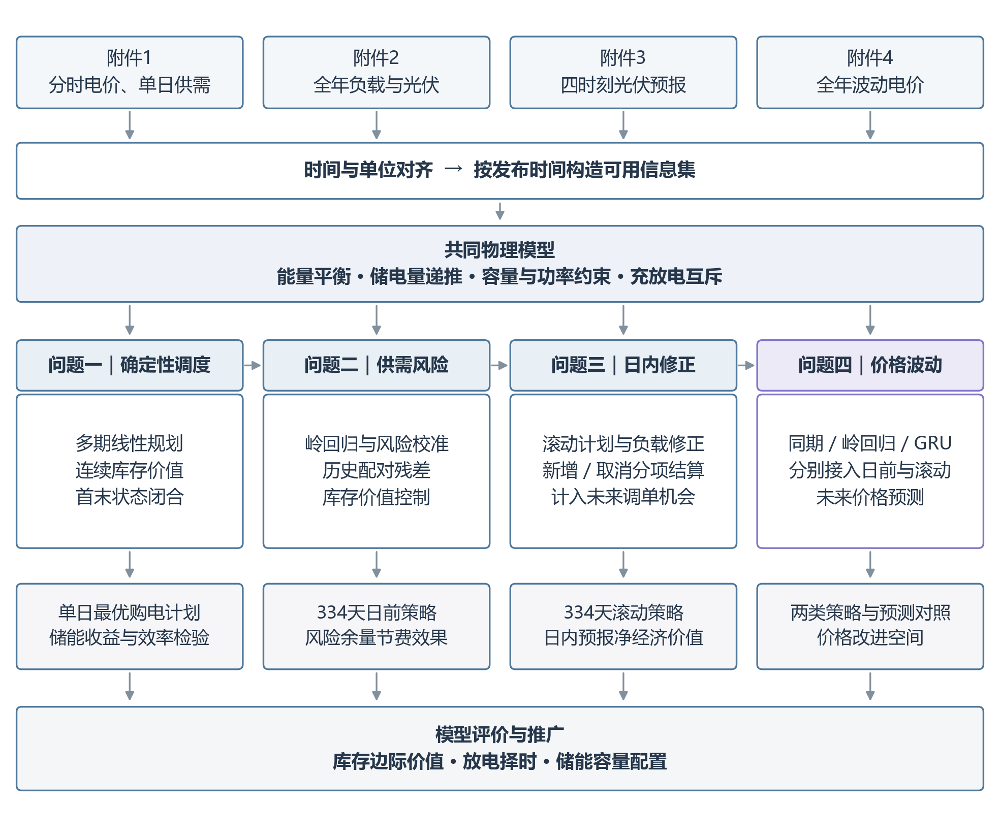
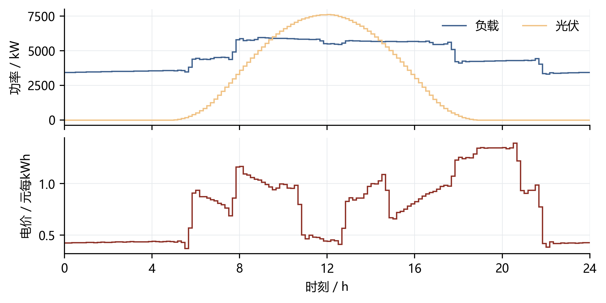
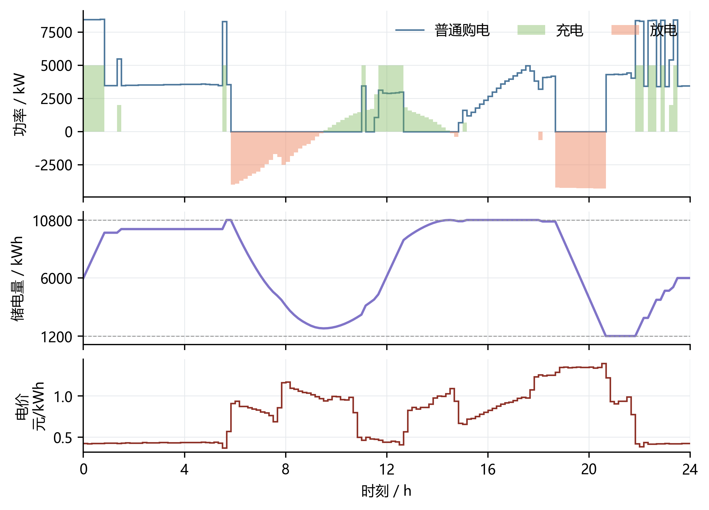
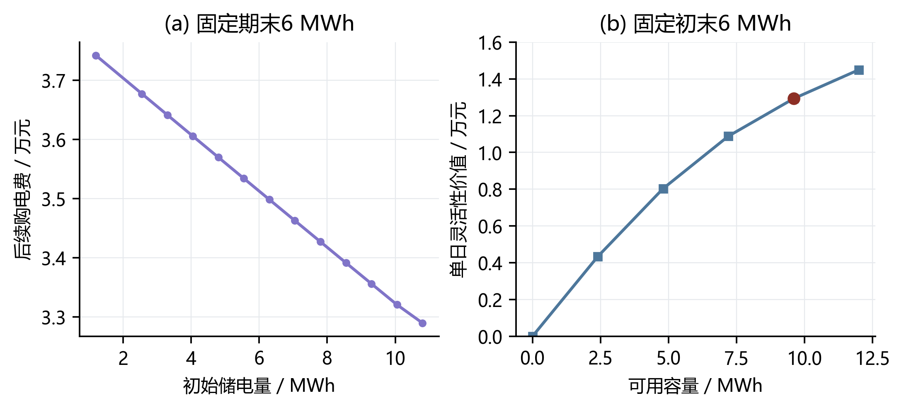
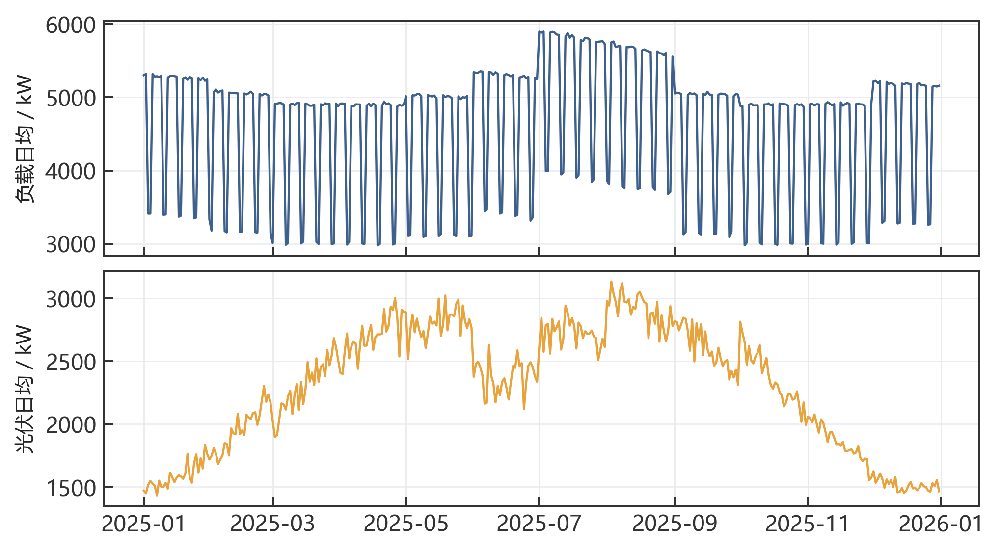
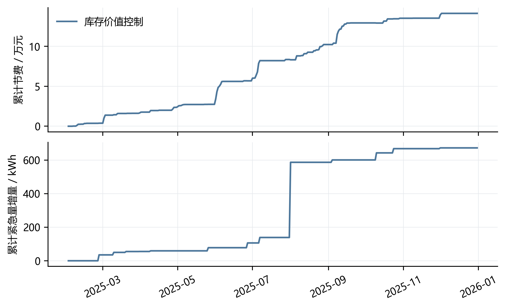
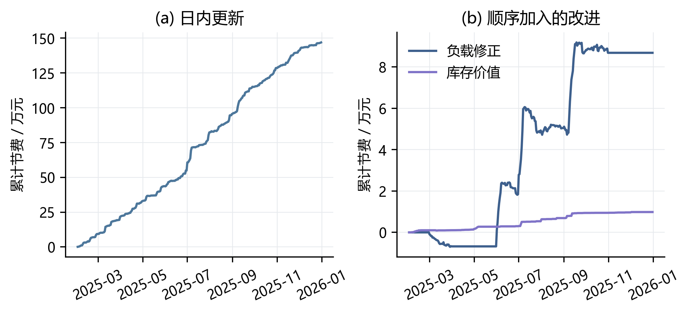
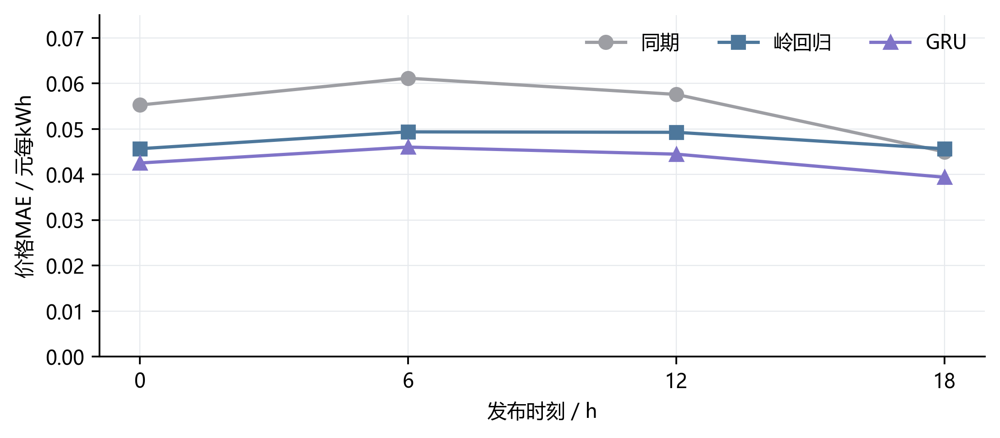

# 基于库存价值与滚动决策的微网购电调控

## 摘 要

微网储能既能利用峰谷价差转移用电，也能在供需偏差出现后调整放电时机。针对计划购电、实时补购及日内调单之间的耦合关系，本文以总购电费用最小为目标，将四个问题统一为信息逐步更新下的库存决策问题。

针对问题一，建立**多期线性规划模型**，联立电量平衡、储电状态和功率容量约束，利用凸分段线性的**连续状态价值函数**描述库存的跨期作用。最优日购电量为59,482.70 kWh，费用35,126.95元，较无储能降低26.90%，对应单日运行灵活性价值12,925.10元。

针对问题二，建立**岭回归预测与分位数风险校准模型**，以70%历史误差分位余量确定日前需求，再通过**历史路径价值控制**将库存分配至后续高价缺口。2—12月334天总费用为13,991,392.60元，较相同计划生成规则下的即时放电策略节省141,219.56元，期末储电量相同。

针对问题三，建立**非对称结算下的滚动优化模型**，结合**负载收缩回归与月度模型选择**更新供需判断，并将下一次调单机会计入库存价值。最终总费用为13,479,283.32元；固定其余条件时，引入6、12、18点预报使基础策略节省1,469,150.15元，说明日内信息具有明确的运行价值。

针对问题四，建立**同期、岭回归及残差GRU电价预测模型**，将预测价格接入日前与滚动决策。GRU价格MAE为0.04366元/kWh，较岭回归降低8.09%；按验证期费用确定价格预测器后，日前与滚动总费用分别为14,765,492.68元和14,210,881.01元。共同名义供需条件下，GRU计划距真实价格最优解的费用差占1.002%。

进一步将库存边际价值解释为储能择时权的机会成本，推导放电条件与容量配置方法。确定性规划、状态递推及逐时账单相互校核，形成从购电计划、实时运行到灵活性评价的完整决策链条。

关键词：微网购电；库存价值；线性规划；分位数校准；滚动优化

## 一 问题重述

### 1.1 研究背景

非孤岛式微网通过外网购电、光伏发电和储能放电共同满足小区负载。光伏富余或电价较低时，储能可吸收电量；负载上升或电价较高时，再将其释放。由于充放电存在损耗，且受功率、容量约束，储能调度需要权衡当前购电支出与后续供电需求。

这一权衡还受到信息和合同的限制。运营者在每日零点申报购电计划时，尚不知道全天真实负载与光伏出力。计划不足可能引发五倍价格的紧急购电，计划过量则产生无法收回的支出。日内预报提供了修订机会，但新增和取消合同各有费用。因此，购电决策既要判断未来需要多少电，也要决定何时使用有限库存。

### 1.2 问题的提出

问题一给定重复发生的电价与负载以及单日光伏预测，要求在零点制定全天购电与储能方案，保证供电不低于负载，且日初、日末储电量相等。

问题二引入逐日变化的负载与光伏，要求仅依靠零点可获得的信息申报当天计划。普通购电按计划量结算，实时缺口按当时电价的五倍补购。

问题三每天在0、6、12、18点提供未来24小时整点光伏预报，允许调整未执行计划。取消部分按半价付费，新增部分按1.5倍价格付费，需要据此制定滚动策略并判断日内更新是否必要。

问题四进一步考虑实时波动电价，重新计算问题二和问题三，比较价格预测、供需预测与储能调度的共同作用。

第二至四问的评价区间为2025年2月1日至12月31日，共334天。各问均给出指定日期和时段的购电、储能及紧急购电结果，并按题目要求保存五份完整工作簿。

## 二 问题分析

### 2.1 问题一的分析

全天供需和价格已知，购电与储能状态由线性约束连接，适合建立多期线性规划。先求得循环运行的最低费用，再把后续费用写成当前储电量的函数。这样既能解释峰谷套利，也为后续不确定环境中的放电决策提供依据。

### 2.2 问题二的分析

供需不确定性使预测误差具有不对称成本。以日、周周期信息预测负载与光伏，并用历史净负载误差设置购电余量，可在计划层控制欠购风险。计划锁定后，利用历史场景估计后续库存价值，避免在低价缺口中提前耗尽储能。

### 2.3 问题三的分析

新预报使未来合同可以修订，储能的后续价值随之变化。将取消和新增购电分别列式，在每次发布时重解剩余时域；同时根据已观测负载偏差更新预测。实时放电不仅取决于后续缺口，还取决于这些缺口能否在下一次发布后通过普通调单解决。

### 2.4 问题四的分析

价格波动改变了当前放电和保留库存的收益。将未来价格预测纳入原有购电与价值递推模型，在执行时以已揭示的当前价格决策。预测精度与实际费用分别评价，从而辨别价格预测改善是否足以改变受约束的储能动作。

四问的递进关系如图1。共同的物理状态与费用目标保持一致，变化的是外生信息及合同调整权限。

图 1 四问递进与共同决策结构

## 三 模型假设与数据处理

### 3.1 参数与运行假设

储能参数见表1。充电、放电效率分别取0.9；充放电功率定义在微网母线侧。储电量记在时段边界，购电、充放电及负载统一用kWh表示。

表 1 储能参数及离散时段

| 参数 | 数值 | 说明 |
| --- | --- | --- |
| 额定容量 | 12,000 kWh | 题设 |
| 允许储电量 | 1,200—10,800 kWh | 题设 |
| 最大充放电功率 | 5,000 kW | 母线侧 |
| 初始储电量 | 6,000 kWh | 1月1日零点 |
| 充电／放电效率 | 0.9／0.9 | 分别计入 |
| 时段长度 | 1/6 h | 十分钟 |

全天划分为144个十分钟区间。将附件中00:10至24:00的记录视为相应前十分钟区间的平均功率或结算电价，所有问题采用同一时间口径；区间内按常值计算，功率乘1/6小时得到电量。整点光伏预报则视为预测时刻的功率点，以线性插值后的区间积分转换为电量。

微网只购电、不向外网售电；无法被负载或电池吸收的电量允许弃用。实际供需及交易电价在当前区间执行时可见，未来实际值不进入计划。暂不计电池退化、爬坡及开关成本。

第一问采用日周期边界，日初和日末均为6,000 kWh。第二至四问从1月1日题设初始状态开始热身，实际储电量逐日传递；名义计划设置6,000 kWh的日末下限，以维持次日备用，实际日末库存由运行过程决定。

### 3.2 时间对齐与数据预处理

附件1含144组单日记录；附件2的负载与光伏各含52,560个观测；附件3包含1,460次预报，每次24个整点；附件4包含52,560个电价。按日期、发布时间和目标区间建立索引，保留0:00+1所表示的次日零点，防止跨日数据落入错误日期。

原始数值无缺失、负数或非有限值，日期覆盖完整。附件3每个日期占四行，其中后三行的空日期仅作标签补齐；光伏零值与极低电价均保留。预处理只统一时间格式和单位，不对真实观测插补、缩尾或平滑。训练标准化和预测非负约束作用于模型输入输出，不改变结算所用的实测数据。

$$
L_{d,t}=P^{\mathrm{load}}_{d,t}\Delta t,\qquad V_{d,t}=P^{\mathrm{PV}}_{d,t}\Delta t,\qquad \Delta t=\frac16\ \mathrm h.
$$

每次历史训练只使用已结束日期。1月22—31日用于参数和执行规则的开发验证，2—12月按时间顺序运行；后续已观测数据可以进入下一次训练。各方案在评价期使用共同初始库存9,902.811288 kWh，以统一运行起点。

## 四 符号说明

主要决策变量与状态变量见表2，各问沿用同一物理量定义。

表 2 主要符号

| 符号 | 含义 | 单位 |
| --- | --- | --- |
| $L_t,V_t$ | 负载电量、光伏电量 | kWh |
| $g_t,e_t$ | 普通购电量、紧急购电量 | kWh |
| $c_t,d_t,w_t$ | 充电、放电、弃电 | kWh |
| $S_t$ | 时段开始的内部储电量 | kWh |
| $p_t$ | 外网交易电价 | 元/kWh |
| $M$ | 单时段母线侧充放电上限 | kWh |
| $x_t,y_t$ | 午夜合同、最终有效合同 | kWh |
| $u_t,v_t$ | 取消量、新增量 | kWh |
| $J_t(s),\bar J_t(s)$ | 后续费用、场景平均后续费用 | 元 |
| $\mu_t(s)$ | 每单位内部库存的边际价值 | 元/kWh |
| $\mathcal I_\tau$ | 发布时刻可获得的信息 | — |

下文省略不引起歧义的日期下标。t表示十分钟时段，τ表示计划或预报的发布时间；实际电量与预测电量分别用原符号及其上方的“帽”区分。

## 五 第一问：确定性购电与库存价值

### 5.1 多期购电模型

单日负载、光伏和价格见图2。光伏集中于日间，而负载持续存在，单纯按净负载购电无法充分利用峰谷价差。储能把不同时段联系起来：一次充电既增加当前购电量，也改变后续可用于供电的库存。

图 2 第一问供需与电价

以全天普通购电费最小为目标，建立以下模型：

$$
\begin{aligned}
\min\quad &C_1=\sum_{t=1}^{144}p_tg_t,\\
\text{s.t.}\quad &g_t+V_t+d_t=L_t+c_t+w_t,\\
&S_{t+1}=S_t+\eta_c c_t-d_t/\eta_d,\\
&S_{\min}\le S_t\le S_{\max},\qquad 0\le c_t,d_t\le M,\\
&g_t,w_t\ge0,\qquad c_td_t=0,\qquad S_1=S_{145}=6000.
\end{aligned}
$$

其中w为富余电量，允许供给超过负载和充电需求。M＝5,000/6＝833.33 kWh是母线侧单时段充放电上限。状态方程计入双向效率损失，因此同样的外部充电量不能全部回收为可用放电量。

求解时先放松充放电互斥，再消除无效循环。令ρ＝ηcηd，取a＝min(c,d/ρ)，将充电、放电、弃电分别改为c−a、d−ρa、w＋(1−ρ)a。该变换保持库存变化、电量平衡和购电费，且至少一种动作归零。因此可由线性规划直接获得同费用的可执行调度。模型使用HiGHS求解[1–2]。

### 5.2 最优调度结果

最优日购电量为59,482.70 kWh，总费用35,126.95元，日初、日末库存均为6,000 kWh。图3显示低价时集中购电充电、高价时释放库存的运行结构；指定时段与四小时汇总见表3、表4。

图 3 第一问购电与储能运行

表 3 第一问指定时段购电及全天费用

| 时间段 | 购电量 | 时间段 | 购电量 | 时间段 | 购电量 |
| --- | --- | --- | --- | --- | --- |
| 10:00-10:10 | 0.00 | 12:00-12:10 | 480.41 | 14:00-14:10 | 0.00 |
| 16:00-16:10 | 445.43 | 18:00-18:10 | 531.89 | 20:00-20:10 | 0.00 |
| 全天购电量 | 59,482.70 | 全天购电费 | 35,126.95 | — | — |

表 4 第一问四小时充放电及首末库存

| 时间段 | 充电量 | 放电量 | 时间段 | 充电量 | 放电量 |
| --- | --- | --- | --- | --- | --- |
| 00:00-04:00 | 4,500.00 | 0.00 | 04:00-08:00 | 833.33 | 6,365.84 |
| 08:00-12:00 | 4,787.96 | 1,703.00 | 12:00-16:00 | 5,286.04 | 91.10 |
| 16:00-20:00 | 0.00 | 5,780.13 | 20:00-24:00 | 5,333.33 | 2,859.87 |
| 00:00储电量 | 6,000.00 | — | 24:00储电量 | 6,000.00 | — |

不使用储能时，每个区间直接购买正净负载，费用为48,052.05元。储能使日费用下降12,925.10元，即26.90%。四小时汇总块中可以同时出现充、放电量，这是块内不同时段的动作累积；十分钟动作仍保持互斥。

### 5.3 价值函数及其经济解释

为把这一调度推广到变化的库存状态，令J_t(s)表示从时段t开始、当前库存为s时的最低后续购电费。以v＝s−s′表示电池内部库存的释放量，n＝L−V表示净负载，则母线获得的净电量及单时段购电费为：

$$
\phi(v)=\begin{cases}\eta_dv,&v\ge0,\\v/\eta_c,&v<0,\end{cases}\qquad h_t(v)=p_t\max\{n_t-\phi(v),0\}.
$$

由最优性原理，当前动作与后续费用满足：

$$
J_t(s)=\min_{s'\in\mathcal S(s)}\{h_t(s-s')+J_{t+1}(s')\},\qquad J_{145}(s)=\begin{cases}0,&s=6000,\\+\infty,&s\ne6000.\end{cases}
$$

集合S(s)由库存及充放电上限确定。非负电价和ηcηd≤1使h为凸分段线性函数；递推中的下确界卷积与可行区间限制保持凸性[7]。因此J可用有限折点表示，逐段归并斜率即可完成连续状态递推，无需离散库存网格。该日初始价值函数有13个折点，在6,000 kWh处给出上述最优费用。

定义库存边际价值μ_t(s)＝−∂J_t(s)/∂s，其单位为元/内部kWh。增加库存能够少付的后续购电费就是该库存的机会成本。由于J具有凸性，边际价值随库存增加而不增；在折点处取相应的左右边际值。图4(a)展示这一关系，日初6,000 kWh附近的边际价值约为0.4754元/kWh。

图 4 库存费用函数与容量的运行价值

从经济意义看，储能赋予运营者选择用电时机的权利，这与实物期权所刻画的运行灵活性相联系[8]。本题不涉及售电，择时收益体现为避免未来购电支出。下一问将沿用这一机会成本，将确定性后续费用扩展为历史供需场景下的价值估计。

## 六 第二问：预测、风险校准与实时控制

### 6.1 供需预测

附件负载具有明显周周期：同槽七日相关系数为0.9855，日总负载七日相关为0.9880。光伏则同时受昼夜形状和逐日变化影响。图5展示全年供需结构，这些规律用于构造预测特征，而不直接代替实际费用评价。

图 5 全年负载与光伏分布

对负载与光伏分别建立岭回归[3]。输入包括昨日、前日、上周同日同槽值，近三日及七日同槽均值、七日同槽标准差、昨日及近三日全天均值，以及日内前三阶正余弦和星期指示，共21个特征。采用带截距的目标函数：

$$
\min_{\beta,b}\sum_{i\in\mathcal T_d}(y_i-b-\widetilde x_i^{\mathsf T}\beta)^2+\lambda\|\beta\|_2^2.
$$

标准化参数只从当次训练集估计，截距不惩罚。模型从1月15日开始每七天更新，使用最近至多60个完整日；惩罚系数在1、10、100中按一月预测误差选为1。预测截断为非负，过去七日同槽光伏全为零时预测置零。历史不足时用近三日均值和日周同期均值完成热身。

同期预测取昨日与上周同日同槽值的平均，用作可解释的预测参照。全年岭回归的负载MAE、RMSE分别为179.86、234.59 kW，光伏分别为155.28、306.74 kW。图6给出指定日期的预测与实测，误差将通过风险校准和实时控制进入后续决策。

图 6 指定日期的负载与光伏预测

### 6.2 非对称风险与日前购电

低估净负载会触发五倍补购，高估则形成普通计划支出，二者的费用并不对称。定义预测净负载误差：

$$
\varepsilon_{j,s}=(L_{j,s}-V_{j,s})-(\hat L_{j,s}-\hat V_{j,s}),\qquad r_{d,t}(q)=\max\{0,Q_q(\mathcal E_{d,t})\}.
$$

误差池E使用此前至多28日、目标时段前后三槽的已发生误差，不跨日环绕；排除首日冷启动误差。q为历史误差的分位水平，余量r加在预测负载上，形成名义需求L̂＋r。每日零点将其与光伏预测代入第五章的规划，初始状态取实际库存，末端条件改为S_145≥6,000 kWh。

在无储能的单时段模型中，最小化p·g＋5p·E[(D−g)⁺]会得到0.8临界分位。跨时段储能和日末备用改变了这一关系，因此本文按完整运行费用选择q。一月验证选择70%余量：即时执行器下验证费509,757.47元；提高至90%虽消除该窗口紧急量，却使总费升至633,664.05元。风险校准由总费用约束，避免为压低缺口而过量申报。

### 6.3 历史路径下的库存价值控制

计划确定后，普通购电费按合同支付，实时阶段需要决定电池如何应对净缺口。每次发布取此前至多28个完整日，将负载与光伏的配对残差叠加到当前预测，分别截断为非负后得到K条场景。配对保留了同一历史日供需误差的关联及日内形状。

对第k条场景递推其后续紧急购电费用J_t^(k)(s)。场景内计划量固定，富余优先充电，紧急购电仅补负载；日末附加价值取零。以路径函数均值近似当前信息下的后续费用：

$$
\bar J_t(s)=\frac1K\sum_{k=1}^{K}J_t^{(k)}(s).
$$

在当前实际净缺口n_t＝L_t−V_t−g_t＞0时，下一库存按下式确定：

$$
S_{t+1}\in\arg\min_{z\in[\max\{S_{\min},S_t-\min(n_t,M)/\eta_d\},S_t]}\{5p_t[n_t-\eta_d(S_t-z)]+\bar J_{t+1}(z)\}.
$$

该目标仍为凸分段线性，只需比较可达区间端点及路径价值折点。放电一单位内部库存节省5p_tηd元；当它高于库存后续边际价值μ̄时，放电有利，反之应保留库存。这一条件将第五章的机会成本直接转化为实时动作。

当n_t≤0时，充电量取min(−n_t,M,(S_max−S_t)/ηc)，剩余电量弃用。无论采用何种动作，负载缺口均由紧急购电补足。下一时段与次日从实际末状态继续，全年实际费用为：

$$
C_2=\sum_{d,t}p_t(g_{d,t}+5e_{d,t}).
$$

## 七 第二问：运行结果与机制分析

### 7.1 策略选择与全年结果

一月验证中，路径价值控制费用为509,140.53元，低于即时放电执行器的509,757.47元。零终端价值与低谷价折算终端价值同分，选取较简单的零值规则。随后按时间顺序运行334天，结果见表5。

表 5 第二问执行策略的费用与库存

| 指标 | 即时放电 | 库存价值控制 |
| --- | --- | --- |
| 普通计划费/元 | 12,935,046.95 | 12,934,997.78 |
| 紧急购电费/元 | 1,197,565.21 | 1,056,394.83 |
| 总费用/元 | 14,132,612.16 | 13,991,392.60 |
| 紧急电量/kWh | 197,465.10 | 198,137.46 |
| 期末库存/kWh | 5,903.65 | 5,903.65 |

路径价值控制总费用13,991,392.60元，较相同预测、余量及计划生成规则下的即时执行器节省141,219.56元，降幅0.999%。两方案期末库存均为5,903.65 kWh。普通计划费仅变化49.17元，主要收益来自紧急费用下降141,170.39元。

### 7.2 放电择时的作用

即时执行器遇缺口便尽量放电，容易把库存用于较便宜的时段。价值控制在当前补购成本较低时保留部分库存，以减少后续昂贵缺口。由此，紧急购电量从197,465.10增至198,137.46 kWh，费用却下降。数量与支出方向不同，说明调度优化需要同时考虑价格和时点。

由图7可见，累计节费与紧急量变化并不同步，库存价值控制通过调整放电时段降低账单。四个指定日期的详细结果见附录A。

图 7 日前库存价值控制的累计费用与补购量变化

### 7.3 参数稳定性

在保持原即时执行器、风险余量和其他设置不变时，28、56、60、84日训练窗的全年费用分别为14,211,345.15、14,152,541.05、14,132,612.16、14,033,154.46元。该结果说明更长历史在本年有潜力，但窗口取整周并不保证费用更低。一月训练历史尚短，无法区分这些上限，主策略继续采用既定60日窗。

这里的窗口对照用于识别季节稳定性；实际部署中，窗口长度需由当时可获得的验证数据确定。第三问将进一步利用日内已观测负载，而不仅依赖零点生成的全天预测。

## 八 第三问：信息更新与合同调整

### 8.1 光伏预报与可用信息

每次发布提供未来1至24小时整点功率。对相邻整点作线性插值并计算各十分钟区间积分；发布时刻的左端点由最近已结束区间的实测光伏近似。只取当前日期内尚未执行的部分，不将下一日真实数据用于边界补齐。图8给出同一日期各版预报与实际光伏。

图 8 各发布时刻的光伏预报

滚动规划在0、6、12、18点运行，每次以当时实际库存为初值，固定过去动作，重算当前至24点的计划。该处理与模型预测控制的滚动时域思想一致[4]。

### 8.2 合同费用与滚动规划

记x_t为午夜计划、y_t为执行前最后一次有效计划。取消量u_t＝(x_t−y_t)⁺，新增量v_t＝(y_t−x_t)⁺。普通合同及紧急购电费用统一写为：

$$
C_3=\sum_{d,t}p_t\{\min(x_t,y_t)+0.5u_t+1.5v_t+5e_t\}=\sum_{d,t}p_t\{x_t-0.5u_t+1.5v_t+5e_t\}.
$$

保留合同全额结算，取消部分仍付半价，新增部分按1.5倍付费。每次规划相对于同一午夜合同列式，以有效计划作为供电输入；已执行时段的合同和费用不再改变。

在发布时刻τ，剔除与当前决策无关的午夜合同常数后，剩余时域的目标为：

$$
\min\sum_{t\in\mathcal T_\tau}p_t(1.5v_t-0.5u_t),\qquad y_t-x_t=v_t-u_t,\quad u_t,v_t\ge0.
$$

约束沿用第五章物理模型，负载与光伏替换为当次预测及其风险余量，日末名义库存下限仍为6,000 kWh。按一月验证费用选择50%余量，并在三个后续发布时刻全部更新。

### 8.3 负载偏差修正

光伏预报更新时，日内已观测的负载也提供新信息。以发布前18个区间的平均负载预测误差作为当前偏差x，以历史目标小时的平均误差为响应y，对不同发布时刻和提前小时分别拟合收缩回归：

$$
\hat\beta_{d,v,h}=\operatorname{clip}_{[0,1.5]}\left(\frac{\sum_{i\in H_d}x_{i,v}y_{i,v,h}}{1.2\sum_{i\in H_d}x_{i,v}^{2}}\right),\qquad\hat L^{A}_{d,v,t}=\max\{0,\hat L^0_{d,t}+\hat\beta_{d,v,h(t)}x_{d,v}\}.
$$

H包含此前至多28个已结束日期；历史不足七个完整日不启用修正，分母为零时系数取零。系数非负与上限约束限制短样本放大，1.2倍分母相当于20%的平方尺度收缩。每个预测族使用自身历史误差重新计算风险余量。

月初分别回放此前28天的基础预测与修正预测，从共同已知库存出发，按实际费用选择本月预测族。该选择信号由即时执行器的历史影子运行生成；真实系统随后按价值控制器运行，两者的库存记录分别保持连续。2月沿用一月选择，此后只使用过去月份的信息。

6、12、18点修正后的负载MAE分别为27.96、28.85、27.68 kWh/十分钟，较未修正降低7.61%、6.85%、12.34%。实际在3、6、7、8、9、10月启用修正，其余月份采用基础预测。

### 8.4 可调单条件下的库存价值

合同可调整后，后续缺口不必全部依靠五倍紧急购电。为将这一机会纳入第六章价值递推，当前至下次发布前的场景缺口仍按五倍价估计，下一次发布后的缺口则以1.5倍预测价近似其可新增合同的边际成本。每次发布重建后续函数，只执行随后的36个时段。

这个近似把未来调单机会反映在当前放电条件中：能够在下一次发布后以较低费用补购的缺口，对保留库存的要求较弱。实际运行账单仍严格按第8.2节计算，所有真实紧急购电均付五倍价。

### 8.5 更新信息的经济价值

固定50%余量、负载预测与即时执行器，比较仅使用零点预报与使用全部四次预报，费用分别为15,045,126.93元和13,575,976.78元，节省1,469,150.15元，降幅9.76%。日内预报使一部分供电缺口提前转化为普通计划调整，紧急费下降足以覆盖调整费用，因此有必要使用其他时刻预报。

在此基础上，月度负载选择将费用降至13,489,127.94元；再加入可调单库存价值控制，最终费用为13,479,283.32元，紧急购电量79,340.34 kWh。图9按实际加入顺序展示增益。各阶段的比较对象不同，分解用于解释改进过程，不假设各模块收益彼此独立。

图 9 日内信息更新及后续改进的累计收益

表 6 第三问最终方案的费用构成

| 费用项目 | 金额/元 |
| --- | --- |
| 午夜原合同 | 12,524,675.97 |
| 新增合同费用 | 739,101.35 |
| 取消合同半价抵扣 | -221,795.48 |
| 紧急购电 | 437,301.48 |
| 总费用 | 13,479,283.32 |

最终方案的费用分解见表6，指定日计划、储能与紧急购电见附录A。普通合同的每次修改均保留发布时间及有效区间，保证滚动计划能够对应到实际执行。

## 九 第四问：波动电价下的联合决策

### 9.1 价格预测

附件4电价范围为0.0076—1.7936元/kWh。价格的日内结构为择时提供依据，其随机偏离则使库存机会成本发生变化。三类预测器均使用发布前历史和已知日历信息，输出未来144个十分钟目标，只将当日剩余部分送入调度。

同期预测取昨日与上周同一目标时段价格的均值；岭回归在滞后价格、统计量和周期特征上建立12维线性预测；残差GRU在同期预测基础上学习非线性修正。GRU输入包括昨日价、上周价、日内正余弦及星期正余弦，采用单层32维隐藏状态[5–6]：

$$
\hat p_{\tau,j}=\max\{0.001,\hat p^{\mathrm{seasonal}}_{\tau,j}+s_y(w^{\mathsf T}h_j+b)\},\qquad h_j=\operatorname{GRU}(x_j,h_{j-1}).
$$

sy为当次训练价格标准差，输出头从零初始化。使用SmoothL1损失与Adam优化器，学习率0.003、批量32、梯度范数上限1，最多50轮，内部验证连续六轮无改进即停止。每次使用此前至多60日，最近三个完整日用于内部验证；未全部发生的目标窗口不进入训练。

在1月15日、22日及此后月初拟合，三个基种子17、42、2026各与拟合日编号相加，最终等权集成。图10比较相同发布时刻和目标范围的价格误差。

图 10 各发布时刻的电价预测误差

GRU在四组比较中均取得最低MAE，按全部120,240个发布—目标配对加权，MAE为0.04366元/kWh，较同期降低22.70%，较岭回归降低8.09%。同一目标可在不同发布时刻被预测，所有模型按相同配对计算误差。

### 9.2 价格与库存控制的衔接

在日前分支，午夜价格预测进入合同优化及固定合同后续价值；在滚动分支，每次新价格预测与供需信息共同进入剩余时域规划，后续价值同时计入调单机会。当前区间动作使用已揭示的实际电价，未来函数使用当次预测价格，结算则使用实际交易价。

价格预测器按一月实际费用选择：日前采用岭回归，滚动采用同期预测。保持基础调度规则时，GRU虽然价格误差更低，但其滚动年度费用仅比同期低2,094.78元。容量、功率和效率限制了动作空间；当几种预测给出相同峰谷价序时，误差降低未必改变购电和放电决策。

接入库存价值控制后，日前费用14,765,492.68元，较即时执行器节省115,042.37元；滚动费用14,210,881.01元，较仅采用月度负载选择的方案再省5,444.97元。完整结果见表7，指定日期见附录A。

表 7 四问最终费用与运行区间

| 问题 | 总费用/元 | 运行区间 |
| --- | --- | --- |
| 一 | 35,126.95 | 单日 |
| 2 | 13,991,392.60 | 334天 |
| 3 | 13,479,283.32 | 334天 |
| 4-2 | 14,765,492.68 | 334天 |
| 4-3 | 14,210,881.01 | 334天 |

### 9.3 价格信息的名义改善空间

为衡量价格预测尚能改变多少计划费用，固定供需预测、风险余量、日初库存和日末条件，构造共同名义可行域Ω_d。以真实价格在该可行域求最小费用J_d*，并用同一真实价格评价预测器m产生的名义计划，记为J_m,d，则：

$$
J_d^*=\min_{g\in\Omega_d}p_d^{\mathsf T}g,\qquad J_{m,d}=p_d^{\mathsf T}g_{m,d},\qquad 0\le\Delta_m\le\sum_d(J_{m,d}-J_d^*).
$$

基础名义计划实验中，GRU费用为13,656,357.29元，真实价格最优费用为13,519,514.66元，由未舍入值计算差额136,842.64元，占1.002%。这表示在该组供需与储能条件下，仅改善价格预测的名义节费空间有限。实际运行还包含供需误差、紧急购电和状态反馈，故与上述名义费用分别核算。

由第二至四问可见，供需校准决定缺口大小，合同调整决定补购途径，库存价值决定有限电量的使用时机。价格信息通过同一价值函数参与决策，而不是形成一套与前文分离的调度模型。

## 十 模型的评价与推广

### 10.1 模型的优点

（1）物理模型与决策时序统一。四问共用电量平衡和库存递推，仅随问题条件增加预测与合同权限；日前计划、日内修订和实时执行均可对应到同一状态轨迹。

（2）风险与成本直接关联。历史分位余量控制欠购风险，价值函数进一步区分缺口发生的价格和时点。第二问在相同初末库存下节省141,219.56元，表明有限储能的配置方式可以在总补购量变化很小时降低支出。

（3）求解结构清晰。循环消除使线性规划获得可执行动作，连续凸分段线性递推保留库存边际信息。名义优化最优值、物理约束及逐时账单经交叉核算一致，模型能够从计划层追溯到运行结果。

（4）信息价值可分解。固定其余条件比较预报更新，再按顺序加入负载修正和库存控制，区分信息、预测与执行的作用，为选择数据服务和控制策略提供费用依据。

### 10.2 模型的局限

（1）十分钟均值忽略区间内快速波动，线性效率未包含退化、爬坡及开关损耗。时间记录的区间均值解释与当前电价可见性是运行假设，实际部署需与计量及交易机制匹配。

（2）历史路径均值近似后续费用；滚动分支用1.5倍价格概括未来新增合同机会，未联合枚举未来取消、调单和供需的多阶段场景。确定性名义模型可证明最优，随机环境下的全年策略属于可实施近似。

（3）数据仅覆盖一年，模型经过同年开发复核。配对区块重采样反映该年固定轨迹的波动，不能覆盖模型选择偏差和跨年分布变化；日末备用及训练窗口仍需独立数据检验。

### 10.3 模型推广

**储能灵活性的价值评估。** 令Π为受功率、容量和合同约束的可行策略集合，固定规则π₀的预计费用为C^π₀。允许根据已揭示信息择时运行时，运营灵活性价值可定义为：

$$
\mathcal F_t(s)=C_t^{\pi_0}(s)-\inf_{\pi\in\Pi}\mathbb E[C_t^{\pi}\mid\mathcal I_t,S_t=s].
$$

只要π₀属于Π，F即非负。该差额对应运营者获得调节时机选择权后可避免的支出，可视为储能运行实物期权的价值[8]。本文按真实费用评价这一灵活性，不额外假定交易市场完备或构造金融衍生品的无套利价格。

**容量配置。** 将允许库存区间以6,000 kWh为中心对称扩展，保持初末状态和5,000 kW功率不变，重新求解所得结果见图4(b)。可用容量为2,400、4,800、7,200、9,600、12,000 kWh时，单日节费分别为4,337.35、8,031.64、10,882.46、12,925.10、14,495.30元。扩容增加可行策略，节费随容量上升，但边际收益递减。以各季代表日加权得到年运行收益后，可与增容及退化费用比较，确定经济容量；本题未给出投资数据，因此不计算投资回收期。

**风险管理与其他灵活负载。** 对极端缺口敏感的运营者，可在预期费用中加入尾部风险项，将目标扩展为E[C]＋λ·CVaR_α(C)，再由承受能力确定风险权重。对于电动汽车群或可调节冷热负荷，只需替换状态方程和可行动作，保留库存边际价值与信息更新的递推结构，即可研究不同设备的协同择时。新增风险与设备参数需重新验证，不能直接沿用本题数值。

## 参考文献

[1] SciPy Developers. scipy.optimize.milp: Mixed-integer linear programming[EB/OL]. https://docs.scipy.org/doc/scipy/reference/generated/scipy.optimize.milp.html.

[2] Huangfu Q, Hall J A J. Parallelizing the dual revised simplex method[J]. Mathematical Programming Computation, 2018, 10: 119–142. DOI:10.1007/s12532-017-0130-5.

[3] Hoerl A E, Kennard R W. Ridge regression: Biased estimation for nonorthogonal problems[J]. Technometrics, 1970, 12(1): 55–67. DOI:10.1080/00401706.1970.10488634.

[4] Mayne D Q, Rawlings J B, Rao C V, Scokaert P O M. Constrained model predictive control: Stability and optimality[J]. Automatica, 2000, 36(6): 789–814. DOI:10.1016/S0005-1098(99)00214-9.

[5] PyTorch Contributors. GRU[EB/OL]. https://docs.pytorch.org/docs/stable/generated/torch.nn.GRU.html.

[6] Cho K, van Merriënboer B, Gulcehre C, et al. Learning phrase representations using RNN encoder–decoder for statistical machine translation[C]. EMNLP, 2014: 1724–1734. DOI:10.3115/v1/D14-1179.

[7] Boyd S, Vandenberghe L. Convex Optimization[M]. Cambridge University Press, 2004.

[8] Carmona R, Ludkovski M. Valuation of energy storage: An optimal switching approach[J]. Quantitative Finance, 2010, 10(4): 359–374. DOI:10.1080/14697680902946514.

## 附录 A 四问指定日期完整结果

电量单位为kWh，费用单位为元。普通购电与紧急购电分列。滚动问题的指定时段和全天购电量指最终有效普通计划；午夜计划及每次更新完整保存在Excel中。所有表由实际轨迹自动生成。

### A.1 问题1

对应结果见表 8。

表 8 问题1（单日） 指定时段购电及全天费用

| 时间段 | 购电量 | 时间段 | 购电量 | 时间段 | 购电量 |
| --- | --- | --- | --- | --- | --- |
| 10:00-10:10 | 0.00 | 12:00-12:10 | 480.41 | 14:00-14:10 | 0.00 |
| 16:00-16:10 | 445.43 | 18:00-18:10 | 531.89 | 20:00-20:10 | 0.00 |
| 全天购电量 | 59,482.70 | 全天购电费 | 35,126.95 | — | — |

对应结果见表 9。

表 9 问题1（单日） 储能运行

| 时间段 | 充电量 | 放电量 | 时间段 | 充电量 | 放电量 |
| --- | --- | --- | --- | --- | --- |
| 00:00-04:00 | 4,500.00 | 0.00 | 04:00-08:00 | 833.33 | 6,365.84 |
| 08:00-12:00 | 4,787.96 | 1,703.00 | 12:00-16:00 | 5,286.04 | 91.10 |
| 16:00-20:00 | 0.00 | 5,780.13 | 20:00-24:00 | 5,333.33 | 2,859.87 |
| 00:00储电 | 6,000.00 | — | 24:00储电 | 6,000.00 | — |

### A.2 问题2

对应结果见表 10。

表 10 问题2（2025-03-20） 指定时段购电及全天费用

| 时间段 | 购电量 | 时间段 | 购电量 | 时间段 | 购电量 |
| --- | --- | --- | --- | --- | --- |
| 10:00-10:10 | 0.00 | 12:00-12:10 | 574.14 | 14:00-14:10 | 0.00 |
| 16:00-16:10 | 488.93 | 18:00-18:10 | 720.76 | 20:00-20:10 | 0.00 |
| 全天购电量 | 68,036.47 | 全天购电费 | 41,302.44 | — | — |

对应结果见表 11。

表 11 问题2（2025-03-20） 储能运行

| 时间段 | 充电量 | 放电量 | 时间段 | 充电量 | 放电量 |
| --- | --- | --- | --- | --- | --- |
| 00:00-04:00 | 4,071.86 | 209.79 | 04:00-08:00 | 1,038.99 | 5,515.86 |
| 08:00-12:00 | 6,186.28 | 2,777.38 | 12:00-16:00 | 4,162.63 | 444.57 |
| 16:00-20:00 | 266.98 | 5,654.71 | 20:00-24:00 | 5,687.88 | 2,954.47 |
| 00:00储电 | 6,617.05 | — | 24:00储电 | 6,382.68 | — |

对应结果见表 12。

表 12 问题2（2025-03-20） 紧急购电

| 时段 | 电量 |
| --- | --- |
| 17:20-17:30 | 5.19 |

对应结果见表 13。

表 13 问题2（2025-06-21） 指定时段购电及全天费用

| 时间段 | 购电量 | 时间段 | 购电量 | 时间段 | 购电量 |
| --- | --- | --- | --- | --- | --- |
| 10:00-10:10 | 0.00 | 12:00-12:10 | 0.00 | 14:00-14:10 | 0.00 |
| 16:00-16:10 | 210.92 | 18:00-18:10 | 0.00 | 20:00-20:10 | 0.00 |
| 全天购电量 | 36,315.40 | 全天购电费 | 21,120.39 | — | — |

对应结果见表 14。

表 14 问题2（2025-06-21） 储能运行

| 时间段 | 充电量 | 放电量 | 时间段 | 充电量 | 放电量 |
| --- | --- | --- | --- | --- | --- |
| 00:00-04:00 | 526.76 | 524.94 | 04:00-08:00 | 413.77 | 4,402.74 |
| 08:00-12:00 | 9,426.35 | 0.00 | 12:00-16:00 | 0.00 | 0.00 |
| 16:00-20:00 | 151.96 | 5,493.83 | 20:00-24:00 | 6,132.83 | 2,497.81 |
| 00:00储电 | 6,945.01 | — | 24:00储电 | 7,576.71 | — |

对应结果见表 15。

表 15 问题2（2025-06-21） 紧急购电

| 时段 | 电量 |
| --- | --- |
| 无 | 0.00 |

对应结果见表 16。

表 16 问题2（2025-09-23） 指定时段购电及全天费用

| 时间段 | 购电量 | 时间段 | 购电量 | 时间段 | 购电量 |
| --- | --- | --- | --- | --- | --- |
| 10:00-10:10 | 0.00 | 12:00-12:10 | 491.40 | 14:00-14:10 | 0.00 |
| 16:00-16:10 | 549.29 | 18:00-18:10 | 788.73 | 20:00-20:10 | 0.00 |
| 全天购电量 | 71,561.09 | 全天购电费 | 44,415.98 | — | — |

对应结果见表 17。

表 17 问题2（2025-09-23） 储能运行

| 时间段 | 充电量 | 放电量 | 时间段 | 充电量 | 放电量 |
| --- | --- | --- | --- | --- | --- |
| 00:00-04:00 | 5,252.67 | 0.00 | 04:00-08:00 | 218.14 | 5,830.96 |
| 08:00-12:00 | 5,558.85 | 1,896.62 | 12:00-16:00 | 4,033.40 | 575.17 |
| 16:00-20:00 | 231.66 | 5,642.21 | 20:00-24:00 | 6,050.86 | 2,841.96 |
| 00:00储电 | 6,072.60 | — | 24:00储电 | 6,631.50 | — |

对应结果见表 18。

表 18 问题2（2025-09-23） 紧急购电

| 时段 | 电量 |
| --- | --- |
| 20:20-20:30 | 0.33 |

对应结果见表 19。

表 19 问题2（2025-12-21） 指定时段购电及全天费用

| 时间段 | 购电量 | 时间段 | 购电量 | 时间段 | 购电量 |
| --- | --- | --- | --- | --- | --- |
| 10:00-10:10 | 0.00 | 12:00-12:10 | 967.61 | 14:00-14:10 | 0.00 |
| 16:00-16:10 | 812.86 | 18:00-18:10 | 739.98 | 20:00-20:10 | 0.00 |
| 全天购电量 | 97,145.51 | 全天购电费 | 62,434.14 | — | — |

对应结果见表 20。

表 20 问题2（2025-12-21） 储能运行

| 时间段 | 充电量 | 放电量 | 时间段 | 充电量 | 放电量 |
| --- | --- | --- | --- | --- | --- |
| 00:00-04:00 | 4,629.25 | 143.74 | 04:00-08:00 | 1,398.62 | 1,538.91 |
| 08:00-12:00 | 5,704.82 | 7,168.67 | 12:00-16:00 | 6,940.07 | 2,243.11 |
| 16:00-20:00 | 24.16 | 5,708.86 | 20:00-24:00 | 5,695.76 | 2,842.53 |
| 00:00储电 | 6,318.60 | — | 24:00储电 | 6,443.34 | — |

对应结果见表 21。

表 21 问题2（2025-12-21） 紧急购电

| 时段 | 电量 |
| --- | --- |
| 07:50-08:00 | 23.78 |

### A.3 问题3

对应结果见表 22。

表 22 问题3（2025-03-20） 指定时段购电及全天费用

| 时间段 | 购电量 | 时间段 | 购电量 | 时间段 | 购电量 |
| --- | --- | --- | --- | --- | --- |
| 10:00-10:10 | 0.00 | 12:00-12:10 | 520.67 | 14:00-14:10 | 0.00 |
| 16:00-16:10 | 638.18 | 18:00-18:10 | 714.94 | 20:00-20:10 | 0.00 |
| 全天购电量 | 66,401.94 | 全天购电费 | 42,938.13 | — | — |

对应结果见表 23。

表 23 问题3（2025-03-20） 储能运行

| 时间段 | 充电量 | 放电量 | 时间段 | 充电量 | 放电量 |
| --- | --- | --- | --- | --- | --- |
| 00:00-04:00 | 4,249.82 | 348.06 | 04:00-08:00 | 1,010.91 | 5,813.27 |
| 08:00-12:00 | 3,254.96 | 2,698.33 | 12:00-16:00 | 6,483.14 | 254.72 |
| 16:00-20:00 | 646.16 | 5,206.99 | 20:00-24:00 | 5,530.12 | 3,018.64 |
| 00:00储电 | 6,309.41 | — | 24:00储电 | 6,100.33 | — |

对应结果见表 24。

表 24 问题3（2025-03-20） 紧急购电

| 时段 | 电量 |
| --- | --- |
| 09:40-10:00 | 79.05 |
| 21:40-21:50 | 4.66 |

对应结果见表 25。

表 25 问题3（2025-06-21） 指定时段购电及全天费用

| 时间段 | 购电量 | 时间段 | 购电量 | 时间段 | 购电量 |
| --- | --- | --- | --- | --- | --- |
| 10:00-10:10 | 0.00 | 12:00-12:10 | 0.00 | 14:00-14:10 | 0.00 |
| 16:00-16:10 | 120.43 | 18:00-18:10 | 0.00 | 20:00-20:10 | 0.00 |
| 全天购电量 | 34,874.69 | 全天购电费 | 19,723.09 | — | — |

对应结果见表 26。

表 26 问题3（2025-06-21） 储能运行

| 时间段 | 充电量 | 放电量 | 时间段 | 充电量 | 放电量 |
| --- | --- | --- | --- | --- | --- |
| 00:00-04:00 | 275.76 | 271.67 | 04:00-08:00 | 449.87 | 3,308.89 |
| 08:00-12:00 | 9,888.78 | 0.00 | 12:00-16:00 | 0.00 | 0.00 |
| 16:00-20:00 | 41.37 | 6,074.66 | 20:00-24:00 | 5,603.72 | 2,654.17 |
| 00:00储电 | 5,225.44 | — | 24:00储电 | 6,181.87 | — |

对应结果见表 27。

表 27 问题3（2025-06-21） 紧急购电

| 时段 | 电量 |
| --- | --- |
| 无 | 0.00 |

对应结果见表 28。

表 28 问题3（2025-09-23） 指定时段购电及全天费用

| 时间段 | 购电量 | 时间段 | 购电量 | 时间段 | 购电量 |
| --- | --- | --- | --- | --- | --- |
| 10:00-10:10 | 0.00 | 12:00-12:10 | 347.56 | 14:00-14:10 | 0.00 |
| 16:00-16:10 | 522.47 | 18:00-18:10 | 784.63 | 20:00-20:10 | 0.00 |
| 全天购电量 | 67,918.94 | 全天购电费 | 44,580.19 | — | — |

对应结果见表 29。

表 29 问题3（2025-09-23） 储能运行

| 时间段 | 充电量 | 放电量 | 时间段 | 充电量 | 放电量 |
| --- | --- | --- | --- | --- | --- |
| 00:00-04:00 | 4,885.98 | 16.12 | 04:00-08:00 | 353.76 | 6,967.82 |
| 08:00-12:00 | 4,885.84 | 1,675.86 | 12:00-16:00 | 6,129.08 | 508.84 |
| 16:00-20:00 | 118.44 | 5,841.36 | 20:00-24:00 | 5,814.52 | 2,695.27 |
| 00:00储电 | 6,102.47 | — | 24:00储电 | 6,398.80 | — |

对应结果见表 30。

表 30 问题3（2025-09-23） 紧急购电

| 时段 | 电量 |
| --- | --- |
| 09:00-09:50 | 220.76 |
| 20:20-20:30 | 6.37 |

对应结果见表 31。

表 31 问题3（2025-12-21） 指定时段购电及全天费用

| 时间段 | 购电量 | 时间段 | 购电量 | 时间段 | 购电量 |
| --- | --- | --- | --- | --- | --- |
| 10:00-10:10 | 0.00 | 12:00-12:10 | 924.13 | 14:00-14:10 | 0.00 |
| 16:00-16:10 | 821.56 | 18:00-18:10 | 739.98 | 20:00-20:10 | 0.00 |
| 全天购电量 | 95,721.86 | 全天购电费 | 62,219.35 | — | — |

对应结果见表 32。

表 32 问题3（2025-12-21） 储能运行

| 时间段 | 充电量 | 放电量 | 时间段 | 充电量 | 放电量 |
| --- | --- | --- | --- | --- | --- |
| 00:00-04:00 | 4,657.30 | 179.36 | 04:00-08:00 | 1,565.97 | 1,572.10 |
| 08:00-12:00 | 5,310.40 | 7,513.79 | 12:00-16:00 | 7,773.62 | 2,250.94 |
| 16:00-20:00 | 57.98 | 5,766.67 | 20:00-24:00 | 5,676.93 | 2,842.53 |
| 00:00储电 | 6,219.20 | — | 24:00储电 | 6,395.64 | — |

对应结果见表 33。

表 33 问题3（2025-12-21） 紧急购电

| 时段 | 电量 |
| --- | --- |
| 07:50-08:00 | 33.89 |

### A.4-2 问题4-2

对应结果见表 34。

表 34 问题4-2（2025-03-20） 指定时段购电及全天费用

| 时间段 | 购电量 | 时间段 | 购电量 | 时间段 | 购电量 |
| --- | --- | --- | --- | --- | --- |
| 10:00-10:10 | 0.00 | 12:00-12:10 | 574.14 | 14:00-14:10 | 0.00 |
| 16:00-16:10 | 488.93 | 18:00-18:10 | 310.56 | 20:00-20:10 | 756.24 |
| 全天购电量 | 67,791.08 | 全天购电费 | 42,355.14 | — | — |

对应结果见表 35。

表 35 问题4-2（2025-03-20） 储能运行

| 时间段 | 充电量 | 放电量 | 时间段 | 充电量 | 放电量 |
| --- | --- | --- | --- | --- | --- |
| 00:00-04:00 | 3,655.77 | 152.63 | 04:00-08:00 | 1,195.22 | 5,572.84 |
| 08:00-12:00 | 6,186.28 | 2,777.38 | 12:00-16:00 | 4,162.63 | 444.57 |
| 16:00-20:00 | 214.58 | 7,108.02 | 20:00-24:00 | 5,717.23 | 1,458.76 |
| 00:00储电 | 6,850.72 | — | 24:00储电 | 6,409.05 | — |

对应结果见表 36。

表 36 问题4-2（2025-03-20） 紧急购电

| 时段 | 电量 |
| --- | --- |
| 无 | 0.00 |

对应结果见表 37。

表 37 问题4-2（2025-06-21） 指定时段购电及全天费用

| 时间段 | 购电量 | 时间段 | 购电量 | 时间段 | 购电量 |
| --- | --- | --- | --- | --- | --- |
| 10:00-10:10 | 0.00 | 12:00-12:10 | 0.00 | 14:00-14:10 | 0.00 |
| 16:00-16:10 | 210.92 | 18:00-18:10 | 0.00 | 20:00-20:10 | 0.00 |
| 全天购电量 | 36,422.89 | 全天购电费 | 18,518.97 | — | — |

对应结果见表 38。

表 38 问题4-2（2025-06-21） 储能运行

| 时间段 | 充电量 | 放电量 | 时间段 | 充电量 | 放电量 |
| --- | --- | --- | --- | --- | --- |
| 00:00-04:00 | 438.52 | 3,694.59 | 04:00-08:00 | 1,239.76 | 1,877.96 |
| 08:00-12:00 | 9,421.97 | 0.00 | 12:00-16:00 | 0.00 | 0.00 |
| 16:00-20:00 | 163.47 | 5,505.34 | 20:00-24:00 | 6,196.26 | 2,497.81 |
| 00:00储电 | 7,001.50 | — | 24:00储电 | 7,631.37 | — |

对应结果见表 39。

表 39 问题4-2（2025-06-21） 紧急购电

| 时段 | 电量 |
| --- | --- |
| 无 | 0.00 |

对应结果见表 40。

表 40 问题4-2（2025-09-23） 指定时段购电及全天费用

| 时间段 | 购电量 | 时间段 | 购电量 | 时间段 | 购电量 |
| --- | --- | --- | --- | --- | --- |
| 10:00-10:10 | 0.00 | 12:00-12:10 | 491.40 | 14:00-14:10 | 0.00 |
| 16:00-16:10 | 549.29 | 18:00-18:10 | 416.70 | 20:00-20:10 | 0.00 |
| 全天购电量 | 71,436.45 | 全天购电费 | 46,451.24 | — | — |

对应结果见表 41。

表 41 问题4-2（2025-09-23） 储能运行

| 时间段 | 充电量 | 放电量 | 时间段 | 充电量 | 放电量 |
| --- | --- | --- | --- | --- | --- |
| 00:00-04:00 | 4,585.50 | 0.00 | 04:00-08:00 | 760.67 | 5,830.96 |
| 08:00-12:00 | 5,687.53 | 1,896.62 | 12:00-16:00 | 3,858.02 | 528.46 |
| 16:00-20:00 | 253.12 | 6,023.40 | 20:00-24:00 | 6,035.33 | 2,472.31 |
| 00:00储电 | 6,184.77 | — | 24:00储电 | 6,633.87 | — |

对应结果见表 42。

表 42 问题4-2（2025-09-23） 紧急购电

| 时段 | 电量 |
| --- | --- |
| 20:10-20:20 | 10.23 |

对应结果见表 43。

表 43 问题4-2（2025-12-21） 指定时段购电及全天费用

| 时间段 | 购电量 | 时间段 | 购电量 | 时间段 | 购电量 |
| --- | --- | --- | --- | --- | --- |
| 10:00-10:10 | 0.00 | 12:00-12:10 | 967.61 | 14:00-14:10 | 0.00 |
| 16:00-16:10 | 812.86 | 18:00-18:10 | 739.98 | 20:00-20:10 | 0.00 |
| 全天购电量 | 97,314.24 | 全天购电费 | 73,263.64 | — | — |

对应结果见表 44。

表 44 问题4-2（2025-12-21） 储能运行

| 时间段 | 充电量 | 放电量 | 时间段 | 充电量 | 放电量 |
| --- | --- | --- | --- | --- | --- |
| 00:00-04:00 | 5,056.07 | 143.74 | 04:00-08:00 | 1,743.90 | 2,155.89 |
| 08:00-12:00 | 5,755.95 | 7,219.80 | 12:00-16:00 | 6,952.06 | 2,243.11 |
| 16:00-20:00 | 24.16 | 5,708.86 | 20:00-24:00 | 5,755.02 | 2,845.49 |
| 00:00储电 | 6,309.24 | — | 24:00储电 | 6,493.37 | — |

对应结果见表 45。

表 45 问题4-2（2025-12-21） 紧急购电

| 时段 | 电量 |
| --- | --- |
| 07:50-08:00 | 23.78 |

### A.4-3 问题4-3

对应结果见表 46。

表 46 问题4-3（2025-03-20） 指定时段购电及全天费用

| 时间段 | 购电量 | 时间段 | 购电量 | 时间段 | 购电量 |
| --- | --- | --- | --- | --- | --- |
| 10:00-10:10 | 0.00 | 12:00-12:10 | 520.67 | 14:00-14:10 | 0.00 |
| 16:00-16:10 | 638.18 | 18:00-18:10 | 714.94 | 20:00-20:10 | 741.44 |
| 全天购电量 | 66,091.31 | 全天购电费 | 43,656.33 | — | — |

对应结果见表 47。

表 47 问题4-3（2025-03-20） 储能运行

| 时间段 | 充电量 | 放电量 | 时间段 | 充电量 | 放电量 |
| --- | --- | --- | --- | --- | --- |
| 00:00-04:00 | 3,255.66 | 249.34 | 04:00-08:00 | 1,840.75 | 5,937.64 |
| 08:00-12:00 | 3,254.96 | 2,698.33 | 12:00-16:00 | 6,863.61 | 254.72 |
| 16:00-20:00 | 291.94 | 6,696.45 | 20:00-24:00 | 5,561.08 | 1,554.74 |
| 00:00储电 | 6,485.79 | — | 24:00储电 | 6,123.41 | — |

对应结果见表 48。

表 48 问题4-3（2025-03-20） 紧急购电

| 时段 | 电量 |
| --- | --- |
| 09:40-10:00 | 79.05 |

对应结果见表 49。

表 49 问题4-3（2025-06-21） 指定时段购电及全天费用

| 时间段 | 购电量 | 时间段 | 购电量 | 时间段 | 购电量 |
| --- | --- | --- | --- | --- | --- |
| 10:00-10:10 | 0.00 | 12:00-12:10 | 0.00 | 14:00-14:10 | 0.00 |
| 16:00-16:10 | 120.43 | 18:00-18:10 | 0.00 | 20:00-20:10 | 0.00 |
| 全天购电量 | 34,998.69 | 全天购电费 | 17,375.08 | — | — |

对应结果见表 50。

表 50 问题4-3（2025-06-21） 储能运行

| 时间段 | 充电量 | 放电量 | 时间段 | 充电量 | 放电量 |
| --- | --- | --- | --- | --- | --- |
| 00:00-04:00 | 275.76 | 2,705.06 | 04:00-08:00 | 1,497.17 | 1,779.01 |
| 08:00-12:00 | 9,921.65 | 0.00 | 12:00-16:00 | 0.00 | 0.00 |
| 16:00-20:00 | 41.37 | 6,074.66 | 20:00-24:00 | 5,613.02 | 2,623.77 |
| 00:00储电 | 5,257.18 | — | 24:00储电 | 6,224.03 | — |

对应结果见表 51。

表 51 问题4-3（2025-06-21） 紧急购电

| 时段 | 电量 |
| --- | --- |
| 无 | 0.00 |

对应结果见表 52。

表 52 问题4-3（2025-09-23） 指定时段购电及全天费用

| 时间段 | 购电量 | 时间段 | 购电量 | 时间段 | 购电量 |
| --- | --- | --- | --- | --- | --- |
| 10:00-10:10 | 0.00 | 12:00-12:10 | 347.56 | 14:00-14:10 | 0.00 |
| 16:00-16:10 | 522.47 | 18:00-18:10 | 628.48 | 20:00-20:10 | 0.00 |
| 全天购电量 | 67,886.23 | 全天购电费 | 46,606.18 | — | — |

对应结果见表 53。

表 53 问题4-3（2025-09-23） 储能运行

| 时间段 | 充电量 | 放电量 | 时间段 | 充电量 | 放电量 |
| --- | --- | --- | --- | --- | --- |
| 00:00-04:00 | 4,249.37 | 22.22 | 04:00-08:00 | 984.97 | 6,967.82 |
| 08:00-12:00 | 4,885.84 | 1,675.86 | 12:00-16:00 | 6,081.90 | 461.66 |
| 16:00-20:00 | 110.65 | 5,980.56 | 20:00-24:00 | 5,668.05 | 2,563.12 |
| 00:00储电 | 6,114.10 | — | 24:00储电 | 6,262.09 | — |

对应结果见表 54。

表 54 问题4-3（2025-09-23） 紧急购电

| 时段 | 电量 |
| --- | --- |
| 09:00-09:50 | 220.76 |
| 18:20-18:30 | 1.08 |
| 20:10-20:20 | 10.23 |

对应结果见表 55。

表 55 问题4-3（2025-12-21） 指定时段购电及全天费用

| 时间段 | 购电量 | 时间段 | 购电量 | 时间段 | 购电量 |
| --- | --- | --- | --- | --- | --- |
| 10:00-10:10 | 0.00 | 12:00-12:10 | 924.13 | 14:00-14:10 | 0.00 |
| 16:00-16:10 | 821.56 | 18:00-18:10 | 739.98 | 20:00-20:10 | 0.00 |
| 全天购电量 | 95,641.71 | 全天购电费 | 72,890.05 | — | — |

对应结果见表 56。

表 56 问题4-3（2025-12-21） 储能运行

| 时间段 | 充电量 | 放电量 | 时间段 | 充电量 | 放电量 |
| --- | --- | --- | --- | --- | --- |
| 00:00-04:00 | 5,169.62 | 178.51 | 04:00-08:00 | 232.98 | 904.57 |
| 08:00-12:00 | 5,347.35 | 7,538.30 | 12:00-16:00 | 8,080.06 | 2,504.57 |
| 16:00-20:00 | 57.98 | 5,766.67 | 20:00-24:00 | 5,708.45 | 2,845.49 |
| 00:00储电 | 6,215.16 | — | 24:00储电 | 6,420.72 | — |

对应结果见表 57。

表 57 问题4-3（2025-12-21） 紧急购电

| 时段 | 电量 |
| --- | --- |
| 07:50-08:00 | 33.89 |

## 附录 B 支撑文件与计算程序

支撑文件包括result1.xlsx、result2.xlsx、result3.xlsx、result4-2.xlsx、result4-3.xlsx五份结果表，逐时供需与储能轨迹、价格预测及模型参数，以及以下完整计算程序。结果表保留现有布局；第一问为周期运行，按原模板区间起点映射同一日轨迹，末行次日00:00—00:10对应重复日首区间。

原始附件只读。程序依次完成数据读取、预测、风险校准、计划优化、实时执行及结果输出；时间和单位转换在输入阶段统一完成。完整运行说明随支撑文件提供。
