# 考虑供需与电价不确定性的微网购电调度

## 摘 要

针对微网计划购电、储能运行与日内调单的耦合关系，本文以实际总购电费用最小为目标，构建“供需预测—风险校准—库存价值控制”的统一调度框架。在共同的能量平衡和储能约束下，依次扩展可用信息与合同调整权限。

针对问题一，建立**多期线性规划模型**。利用自由弃电条件下的等价变换处理充放电互斥，联合优化购电量与储能状态。最优日购电费为35,126.95元，购电59,482.70 kWh，较无储能节省26.90%，为后续各问提供物理模型与求解基础。

针对问题二，建立**岭回归预测、分位数风险校准与历史路径库存价值模型**。以70%误差余量控制欠购风险，利用过去28日配对残差估计后续缺口费用。2—12月334天总费用为13,991,392.60元；在相同计划规则及初末库存下，库存价值控制节省141,219.56元。

针对问题三，建立**非对称结算滚动优化与可调单库存价值模型**。在6、12、18点利用新预报修订合同，按历史费用逐月选择负载修正方式，并将下次调单机会纳入库存估值。334天总费用为13,479,283.32元；库存价值控制在负载修正基础上再节省9,844.62元。

针对问题四，在第二、三问基础上建立**波动电价下的日前与滚动调度模型**。以历史价格预测驱动计划及库存估值，以当前实际价格执行与结算，并用历史残差范围刻画价格不确定性。两分支334天费用分别为14,765,492.68元与14,210,881.01元，库存价值控制分别节省115,042.37元和5,444.97元。

结果表明，风险校准确定购电规模，日内更新提供合同修订依据，库存价值控制将有限电量配置给成本更高的后续缺口。四问在同一决策结构下逐层扩展，实现计划、调单与实时储能运行的协同。

关键词：微网调度；线性规划；风险校准；库存价值；滚动优化

## 一 问题重述

### 1.1 研究背景

光伏出力与小区负载在时间上存在差异。并网微网通过外部电网补充电力，并利用储能在低价或光伏富余时充电、高价或供电不足时放电，实现电量在时段间的转移。储能的容量、功率和充放电损耗共同限制了电量转移规模，因此购电计划必须与储能运行协同制定。

实际运行受到信息与交易规则的共同约束。运营者需在每天零点申报全天计划，实际负载与光伏尚未完全获知；计划不足会触发高价紧急购电，计划过量则形成额外支出。日内预报允许修订供需判断，但修改合同同样产生费用。波动电价进一步改变储能在不同时段的价值，使购电、调单与放电时机需要联合确定。

### 1.2 问题的提出

题目给出单日分时电价及供需曲线、全年负载与光伏实测数据、日内滚动光伏预报和波动电价四类附件[1]。微网储能额定容量为12,000 kWh，最大充放电功率为5,000 kW，储电量须保持在1,200—10,800 kWh之间，初始储电量为6,000 kWh；充放电效率按题设取值，参数与工作假设见第3.1节。以十分钟为决策间隔，需依次解决以下问题。

**问题一：确定性条件下的购电与储能调度。** 在电价、负载逐日重复且当日光伏预测已给定时，制定全天144个时段的购电与充放电计划，使日初、日末储电量相等且总购电费用最小，给出指定时段购电量、全天费用及四小时储能汇总。

**问题二：供需不确定条件下的日前购电。** 利用决策时已掌握的历史数据，在每日零点制定购电计划；实时供电缺口按交易电价的五倍紧急补购，普通购电按计划量结算。求解2025年2月1日至12月31日的策略，并报告3月20日、6月21日、9月23日和12月21日的指定结果。

**问题三：滚动预报下的计划调整。** 利用0、6、12、18点发布的未来24小时整点光伏预报，调整尚未执行的购电计划；相对午夜计划，取消部分按半价、新增部分按1.5倍交易电价结算。制定全年滚动策略，并比较仅用午夜预报与日内更新的总费用，判断增加预报更新是否必要。

**问题四：波动电价下的策略扩展。** 将固定分时电价改为附件4给出的实时波动电价，重新计算问题二和问题三，给出两类策略的购电、充放电、紧急购电与实际费用。本文对未来价格的信息假设见第3.1节。

## 二 问题分析

### 2.1 问题一的分析

本问的供需与电价均已给定，各时段通过储电量递推相互关联。以购电费用最小为目标，联立能量平衡、容量、功率及日周期约束，得到多期调度模型；自由弃电条件下可用等价线性化处理充放电互斥。该物理可行域在后续各问中保持一致。

### 2.2 问题二的分析

本问在确定性调度中引入供需预测误差。欠购触发五倍补购，多购仍按计划付费，因此先用历史残差校准日前供需输入，再估计库存用于后续缺口的价值。前者确定应买多少电，后者决定当前应释放多少库存，最终均按实际账单评价。

### 2.3 问题三的分析

本问进一步允许修订尚未执行的购电合同。以当前真实储电量为起点，接入新发布的光伏预报与负载修正，在取消和新增费用约束下重新求解剩余时段。由于下次预报发布后仍可调单，库存价值估计也随合同权限更新。

### 2.4 问题四的分析

本问在第二、三问中同时替换计划目标、调单费用和库存价值估计中的电价输入。对尚未发生的时段使用历史价格预测，对已执行时段使用实际价格结算；其余供需预测、风险余量、物理约束和合同规则保持对应关系。重点分析价格波动下的购电与储能行为，以及日内调整的经济效果。

四问按照“共同物理约束—供需风险—日内修正—价格不确定性”递进。图1中每一步继承已有调度结构，只扩展可见信息或合同权限；预测为调度提供输入，线性规划生成合同计划，库存价值决定实时放电。

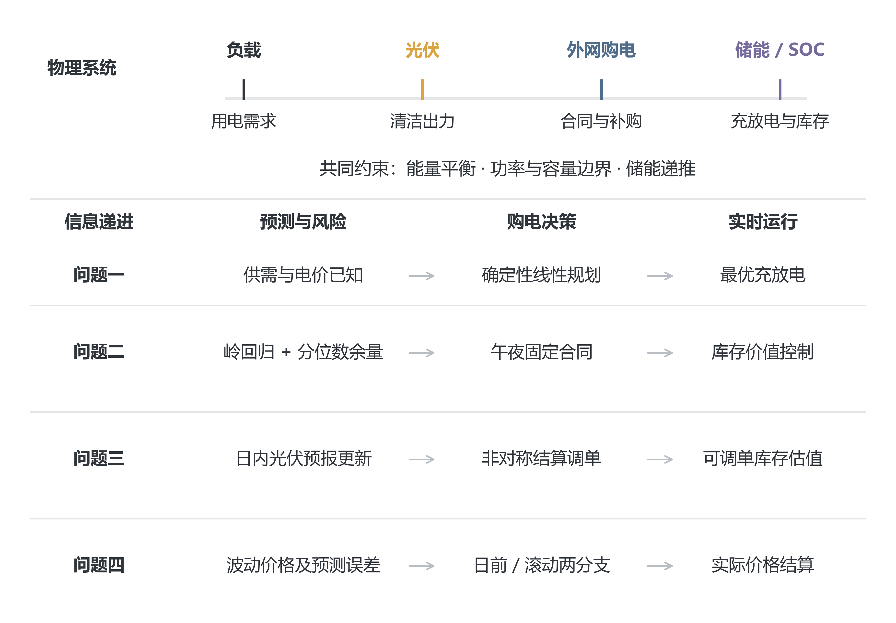

图 1 整体建模思路与四问递进关系

## 三 模型假设与数据处理

### 3.1 参数及工作假设

储能与时间参数见表 1。功率上限定义在微网母线侧，所有决策电量统一使用kWh。将题设90%的充放电效率解释为两侧各90%，对应往返效率81%；效率对运行费用的影响随第一问结果给出。

表 1 储能参数与时间离散

| 参数 | 数值 | 性质 |
| --- | --- | --- |
| 额定容量 | 12000 kWh | 题面给定 |
| 允许储电量 | 1200—10800 kWh | 题面给定 |
| 最大充放电功率 | 5000 kW | 题面给定 |
| 初始储电量 | 6000 kWh | 1 月 1 日 00:00 给定 |
| 充电／放电效率 | 0.9／0.9 | 主实验解释 |
| 时段长度 | 1/6 h | 十分钟离散 |

（1）附件中的00:10、00:20、…、24:00依次对应00:00—00:10、00:10—00:20、…、23:50—24:00区间，区间内功率按常值处理。四问均保持原始记录顺序，状态定义在区间边界，功率乘1/6小时换算为电量。结果模板按标注的区间起点匹配输出；跨入次日的第一问区间使用周期计划，不改变当天优化的初末边界。

（2）微网仅从外网购电，不计售电收入；无法消纳的电量允许无成本弃用，电池退化成本不纳入目标。第一、二问普通购电按计划量结算，第三、四问主动调整按保留量、取消量和新增量分项结算。

（3）实时运行按十分钟区间内功率恒定建模，以当前可观测供需完成充放电与紧急购电；日前及日内计划仅使用决策时已经获得的信息。

（4）第二至四问的实际储电量连续跨日。日前名义轨迹要求日末储电量不少于6,000 kWh，以保留次日运行所需电量；实际日末状态由实时运行决定，并作为次日初始状态。

（5）第四问将未来交易价格视为决策时未知的量，以历史数据预测；到达交易区间后观测当前价格并按其结算。题面提供全年实际价格，并未明确保证零点已知全天价格，因此本条属于信息可见性的工作假设。计划层采用点预测近似未来价格，历史残差范围描述预测误差，不据此假定未来实际价格必在某一区间内。

### 3.2 数据整理与时间对齐

附件1含144个时段，附件2的负载与光伏各含365×144＝52,560个观测。以2025年完整日期和十分钟时段为索引对齐两类序列，将附件1混合存储的时间类型与字符串统一为分钟，核对序列为10、20、…、1440。功率与电量按下式换算：

$$
L_{d,t}=P^{\mathrm{load}}_{d,t}\Delta t,\qquad V_{d,t}=P^{\mathrm{PV}}_{d,t}\Delta t,\qquad \Delta t=\frac{1}{6}\ \mathrm{h}.
$$

数据核查表明：附件1含60个时间类型单元格和84个字符串，统一转换后得到完整时间序列；附件2两类序列均无缺失、非有限值、负数、重复日期或完全重复日曲线。全局四分位距检验未检出超界观测，原始样本全部保留。

预处理仅规范时间格式与计量单位，无须填补、删点、缩尾或平滑。光伏序列中的23,540个零值按零发电记录保留。训练集标准化和预测值非负截断分别作用于特征及模型输出，不改变实际观测。

原始供需和调度轨迹保留十分钟分辨率。图中的月均值、分位范围和累计费用均由原始记录直接汇总，分别刻画季节结构、价格分布与策略收益。

## 四 符号说明

下文沿用表 2 的符号。单日模型省略日期下标，日内区间用 1—144，状态包含 145 个边界点；跨日计算另带日期下标。

表 2 主要符号及单位

| 符号 | 含义 | 单位 |
| --- | --- | --- |
| $d,t$ | 日期与十分钟时段 | — |
| $L_{d,t},V_{d,t}$ | 负载与光伏电量 | kWh |
| $\hat L_{d,t},\hat V_{d,t}$ | 日前负载与光伏预测 | kWh |
| $g_{d,t},e_{d,t}$ | 计划购电与紧急购电 | kWh |
| $c_{d,t},d_{d,t}$ | 母线侧充电与放电 | kWh |
| $w_{d,t}$ | 不能利用的富余电量 | kWh |
| $S_{d,t}$ | 区间起点的储电量 | kWh |
| $p_t$ | 固定分时交易电价 | 元/kWh |
| $\eta_c,\eta_d$ | 充电与放电效率 | — |
| $z_t$ | 充电状态二元变量 | — |
| $\lambda,q$ | 岭惩罚强度与余量分位数 | — |
| $r_{d,t}(q)$ | 非负净负载预测余量 | kWh |

日期下标与放电变量均使用字母d，前者仅出现在下标位置，后者作为决策变量出现；两者由位置及上下文区分。

## 五 第一问的模型建立与求解

### 5.1 供需结构与决策目标

图 2 给出单日供需曲线与分时电价。光伏集中于白天，负载贯穿全天；储能既可吸收午间富余光伏，也可利用外网峰谷价差转移购电时段。两种作用共同决定购电与充放电计划。

目标是最小化全天计划购电费：

$$
\min C_1=\sum_{t=1}^{144}p_tg_t.
$$

以母线侧收支写能量守恒，将允许的富余供电显式记为未利用电量：

$$
g_t+V_t+d_t=L_t+c_t+w_t,\qquad g_t,w_t\geq0.
$$

充电损耗发生在进入储能时，放电损耗发生在从储能输出至母线时，因而状态方程为：

$$
S_{t+1}=S_t+\eta_c c_t-\frac{d_t}{\eta_d},\qquad 1200\leq S_t\leq10800.
$$

SOC 上下界施加于全部 145 个状态点，状态递推与其他时段约束对应 t＝1，…，144。令每时段最大母线侧充放电量 M＝5000/6 kWh，用二元变量直接限制互斥：

$$
0\leq c_t\leq Mz_t,\qquad 0\leq d_t\leq M(1-z_t),\qquad z_t\in\{0,1\}.
$$

第一问满足以下初始和终端条件，避免利用电池初始存量净放电造成虚假节省：

$$
S_1=S_{145}=6000.
$$

将上述关系集中写成一般日模型，决策变量为购电、充放电、未利用电量、储电量和状态变量。给定不同供需输入与初末状态条件时，可复用以下结构：

$$
\boxed{\left\{\begin{aligned}\min_{g,c,d,w,S,z}\quad &\sum_{t=1}^{144}p_tg_t\\\mathrm{s.t.}\quad &g_t+V_t+d_t=L_t+c_t+w_t,\\&S_{t+1}=S_t+\eta_c c_t-d_t/\eta_d,\\&1200\leq S_t\leq10800,\quad g_t,w_t\geq0,\\&0\leq c_t\leq Mz_t,\quad0\leq d_t\leq M(1-z_t),\\&z_t\in\{0,1\},\quad S_1=S_{145}=6000.\end{aligned}\right.}
$$

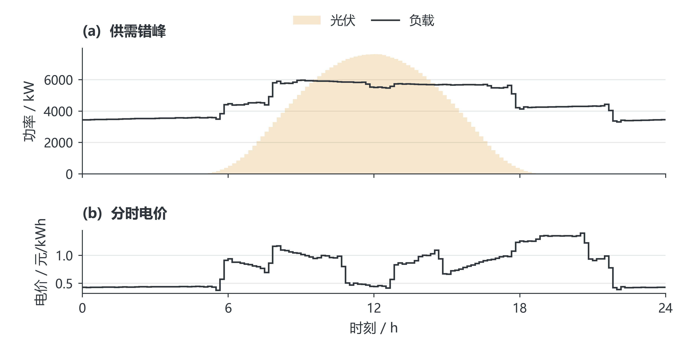

图 2 第一问供需曲线与分时电价

图 2 的每个阶梯对应一个十分钟区间，功率与电价分别使用独立坐标，光伏填充区域表示其出力过程。

为进行全年多次求解，利用自由弃电处理互斥。记 $\rho=\eta_c\eta_d$，对任一松弛解令 $x_t=\min\{c_t,d_t/\rho\}$，以 $c_t-x_t$、$d_t-\rho x_t$ 和 $w_t+(1-\rho)x_t$ 分别替代充电、放电与弃电。该变换保持储能递推、母线平衡和购电费用，且充放电至少一项为零。因此可先用HiGHS求解线性规划[2]，再逐时消去循环充放电；后续各问复用相同过程。

### 5.2 调度结果与指定时段

计算得到全天购电量 59,482.70 kWh、费用 35,126.95 元。购电与储能轨迹见图 3，指定时段购电和四小时充放电分别见表 3、表 4。

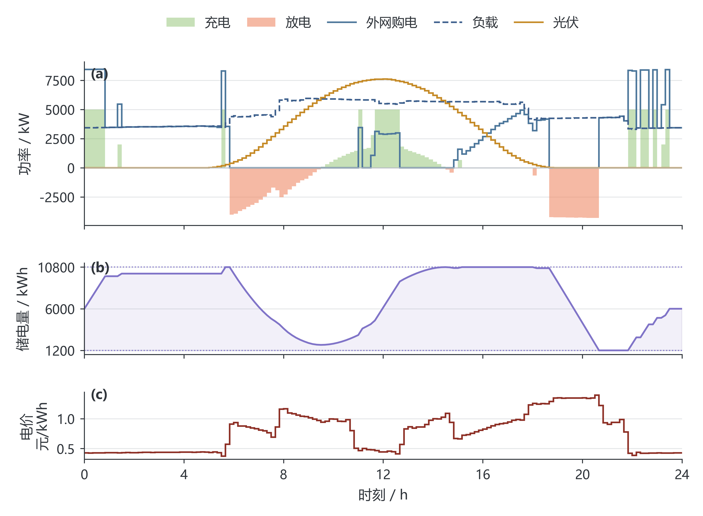

图 3 第一问电价驱动的购电与储能运行

图3上面板以正负方向区分充电与放电，并叠加外网购电；中面板给出边界储电量，下方面板给出分时电价。各面板共用时间轴，保留十分钟决策及145个状态边界。

表 3列出指定十分钟区间的购电量及全天汇总。

表 3 第一问指定时段购电量及全天费用

| 时间段 | 购电量 | 时间段 | 购电量 | 时间段 | 购电量 |
| --- | --- | --- | --- | --- | --- |
| 10:00-10:10 | 0.00 | 12:00-12:10 | 480.41 | 14:00-14:10 | 0.00 |
| 16:00-16:10 | 445.43 | 18:00-18:10 | 531.89 | 20:00-20:10 | 0.00 |
| 全天购电量 | 59,482.70 | 全天购电费 | 35,126.95 | — | — |

表 4按四小时汇总充放电量，并列出各块边界储电量。

表 4 第一问四小时充放电及边界储电量

| 时间段 | 充电量 | 放电量 | 时间段 | 充电量 | 放电量 |
| --- | --- | --- | --- | --- | --- |
| 00:00-04:00 | 4,500.00 | 0.00 | 04:00-08:00 | 833.33 | 6,365.84 |
| 08:00-12:00 | 4,787.96 | 1,703.00 | 12:00-16:00 | 5,286.04 | 91.10 |
| 16:00-20:00 | 0.00 | 5,780.13 | 20:00-24:00 | 5,333.33 | 2,859.87 |
| 00:00 储电量 | 6,000.00 | — | 24:00 储电量 | 6,000.00 | — |

低价时段的外网购电同时满足负载与充电，形成集中购电峰值；高价时段由储能放电补充供电，压低外网购电量。图 3 中购电峰值与充电动作对应，反映储能的跨时段套利。表 3、表 4分别按十分钟和四小时汇总；四小时块内可先充后放，各十分钟区间仍保持互斥。

无储能时直接按净负载缺口购电，费用为48,052.05元。图4比较无储能、实际效率和无损储能三种条件下的最优费用。实际储能净节省12,925.10元，降幅为26.90%；将充放电损耗设为零后，费用进一步降至32,377.09元。往返效率从64%提高到100%时，最优费用由38,223.65元降至32,377.09元。

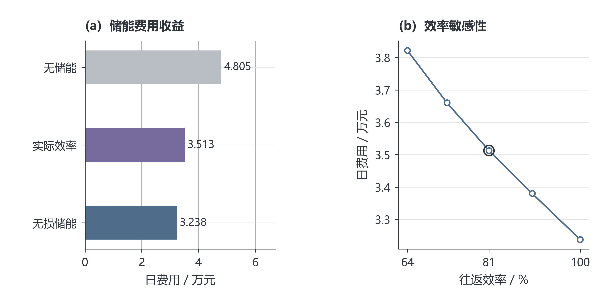

图 4 储能的净收益及效率对最优费用的影响

（a）三种条件采用相同供需与日初日末状态，费用条形从零起算，标注为元。（b）五组效率均重新求解，主设定为两侧各90%、往返81%；曲线表示效率变化后的系统最优费用。

## 六 第二问的预测与日前策略

### 6.1 训练与评价的时间顺序

采用按时间推进的训练、验证与评价划分：1月22—31日选择参数与执行器，2月1日至12月31日开展顺序回测。模型每七天更新，使用最近至多60个已结束日期。此次模型修订属于同年度数据上的开发复核；各时点决策遵守历史可见性，评价区间不作为从未接触的外部测试集。

各候选策略从1月1日6,000 kWh储电量进行共同热身。首日以附件1作为冷启动参考，历史不足七天时使用近三日均值，随后转为日／周同期预测。验证期初与评价期初储电量分别为6,244.256891 kWh和9,902.811288 kWh，保证各策略具有相同起点。附件1仅用于初始化。

### 6.2 供需预测

对负载或光伏电量序列 y，同期基线取昨日与上周同日相同时间槽的均值：

$$
\hat y_{d,t}^{\mathrm{seasonal}}=\frac{y_{d-1,t}+y_{d-7,t}}{2}.
$$

岭回归采用 21 个特征：昨日、前日、上周同日的同槽值，三日和七日同槽均值、七日同槽标准差、昨日全天均值和近三日全天均值共八项；前三阶日内正余弦六项；星期指示七项。日期及时间属于决策时已知的日历信息。标准化均值与尺度仅在当次训练集上估计，常量特征尺度置 1。

$$
\min_{\beta,b}\sum_{i\in\mathcal T_d}(y_i-b-\widetilde{x}_i^{\mathsf T}\beta)^2+\lambda\|\beta\|_2^2.
$$

截距不惩罚，负载和光伏分别拟合。按验证 MAE 比较 λ＝1、10、100，均选 1；实现采用 NumPy 线性方程求解，与带截距岭目标一致 [3]。从 1 月 15 日开始具备拟合条件，之后每七日重新拟合。预测截断为非负；某槽过去七日光伏全零时，该槽预测置零，日出日落季节变化可能使此规则产生滞后。

评价指标采用功率单位的 MAE 与 RMSE；不使用夜间分母为零的普通 MAPE：

$$
\mathrm{MAE}=\frac{1}{n}\sum_i|P_i-\widehat P_i|,\qquad\mathrm{RMSE}=\sqrt{\frac{1}{n}\sum_i(P_i-\widehat P_i)^2}.
$$

### 6.3 净负载误差余量与名义优化

定义历史净负载误差及只包含过去信息的误差样本池：

$$
\varepsilon_{j,s}=(L_{j,s}-V_{j,s})-(\hat L_{j,s}-\hat V_{j,s}).
$$

$$
\mathcal E_{d,t}=\{\varepsilon_{j,s}:\max(2,d-28)\leq j<d,\ 1\leq s\leq144,\ |s-t|\leq3\}.
$$

日期下标以 1 月 1 日为 d＝1；排除首日冷启动误差，最多池化 28 个已结束日期和目标槽前后三槽。跨日边界不绕回，不足 28 天时仅取已有历史。余量规则为：

$$
r_{d,t}(q)=\max\{0,Q_q(\mathcal E_{d,t})\}.
$$

无余量候选直接设 r＝0，与“取零分位数”区分。对 q＝0.7、0.8、0.9，分位数使用样本排序后的线性插值。将预测负载加余量作为名义需求，求解第五节同一物理模型：

$$
L_t^{\mathrm{nom}}=\hat L_{d,t}+r_{d,t}(q),\qquad V_t^{\mathrm{nom}}=\hat V_{d,t},\qquad S_{d,145}^{\mathrm{nom}}\geq6000.
$$

风险校准通过历史误差分位数提高名义需求，在一月验证中按计划费与五倍紧急费之和选择余量。70%表示误差样本池的分位水平；模型属于分位数校准的确定性日前优化，其供电风险由顺序回测评价。

### 6.4 库存价值驱动的实时执行

零点生成计划后，普通购电费已由合同确定，执行阶段的任务是分配储能以减少后续紧急补购。若当前供给富余，先在功率与容量允许范围内充电；若出现缺口，则比较当前放电节费与保留库存的后续价值。

设当前净缺口 $n_t=L_t-V_t-g_t$。对富余供给，充电及弃电量为：

$$
c_t=\min\left\{\max(-n_t,0),M,\frac{10800-S_t}{\eta_c}\right\},\qquad w_t=\max(-n_t-c_t,0).
$$

为估计后续缺口，每次发布取此前至多28个完整日的负载与光伏配对残差，分别叠加至当前预测并截断非负，形成K条净缺口路径。配对保留同一天内负载、光伏误差的联系。对每条路径，以储电量s为状态、紧急补购费为阶段成本，反向递推后续费用：

$$
J_t^{(k)}(s)=\min_{a\in\mathcal A_t^{(k)}(s)}\left\{5p_t e_t^{(k)}(a)+J_{t+1}^{(k)}(s')\right\},\qquad J_{145}^{(k)}(s)=0.
$$

可行集合A包含第一问的储能状态与功率限制，紧急购电只补负载缺口，不能用于充电。路径价值用凸分段线性函数存储[5]，在可行库存区间内计算；其均值近似实际决策的后续费用。历史路径递推用于估值，实时动作始终依据当时可见的供需和库存。

在当前真实缺口 $n_t>0$ 时，选择下一储电状态：

$$
s_{t+1}^{*}\in\arg\min_{z\in[\max\{S_{\min},s_t-\min(n_t,M)/\eta_d\},s_t]}\left\{5p_t[n_t-\eta_d(s_t-z)]+\frac1K\sum_{k=1}^{K}J_{t+1}^{(k)}(z)\right\}.
$$

相应放电量为 $\eta_d(s_t-s_{t+1}^{*})$，剩余缺口由紧急购电补足。求解只需比较可达区间端点与价值函数折点。当后续缺口的单位补购费更高时，模型可以保留部分库存，将电量留给更有价值的时段。实际状态按储能方程逐时更新并连续跨日：

$$
S_{d+1,1}=S_{d,145},\qquad C_2=\sum_{d,t}p_t\left(g_{d,t}^{\mathrm{plan}}+5e_{d,t}\right).
$$

将“出现缺口便尽量放电”的即时平衡规则作为结果分析中的参照，以识别库存配置带来的收益。主策略使用上述价值控制；零终端附加价值由一月验证选定，名义计划仍保持日末6,000 kWh的下限。

## 七 第二问的结果分析

### 7.1 验证期选择与紧急购电权衡

表 5 与图 5 比较相同初始储电量下的验证费用及期末状态。随余量增加，紧急补购支出下降，普通购电支出上升；两者的折中决定余量选择。

表 5 一月份十天验证结果

| 预测器 | 余量 | 总费/元 | 紧急费/元 | 期末SOC/kWh |
| --- | --- | --- | --- | --- |
| 同期 | 无 | 661,834.09 | 173,098.38 | 9,902.81 |
| 同期 | 70% | 634,179.58 | 110,989.47 | 10,595.98 |
| 同期 | 80% | 666,226.97 | 64,910.51 | 10,800.00 |
| 同期 | 90% | 680,257.72 | 456.98 | 10,800.00 |
| 岭回归 | 无 | 532,888.41 | 61,836.07 | 5,924.08 |
| 岭回归 | 70% | 509,757.47 | 8,765.44 | 6,623.17 |
| 岭回归 | 80% | 529,846.45 | 4.16 | 7,110.16 |
| 岭回归 | 90% | 633,664.05 | 0.00 | 9,039.38 |

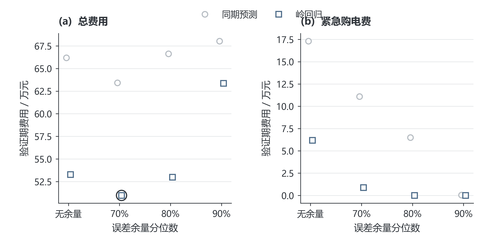

图 5 验证期风险余量与费用的权衡

图5分别展示候选余量的总费用与紧急购电费。增加余量通常降低紧急补购支出，但会增加普通计划支出；岭回归70%余量的验证总费最低，为50.98万元。两种预测器使用相同验证日期和初始库存。

岭回归70%余量的验证费为509,757.47元，其中紧急费8,765.44元；90%余量虽消除了验证期紧急购电，总费却升至633,664.05元。按总购电费用选择70%余量，说明额外多购支出已超过进一步压缩紧急购电的收益。两方案期末储电量相差约2,416 kWh，相关存量同时列于表 5；费用按题设结算，不计期末残值。

### 7.2 全期预测误差与季节变化

按表 6 比较 334 天共 48,096 个十分钟区间的功率预测误差，岭回归在负载预测上的改善大于光伏。四个指定日期的曲线对照见图 6，整年误差仍以全期统计为准。

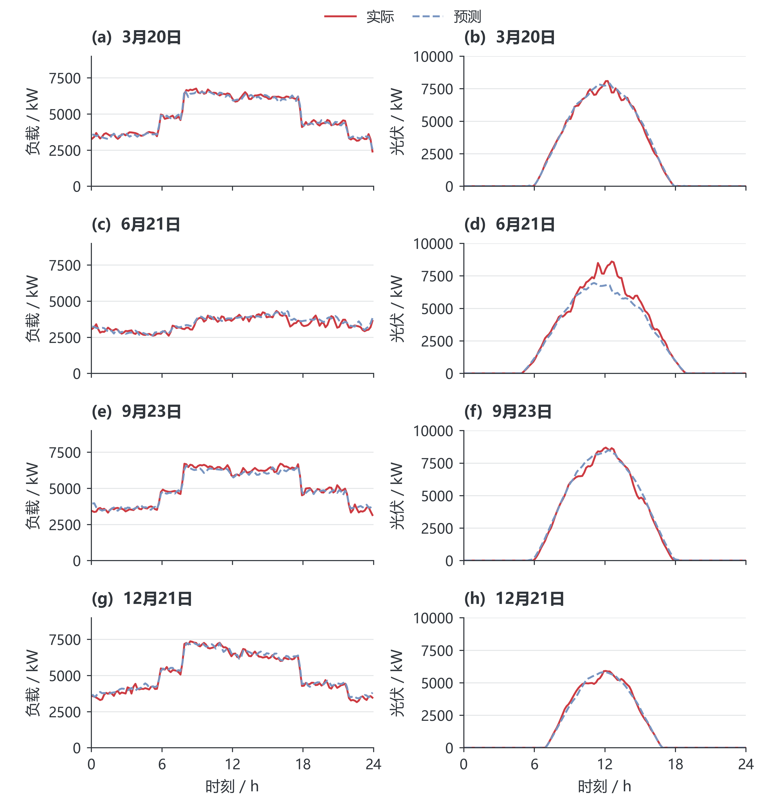

图 6 四个指定日期的负载与光伏日前预测

图6按日期分行、按负载与光伏分列，同一列共用纵轴尺度。实线为实际观测，虚线为岭回归预测，均保留十分钟分辨率。

表 6 第二问全期预测误差

| 预测器 | 负载MAE | 负载RMSE | 光伏MAE | 光伏RMSE |
| --- | --- | --- | --- | --- |
| 同期 | 372.26 | 585.91 | 171.98 | 343.38 |
| 岭回归 | 179.86 | 234.59 | 155.28 | 306.74 |

表 6的误差单位为kW，光伏统计覆盖全天并包含夜间零值，表示全时段平均预测水平。

### 7.3 购电费用与储能配置

表 7列出基础策略，图 7按实际替换顺序展示从同期无余量到岭回归预测、70%风险余量及库存价值控制的费用变化。每一步均与前一步配对，直接给出各层改进的费用贡献。

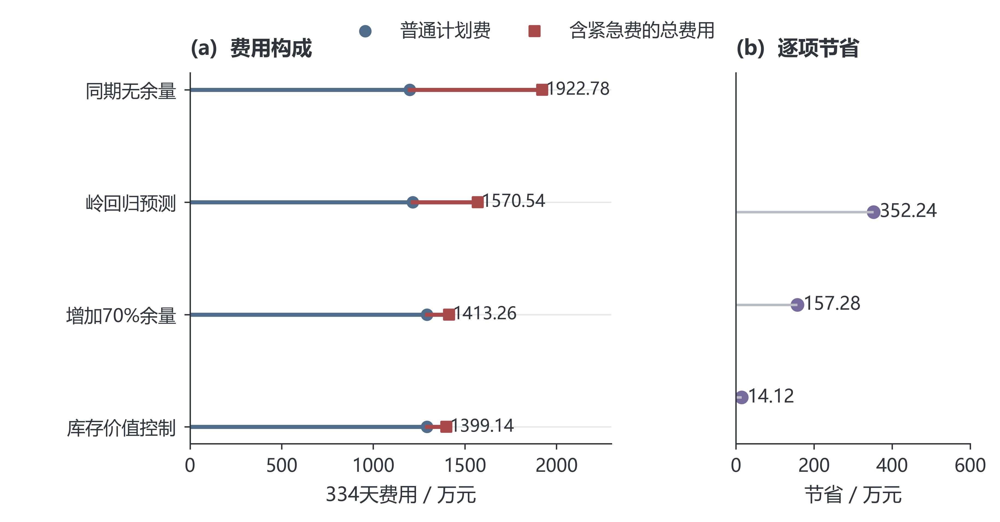

图 7 第二问逐层优化的费用变化与节费来源

表 7 第二问全期费用及期末储电量

| 策略 | 计划费/万元 | 紧急费/万元 | 总费/万元 | 期末SOC/kWh |
| --- | --- | --- | --- | --- |
| 同期 无余量 | 1,199.19 | 723.59 | 1,922.78 | 5,825.99 |
| 岭回归 无余量 | 1,215.92 | 354.62 | 1,570.54 | 5,903.65 |
| 同期 70%余量 | 1,297.86 | 452.54 | 1,750.40 | 6,217.35 |
| 岭回归 70%余量 | 1,293.50 | 119.76 | 1,413.26 | 5,903.65 |

基础策略总费用为14,132,612.16元，较同期无余量降低26.50%，较岭回归无余量降低10.01%。岭回归两组的期末储电量同为5,903.65 kWh，在相同预测器及初末状态下，10.01%的费用降幅直接反映风险余量的价值。

基础策略紧急购电累计197,465.10 kWh，分布于1,132个十分钟区间；连续区间合并后统计为紧急购电事件。未利用电量为2,211,229.49 kWh，由未消纳光伏与富余计划购电共同构成。风险余量通过增加部分普通购电，减少高价缺口补购。

四个指定日期的购电、充放电和紧急购电结果见附录A。

### 7.4 库存价值控制的增益

在相同岭回归、70%余量、费用规则和初始储电量下，历史路径价值控制使334天费用由14,132,612.16元降至13,991,392.60元，节省141,219.56元（0.999%）。其中紧急购电费减少141,170.39元，而紧急电量由197,465.10增至198,137.46 kWh。由此可见，收益来自补购与放电时点的重新分配：以较低价格补足当前缺口，将库存留给更高价格的后续缺口。两方案期末均为5,903.65 kWh，库存转移的经济收益得到同状态对照支持。

## 八 第三问 日内预报的滚动价值

### 8.1 预报信息与决策时域

附件3含365天、每日4个版本、每版24个整点光伏预报，共35,040个值。按四行组还原1,095个结构性空日期后，未发现缺失、非有限数或负值。预报发布时间分别为0、6、12、18点；时刻τ的新预报只服务于τ之后的调度。小时预报端点之间采用分段线性函数，并在十分钟区间上积分为预测电量；发布点以最近完成区间的光伏观测衔接。

这一处理保留了预报更新带来的信息差异。每次求解均以当时真实储电量为起点，固定已经执行的购电与充放电量，重新配置其余区间。该时域推进方式与储能模型预测控制的基本框架一致[4]。

图 8给出指定日期的实际光伏及各版预报，各预报从对应发布时间起展示。日内预报对剩余时段的光伏判断持续更新，为重配购电和储能提供信息。

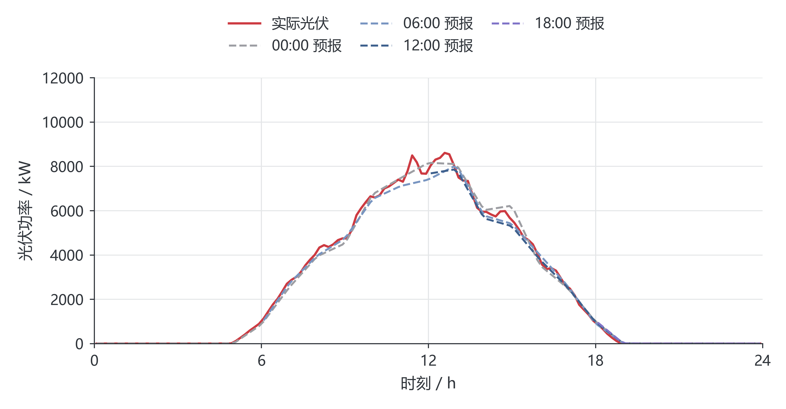

图 8 四个发布版本的光伏预报

### 8.2 保留量、取消量与新增量的结算

记午夜计划为x_t，时段执行前最后一次有效调整量为y_t，紧急购电为e_t。取消量u_t与新增量v_t分别定义为：

$$
u_t=(x_t-y_t)^+,\qquad v_t=(y_t-x_t)^+,\qquad y_t=x_t+v_t-u_t.
$$

保留购电按原价结算，取消部分按半价支付违约费，新增部分按1.5倍价格购买。因此每个区间的完整费用为：

$$
F_t=p_t\min(x_t,y_t)+0.5p_tu_t+1.5p_tv_t+5p_te_t=p_tx_t-0.5p_tu_t+1.5p_tv_t+5p_te_t.
$$

原计划100 kWh、调整为80 kWh、电价1元/kWh时，总费用为80＋0.5×20＝90元；调整为120 kWh时，费用为100＋1.5×20＝130元。前式按保留量计普通费用，后式按原计划记账，两种表达完全等价。多次预报更新均相对同一午夜计划确定偏差；中途计划用于运行与追溯，不重复累计尚未交付区间的修改费用。

### 8.3 滚动优化模型与风险校准

记Tτ为当前尚未执行的区间集合，Ω为第一问去除首末状态等式后的物理可行域。以更新后的光伏预测、负载预测和对应误差余量作为供需输入，求解：

$$
\boxed{\left\{\begin{aligned}\min_{y,c,d,w,S,u,v}\quad&\sum_{t\in T_\tau}\hat p_{\tau,t}(1.5v_t-0.5u_t)\\\mathrm{s.t.}\quad&y_t=x_t+v_t-u_t,\quad0\le u_t\le x_t,\quad v_t\ge0,\\&y_t+\hat V_{\tau,t}+d_t=\hat L_{\tau,t}+r_{\tau,t}+c_t+w_t,\\&(y,c,d,w,S)\in\Omega,\quad S_\tau=S_\tau^{\mathrm{actual}},\quad S_{145}\ge6000.\end{aligned}\right.}
$$

目标函数省略了与当前决策无关的午夜合同常数项。第一至三问的p由附件1给定；第四问替换为当时可获得的价格预测。名义规划满足供电需求，基础执行按第二问即时平衡规则运行，改进执行按第8.6节估计后续库存价值。

风险余量取此前28个完整日期、相同发布版本及目标前后三个区间的净负载误差。将无余量、50%分位余量和70%分位余量分别与8种更新时间组合配对，共比较24组方案。1月22—31日验证选定50%分位余量及6、12、18点更新，随后在2—12月评价。负载预测器和名义日末目标保持一致，以分离预报更新与调整机制的影响。

图 9以一月验证数据比较风险余量与更新时间。左图给出24组候选的费用矩阵，黑框标出50%余量、三次日内更新的选定方案；右图沿0、6、12、18点的顺序增加预报，展示信息更新对验证费用的影响。

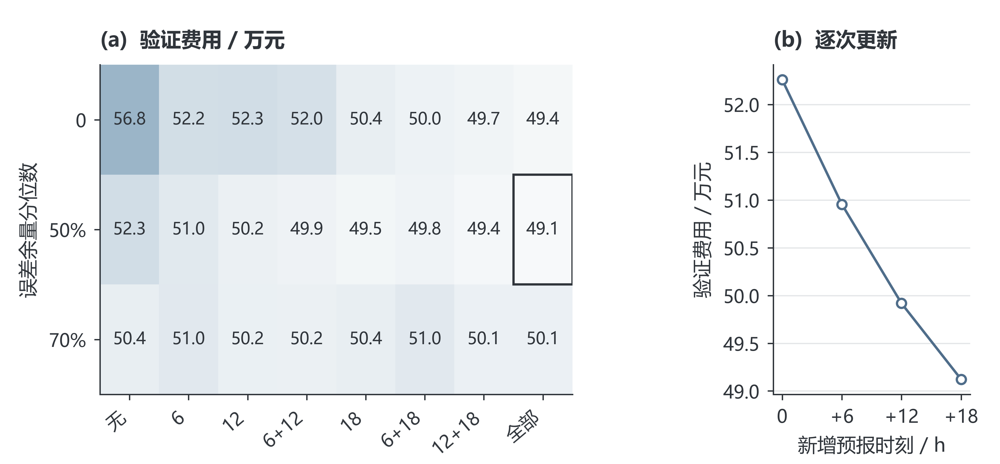

图 9 风险余量与预报更新频次的验证比较

### 8.4 基础滚动策略的更新时间收益

图10左侧按启用的预报组合列出全年节省，固定50%风险余量与基础执行器，分析信息更新的经济价值；右侧给出基础滚动、负载修正及库存价值控制的费用。两部分分别对应预报选择与执行策略的递进。

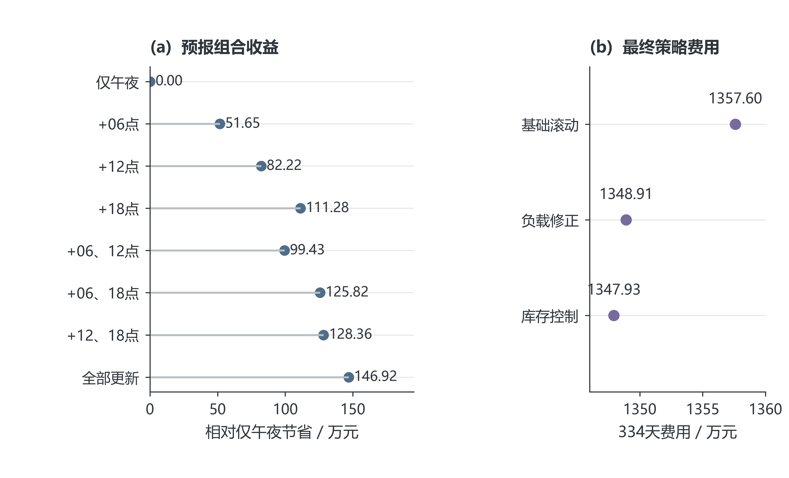

图 10 预报更新组合的全年收益与第三问最终费用

表 8将两方案费用分解为午夜计划、净调整及紧急补购三部分。

表 8 第三问基础策略与仅午夜预报的费用分解

| 费用或运行量 | 仅午夜预报 | 日内滚动 |
| --- | --- | --- |
| 原计划费/元 | 12,530,137.77 | 12,521,239.63 |
| 新增购电费/元 | 0.00 | 678,211.30 |
| 取消量净费用/元 | 0.00 | -203,600.86 |
| 紧急购电费/元 | 2,514,989.16 | 580,126.71 |
| 总费用/元 | 15,045,126.93 | 13,575,976.78 |
| 紧急电量/kWh | 407,324.31 | 101,019.32 |
| 期末储电量/kWh | 5,903.65 | 5,903.65 |

在相同50%余量下，三次更新将总费用由15,045,126.93元降至13,575,976.78元，净节省1,469,150.15元，降幅9.76%；实际紧急购电量降至101,019.32 kWh。新预报使部分供电缺口提前通过计划调整解决，紧急补购费用的下降足以覆盖调整支出。因此，本题有必要引入零点之外的预报。两方案初末储电量相同，节费来自运行策略改善。

### 8.5 面向提前时长的负载修正与月度模型选择

仅在零点预测负载，会忽略日内已观测偏差的持续性。设零点预测误差为实际负载减零点预测，以每次发布前18个十分钟区间的平均误差作为当前偏差x；历史目标小时的六个区间平均误差作为响应y。分别对6、12、18点及各未来目标小时拟合非负收缩回归：

$$
\hat\beta_{d,v,h}=\operatorname{clip}_{[0,1.5]}\left(\frac{\sum_{i\in H_d}x_{i,v}y_{i,v,h}}{1.2\sum_{i\in H_d}x_{i,v}^{2}}\right),\qquad H_d=\{\max(7,d-28),\ldots,d-1\}.
$$

其中日期从0编号；自第14日起启用，至少使用7个完整历史日；分母为零时系数取零。1.2倍分母对应20%的平方误差尺度惩罚，系数上限1.5限制短样本放大。修正后的预测为：

$$
\hat L^{A}_{d,v,t}=\max\{0,\hat L^{0}_{d,t}+\hat\beta_{d,v,h(t)}x_{d,v}\}.
$$

同一目标小时共享修正量，零点预测不变。50%风险余量仍从该预测方案此前28天的历史误差计算，避免沿用旧误差分布而重复补偿。表 9 比较全期各发布时刻的负载预测误差，单位均为kWh/十分钟。

表 9 负载自适应修正的同目标误差对照

| 发布时刻 | 基础MAE | 修正MAE | 降幅 |
| --- | --- | --- | --- |
| 06:00 | 30.26 | 27.96 | 7.61% |
| 12:00 | 30.98 | 28.85 | 6.85% |
| 18:00 | 31.58 | 27.68 | 12.34% |

固定启用修正在1月22—31日使第三、四问滚动验证费分别增加972.85元和1,149.73元，因此不能依据后续全年收益回选一月方案。本文在验证结束后固定一项月度更新规则：2月使用一月选定的基础预测；3月起，每月首日分别回放此前28天的基础与修正方案，两者从该窗口起点的实际储电量出发，按历史真实费用选择下月方案，平局保留基础方案。候选模型、窗口、收缩系数与费用口径在全年评价前固定，月底真实数据仅在次月选择时可见。

两类电价情景均在3、6、7、8、9、10月启用修正，在其余月份使用基础预测。实际储电量连续跨月传递，历史回放的末状态不覆盖实时状态。全年固定启用修正的费用另作消融结果保存，其收益不作为回选规则。该比较属于同一年度数据上的顺序开发验证，并非未接触过的外部测试集。

事后对月度验证末端库存作敏感性检查：将每kWh储电的价值从0变化至样本最高紧急电价折算值，20次模型选择均保持不变，费用排序不依赖低估候选方案的剩余储电量。

### 8.6 计入下次调单机会的库存价值

直接把第6.4节固定合同价值函数用于滚动执行，会将后续全部缺口都按五倍紧急价计值，忽略下次发布后可新增普通合同。该方法在一月验证中增加第三问费用4,210.28元。为修正这一结构偏差，在当前至下次发布的区间仍按五倍价估计缺口，下一发布之后则以1.5倍预测价近似可新增计划的边际费用；每次发布重新构造价值函数并只执行随后36个时段。1.5倍仅用于后续价值估计，实际紧急账单始终按五倍价支付。

修正方案一月费用491,182.82元，较即时平衡低29.11元；据此选定后，全年费用由13,489,127.94元降至13,479,283.32元，再省9,844.62元。固定合同价值法全年反而增加149,493.07元，验证了调单机会必须进入价值估计。该近似未显式求解未来调单、取消与库存的完整联合场景问题，其作用由同口径顺序账单检验。

为单独识别执行器贡献，两执行方案共享第8.5节因果负载选择信号；该信号由基础执行器的历史影子回放生成，实际库存分别连续传递，不用改进方案的未来费用重选预测模型。

## 九 第四问 波动电价下的购电策略

### 9.1 电价信息与不确定性

第二、三问采用每天重复的分时电价，本问改用附件4的实际价格序列。全年365天共52,560个十分钟电价，范围为0.0076—1.7936元/kWh。图11展示价格的季节变化与日内峰谷结构，同一时刻的交易成本不再逐日相同，储能的跨时段价值也随之变化。

按第3.1节的信息假设，决策时尚未揭示的价格以历史预测替代。以发布时刻τ到目标时刻j的预测记为 $\hat p_{\tau,j}$，实际价格分解为：

$$
p_j=\hat p_{\tau,j}+\varepsilon_{\tau,j}.
$$

日前分支沿用线性预测结构，以昨日、上周同槽价格，日内与星期正余弦，滞后差值、乘积及两组滞后曲线均值和标准差构成12维特征，标准化后用岭回归估计价格。惩罚系数取1，1月15日、22日及后续每月首日重新拟合，训练窗口最多60日，所有训练目标在拟合前已经发生。预测价格下限为0.001元/kWh。

滚动分支采用昨日与上周同目标时段价格的均值，并在0、6、12、18点按最新可见历史生成预测。两个分支的价格输入规则由一月验证费用确定后固定；此处价格预测作为统一调度模型的输入模块。

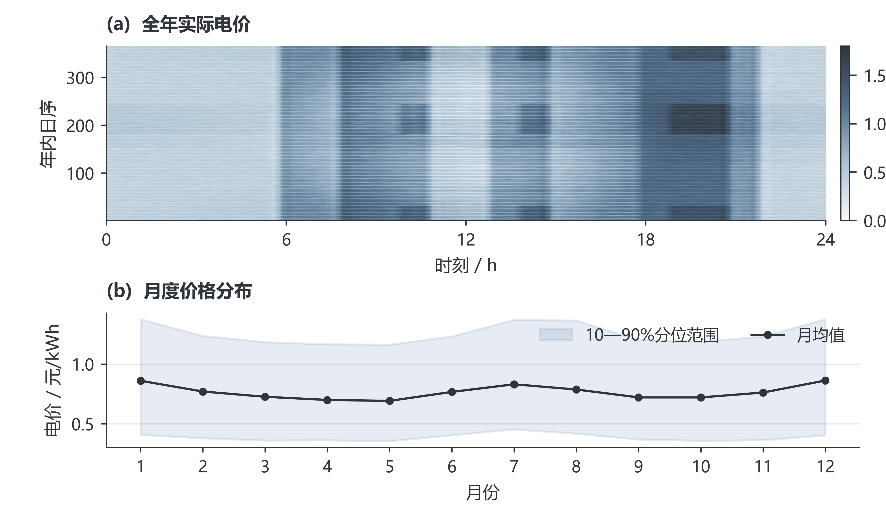

图 11 波动电价的日内结构与月度分布

（a）全年原始十分钟价格，不截断峰谷。（b）每月全部价格的均值与10%—90%分位范围，表示价格分布而非均值的置信区间。

价格误差用过去28个完整日、相同发布时刻和目标时段的残差描述。图12展示四个指定日期的午夜预测及残差10%—90%分位范围。区间端点只使用该日之前的数据；全期48,096个午夜预测目标的实际覆盖率为74.36%，因此该范围用来展示预测风险，不作为未来价格的保证边界。

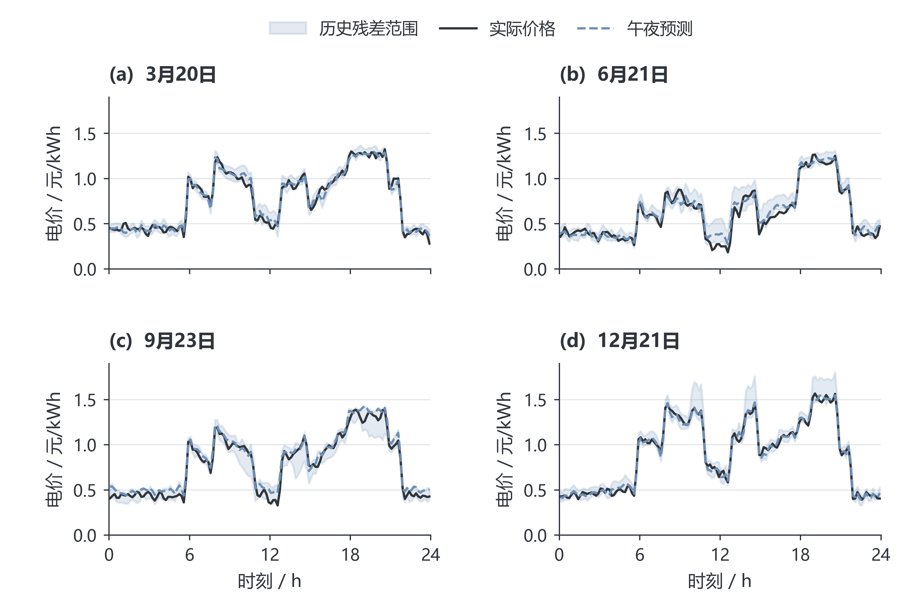

图 12 波动价格的预测偏差与历史残差范围

实线为实际价格，虚线为午夜预测；阴影为点预测加此前28日对应残差的10%—90%分位数，并将下界截至0.001元/kWh。四个日期由题目指定，所有面板使用相同坐标尺度。

### 9.2 日前与滚动模型的价格扩展

第四问继承第二问的供需预测、70%风险余量和固定合同价值控制，以及第三问的滚动光伏预报、50%风险余量、负载修正选择和可调单库存价值。新增内容是：计划目标、合同调整和库存估值中的未来价格均换为当次预测，实际结算使用交易区间的真实价格。

对于日前分支，记 $\mathcal F_d$ 为第二问给定当日名义供需、初始库存及日末下限后的可行域，零点计划满足：

$$
g_d^{0}\in\arg\min_{(g,c,d,w,S)\in\mathcal F_d}\sum_{t=1}^{144}\hat p_{d,0,t}g_t.
$$

对于滚动分支，设Rτ为尚未执行的时段，k、a、b分别为相对午夜合同保留、取消和新增的购电量，满足 $k_t+a_t=g_t^0$、$g_t=k_t+b_t$。在第8.2节的合同规则下，用以下目标替换第三问固定电价目标：

$$
\min\sum_{t\in R_\tau}\hat p_{\tau,t}\left(k_t+0.5a_t+1.5b_t\right).
$$

每次滚动使用当前真实储电量、新预报和当前预测价格，过去的执行结果与午夜原合同保持不变。计划层采用预测价格的确定性等价近似，并以历史验证选择规则；供需误差继续由风险余量处理。本文未将价格误差区间设为硬约束，也未假定点预测能够消除价格风险。

实时执行沿用第6.4节的库存价值决策。当前缺口成本使用已揭示的实际价格p；未来路径费用使用 $\hat p_{\tau,t}$。日前合同锁定时，未来缺口以五倍预测价格估值；滚动分支在下次发布前采用五倍价，之后以1.5倍预测价格近似新增合同机会。该近似只影响库存决策，账单仍按真实合同量和交易价格计算：

$$
C_{4,2}=\sum_{d,t}p_{d,t}\left(g^0_{d,t}+5e_{d,t}\right),\qquad C_{4,3}=\sum_{d,t}p_{d,t}\left(k_{d,t}+0.5a_{d,t}+1.5b_{d,t}+5e_{d,t}\right).
$$

因此，价格变化同时影响计划购电时段、日内调单与当前库存保留。图13按题目指定的四个日期分列，对齐价格、储电量及累计紧急购电的日内轨迹，展示两套策略在不同供需条件下的响应。

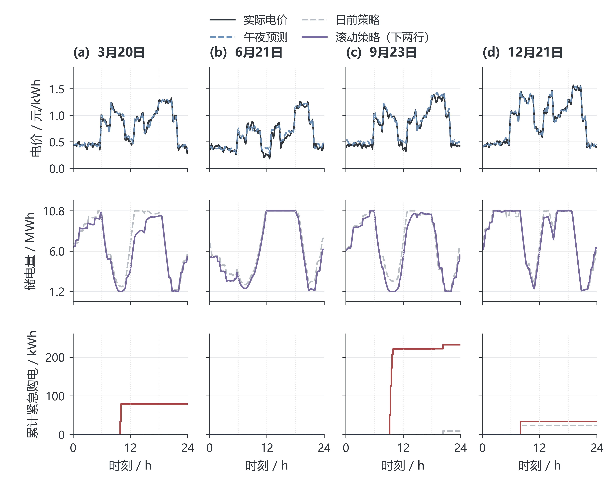

图 13 波动电价下日前与滚动策略的运行过程

图13第一行展示实际价格与午夜预测，第二行展示日前与滚动策略的储电量，第三行展示当日累计紧急购电量。每行共用纵轴尺度，竖虚线为6、12、18点。6月21日两策略均未发生实质紧急购电；9月23日滚动策略补购较多，说明单日效果不必与全年费用排序一致。

### 9.3 实际费用与调度效果

两类策略均在2025年2月1日至12月31日逐时执行，并保持实际储电量跨日连续。表10按保留合同、取消、新增及紧急补购四项归集实际费用；日前策略不能主动调单，后两类合同调整项为零。

表 10 波动电价下两类策略的实际费用构成

| 费用项目 | 日前策略/元 | 滚动策略/元 |
| --- | --- | --- |
| 保留合同购电费 | 13,663,460.94 | 12,764,260.61 |
| 取消合同费用 | 0.00 | 234,774.15 |
| 新增合同购电费 | 0.00 | 765,937.23 |
| 紧急购电费 | 1,102,031.74 | 445,909.02 |
| 总费用 | 14,765,492.68 | 14,210,881.01 |

滚动策略总费用较日前低554,611.67元，降幅为3.76%。其中紧急购电费减少656,122.72元，普通合同及调整相关费用合计增加101,511.05元：日内调整付出额外合同成本，同时降低了高价补购支出。该差额是两套完整策略的运行结果，包含预报、预测输入和调单权限的共同作用。两者期末储电量分别为5,939.92和5,952.82 kWh，按题设账单不计期末残值。

图14进一步检验库存价值控制的贡献。在各自相同价格输入、计划生成规则和初末库存的条件下，相比即时平衡执行，日前节省115,042.37元，滚动节省5,444.97元。后者已能借助调单补足后续缺口，因此进一步优化库存配置的增益较小。

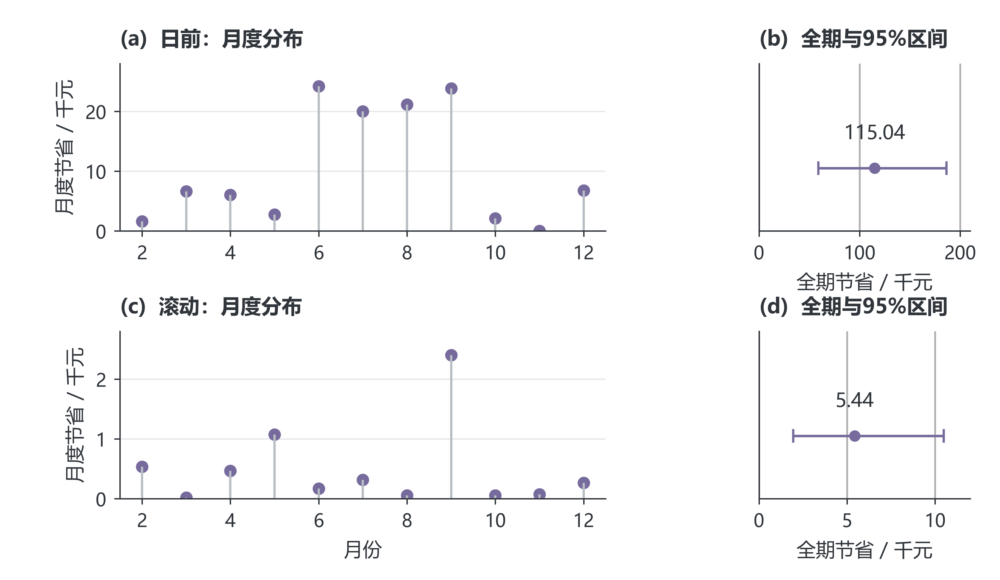

图 14 库存价值控制在波动电价下的收益

图14上、下两行分别为日前与滚动策略；左列为月度节省，右列为全期节省及95%配对区块重采样区间，均以千元为单位，各行采用独立且明确标注的线性刻度。采用2,000次、14日区块，日前区间为[59,151.20，186,368.40]元，滚动为[1,953.22，10,500.59]元。区间反映同年固定轨迹的条件波动，不校正模型开发与选择偏差。

表11汇总四问的最终结果，指定日期的购电与储能表保留于附录A。第二问到第三问扩展合同权限，第四问在这两条分支中引入波动价格，均使用相同物理约束与库存决策逻辑。

表 11 四问最终策略与购电费用

| 问题 | 新增信息或权限 | 最终策略 | 购电费用/元 |
| --- | --- | --- | --- |
| 一 | 供需与电价已知 | 确定性线性规划 | 35,126.95 |
| 二 | 供需预测误差 | 风险校准与固定合同库存价值 | 13,991,392.60 |
| 三 | 日内预报、合同调整 | 滚动优化与可调单库存价值 | 13,479,283.32 |
| 四：日前 | 未来电价未知 | 预测价格下的日前策略 | 14,765,492.68 |
| 四：滚动 | 未来电价未知 | 预测价格下的滚动策略 | 14,210,881.01 |

第一问为单日费用，其余为334天费用；各分支分别评价，不合并为同一系统的总费用。

## 十 模型的评价与推广

### 10.1 模型的优点

（1）四问共享能量平衡与储能递推，将供需误差、预报更新及波动电价依次接入，模型扩展关系清晰，便于分析信息与合同权限的作用。

（2）计划层以风险余量控制欠购，执行层依据后续缺口成本配置库存；保留、取消、新增与紧急补购分别结算，能够解释节费来源。

（3）自由弃电条件下的等价线性化降低求解规模，分段线性库存价值保留连续状态，适合十分钟决策与全年滚动计算。

### 10.2 模型的不足

（1）供需与电价依赖有限历史估计，残差范围不构成价格覆盖率保证；同年度开发与评价可能高估泛化效果，需要跨年度数据检验。

（2）库存价值采用历史路径均值，滚动分支以1.5倍价格近似后续调单机会，未联合优化所有未来合同与库存决策，因而不保证全局最优。

（3）模型未计入电池老化、区间内快速功率变化及网络约束。效率和合同清算口径采用工作假设，实际应用需按设备参数与交易规则校准。

### 10.3 模型的推广

（1）面向园区、商业建筑或充电站，可替换负载、光伏及储能参数，在相同状态递推中加入可控充电负荷与需求响应。

（2）可构造负载、光伏和价格的联合误差场景，以场景平均费用或风险度量扩展计划层，再用多年度数据检验风险与经济性的权衡。

（3）可在目标中加入电池吞吐量、循环寿命、碳成本及峰值需量费用，在经济性之外评价设备寿命与减排效果。

## 十一 参考文献

[1] 全国大学生数学建模竞赛组委会. 2026年高教社杯全国大学生数学建模竞赛C题 微网与外部电网电力调控策略及附件.

[2] SciPy Developers. scipy.optimize.linprog and scipy.optimize.milp. https://docs.scipy.org/doc/scipy/reference/optimize.html. 访问日期2026-09-11.

[3] scikit-learn Developers. Ridge. https://scikit-learn.org/stable/modules/generated/sklearn.linear_model.Ridge.html. 访问日期2026-09-11.

[4] Morstyn T, Hredzak B, Aguilera R P, Agelidis V G. Model Predictive Control for Distributed Microgrid Battery Energy Storage Systems. IEEE Transactions on Control Systems Technology, 2018, 26(3):1107–1114. DOI:10.1109/TCST.2017.2699159.

[5] Boyd S, Vandenberghe L. Convex Optimization. Cambridge University Press, 2004. https://web.stanford.edu/~boyd/cvxbook/.

## 附录 A 四问指定日期完整结果

电量单位为kWh，费用单位为元。普通购电与紧急购电分列。滚动问题的指定时段和全天购电量指最终有效普通计划；午夜计划及每次更新完整保存在Excel中。所有表由实际轨迹自动生成。

### A.1 问题1

对应结果见表 12。

表 12 问题1（单日） 指定时段购电及全天费用

| 时间段 | 购电量 | 时间段 | 购电量 | 时间段 | 购电量 |
| --- | --- | --- | --- | --- | --- |
| 10:00-10:10 | 0.00 | 12:00-12:10 | 480.41 | 14:00-14:10 | 0.00 |
| 16:00-16:10 | 445.43 | 18:00-18:10 | 531.89 | 20:00-20:10 | 0.00 |
| 全天购电量 | 59,482.70 | 全天购电费 | 35,126.95 | — | — |

对应结果见表 13。

表 13 问题1（单日） 储能运行

| 时间段 | 充电量 | 放电量 | 时间段 | 充电量 | 放电量 |
| --- | --- | --- | --- | --- | --- |
| 00:00-04:00 | 4,500.00 | 0.00 | 04:00-08:00 | 833.33 | 6,365.84 |
| 08:00-12:00 | 4,787.96 | 1,703.00 | 12:00-16:00 | 5,286.04 | 91.10 |
| 16:00-20:00 | 0.00 | 5,780.13 | 20:00-24:00 | 5,333.33 | 2,859.87 |
| 00:00 储电量 | 6,000.00 | — | 24:00 储电量 | 6,000.00 | — |

### A.2 问题2

对应结果见表 14。

表 14 问题2（2025-03-20） 指定时段购电及全天费用

| 时间段 | 购电量 | 时间段 | 购电量 | 时间段 | 购电量 |
| --- | --- | --- | --- | --- | --- |
| 10:00-10:10 | 0.00 | 12:00-12:10 | 574.14 | 14:00-14:10 | 0.00 |
| 16:00-16:10 | 488.93 | 18:00-18:10 | 720.76 | 20:00-20:10 | 0.00 |
| 全天购电量 | 68,036.47 | 全天购电费 | 41,302.44 | — | — |

对应结果见表 15。

表 15 问题2（2025-03-20） 储能运行

| 时间段 | 充电量 | 放电量 | 时间段 | 充电量 | 放电量 |
| --- | --- | --- | --- | --- | --- |
| 00:00-04:00 | 4,071.86 | 209.79 | 04:00-08:00 | 1,038.99 | 5,515.86 |
| 08:00-12:00 | 6,186.28 | 2,777.38 | 12:00-16:00 | 4,162.63 | 444.57 |
| 16:00-20:00 | 266.98 | 5,654.71 | 20:00-24:00 | 5,687.88 | 2,954.47 |
| 00:00储电 | 6,617.05 | — | 24:00储电 | 6,382.68 | — |

对应结果见表 16。

表 16 问题2（2025-03-20） 紧急购电

| 时段 | 电量 |
| --- | --- |
| 17:20-17:30 | 5.19 |

对应结果见表 17。

表 17 问题2（2025-06-21） 指定时段购电及全天费用

| 时间段 | 购电量 | 时间段 | 购电量 | 时间段 | 购电量 |
| --- | --- | --- | --- | --- | --- |
| 10:00-10:10 | 0.00 | 12:00-12:10 | 0.00 | 14:00-14:10 | 0.00 |
| 16:00-16:10 | 210.92 | 18:00-18:10 | 0.00 | 20:00-20:10 | 0.00 |
| 全天购电量 | 36,315.40 | 全天购电费 | 21,120.39 | — | — |

对应结果见表 18。

表 18 问题2（2025-06-21） 储能运行

| 时间段 | 充电量 | 放电量 | 时间段 | 充电量 | 放电量 |
| --- | --- | --- | --- | --- | --- |
| 00:00-04:00 | 526.76 | 524.94 | 04:00-08:00 | 413.77 | 4,402.74 |
| 08:00-12:00 | 9,426.35 | 0.00 | 12:00-16:00 | 0.00 | 0.00 |
| 16:00-20:00 | 151.96 | 5,493.83 | 20:00-24:00 | 6,132.83 | 2,497.81 |
| 00:00储电 | 6,945.01 | — | 24:00储电 | 7,576.71 | — |

对应结果见表 19。

表 19 问题2（2025-06-21） 紧急购电

| 时段 | 电量 |
| --- | --- |
| 无 | 0.00 |

对应结果见表 20。

表 20 问题2（2025-09-23） 指定时段购电及全天费用

| 时间段 | 购电量 | 时间段 | 购电量 | 时间段 | 购电量 |
| --- | --- | --- | --- | --- | --- |
| 10:00-10:10 | 0.00 | 12:00-12:10 | 491.40 | 14:00-14:10 | 0.00 |
| 16:00-16:10 | 549.29 | 18:00-18:10 | 788.73 | 20:00-20:10 | 0.00 |
| 全天购电量 | 71,561.09 | 全天购电费 | 44,415.98 | — | — |

对应结果见表 21。

表 21 问题2（2025-09-23） 储能运行

| 时间段 | 充电量 | 放电量 | 时间段 | 充电量 | 放电量 |
| --- | --- | --- | --- | --- | --- |
| 00:00-04:00 | 5,252.67 | 0.00 | 04:00-08:00 | 218.14 | 5,830.96 |
| 08:00-12:00 | 5,558.85 | 1,896.62 | 12:00-16:00 | 4,033.40 | 575.17 |
| 16:00-20:00 | 231.66 | 5,642.21 | 20:00-24:00 | 6,050.86 | 2,841.96 |
| 00:00储电 | 6,072.60 | — | 24:00储电 | 6,631.50 | — |

对应结果见表 22。

表 22 问题2（2025-09-23） 紧急购电

| 时段 | 电量 |
| --- | --- |
| 20:20-20:30 | 0.33 |

对应结果见表 23。

表 23 问题2（2025-12-21） 指定时段购电及全天费用

| 时间段 | 购电量 | 时间段 | 购电量 | 时间段 | 购电量 |
| --- | --- | --- | --- | --- | --- |
| 10:00-10:10 | 0.00 | 12:00-12:10 | 967.61 | 14:00-14:10 | 0.00 |
| 16:00-16:10 | 812.86 | 18:00-18:10 | 739.98 | 20:00-20:10 | 0.00 |
| 全天购电量 | 97,145.51 | 全天购电费 | 62,434.14 | — | — |

对应结果见表 24。

表 24 问题2（2025-12-21） 储能运行

| 时间段 | 充电量 | 放电量 | 时间段 | 充电量 | 放电量 |
| --- | --- | --- | --- | --- | --- |
| 00:00-04:00 | 4,629.25 | 143.74 | 04:00-08:00 | 1,398.62 | 1,538.91 |
| 08:00-12:00 | 5,704.82 | 7,168.67 | 12:00-16:00 | 6,940.07 | 2,243.11 |
| 16:00-20:00 | 24.16 | 5,708.86 | 20:00-24:00 | 5,695.76 | 2,842.53 |
| 00:00储电 | 6,318.60 | — | 24:00储电 | 6,443.34 | — |

对应结果见表 25。

表 25 问题2（2025-12-21） 紧急购电

| 时段 | 电量 |
| --- | --- |
| 07:50-08:00 | 23.78 |

### A.3 问题3

对应结果见表 26。

表 26 问题3（2025-03-20） 指定时段购电及全天费用

| 时间段 | 购电量 | 时间段 | 购电量 | 时间段 | 购电量 |
| --- | --- | --- | --- | --- | --- |
| 10:00-10:10 | 0.00 | 12:00-12:10 | 520.67 | 14:00-14:10 | 0.00 |
| 16:00-16:10 | 638.18 | 18:00-18:10 | 714.94 | 20:00-20:10 | 0.00 |
| 全天购电量 | 66,401.94 | 全天购电费 | 42,938.13 | — | — |

对应结果见表 27。

表 27 问题3（2025-03-20） 储能运行

| 时间段 | 充电量 | 放电量 | 时间段 | 充电量 | 放电量 |
| --- | --- | --- | --- | --- | --- |
| 00:00-04:00 | 4,249.82 | 348.06 | 04:00-08:00 | 1,010.91 | 5,813.27 |
| 08:00-12:00 | 3,254.96 | 2,698.33 | 12:00-16:00 | 6,483.14 | 254.72 |
| 16:00-20:00 | 646.16 | 5,206.99 | 20:00-24:00 | 5,530.12 | 3,018.64 |
| 00:00储电 | 6,309.41 | — | 24:00储电 | 6,100.33 | — |

对应结果见表 28。

表 28 问题3（2025-03-20） 紧急购电

| 时段 | 电量 |
| --- | --- |
| 09:40-10:00 | 79.05 |
| 21:40-21:50 | 4.66 |

对应结果见表 29。

表 29 问题3（2025-06-21） 指定时段购电及全天费用

| 时间段 | 购电量 | 时间段 | 购电量 | 时间段 | 购电量 |
| --- | --- | --- | --- | --- | --- |
| 10:00-10:10 | 0.00 | 12:00-12:10 | 0.00 | 14:00-14:10 | 0.00 |
| 16:00-16:10 | 120.43 | 18:00-18:10 | 0.00 | 20:00-20:10 | 0.00 |
| 全天购电量 | 34,874.69 | 全天购电费 | 19,723.09 | — | — |

对应结果见表 30。

表 30 问题3（2025-06-21） 储能运行

| 时间段 | 充电量 | 放电量 | 时间段 | 充电量 | 放电量 |
| --- | --- | --- | --- | --- | --- |
| 00:00-04:00 | 275.76 | 271.67 | 04:00-08:00 | 449.87 | 3,308.89 |
| 08:00-12:00 | 9,888.78 | 0.00 | 12:00-16:00 | 0.00 | 0.00 |
| 16:00-20:00 | 41.37 | 6,074.66 | 20:00-24:00 | 5,603.72 | 2,654.17 |
| 00:00储电 | 5,225.44 | — | 24:00储电 | 6,181.87 | — |

对应结果见表 31。

表 31 问题3（2025-06-21） 紧急购电

| 时段 | 电量 |
| --- | --- |
| 无 | 0.00 |

对应结果见表 32。

表 32 问题3（2025-09-23） 指定时段购电及全天费用

| 时间段 | 购电量 | 时间段 | 购电量 | 时间段 | 购电量 |
| --- | --- | --- | --- | --- | --- |
| 10:00-10:10 | 0.00 | 12:00-12:10 | 347.56 | 14:00-14:10 | 0.00 |
| 16:00-16:10 | 522.47 | 18:00-18:10 | 784.63 | 20:00-20:10 | 0.00 |
| 全天购电量 | 67,918.94 | 全天购电费 | 44,580.19 | — | — |

对应结果见表 33。

表 33 问题3（2025-09-23） 储能运行

| 时间段 | 充电量 | 放电量 | 时间段 | 充电量 | 放电量 |
| --- | --- | --- | --- | --- | --- |
| 00:00-04:00 | 4,885.98 | 16.12 | 04:00-08:00 | 353.76 | 6,967.82 |
| 08:00-12:00 | 4,885.84 | 1,675.86 | 12:00-16:00 | 6,129.08 | 508.84 |
| 16:00-20:00 | 118.44 | 5,841.36 | 20:00-24:00 | 5,814.52 | 2,695.27 |
| 00:00储电 | 6,102.47 | — | 24:00储电 | 6,398.80 | — |

对应结果见表 34。

表 34 问题3（2025-09-23） 紧急购电

| 时段 | 电量 |
| --- | --- |
| 09:00-09:50 | 220.76 |
| 20:20-20:30 | 6.37 |

对应结果见表 35。

表 35 问题3（2025-12-21） 指定时段购电及全天费用

| 时间段 | 购电量 | 时间段 | 购电量 | 时间段 | 购电量 |
| --- | --- | --- | --- | --- | --- |
| 10:00-10:10 | 0.00 | 12:00-12:10 | 924.13 | 14:00-14:10 | 0.00 |
| 16:00-16:10 | 821.56 | 18:00-18:10 | 739.98 | 20:00-20:10 | 0.00 |
| 全天购电量 | 95,721.86 | 全天购电费 | 62,219.35 | — | — |

对应结果见表 36。

表 36 问题3（2025-12-21） 储能运行

| 时间段 | 充电量 | 放电量 | 时间段 | 充电量 | 放电量 |
| --- | --- | --- | --- | --- | --- |
| 00:00-04:00 | 4,657.30 | 179.36 | 04:00-08:00 | 1,565.97 | 1,572.10 |
| 08:00-12:00 | 5,310.40 | 7,513.79 | 12:00-16:00 | 7,773.62 | 2,250.94 |
| 16:00-20:00 | 57.98 | 5,766.67 | 20:00-24:00 | 5,676.93 | 2,842.53 |
| 00:00储电 | 6,219.20 | — | 24:00储电 | 6,395.64 | — |

对应结果见表 37。

表 37 问题3（2025-12-21） 紧急购电

| 时段 | 电量 |
| --- | --- |
| 07:50-08:00 | 33.89 |

### A.4-2 问题4-2

对应结果见表 38。

表 38 问题4-2（2025-03-20） 指定时段购电及全天费用

| 时间段 | 购电量 | 时间段 | 购电量 | 时间段 | 购电量 |
| --- | --- | --- | --- | --- | --- |
| 10:00-10:10 | 0.00 | 12:00-12:10 | 574.14 | 14:00-14:10 | 0.00 |
| 16:00-16:10 | 488.93 | 18:00-18:10 | 310.56 | 20:00-20:10 | 756.24 |
| 全天购电量 | 67,791.08 | 全天购电费 | 42,355.14 | — | — |

对应结果见表 39。

表 39 问题4-2（2025-03-20） 储能运行

| 时间段 | 充电量 | 放电量 | 时间段 | 充电量 | 放电量 |
| --- | --- | --- | --- | --- | --- |
| 00:00-04:00 | 3,655.77 | 152.63 | 04:00-08:00 | 1,195.22 | 5,572.84 |
| 08:00-12:00 | 6,186.28 | 2,777.38 | 12:00-16:00 | 4,162.63 | 444.57 |
| 16:00-20:00 | 214.58 | 7,108.02 | 20:00-24:00 | 5,717.23 | 1,458.76 |
| 00:00储电 | 6,850.72 | — | 24:00储电 | 6,409.05 | — |

对应结果见表 40。

表 40 问题4-2（2025-03-20） 紧急购电

| 时段 | 电量 |
| --- | --- |
| 无 | 0.00 |

对应结果见表 41。

表 41 问题4-2（2025-06-21） 指定时段购电及全天费用

| 时间段 | 购电量 | 时间段 | 购电量 | 时间段 | 购电量 |
| --- | --- | --- | --- | --- | --- |
| 10:00-10:10 | 0.00 | 12:00-12:10 | 0.00 | 14:00-14:10 | 0.00 |
| 16:00-16:10 | 210.92 | 18:00-18:10 | 0.00 | 20:00-20:10 | 0.00 |
| 全天购电量 | 36,422.89 | 全天购电费 | 18,518.97 | — | — |

对应结果见表 42。

表 42 问题4-2（2025-06-21） 储能运行

| 时间段 | 充电量 | 放电量 | 时间段 | 充电量 | 放电量 |
| --- | --- | --- | --- | --- | --- |
| 00:00-04:00 | 438.52 | 3,694.59 | 04:00-08:00 | 1,239.76 | 1,877.96 |
| 08:00-12:00 | 9,421.97 | 0.00 | 12:00-16:00 | 0.00 | 0.00 |
| 16:00-20:00 | 163.47 | 5,505.34 | 20:00-24:00 | 6,196.26 | 2,497.81 |
| 00:00储电 | 7,001.50 | — | 24:00储电 | 7,631.37 | — |

对应结果见表 43。

表 43 问题4-2（2025-06-21） 紧急购电

| 时段 | 电量 |
| --- | --- |
| 无 | 0.00 |

对应结果见表 44。

表 44 问题4-2（2025-09-23） 指定时段购电及全天费用

| 时间段 | 购电量 | 时间段 | 购电量 | 时间段 | 购电量 |
| --- | --- | --- | --- | --- | --- |
| 10:00-10:10 | 0.00 | 12:00-12:10 | 491.40 | 14:00-14:10 | 0.00 |
| 16:00-16:10 | 549.29 | 18:00-18:10 | 416.70 | 20:00-20:10 | 0.00 |
| 全天购电量 | 71,436.45 | 全天购电费 | 46,451.24 | — | — |

对应结果见表 45。

表 45 问题4-2（2025-09-23） 储能运行

| 时间段 | 充电量 | 放电量 | 时间段 | 充电量 | 放电量 |
| --- | --- | --- | --- | --- | --- |
| 00:00-04:00 | 4,585.50 | 0.00 | 04:00-08:00 | 760.67 | 5,830.96 |
| 08:00-12:00 | 5,687.53 | 1,896.62 | 12:00-16:00 | 3,858.02 | 528.46 |
| 16:00-20:00 | 253.12 | 6,023.40 | 20:00-24:00 | 6,035.33 | 2,472.31 |
| 00:00储电 | 6,184.77 | — | 24:00储电 | 6,633.87 | — |

对应结果见表 46。

表 46 问题4-2（2025-09-23） 紧急购电

| 时段 | 电量 |
| --- | --- |
| 20:10-20:20 | 10.23 |

对应结果见表 47。

表 47 问题4-2（2025-12-21） 指定时段购电及全天费用

| 时间段 | 购电量 | 时间段 | 购电量 | 时间段 | 购电量 |
| --- | --- | --- | --- | --- | --- |
| 10:00-10:10 | 0.00 | 12:00-12:10 | 967.61 | 14:00-14:10 | 0.00 |
| 16:00-16:10 | 812.86 | 18:00-18:10 | 739.98 | 20:00-20:10 | 0.00 |
| 全天购电量 | 97,314.24 | 全天购电费 | 73,263.64 | — | — |

对应结果见表 48。

表 48 问题4-2（2025-12-21） 储能运行

| 时间段 | 充电量 | 放电量 | 时间段 | 充电量 | 放电量 |
| --- | --- | --- | --- | --- | --- |
| 00:00-04:00 | 5,056.07 | 143.74 | 04:00-08:00 | 1,743.90 | 2,155.89 |
| 08:00-12:00 | 5,755.95 | 7,219.80 | 12:00-16:00 | 6,952.06 | 2,243.11 |
| 16:00-20:00 | 24.16 | 5,708.86 | 20:00-24:00 | 5,755.02 | 2,845.49 |
| 00:00储电 | 6,309.24 | — | 24:00储电 | 6,493.37 | — |

对应结果见表 49。

表 49 问题4-2（2025-12-21） 紧急购电

| 时段 | 电量 |
| --- | --- |
| 07:50-08:00 | 23.78 |

### A.4-3 问题4-3

对应结果见表 50。

表 50 问题4-3（2025-03-20） 指定时段购电及全天费用

| 时间段 | 购电量 | 时间段 | 购电量 | 时间段 | 购电量 |
| --- | --- | --- | --- | --- | --- |
| 10:00-10:10 | 0.00 | 12:00-12:10 | 520.67 | 14:00-14:10 | 0.00 |
| 16:00-16:10 | 638.18 | 18:00-18:10 | 714.94 | 20:00-20:10 | 741.44 |
| 全天购电量 | 66,091.31 | 全天购电费 | 43,656.33 | — | — |

对应结果见表 51。

表 51 问题4-3（2025-03-20） 储能运行

| 时间段 | 充电量 | 放电量 | 时间段 | 充电量 | 放电量 |
| --- | --- | --- | --- | --- | --- |
| 00:00-04:00 | 3,255.66 | 249.34 | 04:00-08:00 | 1,840.75 | 5,937.64 |
| 08:00-12:00 | 3,254.96 | 2,698.33 | 12:00-16:00 | 6,863.61 | 254.72 |
| 16:00-20:00 | 291.94 | 6,696.45 | 20:00-24:00 | 5,561.08 | 1,554.74 |
| 00:00储电 | 6,485.79 | — | 24:00储电 | 6,123.41 | — |

对应结果见表 52。

表 52 问题4-3（2025-03-20） 紧急购电

| 时段 | 电量 |
| --- | --- |
| 09:40-10:00 | 79.05 |

对应结果见表 53。

表 53 问题4-3（2025-06-21） 指定时段购电及全天费用

| 时间段 | 购电量 | 时间段 | 购电量 | 时间段 | 购电量 |
| --- | --- | --- | --- | --- | --- |
| 10:00-10:10 | 0.00 | 12:00-12:10 | 0.00 | 14:00-14:10 | 0.00 |
| 16:00-16:10 | 120.43 | 18:00-18:10 | 0.00 | 20:00-20:10 | 0.00 |
| 全天购电量 | 34,998.69 | 全天购电费 | 17,375.08 | — | — |

对应结果见表 54。

表 54 问题4-3（2025-06-21） 储能运行

| 时间段 | 充电量 | 放电量 | 时间段 | 充电量 | 放电量 |
| --- | --- | --- | --- | --- | --- |
| 00:00-04:00 | 275.76 | 2,705.06 | 04:00-08:00 | 1,497.17 | 1,779.01 |
| 08:00-12:00 | 9,921.65 | 0.00 | 12:00-16:00 | 0.00 | 0.00 |
| 16:00-20:00 | 41.37 | 6,074.66 | 20:00-24:00 | 5,613.02 | 2,623.77 |
| 00:00储电 | 5,257.18 | — | 24:00储电 | 6,224.03 | — |

对应结果见表 55。

表 55 问题4-3（2025-06-21） 紧急购电

| 时段 | 电量 |
| --- | --- |
| 无 | 0.00 |

对应结果见表 56。

表 56 问题4-3（2025-09-23） 指定时段购电及全天费用

| 时间段 | 购电量 | 时间段 | 购电量 | 时间段 | 购电量 |
| --- | --- | --- | --- | --- | --- |
| 10:00-10:10 | 0.00 | 12:00-12:10 | 347.56 | 14:00-14:10 | 0.00 |
| 16:00-16:10 | 522.47 | 18:00-18:10 | 628.48 | 20:00-20:10 | 0.00 |
| 全天购电量 | 67,886.23 | 全天购电费 | 46,606.18 | — | — |

对应结果见表 57。

表 57 问题4-3（2025-09-23） 储能运行

| 时间段 | 充电量 | 放电量 | 时间段 | 充电量 | 放电量 |
| --- | --- | --- | --- | --- | --- |
| 00:00-04:00 | 4,249.37 | 22.22 | 04:00-08:00 | 984.97 | 6,967.82 |
| 08:00-12:00 | 4,885.84 | 1,675.86 | 12:00-16:00 | 6,081.90 | 461.66 |
| 16:00-20:00 | 110.65 | 5,980.56 | 20:00-24:00 | 5,668.05 | 2,563.12 |
| 00:00储电 | 6,114.10 | — | 24:00储电 | 6,262.09 | — |

对应结果见表 58。

表 58 问题4-3（2025-09-23） 紧急购电

| 时段 | 电量 |
| --- | --- |
| 09:00-09:50 | 220.76 |
| 18:20-18:30 | 1.08 |
| 20:10-20:20 | 10.23 |

对应结果见表 59。

表 59 问题4-3（2025-12-21） 指定时段购电及全天费用

| 时间段 | 购电量 | 时间段 | 购电量 | 时间段 | 购电量 |
| --- | --- | --- | --- | --- | --- |
| 10:00-10:10 | 0.00 | 12:00-12:10 | 924.13 | 14:00-14:10 | 0.00 |
| 16:00-16:10 | 821.56 | 18:00-18:10 | 739.98 | 20:00-20:10 | 0.00 |
| 全天购电量 | 95,641.71 | 全天购电费 | 72,890.05 | — | — |

对应结果见表 60。

表 60 问题4-3（2025-12-21） 储能运行

| 时间段 | 充电量 | 放电量 | 时间段 | 充电量 | 放电量 |
| --- | --- | --- | --- | --- | --- |
| 00:00-04:00 | 5,169.62 | 178.51 | 04:00-08:00 | 232.98 | 904.57 |
| 08:00-12:00 | 5,347.35 | 7,538.30 | 12:00-16:00 | 8,080.06 | 2,504.57 |
| 16:00-20:00 | 57.98 | 5,766.67 | 20:00-24:00 | 5,708.45 | 2,845.49 |
| 00:00储电 | 6,215.16 | — | 24:00储电 | 6,420.72 | — |

对应结果见表 61。

表 61 问题4-3（2025-12-21） 紧急购电

| 时段 | 电量 |
| --- | --- |
| 07:50-08:00 | 33.89 |

## 附录 B 支撑文件与计算程序

五份结果工作簿分别为result1.xlsx、result2.xlsx、result3.xlsx、result4-2.xlsx和result4-3.xlsx，均保持原题模板。完整运行数据、代码和图表源文件随支撑材料提供；程序按“数据读取—历史预测—风险校准—计划求解—实时执行—费用结算”的顺序组织。

下面给出价格预测、线性规划及库存价值计算的核心程序。所有实际费用以交易时刻价格结算，原始附件只读。
