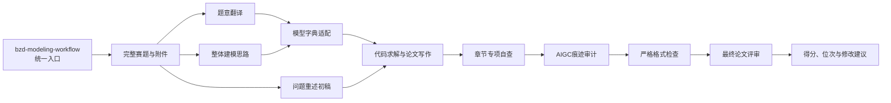

# BZD Math Modeling Skills

面向数学建模竞赛完整流程的 BZD Skills 合集，支持 **Codex** 与 **Claude Code**。

本项目以一个总控 Skill 为统一入口，覆盖赛题逐句理解、全局建模思路生成、模型适配性判断、论文分章节自查、AIGC 痕迹审计、全文格式检查、评委式综合评审、竞赛位次预估和高校国奖数据查询。

相关规则主要基于 2020—2025 年高教社杯全国大学生数学建模竞赛赛题、评分细则、评分要点、评阅概述及完整评阅流程整理，并结合数学建模论文写作规范、模型字典和历史获奖数据持续更新。

> 本项目不是竞赛官方工具。模型建议、论文评分、位次预测和备赛判断均为辅助参考，最终以当届组委会与所在赛区发布的正式规则及实际评审结果为准。

## 快速开始

如果不确定应该调用哪个 Skill，直接使用总控入口：

```text
调用 $bzd-modeling-workflow。

当前阶段：刚拿到题目
赛题：<赛题文件或路径>
附件：<附件文件或路径，可选>

请识别当前阶段，并按BZD数学建模完整工作流安排下一步。
```

总控 Skill 会识别当前阶段，选择需要调用的专项 Skill，记录阶段产物并给出下一步操作；不会在没有必要时机械运行全部检查。

## Skills 总览

### 零、集成与总控类

| Skill | 作用 | 输入 | 输出 |
|---|---|---|---|
| [`bzd-modeling-workflow`](skills/总控类/bzd-modeling-workflow/) | 识别竞赛阶段并统一调度读题、建模、写作、自查和终稿评审 | 当前阶段，以及已有赛题、附件、数据、思路、论文、代码或检查报告 | 调用计划、阶段产物索引、去重问题清单、下一步建议和流程进度 |

### 一、生成类

| Skill | 作用 | 输入 | 输出 |
|---|---|---|---|
| [`bzd-problem-translator`](skills/生成类/bzd-problem-translator/) | 逐句解释赛题，识别定义、约束、数据口径、交付要求和跨问关系 | 完整赛题及附件说明 | Markdown 题意翻译报告、遗漏审计和跨问题联动图 |
| [`bzd-modeling-ideas`](skills/生成类/bzd-modeling-ideas/) | 从全题角度生成贯穿全文的建模主线，并比较每一问的候选模型 | 完整赛题、附件；可选题意翻译报告 | 问题分析、多模型对比、推荐方案、选型理由、创新与验证建议 |
| [`bzd-problem-restatement`](skills/生成类/bzd-problem-restatement/) | 生成问题重述初稿，也可检查用户已有的问题重述 | 完整赛题；自查模式另提供已有重述 | 问题背景、问题回顾、研究综述，或问题重述诊断报告 |
| [`bzd-ai-usage-disclosure`](skills/生成类/bzd-ai-usage-disclosure/) | 根据真实使用情况生成或检查 AI 工具使用声明与使用详情 | 论文、真实 AI 使用记录；可选已有披露材料 | AI 使用声明、使用详情材料和一致性自查结果 |

### 二、论文自查类

| Skill | 自查对象 | 输入 | 输出 |
|---|---|---|---|
| [`bzd-paper-format-checker`](skills/论文自查类/bzd-paper-format-checker/) | 全文页面结构、排版、篇幅、标题、图表、公式、匿名性和文件卫生 | 完整 PDF；可选 Word | 原子检查结果、逐项扣分、格式规范分、格式质量系数和自查表 |
| [`bzd-abstract-checker`](skills/论文自查类/bzd-abstract-checker/) | 摘要、论文题目和关键词 | 摘要；可选赛题、题目和关键词 | 摘要独立性判断、逐项问题和优先修改建议 |
| [`bzd-problem-restatement`](skills/论文自查类/bzd-problem-restatement/) | 问题重述 | 完整赛题和已有问题重述 | 任务遗漏、条件失真、章节越界和修改建议 |
| [`bzd-problem-analysis-checker`](skills/论文自查类/bzd-problem-analysis-checker/) | 问题分析 | 完整赛题、附件说明和已有问题分析 | 任务映射、模型选择依据、跨问联动和修改优先级 |
| [`bzd-model-assumption-checker`](skills/论文自查类/bzd-model-assumption-checker/) | 模型假设 | 完整赛题、模型假设；可选模型正文 | 逐条合理性诊断、遗漏假设、验证要求和修改优先级 |
| [`bzd-symbol-notation-checker`](skills/论文自查类/bzd-symbol-notation-checker/) | 符号说明 | 完整论文，或符号表与相关模型正文 | 符号遗漏、冲突、单位、上下标、首次定义和版式诊断 |
| [`bzd-model-solution-checker`](skills/论文自查类/bzd-model-solution-checker/) | 模型建立、求解、结果、检验及灵敏度分析 | 完整赛题和论文；可选附件或代码 | 核心正文诊断、复现性检查、红线问题和优先修改建议 |
| [`bzd-reference-appendix-checker`](skills/论文自查类/bzd-reference-appendix-checker/) | 正文引用、参考文献、附录、代码和支撑材料 | 论文、参考文献、附录、程序及支撑材料 | P0—P3 风险、引用一致性、附录完整性和复现问题 |
| [`bzd-ai-usage-disclosure`](skills/论文自查类/bzd-ai-usage-disclosure/) | AI 工具使用声明与详情材料 | 论文、真实 AI 使用记录和已有披露材料 | 完整性、一致性、匿名性和责任边界检查 |
| [`bzd-paper-aigc-auditor`](skills/论文自查类/bzd-paper-aigc-auditor/) | 论文语言 AI 痕迹、建模模板化、模型拼装和伪改进风险 | 完整数模论文；可选赛题、代码、数据和 AI 使用记录 | 风险区间、逐板块证据、模型真实性分类和人工化修改建议 |
| [`bzd-model-dictionary`](skills/论文自查类/bzd-model-dictionary/) | 候选模型与题目、数据及用途的适配性 | 赛题、数据结构、候选模型和求解思路 | 模型档案、适配结论、使用条件、缺陷、检验方法及替代模型 |
| [`bzd-review-paper`](skills/论文自查类/bzd-review-paper/) | 完整论文的评委式综合评审 | 竞赛类型、完整赛题和完整论文；国赛可补充组别、赛区、学校和指导教师 | 百分制得分、格式系数、竞赛位次、详细扣分和 HTML 报告 |

> `bzd-paper-format-checker` 是全文格式与呈现方式的快速总检，不能替代各章节专项 Skill 对内容正确性和建模质量的深入检查。非终稿不建议频繁运行严格格式审查，以免消耗较多 Token。

### 三、综合评审与自我定位类

| Skill | 作用 | 输入 | 输出 |
|---|---|---|---|
| [`bzd-review-paper`](skills/综合评审与自我定位类/bzd-review-paper/) | 根据当前赛题重新制定评分细则并完成整篇论文评审 | 竞赛类型、完整赛题、完整论文；国赛可补充组别、赛区、学校和指导教师 | 论文质量分、格式质量系数、竞争环境校准、位次估计、详细扣分和 HTML 报告 |
| [`bzd-cumcm-school-awards`](skills/综合评审与自我定位类/bzd-cumcm-school-awards/) | 查询高校近五年国奖情况，并辅助判断省奖、国奖备赛距离 | 学校、赛区；进度评估时补充个人竞赛与模拟经历 | 高校国奖画像、2026 年经验预测、高频指导教师和备赛建议 |

同名 Skill 可能为方便不同使用场景而出现在多个分类目录中。安装时选择其中一份即可，不要把同名副本重复安装到同一个 Skills 目录。

## 推荐工作流



### 1. 拿到赛题

- 使用 `bzd-problem-translator` 逐句理解赛题并梳理跨问题联动；
- 使用 `bzd-modeling-ideas` 生成全题建模主线与多模型候选方案；
- 论文手可同步使用 `bzd-problem-restatement` 形成第一章初稿。

### 2. 确定模型

- 将题目、数据结构、候选模型和计划用途交给 `bzd-model-dictionary`；
- 检查模型是否满足数据要求与关键假设，并确定必要的检验方法；
- 再使用 Codex、Claude Code、数模智能体或其他工具完成代码求解和结果分析。

### 3. 论文写作与分章自查

依次检查摘要、问题重述、问题分析、模型假设、符号说明、模型建立与求解、参考文献和附录以及 AI 工具披露。写作过程中如需阶段性了解整体水平，可调用 `bzd-review-paper` 并选择不执行严格格式审查。

### 4. 终稿检查

1. 使用 `bzd-paper-aigc-auditor` 定位语言模板化、算法堆砌和建模逻辑断层；
2. 使用 `bzd-paper-format-checker` 执行严格格式、页面结构、匿名性和文件卫生检查；
3. 修改后使用 `bzd-review-paper` 进行最终评审，并接入同一版本论文的格式检查结果。

## 评分与预测边界

- `bzd-review-paper` 每次都应根据本次赛题重新分解任务并冻结评分细则，不能机械沿用历史题目的答案或既有对话结论；
- 论文质量分与赛区、学校、组别和指导教师因素分开处理，竞争环境信息用于奖项与位次校准，不应篡改论文自身的学术质量判断；
- 格式严格审查可将 `bzd-paper-format-checker` 的格式规范分映射为格式质量系数，并由 `bzd-review-paper` 接入，避免重复检查和重复扣分；
- 高度原创、超出常规评阅路径的方案可能被 AI 低估，最终仍需有经验的指导教师或人工评委复核；
- 历史获奖数据、赛区强度和经验概率不代表官方名额或获奖承诺。

## 安装

### Codex

下载或克隆仓库后，将需要使用的具体 `bzd-...` 文件夹复制到：

```text
Windows：%USERPROFILE%\.codex\skills\
macOS/Linux：~/.codex/skills/
```

例如：

```text
.codex/skills/
├── bzd-modeling-workflow/
├── bzd-problem-translator/
├── bzd-modeling-ideas/
├── bzd-model-dictionary/
├── bzd-paper-format-checker/
├── bzd-review-paper/
└── 其他需要使用的bzd Skill/
```

### Claude Code

将需要使用的具体 `bzd-...` 文件夹复制到：

```text
项目目录/.claude/skills/
```

应直接复制 `bzd-...` 文件夹，不要把外层中文分类目录作为一个 Skill 安装。Claude Code 补充配置见 [`integrations/claude-code/`](integrations/claude-code/)。

## 调用示例

### 总控完整流程

```text
调用 $bzd-modeling-workflow。

当前阶段：已有论文初稿
赛题：<赛题路径>
附件：<附件路径，可选>
论文：<论文路径>

请判断需要调用哪些专项Skills，汇总重复问题，并给出下一步修改顺序。
```

### 翻译赛题

```text
调用 $bzd-problem-translator 翻译以下完整赛题：<赛题路径>
请逐句解释并输出跨问题联动图。
```

### 生成建模思路

```text
调用 $bzd-modeling-ideas 分析：
赛题：<赛题路径>
附件：<附件路径，可选>
题意翻译报告：<可选路径>

请生成贯穿全文的建模主线，并比较每一问的候选模型与选用理由。
```

### 判断模型是否适用

```text
调用 $bzd-model-dictionary：
题目：<题目内容或路径>
数据：<样本量、变量类型、数据结构和缺失情况>
候选模型：<模型名称>
求解思路：<模型在本题中的具体用途>
```

### 严格检查论文格式

```text
调用 $bzd-paper-format-checker：
论文：<PDF或Word路径>

请逐项检查并输出格式规范分、格式质量系数和优先修改建议。
```

### 最终评审

```text
调用 $bzd-review-paper：
竞赛类型：<高教社杯国赛或其他竞赛>
组别：<本科组或高职高专组，可选>
赛区：<赛区，可选>
学校：<学校，可选>
指导教师：<教师，可选>
赛题：<赛题路径>
论文：<论文路径>
已有格式检查报告：<可选路径>
```

## 项目结构

```text
bzd-math-modeling-skills/
├── README.md
├── CHANGELOG.md
├── skills/
│   ├── 总控类/
│   │   └── bzd-modeling-workflow/
│   ├── 生成类/
│   │   ├── bzd-problem-translator/
│   │   ├── bzd-modeling-ideas/
│   │   ├── bzd-problem-restatement/
│   │   └── bzd-ai-usage-disclosure/
│   ├── 论文自查类/
│   │   ├── bzd-paper-format-checker/
│   │   ├── bzd-abstract-checker/
│   │   ├── bzd-problem-restatement/
│   │   ├── bzd-problem-analysis-checker/
│   │   ├── bzd-model-assumption-checker/
│   │   ├── bzd-symbol-notation-checker/
│   │   ├── bzd-model-solution-checker/
│   │   ├── bzd-reference-appendix-checker/
│   │   ├── bzd-ai-usage-disclosure/
│   │   ├── bzd-paper-aigc-auditor/
│   │   ├── bzd-model-dictionary/
│   │   └── bzd-review-paper/
│   └── 综合评审与自我定位类/
│       ├── bzd-review-paper/
│       └── bzd-cumcm-school-awards/
├── integrations/
│   └── claude-code/
└── 数模资料/
```

## 数模资料

[`数模资料/`](数模资料/) 当前包含：

- 2026 年数学建模竞赛 Word 模板；
- 2026 年数学建模竞赛模板 PDF；
- 近五年官方评阅细则与评分要点参考资料；
- 数学建模论文自查表；
- BZD 数模论文 AI 痕迹自查指南。

具体文件及使用范围见 [`数模资料/README.md`](数模资料/README.md)。

## 重要说明

- 不要向公开仓库提交未公开赛题、未授权论文、个人身份信息、API Key、Token 或内部材料；
- 没有真实数据和程序运行证据时，不得虚构模型参数、最优结果、显著性、预测精度或复现结论；
- 使用者应自行确认当届竞赛关于 AI 工具、论文格式、附录材料和学术诚信的最新规定；
- 仓库内经验规则、历史数据和奖项阈值可能随竞赛年份变化；
- 对重要结论、模型适用性和最终论文质量，建议保留人工复核环节。

## 联系方式

✨ 如需进一步详细的论文检查、赛中资料等服务，可关注 **BZD数模社** 官网：[https://bzdshumo.com/](https://bzdshumo.com/)

- QQ数模交流群（主群1）：689964173
- QQ数模交流2群（主群2）：275032074
- 资料通知群（仅推送资料/无聊天）：928949323
- 微信（个性化定制）：bzdsxjm521
- 备用微信：bzdsxjm520 / BZD661188
